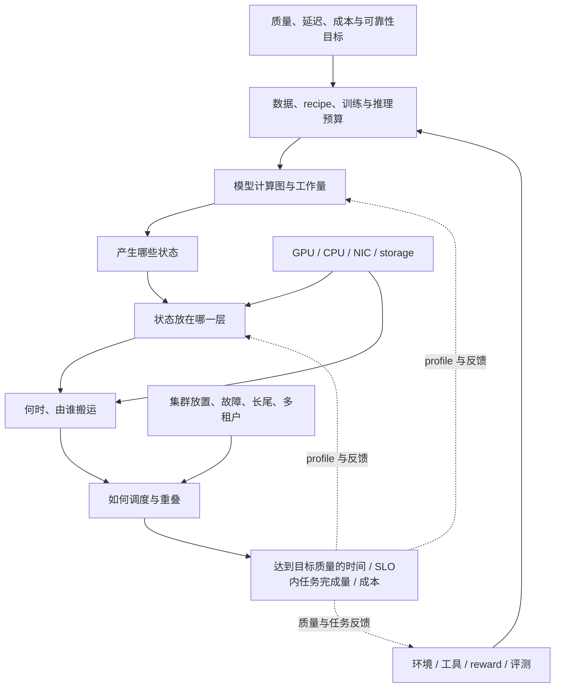

# HPCGame 2026：MLSys 知识地图

> [!abstract] 先看全景，再按问题局部细化
> 每次从一个症状、对象或问题进入，先固定**质量与完成目标**，再沿工作量、状态、搬运、调度和反馈展开。每轮阅读都回到同一张关系图。

> [!nav] 从当前关心的层次进入
> **现在怎么看**：[[HPCGame 2026 - 06 前沿追踪|当前判断]] · [[MLSys - 2026-09 周度更新|2026-09 变化]] · [[MLSys - 月度复盘|周期复盘]]
>
> **执行机制**：[[HPCGame 2026 - 01 训练状态与并行|训练]] · [[HPCGame 2026 - 02 稀疏模型与数值格式|模型与精度]] · [[HPCGame 2026 - 03 推理状态与调度|推理]] · [[HPCGame 2026 - 04 通信与内存层级|通信和内存]] · [[HPCGame 2026 - 05 Kernel、DSL 与硬件|编译和硬件]]
>
> **完整生命周期**：[[HPCGame 2026 - 07 数据与后训练闭环|数据与后训练]] · [[HPCGame 2026 - 08 集群效率与可靠性|集群效率]] · [[HPCGame 2026 - 09 多模态与新工作负载|新工作负载]]

## 1. 中央生成过程



2026-09-15 重构后的中心问题：

> **如何在质量与服务约束下，用更少的时间与成本完成有效训练或用户任务？**

减少不可隐藏的数据移动是关键手段之一；改变所需工作量、提高反馈有效性、减少排队和故障损失，也会改变答案。具体机制见 [[HPCGame 2026 - 07 数据与后训练闭环]] 与 [[HPCGame 2026 - 08 集群效率与可靠性]]。

## 2. 五个稳定变量

项目名会变，下面五个变量可以反复使用：

| 变量 | 固定追问 | 典型对象 |
| --- | --- | --- |
| 工作量 `work` | 达到同等质量，究竟需要执行多少训练、生成、验证与环境交互？ | 数据/recipe、optimizer、采样预算、去噪步数、reward |
| 状态 `state` | 产生、增长、复用和失效的是什么？ | parameter、optimizer、activation、KV、recurrent state、expert、embedding |
| 移动 `movement` | 多少 bytes，从哪里到哪里，谁发起？ | HBM、NVLink、RDMA、C2C、DRAM、SSD |
| 规则性 `regularity` | shape、路由、访问与控制流是否可预测？ | dense GEMM、MoE、sparse attention、agent session |
| 目标 `objective` | 优化的是峰值、平均值还是 SLO 内完成量？ | FLOPs、bandwidth、latency、throughput、goodput、cost |

一个优化通常会在五者间重新分配代价：

- MoE：少激活参数，却增加动态路由与 All-to-All；
- FP4：少字节、更高 tensor-core 峰值，却增加 scale、Q/DQ、布局与收敛约束；
- FSDP：少复制状态，却增加 materialization 与 collective；
- PD/EPD：隔离资源池，却增加 KV/encoder state 传输与跨池排队；
- sparse/hybrid attention：少算 token pair，却增加索引、异构状态和 runtime 分支。
- 异步 RL：提高生成与更新的重叠，却需要控制旧策略样本及质量变化。

## 3. 从当前困惑进入，而不是按章节进入

| 你脑中的问题 | 第一入口 | 随后扩散到 |
| --- | --- | --- |
| 模型/optimizer/activation 放不下 | [[HPCGame 2026 - 01 训练状态与并行]] | 通信组、拓扑、checkpoint |
| FLOPs 降了，为什么系统没变快 | [[HPCGame 2026 - 02 稀疏模型与数值格式]] | launch、All-to-All、Q/DQ、kernel |
| TTFT 与 TPOT 为什么互相打架 | [[HPCGame 2026 - 03 推理状态与调度]] | batching、PD、KV transfer、goodput |
| GPU 为什么在等、网络为什么跑不满 | [[HPCGame 2026 - 04 通信与内存层级]] | control path、progress、placement |
| 一个 kernel 快 2× 为什么不可信 | [[HPCGame 2026 - 05 Kernel、DSL 与硬件]] | shape、Amdahl、正确性、代际绑定 |
| 哪些结论已经过时 | [[HPCGame 2026 - 06 前沿追踪]] | release、论文、公开 issue、勘误 |
| rollout 快了，为什么达到同等评测质量仍慢 | [[HPCGame 2026 - 07 数据与后训练闭环]] | 环境长尾、样本陈旧、权重同步、数值一致性 |
| 卡很多，为什么有效完成的工作少 | [[HPCGame 2026 - 08 集群效率与可靠性]] | 排队/放置、冷启动、慢节点、恢复、多租户 |
| 视频/音频/agent 为什么不能直接套用 token/s | [[HPCGame 2026 - 09 多模态与新工作负载]] | 阶段、流式时序、质量、任务完成 |

## 4. 同一个对象的多视角

### MoE

```text
模型视角：总参数扩张、每 token 只激活少数 expert
训练视角：EP/EDP/ETP process groups 与负载均衡
通信视角：dispatch/combine 的 All-to-All(v)
kernel 视角：小而不规则的 grouped GEMM 与 launch overhead
推理视角：expert placement、热度、跨节点 tail 与 cache
```

### Hybrid attention

```text
模型视角：full / sparse / MLA / recurrent mixer 组合
训练视角：不同子图有不同 TP/CP/DP 最优 mesh
推理视角：KV、latent、recurrent、MTP、vision state 共存
kernel 视角：精确 attention 仍随 GPU 代际重写
存储视角：冷状态可能进入 CPU/SSD/remote tier
```

### 低精度

```text
数学视角：哪些 tensor 可以降精度，误差如何积累
kernel 视角：tensor core、scale layout、Q/DQ fusion
通信视角：payload 是否同步变小
训练视角：optimizer/gradient/activation recipe 是否收敛
评测视角：raw GEMM、linear layer 与完整 step 不是同一口径
```

### 后训练闭环

```text
数据视角：生成哪些样本、怎样筛选与复现
训练视角：策略何时更新、样本落后多少版本
推理视角：rollout如何分批、中断、恢复与验证
通信视角：何时同步权重、怎样控制状态版本
集群视角：环境长尾、GPU共享与故障恢复
目标视角：同等独立评测质量/任务成功率的总时间与成本，reward另报
```

## 5. 每轮阅读的五次去噪

无需顺序通读；对任意技术做五轮即可：

1. **目标轮**：质量与成功标准相同吗，需要完成的工作量变了吗？
2. **对象轮**：它在处理什么状态或数据？
3. **账本轮**：FLOPs、HBM bytes、network bytes、临时 buffer、环境成本分别怎么变？
4. **时间轮**：什么在 critical path，排队、启动、故障和重试算进去了吗？
5. **证据轮**：事实对应哪个版本和日期，在哪种功能组合成立，由谁验证？

最后一轮回到 [[MLSys - 证据台账]]；阅读所得的判断变化回到 [[HPCGame 2026 - 06 前沿追踪]]。每个月用 [[MLSys - 月度复盘]] 重新组织这些联系。

## 6. 讲座时间入口

| 时间 | 主题 | 进入哪篇 |
| --- | --- | --- |
| [04:14](https://www.bilibili.com/video/BV1vmzXBBESY/?t=254) | 数据与训练复盘 | [[HPCGame 2026 - 02 稀疏模型与数值格式]]、[[HPCGame 2026 - 07 数据与后训练闭环]] |
| [12:13](https://www.bilibili.com/video/BV1vmzXBBESY/?t=733) | Scaling 与并行 | [[HPCGame 2026 - 01 训练状态与并行]] |
| [36:05](https://www.bilibili.com/video/BV1vmzXBBESY/?t=2165) | MoE / DeepEP / DeepGEMM | [[HPCGame 2026 - 02 稀疏模型与数值格式]]、[[HPCGame 2026 - 04 通信与内存层级]] |
| [43:26](https://www.bilibili.com/video/BV1vmzXBBESY/?t=2606) | Attention 路线 | [[HPCGame 2026 - 02 稀疏模型与数值格式]] |
| [48:25](https://www.bilibili.com/video/BV1vmzXBBESY/?t=2905) | 混合精度 | [[HPCGame 2026 - 02 稀疏模型与数值格式]] |
| [55:08](https://www.bilibili.com/video/BV1vmzXBBESY/?t=3308) | 推理 workload | [[HPCGame 2026 - 03 推理状态与调度]] |
| [1:10:35](https://www.bilibili.com/video/BV1vmzXBBESY/?t=4235) | PD 与 KV transfer | [[HPCGame 2026 - 03 推理状态与调度]] |
| [1:14:41](https://www.bilibili.com/video/BV1vmzXBBESY/?t=4481) | 网络、NCCL、NVSHMEM | [[HPCGame 2026 - 04 通信与内存层级]] |
| [1:41:07](https://www.bilibili.com/video/BV1vmzXBBESY/?t=6067) | GPU 与 DSL | [[HPCGame 2026 - 05 Kernel、DSL 与硬件]] |
| [1:50:47](https://www.bilibili.com/video/BV1vmzXBBESY/?t=6647) | CPU、C2C、storage、Engram | [[HPCGame 2026 - 04 通信与内存层级]] |

## 7. 来源与归档

- [讲座视频](https://www.bilibili.com/video/BV1vmzXBBESY/)
- [公开 Slides](https://disk.pku.edu.cn/link/AA79261A850FCC49EAAF63FC4EC4159211)
- [[HPCGame 2026 - 大模型训练、推理与 Infra 概览|原始线性长文（保留作完整资料库）]]
- [[HPCGame 2026 - 06 前沿追踪|当前判断与研究主线]]
- [[MLSys - 2026-08 至 09 旧版基线与日志|旧版基线与历史原文]] · [[MLSys - 证据台账|勘误和事实核验]]
- [[MLSys - 追踪规则与来源|执行规则与来源登记]] · [[MLSys - 运行记录|实际核查覆盖]]
