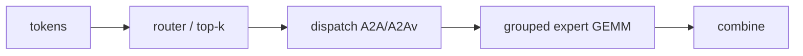

# HPCGame 2026：稀疏模型与数值格式

> [!nav] 返回与扩散
> [[HPCGame 2026 - 00 MLSys 知识地图|知识地图]] · [[HPCGame 2026 - 01 训练状态与并行|训练并行]] · [[HPCGame 2026 - 03 推理状态与调度|推理状态]] · [[HPCGame 2026 - 05 Kernel、DSL 与硬件|Kernel]]

> [!abstract] 核心问题
> 模型侧优化不断减少“每 token 必须做的 dense compute”，却制造更多条件化、低精度和异构状态。**少 FLOPs 不等于少系统成本。**

> [!nav] 从结构回到质量和部署
> 数据准备与低精度下的训练—生成一致性见 [[HPCGame 2026 - 07 数据与后训练闭环]]；生成式多模态的近似与质量比较见 [[HPCGame 2026 - 09 多模态与新工作负载]]。
>
> 既有精确版本与 benchmark 属于历史案例；当前结论和部署组合边界以 [[HPCGame 2026 - 06 前沿追踪]]、[[MLSys - 证据台账]] 为准。

## 1. 能力首先来自数据与 recipe

Infra 的目标不是把 FLOPs 跑满，而是把训练预算转化为能力。真正影响质量的包括：数据获取/清洗/去重、domain mixing、curriculum/repetition、context 与 learning-rate schedule、污染控制和评测口径。

开放度需要拆成层级：

```text
权重 < 代码 < 数据清单 < 实际数据 < 训练日志
     < 失败实验 < 精确环境 < 可重跑脚本
```

基线核查中的几个锚点：

- [Kaiyuan-2B](https://arxiv.org/abs/2512.07612)：Quantile Data Benchmarking、Selective Repetition、Multi-Domain Curriculum；
- [EvoLM](https://arxiv.org/abs/2506.16029)：公开多阶段模型与训练轨迹，而非单一 checkpoint；
- [Smol Training Playbook](https://huggingface.co/spaces/HuggingFaceTB/smol-training-playbook)：staged mixture、长上下文课程、失败实验与算力账本；
- Nemotron 3 Super/Ultra：开放权重、数据与环境线索，但仍不等于组织内部全部过滤版本与失败 runs。

因此 “open model” 不是完整可复现的同义词；相互冲突的 recipe 结论也可能只是数据、规模和阶段不同。

## 2. MoE：计算稀疏化，通信动态化



MoE 让总参数容量增长快于每 token FLOPs，但代价转移到：

- expert 负载均衡与 capacity；
- shared expert 与 replica ownership；
- padding/packing 和 grouped GEMM shape；
- 跨节点 All-to-All tail；
- 通信/GEMM overlap；
- reduction 顺序与浮点语义。

### DeepEP、DeepGEMM、UCCL 的位置

- DeepGEMM 解决低精度 expert GEMM 的局部映射；
- DeepEP 解决 dispatch/combine 与通信/计算 overlap；
- DeepEP V2 从 NVSHMEM 路径转向 NCCL GIN，加入 JIT、ElasticBuffer、EP2048、低/0-SM 路径；
- UCCL EP 用兼容接口扩展到 NVIDIA/AMD、EFA/Broadcom/ConnectX-7。

这组变化说明项目标签不可靠：“GPU-centric” 能力正在被 NCCL 吸收。应该追踪真正的 control path、data path 和 progress model，详见 [[HPCGame 2026 - 04 通信与内存层级]]。

公开的 B300 illegal access、UCCL EFA EP16 间歇崩溃等问题也提醒：benchmark 成功不等于跨 shape、硬件、文件系统和故障稳定。

## 3. Attention：四种减少成本的方式

| 路线 | 是否改变精确语义 | 主要减少 | 新状态/代价 |
| --- | --- | --- | --- |
| FlashAttention | 否 | HBM IO、中间矩阵 | 代际相关 tile/pipeline |
| GQA/MLA | 是 | KV 容量与带宽 | latent/特殊 decode kernel |
| sparse attention | 是 | token-pair compute | 稀疏索引、热度与不规则负载 |
| linear/recurrent | 是 | 完整 KV 与 $n^2$ | recurrent state、训练稳定性 |

FlashAttention 是 IO-aware 的精确实现优化；sparse/linear/hybrid 是模型语义变化。把二者放在同一条“attention 更快”坐标轴上，会混淆正确性和系统代价。

### Hybrid 已成为运行时现实

- [Kimi K3](https://github.com/MoonshotAI/Kimi-K3)：69 层 KDA + 24 层 Gated MLA、1M context、原生视觉；
- DeepSeek V4：hybrid sparse attention 进入公开 serving 支持；
- [Qwen3.8-Flash-Next](https://huggingface.co/Qwen/Qwen3.8-Flash-Next)：experimental preview，将 Gated DeltaNet、micro-block QSA、MoE、MTP 与可 offload n-gram embedding 放在同一模型；
- [FlashAttention-4](https://arxiv.org/abs/2603.05451)：精确 attention 仍针对 Blackwell 重写，说明新架构并没有消灭精确 kernel 优化。

未来 runtime 管理的不再只有 KV：

```text
traditional KV
MLA latent
recurrent/DeltaNet state
sparse index + hot buffer
MTP draft state
vision / encoder state
n-gram / conditional memory
```

这使 attention 优化从“一个 kernel”升级为统一 state lifecycle 问题，并直接连接 [[HPCGame 2026 - 03 推理状态与调度]]。

## 4. 低精度：表示、搬运和收敛的联合设计

从 BF16/FP16 到 FP8/FP4，不能只看 tensor-core 峰值。完整账本包括：

| 层次 | 必须核查 |
| --- | --- |
| 表示 | value format、block/channel/tensor scale、异常值 |
| 计算 | accumulation dtype、stochastic rounding、Hadamard |
| 数据流 | Q/DQ 是否 fusion，scale tensor 读写，layout conversion |
| 训练 | weight/activation/gradient/optimizer 各自精度与 recipe |
| 通信 | payload 是否同步降低，还是只缩本地 GEMM |
| 口径 | raw GEMM、linear layer、完整 step、最终 time-to-quality |

[Transformer Engine NVFP4](https://docs.nvidia.com/deeplearning/transformer-engine/user-guide/features/low_precision_training/nvfp4/nvfp4.html) 已给出 E2M1、16-value block scale、FP32 global scale、gradient stochastic rounding、Hadamard 与 2D weight scaling；Nemotron 3 Ultra 提供 550B/55B active、20T token 级训练证据。

但厂商 benchmark 中，当步量化的 linear-layer autocast 约 2.03×，预量化 raw GEMM 约 3.55×。两者之差就是 Q/DQ 与数据流代价；完整训练 step 还要再支付 attention、optimizer、通信和 dataloader 的 Amdahl 项。

## 5. 三类“局部快、全局不快”

1. **MoE kernel 快，模型不快**：launch、routing、A2A 或小 shape 支配；2026-08 新论文甚至报告 fused Triton 隔离快 5.6–9×、端到端仅 0.999×。
2. **sparse attention 少算，state 不少**：GPU hot buffer、host tier、索引与 prefetch 仍可能成为瓶颈。
3. **FP4 GEMM 快，训练不同比快**：量化、scale、非 GEMM 算子、通信与收敛约束吃掉收益。

统一判断方法是：先建立 end-to-end ceiling，再决定优化局部算子。

## 6. 互相强化的趋势

```text
MoE / sparse / recurrent / FP4
        ↓ 计算更少、更条件化
算术强度与规则性下降
        ↓
launch、state movement、routing、metadata 更显著
        ↓
通信运行时、调度器与专用 kernel 必须共同设计
```

这也是为什么“模型研究”和“Infra”边界越来越模糊。

## 7. 易错判断

- “MoE 是小一点的 dense FFN” → 它改变流量形态；
- “FlashAttention、sparse、linear 都是在做近似” → FlashAttention 保持精确语义；
- “少算 attention 就少存状态” → sparse index 与多级 cache 可能增加管理复杂度；
- “FP4 峰值翻倍所以训练翻倍” → 必须区分 raw GEMM、layer、step 与 time-to-quality；
- “路由一致就代表量化质量一致” → routing fidelity 与输出质量是不同目标。

## 8. 一手资料

- [DeepEP](https://github.com/deepseek-ai/DeepEP) · [DeepGEMM](https://github.com/deepseek-ai/DeepGEMM) · [UCCL EP](https://github.com/uccl-project/uccl/blob/main/ep/README.md)
- [Kimi K3](https://github.com/MoonshotAI/Kimi-K3) · [Qwen3.8-Flash-Next](https://huggingface.co/Qwen/Qwen3.8-Flash-Next)
- [FlashAttention-4](https://arxiv.org/abs/2603.05451) · [SGLang HiSparse](https://www.lmsys.org/blog/2026-04-10-sglang-hisparse/)
- [Transformer Engine NVFP4](https://docs.nvidia.com/deeplearning/transformer-engine/user-guide/features/low_precision_training/nvfp4/nvfp4.html)
- [MoE launch-bound 论文](https://arxiv.org/abs/2608.26612)
