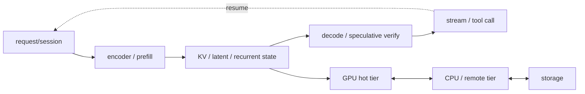

# HPCGame 2026：推理状态与调度

> [!nav] 返回与扩散
> [[HPCGame 2026 - 00 MLSys 知识地图|知识地图]] · [[HPCGame 2026 - 02 稀疏模型与数值格式|模型状态]] · [[HPCGame 2026 - 04 通信与内存层级|通信/存储]] · [[HPCGame 2026 - 06 前沿追踪|前沿追踪]]

> [!abstract] 核心问题
> 推理引擎不是“执行模型”的薄封装，而是一个动态状态系统：**请求产生哪些状态、状态能否复用、在哪一层保存、何时搬运、怎样在 SLO 内调度。**

> [!nav] 三个扩散方向
> 推理作为训练的数据生产者，见 [[HPCGame 2026 - 07 数据与后训练闭环]]；副本扩缩、租户隔离和故障恢复，见 [[HPCGame 2026 - 08 集群效率与可靠性]]；音视频与多阶段生成，见 [[HPCGame 2026 - 09 多模态与新工作负载]]。
>
> 下面的版本和 issue 是历史案例；“仍开放”等状态指原记录时点，下次引用前按 [[MLSys - 运行记录]] 回访。模型支持、runner 支持与部署 recipe 的具体组合见 [[MLSys - 证据台账#E-20260915-03]] 和 [[MLSys - 证据台账#E-20260915-04]]。

## 1. 先固定 workload 和目标函数

| 场景 | 主要约束 | 典型系统问题 |
| --- | --- | --- |
| 端侧/资源受限 | 功耗、内存、隐私 | 低 bit、CPU/NPU/GPU 异构、offload |
| 单机/小池 colocated | 单实例利用率 | continuous batching、prefix cache、kernel |
| 数据中心 scale-out | 独立扩缩与故障 | P/D/EPD、KV transfer、跨节点 routing |
| 多模态/agent | 长寿命、多阶段、外部事件 | encoder state、tool latency、session retention |

四个指标必须同时出现：

- **TTFT**：排队 + prefill 的首 token 延迟；
- **TPOT / ITL**：decode step 间延迟；
- **Throughput**：单位时间处理的 token/request；
- **Goodput**：满足 SLO 的有效完成量。

平均 throughput 可以靠堆积违约请求提高，因此大规模 serving 的目标更常是 goodput，而不是 token/s 最大化。

## 2. 请求不是 token 流，而是状态生命周期



现代模型可能同时产生：传统 KV、MLA latent、recurrent state、MTP/draft state、sparse index、vision/encoder embedding、prefix identity 与 session metadata。运行时若仍假设只有同构 KV blocks，很快会在 hybrid/multimodal 模型上失效。

## 3. 单池优化彼此耦合

| 机制 | 直接收益 | 新代价/耦合 |
| --- | --- | --- |
| continuous batching | 提高 decode batch 利用率 | scheduler overhead、延迟干扰 |
| chunked prefill | 让长 prefill 与 decode 交错 | chunk/launch 开销、TTFT/TPOT 权衡 |
| prefix cache | 复用共享前缀 | identity、eviction、tenant 隔离 |
| speculative/MTP | 一次提出多个 token | acceptance、draft 显存、verify cost |
| CUDA Graph/megakernel | 降低 host launch | shape 稳定性、编译和 graph cache |
| fine-grained overlap | 隐藏通信 | 资源争用、依赖与 tail 覆盖 |

不能逐个打开优化开关再把收益相加：chunked prefill 改变批次形态，prefix cache 改变 prefill 到达率，speculative decoding 改变每 step token 数，CUDA Graph 又依赖 shape 分布。

### Speculative decoding 的边界

收益取决于 acceptance rate、draft/target 成本和 workload。vLLM 官方把它主要定位于 medium/low-QPS、memory-bound 场景；高 QPS 下额外 compute/显存未必换来更多 goodput。

SGLang `v0.5.18` 的公开 issue 还显示：NEXTN/EAGLE 初始化时的临时 embedding/head 若在 KV pool 定容后才释放，可让单卡 `max_total_num_tokens` 从修补后的 305,070 降到 149,806。这是一个仍开放的用户报告，但它揭示了容易漏算的维度：**启动期状态时序也会决定稳态 admission capacity。**

## 4. vLLM 与 SGLang：从起源理解，不用标签替代现状

- vLLM 由 PagedAttention/blocked KV 起家，当前形成 hash-based prefix cache、平台/API 与 KV Connector 生态；
- SGLang 由 RadixAttention/program reuse 起家，当前围绕 Radix/HiCache、day-0 model/kernel、PD/EPD 演进；
- 两者都已覆盖 batching、prefix cache、spec decode、quantization、chunked prefill、CUDA Graph 与分布式 serving。

因此真正该比较的是：

```text
scheduler policy
cache identity / eviction / tiering
hybrid + multimodal state coverage
speculator 与 model runner 的组合
connector compatibility
kernel/quant backend
failure 与 observability
```

vLLM `0.28.0` 的稳定 release 已把 Model Runner V2 的 E/P/D、磁盘 KV offload、可插拔 secondary tier、partial load、metrics 与 canonical CPU layout 放进同一版本，说明这些能力正在从外围 connector 变成 runtime 核心。

## 5. PD/EPD：隔离资源，不保证 raw throughput

```text
request → prefill pool → state transfer → decode pool → stream
                ↑
       optional encoder pool
```

拆分后得到 P:D:E 独立扩缩和 SLO 隔离，同时新增：

- KV/encoder transfer engine；
- admission control 与跨池 backpressure；
- KV-aware routing 和 prefix locality；
- 独立故障域、重试与状态 ownership；
- pool ratio 与网络拓扑的联合规划。

> [!warning] 关键修正
> vLLM 官方文档明确说明 disaggregated prefill 本身不提升 throughput；它主要用于独立调节 TTFT/ITL 和隔离 tail。KV transfer 与跨池排队完全可能抵消收益。

SGLang 已公开 EPD；vLLM 提供 disaggregated encoder 的 E→PD/E→P→D 拓扑。Dynamo 又把多模态、agent priority 与 cache retention 接到分离式 runtime。演进方向不是“更多池一定更快”，而是让不同状态/阶段拥有不同资源模型。

## 6. KV cache 已是独立数据系统

| 问题 | 不能省略的系统语义 |
| --- | --- |
| identity | block hash、collision、model/version、tenant |
| placement | GPU、CPU、remote memory、SSD |
| lifecycle | allocate、reuse、evict、prefetch、invalidate |
| routing | prefix/session locality、热度与成本 |
| consistency | transfer completion、ownership、partial load |
| failure | worker 消失后 metadata 与重放 |

vLLM KV Connectors 已覆盖 NIXL、Mooncake、LMCache、FlexKV 等；SGLang HiCache 覆盖 GPU/CPU/storage 和 HF3FS、Mooncake、NIXL、AIBrix 等后端。

“有三层 cache”并不代表可靠：flat file directory 导致 ENOSPC、PD admission freeze、connector 版本组合都已在公开问题中出现。Dynamo `1.4.2` 甚至修复过 Rust NIXL binding 静默落到 non-functional stubs、而 Python binding 正常的 loader-path 问题。验收必须观察真实 bytes/latency/fallback，不能只看进程启动。

## 7. CPU-GPU offload 是另一个专门化 runtime

KTransformers 把大 MoE experts 放入 CPU DRAM，只让 attention/热路径留在 GPU，并利用 AMX 等 CPU 指令。它已支持新模型、CPU-GPU expert scheduling、SGLang 与 GPU/CPU/disk 三层 prefix cache。

但这不是“消费级显卡轻松装下大模型”：官方 DeepSeek-R1 Q4 示例仍约需 382GB DRAM 和 14GB VRAM。瓶颈从 GPU 容量移动到主存容量、NUMA、PCIe/C2C 与 CPU compute。

## 8. Agent serving 改变调度事件

传统请求近似 `prefill → decode → finish`；agent session 更像：

```text
prefill → decode → tool wait → external IO → resume
        ↘ image/audio encoder ↗
```

调度目标因此可能从单次 TTFT/TPOT 变成 tool latency、session completion、cache-retention value 与端到端 cost。长寿命 session 还会把 cache eviction 与 admission 变成经济决策，而非纯 LRU。

## 9. 一次完整的 serving 实验

1. 固定 arrival process、prompt/output 分布、并发和 SLO；
2. 同时记录 TTFT、TPOT、throughput、goodput 与 tail；
3. 画出 KV/state 从 allocate 到 free 的时间线；
4. 分别记录 compute、queue、transfer、cache hit/miss；
5. 注入 worker/connector/storage 故障；
6. 再切换 batching、chunk、prefix、spec、PD/EPD，而不是只测 happy path。

## 10. 一手资料

- [vLLM prefix caching](https://docs.vllm.ai/en/latest/design/prefix_caching/) · [speculative decoding](https://docs.vllm.ai/en/latest/features/spec_decode/) · [disaggregated prefill](https://docs.vllm.ai/en/latest/features/disagg_prefill/)
- [vLLM 0.28.0](https://github.com/vllm-project/vllm/releases/tag/v0.28.0)
- [SGLang HiCache](https://github.com/sgl-project/sglang/blob/main/docs_new/docs/advanced_features/hicache_best_practices.mdx) · [EPD](https://github.com/sgl-project/sglang/blob/main/docs/advanced_features/epd_disaggregation.md)
- [SGLang EAGLE/KV capacity issue](https://github.com/sgl-project/sglang/issues/36452)
- [Dynamo 1.4.2 NIXL fix](https://github.com/ai-dynamo/dynamo/releases/tag/v1.4.2)
- [KTransformers](https://github.com/kvcache-ai/ktransformers)
