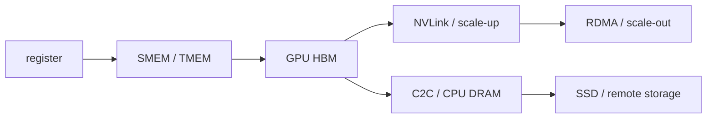

# HPCGame 2026：通信与内存层级

> [!nav] 返回与扩散
> [[HPCGame 2026 - 00 MLSys 知识地图|知识地图]] · [[HPCGame 2026 - 01 训练状态与并行|训练并行]] · [[HPCGame 2026 - 03 推理状态与调度|推理状态]] · [[HPCGame 2026 - 05 Kernel、DSL 与硬件|Kernel/硬件]]

> [!abstract] 核心问题
> 网络不是独立外设，而是更远的一层 memory hierarchy。应追问：**什么操作、由谁发起、数据经过哪些 memory、谁推进进度、完成语义是什么。**

> [!nav] 把通信接回工作生命周期
> RL 权重版本和反馈时序见 [[HPCGame 2026 - 07 数据与后训练闭环]]；拓扑放置、慢节点、失败恢复与租户约束见 [[HPCGame 2026 - 08 集群效率与可靠性]]。
>
> 本篇已有的版本/规格案例保留其历史时点；最新适用范围、未确认事项和后续修复进入 [[MLSys - 证据台账]] 与 [[HPCGame 2026 - 06 前沿追踪]]。

## 1. 一张统一的层级图



每一层都由四个量刻画：容量、带宽、延迟、可预测性。优化的本质是让状态在被消费前到达合适层，并使搬运落在可隐藏窗口内。

训练数据和 checkpoint 常可顺序预取；在线 KV、prefix、expert、session 或 Engram lookup 由用户请求驱动，更随机、长尾且多租户，因此 storage tiering 在 serving 中更难隐藏。

## 2. 不从库名开始，从五个维度开始

| 维度 | 例子 |
| --- | --- |
| transport | PCIe、NVLink、InfiniBand、RoCE、EFA |
| operation | collective、P2P、put/get/atomic |
| control path | CPU、GPU、NIC/DPU 发起 |
| data path | direct、proxy、staging、registered window |
| progress model | 谁推进 WQ、doorbell、completion、retry |

“NCCL 是 CPU-centric、NVSHMEM 是 GPU-centric”只是历史近似。NCCL GIN/device APIs 与 DeepEP V2 已使边界融合；项目名不能代替对 data/control/progress path 的检查。

## 3. Collective 正在变成可编程数据面

### NCCL 的演进

传统 NCCL 以 host 发起的静态 collective 为中心；NCCL 2.31.x 已加入/强化：

- Compute Fabric Transport 的 host/device APIs；
- 注册 window memory 后的 device-side Put/Get/Red/NVLS；
- per-collective configuration 与 tuning；
- GIN EFA GDA backend、device-side timeout；
- one-sided multi-context/multi-NIC；
- hierarchical 0-SM AllGather/Alltoall；
- TMA cost model、CuTe DSL bindings 与 diagnostics。

这并不意味着全部成熟。官方 release notes 仍列出特定 H100/B40/PAT 等 regression 与 known issues，feature matrix 必须绑定 NCCL、CUDA、driver、NIC 与 topology。

2026-09-21 增量：NCCL 2.32.3 将 GPU 进度、watchdog mirror 和降级诊断进一步纳入实现。由此应把“谁推进进度”连到“如何证明仍有进展、如何识别 fallback、何时进入失败终态”；诊断能力不等于自动恢复。Rubin target 的加入也不意味着性能调优已完成。[[MLSys - 证据台账#E-20260921-03]] · [精确 release](https://github.com/NVIDIA/nccl/releases/tag/v2.32.3-1)

### NVSHMEM 与 IBGDA

NVSHMEM 用 symmetric heap、one-sided put/get/atomics 与 device-side synchronization，让 kernel 内部发起细粒度通信。

传统 IBRC 常由 CPU proxy 维护发送队列和 doorbell；IBGDA 将 WQ、DBR、completion 等控制对象暴露给 GPU，减少 CPU round trip。它在小消息、动态 EP、kernel 内通信中有潜力，但增加 memory ordering、资源管理与兼容性复杂度。

NVSHMEM 3.7.x 已覆盖 Ampere/Hopper/Blackwell 与多代 CUDA，同时保留平台、ABI、PMI/VMM 等限制。NCCL 吸收 device APIs 不会让 NVSHMEM 消失，更可能形成不同抽象层的互补。

## 4. MoE 是通信栈的压力测试

```text
router → variable-size dispatch → grouped GEMM → variable-size combine
```

MoE 的 All-to-All(v) 同时具有小消息、输入相关流量、跨节点不均衡与 strict synchronization。DeepEP、NCCL GIN、NVSHMEM、UCCL 的竞争，本质是在争夺以下设计点：

- GPU/NIC 是否能低/0-SM 推进；
- buffer 是否固定注册、弹性扩展；
- dispatch/combine 如何与 grouped GEMM overlap；
- topology、expert placement 与 tail 如何处理；
- 跨 NVIDIA/AMD/EFA/ConnectX 的语义如何保持。

DeepEP V2 转向 NCCL GIN，是“collective 库成为可编程数据面”的直接证据；UCCL EP 的异构扩展则说明单厂商最优路径仍不是完整答案。

## 5. NIXL 与 KV/状态传输

NIXL、Mooncake、LMCache 等处在“memory/transport abstraction”与 serving runtime 之间。它们必须处理 registered memory、push/pull、completion、peer lifecycle 与 backend compatibility。

Dynamo 1.4.2 的 NIXL loader-path 修复展示了典型危险：Rust binding 静默使用 non-functional stubs，而同一解释器内 Python binding 正常。只有观测真实 bytes、completion 和 fallback，才能确认数据路径成立。

因此 KV transfer benchmark 必须同时报告：

```text
payload size / block count
registration 与 setup 是否计入
push/pull 与并发数
P/D compute overlap
CPU/GPU/NIC 占用
tail 与 failure behavior
```

## 6. Scale-up 与 scale-out 不能混为一层

| 层 | 代表 | 更适合 |
| --- | --- | --- |
| scale-up | NVLink/NVSwitch、UALink | TP、细粒度 EP/CP、coherent placement |
| scale-out | InfiniBand/RoCE/EFA | DP、较粗 EP、跨机 serving |

NVLink 的带宽与语义决定细粒度并行的可行域。UALink 2.0 已发布 Common 2.0、200G data/link layer、manageability、chiplet 与 in-network compute 规范，但 specification 不等于交换芯片、accelerator、collective、管理栈和认证生态已生产互通。

结论应写成：**标准在收敛，软件生态、可观测性和部署经验仍未收敛。**

## 7. CPU、C2C、DPU 与 storage 回到快路径

### C2C

Grace/GB/Vera Rubin 的 coherent C2C 让 CPU DRAM 可能参与 KV、expert、embedding、preprocess 与 checkpoint，而不只是最后兜底。厂商公布的 1.8 TB/s C2C、3.6 TB/s scale-up 等是平台规格，不是任意 workload 的可用带宽；NUMA、page placement、coherence traffic 与争用仍决定结果。

### DPU

GPU-initiated networking 不会自动消灭 DPU。更合理的职责分解是：

```text
GPU：极低延迟发起、kernel 内通信
NIC：RDMA、transport、congestion primitives
DPU：隔离、安全、虚拟化、storage/network services、弹性控制
CPU：全局调度、复杂控制面、异常路径
```

具体 workload 是否需要 DPU，应由端到端 profile 和运维边界决定。

### Engram 与条件记忆

Engram 用大表/条件 lookup 扩展神经网络容量，要求 lookup/prefetch 能被主干 compute 隐藏。DeepEP V2 已有实验性 0-SM RDMA Engram communication，后续也出现 CXL pooling、memory grafting 等研究。

它们共同指向：模型参数、KV、prefix 和外部记忆正在共享同一套 memory hierarchy 问题；但公开数据面支持仍是早期证据，不代表已大规模生产验证。

## 8. 通信实验的最低信息量

1. 消息大小、并发、world size 与拓扑；
2. GPU/CPU/NIC 各自占用与发起路径；
3. registration/setup 是否计入；
4. 算法、protocol、channel/SM 数；
5. p50/p99、拥塞和多租户；
6. driver/CUDA/NCCL/NVSHMEM/NIXL 精确版本；
7. failure、timeout、retry 和 communicator resize。

没有这七项，“带宽提升 2×”很难迁移到真实训练或 serving。

## 9. 一手资料

- [NCCL 2.31.2 release notes](https://docs.nvidia.com/deeplearning/nccl/archives/nccl_2312/release-notes/rel_2-31-2.html)
- [NVSHMEM 3.7.2 release notes](https://docs.nvidia.com/nvshmem/release-notes-install-guide/release-notes/release-3720.html)
- [DeepEP](https://github.com/deepseek-ai/DeepEP) · [UCCL](https://github.com/uccl-project/uccl) · [NIXL](https://github.com/ai-dynamo/nixl)
- [UALink 2.0 announcement](https://ualinkconsortium.org/wp-content/uploads/2026/04/UALink-2.0-Specification-PR_FINAL.pdf)
- [Vera Rubin NVL72](https://www.nvidia.com/en-us/data-center/vera-rubin-nvl72/)
- [Engram](https://arxiv.org/abs/2601.07372)
