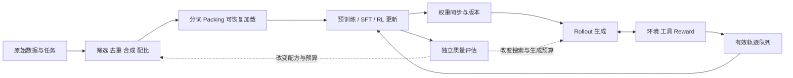

# HPCGame 2026：数据与后训练闭环

> [!abstract] 一句话与一张图
> 系统效率最终要回答：**从原始数据或任务出发，达到同等模型质量、任务成功率，需要多少时间和总成本？** 数据、训练、生成、环境与评估共同决定这个答案。

> [!nav] 从关系进入
> [[HPCGame 2026 - 00 MLSys 知识地图|知识地图]] · [[HPCGame 2026 - 01 训练状态与并行|训练状态]] · [[HPCGame 2026 - 03 推理状态与调度|生成与调度]] · [[HPCGame 2026 - 08 集群效率与可靠性|集群效率]] · [[HPCGame 2026 - 06 前沿追踪|追踪入口]]



## 1. 先固定终点：每秒更多 token，还是更早达到目标

训练看 **time-to-quality / cost-to-quality**：在预先固定的数据、评测协议与质量门槛下，首次稳定达到门槛的时间和资源成本。部署看同一任务分布上、满足质量与延迟约束的每次成功成本。

把等待、数据准备、reward、评估和恢复计入系统边界；同时报告训练期与一次性准备成本，避免不同摊销假设藏在一个数字里。多种质量维度无法合成一个门槛时，比较质量—成本曲线。

训练 reward 是诊断量；达到同样 reward 不自动等于同样能力。最终质量应使用独立评测或固定任务成功标准，同时保留 reward 曲线以解释优化过程。

| 局部变快 | 仍需回答的全局问题 |
| --- | --- |
| 清洗/合成吞吐提高 | 是否减少有效信息、改变领域比例，或增加生成与过滤成本？ |
| 训练 step 更快 | 同等质量需要的步数和有效训练 token 是否也变了？ |
| Rollout tokens/s 更高 | 被训练实际使用的轨迹比例、陈旧程度和质量怎样？ |
| 单次推理更便宜 | 是否需要更多采样、验证或工具调用才能成功？ |

这是本篇的分析框架；下文的项目与论文只是检验框架的具体来源，不代表普适性能结论。

## 2. 数据生产与输入管线：两个相连的预算

**生产端决定学什么，加载端决定以什么顺序、多快送进去。** 可以从下面任一瓶颈进入，再沿图检查下游影响。

| 环节 | 必须保留的语义 | 系统代价与观察点 |
| --- | --- | --- |
| 抽取、过滤、去重 | 文档来源、过滤版本、exact/fuzzy 阈值、评测污染检查 | CPU/GPU 分工、全局 shuffle、索引与存储放大 |
| 合成、验证、重写 | 生成模型和采样配置、验证器、保留规则 | 生成 token、候选丢弃率、教师与验证器成本 |
| mixture / curriculum | 领域比例、重复率、阶段与采样种子 | 数据局部性与统计目标是否冲突 |
| tokenize / pack / load | 文档边界、loss mask、位置编码、样本顺序 | padding、有效 token、读取等待与预取缓冲 |

[NeMo Curator 官方仓库](https://github.com/NVIDIA-NeMo/Curator)提供文本、图像、视频、音频的过滤和去重流水线，以及合成数据入口。它是观察“数据准备也需要分布式计算”的来源；具体 recipe 的质量收益仍需训练实验确认。

Packing 把多个短样本放进一个计算块，可减少 padding；独立 SFT 样本需要保留 attention 边界。它与预训练的文档拼接、以及为了长上下文而做的 CP 是不同决策。[Megatron Bridge 文档](https://docs.nvidia.com/nemo/megatron-bridge/latest/training/packed-sequences.html)明确区分这些路径，并提醒 pack 长度可改变截断和样本组合。

因此验证 packing 要同时看有效 token 数、loss reduction、边界 mask 与质量；布局是否适配 attention kernel、CP/TP 和 CUDA Graph，连接 [[HPCGame 2026 - 01 训练状态与并行]] 与 [[HPCGame 2026 - 05 Kernel、DSL 与硬件]]。

### 恢复训练，也要恢复“读到了哪里”

权重和 optimizer 恢复成功，只说明模型状态回来。完整数据状态还可能包括 sampler/RNG、worker 游标、shuffle buffer、未完成的 pack、mixture 阶段和数据版本。

[TorchData StatefulDataLoader](https://meta-pytorch.org/data/beta/stateful_dataloader_tutorial.html)提供 `state_dict` / `load_state_dict`，支持 dataset/sampler 的自定义状态；其 iterable-dataset 示例要求恢复时 `num_workers` 相同。不能据此推断任意 worker/rank 变更都能无重复无遗漏恢复。

应把恢复前后样本 ID、有效 token 与随机变换的连续性列入验收；弹性扩缩与 checkpoint 边界见 [[HPCGame 2026 - 08 集群效率与可靠性]]。

## 3. RL 把训练和推理接成一个反馈系统

一次典型循环是：**取任务 → rollout 与环境交互 → reward / advantage → 参数更新 → 同步权重 → 下一批轨迹**。算法可能省略 critic、加入 reference policy 或多个 reward，资源账本必须按实际配置展开。

| 阶段 | 关键状态 | 首要限制 | 与旧笔记的联系 |
| --- | --- | --- | --- |
| Rollout | KV、采样配置、生成时的 policy version、log-prob | 变长生成、尾延迟、状态容量 | [[HPCGame 2026 - 03 推理状态与调度]] |
| 环境 / reward | 工具输出、轨迹、环境版本、reward 版本 | CPU、外部 IO、沙箱启动、验证计算 | [[HPCGame 2026 - 09 多模态与新工作负载]] |
| Train | 参数、optimizer、梯度、有效 token mask | 显存、并行、batch 形态 | [[HPCGame 2026 - 01 训练状态与并行]] |
| Weight sync | 参数分片、训练/推理布局与版本标识 | 重分片、传输、更新时间窗口 | [[HPCGame 2026 - 04 通信与内存层级]] |

环境等待期间即使 GPU 空闲，增加推理 GPU 也不一定缩短循环；reward 变快又可能把瓶颈推回训练。资源比例应根据各阶段到达率、队列年龄和完成速率调整。

[verl Agent Loop 文档](https://verl.readthedocs.io/en/latest/advance/agent_loop.html)将多轮生成、工具和环境交互形成的轨迹接入训练，并区分模型生成 token 与工具返回 token 的 response mask。该页标注 API 为 alpha，不能据“可运行”推断接口稳定。

## 4. 同步与异步：时间重叠会产生版本差

同步循环便于定义“哪批轨迹来自哪个 policy”，但阶段边界会等待长轨迹。分离 rollout 与 trainer 后可以流水执行，代价是样本可能来自旧权重，且队列中的旧样本会继续累积。

```text
权重同步更少 → 同步开销降低 → rollout 更连续
                         ↘ 行为策略更旧 → 分布差异与样本修正增大
生成更快 → 队列变长 → 样本年龄增大 → 可用训练信号未必同比增加
```

把 **wall-clock age、policy-version lag、分布差异** 分开记录：相同“落后一轮”在不同更新幅度下并不等价。还要追踪丢弃样本率、partial trajectory 跨越的版本数和最终质量曲线。

[verl fully-async recipe](https://github.com/verl-project/verl/blob/main/docs/advance/fully_async.md)给出独立 Rollouter/Trainer、消息队列、同步频率、freshness 控制与 partial rollout；其文档更新时间为 **2026-05-25**，入口在 experimental namespace。本次把它纳入基线，未将其计作 9 月新增发布。

Partial rollout 在同步后继续未完成轨迹，能够改变等待时间，也要求正确记录各段的行为概率和版本。具体 freshness 参数是实现定义，不能把配置数值直接当成通用的“落后几轮”。

需要被新证据检验的判断是：**只有重叠节省的时间超过同步、无效样本和收敛变化的代价，异步才改善 time-to-quality。**

### 角色切换与权重切换，需要协议而非单一同步调用

2026-09-21 增量核验：verl 0.9.1 允许把空闲训练 GPU 暂借生成，同时修复权重更新期间的新请求门控。两个操作必须一起分析：**停止接纳 → 收束在途工作 → 切换权重/角色 → 恢复提交**；只暂停 scheduler，入口仍可能累积无法排空的请求。

这也限定了性能解读：固定训练步数变快，只证明该执行区间缩短；还要核对策略陈旧、有效样本和独立质量。具体支持组合与作者实验见 [[MLSys - 证据台账#E-20260921-01]]、[verl 0.9.1](https://github.com/verl-project/verl/releases/tag/v0.9.1)。上文旧 fully_async experimental 路径保留为机制历史；本版已将这些旧 trainer 入口标记 deprecated，不能当作当前推荐接口。

## 5. 同一份权重，也可能不是同一个行为策略

训练与 rollout 可能采用不同精度、attention kernel、归约顺序和后端；这些差异可能改变 token 概率。还要区分 tokenizer、chat template、temperature/top-p 和 mask 不一致造成的语义差异。

对于依赖行为概率的 RL 更新，检查三个对象：生成样本的 **行为策略**、算法使用的 **旧策略/参考量**、正在更新的 **当前策略**。它们不能仅凭 checkpoint 名称就被视为相同。

[verl rollout correction 文档](https://github.com/verl-project/verl/blob/main/docs/algo/rollout_corr.md)分别列出实现差异与模型陈旧，并提供 importance weighting / rejection 的组合。该文档本身的更新时间标签为 **2025-10-30**；这里引用机制，不推断各后续增补的首次发布日期。

分析顺序：先确认 token/mask/采样协议 → 对齐同一输入的 log-prob → 测量差异与极端比率 → 再评估修正对方差、有效样本和质量的影响。修正算法不能替代实现正确性检查。

这让 [[HPCGame 2026 - 02 稀疏模型与数值格式|FP8/FP4 与数值格式]]、[[HPCGame 2026 - 05 Kernel、DSL 与硬件|Kernel/编译]] 同时影响速度与学习信号，成为需要联合验证的系统边界。

## 6. Test-time compute：把预算花在哪里

| 做法 | 语义目标 | 正确的比较轴 |
| --- | --- | --- |
| 多候选、搜索、反思、verifier 选择 | 改变求解过程与最终答案选择分布，以提高质量 | 同预算质量、同质量成本、延迟分布 |
| 精确 speculative sampling | 在满足接受/修正条件时保留 target 的采样分布 | 同 target/采样协议下的延迟、goodput、总计算 |
| 近似接受、压缩或量化 target | 可能改变目标分布或数值结果 | 质量与成本都重新验证 |

[Snell 等的 test-time compute 论文](https://arxiv.org/abs/2408.03314)于 **2024-08-06** 首次提交，讨论按任务难度分配搜索与修订预算；这里作为概念来源，不外推其 benchmark 到任意模型和任务。

[Leviathan 等的 speculative decoding 论文](https://arxiv.org/abs/2211.17192)于 **2022-11-30** 首次提交，给出不改变 target 分布的采样方法。分布一致不等于相同随机种子下逐 token、逐 bit 一致，具体系统仍要检查采样实现和数值边界。

两者可以组合：先确定需要多少候选、何时停止及如何验证，再优化每次模型调用。总账要计入 draft、verifier、失败分支、工具与环境；不能只计最终输出 token。

## 7. 持续追踪时，只接受能改变判断的证据

| 当前问题 | 足以更新判断的证据 | 与哪些方向联动 |
| --- | --- | --- |
| 更好的数据是否抵消生产成本？ | 固定质量评测的 recipe 消融、数据版本、准备与训练成本 | 数据、存储、开放复现 |
| 更高 rollout 吞吐是否改善学习？ | 同硬件预算下的质量—时间曲线、样本新鲜度和浪费率 | 调度、RL、权重同步 |
| 异步是否可稳定扩展？ | 多种长度/环境的收敛结果、恢复行为、版本一致性 | 集群、容错、环境服务 |
| 低精度是否破坏训练—推理一致性？ | 同输入 log-prob 对照、长程训练稳定性、修正消融 | 数值格式、kernel、后端 |
| 更多 test-time 计算是否划算？ | 难度分层的质量—成本曲线，含搜索/验证开销 | serving、多模态、agent |

新结果先进入 [[HPCGame 2026 - 06 前沿追踪]] 的证据与周报流程，再修订本篇稳定判断。记录“首次出现日期、具体版本、核查日期”；滚动文档被今天访问，不构成今天发布的证据。

## 8. 截至 2026-09-15 的来源边界

- **可用实现/文档锚点**：Curator、Megatron Bridge packing、TorchData 状态恢复；本次未声明它们的最新稳定版本或生产覆盖范围。
- **明确的早期接口/recipe**：verl Agent Loop 的 alpha 声明与 fully-async 的 experimental 入口；文档中的作者性能数据未提升为普适结论。
- **算法与分析来源**：rollout correction 文档、2024 年 test-time compute 论文、2022/2023 年 speculative decoding 论文；不计入本周“新发布”。
- **待跟进**：跨框架数值对齐、环境恢复与去重语义、异步多版本轨迹、数据质量收益的跨规模可迁移性；这些是观察问题，而非已解决事实。
