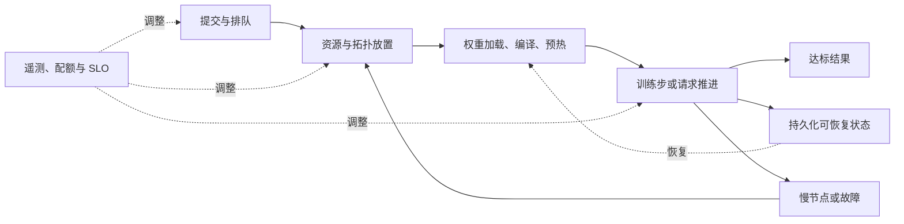

# HPCGame 2026：集群效率与可靠性

> [!nav] 返回与扩散
> [[HPCGame 2026 - 00 MLSys 知识地图|知识地图]] · [[HPCGame 2026 - 01 训练状态与并行|并行作业]] · [[HPCGame 2026 - 03 推理状态与调度|请求调度]] · [[HPCGame 2026 - 04 通信与内存层级|数据路径]] · [[HPCGame 2026 - 07 数据与后训练闭环|数据与后训练]] · [[HPCGame 2026 - 09 多模态与新工作负载|新工作负载]] · [[HPCGame 2026 - 06 前沿追踪|证据与变化]]

> [!abstract] 30 秒全景
> 集群的产出由整个生命周期决定：**拿到合适资源 → 准备状态 → 推进有效工作 → 从中断恢复 → 完成质量与时延目标。** 排队、拓扑碎片、慢 rank、冷启动和重算，都可能吃掉 kernel 带来的收益。

## 1. 从症状进入同一张图



| 症状 | 先看什么 | 再连接哪里 |
| --- | --- | --- |
| 空闲 GPU 很多，作业仍排队 | gang 大小、连续高速域、配额、拓扑碎片 | [[HPCGame 2026 - 01 训练状态与并行\|process groups]] |
| GPU 都很忙，训练推进很慢 | rank 间时差、同步等待、重算、坏样本 | [[HPCGame 2026 - 07 数据与后训练闭环\|时间到质量]] |
| 扩容完成，P99 仍很差 | Pod ready 与 engine ready、编译、冷 KV、路由 | [[HPCGame 2026 - 05 Kernel、DSL 与硬件\|编译与冷启动]] |
| 重启成功，loss 或任务结果漂移 | optimizer、RNG、数据游标、版本一致性 | [[HPCGame 2026 - 07 数据与后训练闭环\|训练闭环]] |
| cache 命中率提高，租户体验变差 | 热点、队头阻塞、隔离域、adapter churn | [[HPCGame 2026 - 03 推理状态与调度\|状态与 admission]] |

## 2. 先建立产出账本

本文用下面的分解作为分析框架，实际阶段可能重叠，测量时应避免重复计时：

```text
时间到目标质量 = 排队 + 准备 + 有效训练推进 + 未隐藏等待 + 故障/重算损失
请求完成时间   = 排队 + 启动/加载 + 模型执行 + 工具/传输等待 + 重试
```

**占到了 GPU、GPU 有活动、完成了有效工作，是三个不同指标。** 高 MFU 只描述选定执行区间内的计算效率；如果忽略排队、恢复、无效 rollout 或重复训练，仍不能解释总成本。

建议并排记录：

- 训练：达到固定评测目标的 wall-clock、总 accelerator-hours、有效样本/更新数、故障损失；
- serving：固定质量与 TTFT/ITL 约束下的完成量、拒绝/取消/重试比例、P95/P99；
- 经济性：每个达标结果的成本，含闲置保温、CPU、网络、存储和重复计算；定义清楚后再使用 `goodput/$`；
- 资源约束：供电/功率封顶、可用机架与互连、容量预算；功率更低若运行更久，总能耗未必更低。

[MLPerf Endpoints](https://mlcommons.org/benchmarks/endpoints/)提供一个可借鉴的比较方式：先选时延目标，再比较满足目标时的系统吞吐；结果需同时看提交方、division、availability 与是否 provisional。它不是本文全部成本账本的替代品，也不能自动视为独立复测。

## 3. 进入集群：数量够，还需要位置合适

一个要求 64 张 GPU 的同步作业，可能需要一组紧密相连的节点。把 64 张零散空闲卡相加，只得到容量，未必得到适合 TP/EP 的通信域。

调度的取舍包括：

1. **Gang admission**：整组资源准备好再启动，减少部分 rank 占卡等待；代价是大作业可能等待更久。
2. **拓扑放置**：把高频通信组留在高速域；过严的亲和约束可能降低可分配容量。
3. **公平与回填**：让短作业使用空隙，同时控制对长作业、紧急作业和服务池的影响。
4. **扩缩与抢占**：保存/恢复成本和并行配置变化，必须进入调度决策。

**已实现但有成熟度边界的观察点**：Kueue 的 Topology-Aware Scheduling 自 `v0.14` 起为 **beta、默认启用**，区分 required/preferred topology。其节点替换能力也有失败范围限制；拓扑可重新分配，并不证明应用状态能无损接续。[Kueue TAS 官方文档](https://kueue.sigs.k8s.io/docs/concepts/topology_aware_scheduling/)

持续追问：一个 placement 策略降低了通信时间多少，又增加了排队时间多少？是否仅把等待从作业内部移到了队列外部？

## 4. 开始运行：扩容速度受状态准备约束

从增加副本到实际接流量，中间至少要区分：获取节点、镜像/依赖、加载权重、建立 communicator、编译与 autotune、graph capture、cache 预热。各阶段的可重用状态不同。

```text
更少保温副本 → 更低闲置成本 → 更频繁冷启动 → 更长排队或更早扩容
更多 cache locality → 更少 prefill → 更集中热点 → 可能更需要迁移与回压
```

扩缩信号应连到 queue、到达率、在途工作、KV 压力与实际时延；GPU busy 程度不能单独说明还有多少可用服务容量。缩容还要处理 draining、长 session、adapter 与 KV 的再分布。

**当前工程入口**：llm-d 的 `dev` 文档分别描述 EPP queue/running request 驱动的 KEDA 路径与 WVA 路径；后者纳入 KV、异构资源及分离式角色，但 SLO targets / strong latency SLO 仍有 **experimental** 标记。此处记录的是文档可见能力，具体部署需固定版本核查。[llm-d autoscaling matrix](https://llm-d.ai/docs/dev/architecture/advanced/autoscaling)

冷启动中编译与 shape 的部分见 [[HPCGame 2026 - 05 Kernel、DSL 与硬件#10. 整图编译：把局部收益变成可重复的运行时行为]]；agent session 和实时流的退出条件见 [[HPCGame 2026 - 09 多模态与新工作负载]]。

## 5. 推进与中断：最慢 rank 和故障是两类问题

慢 rank 仍可能持续产出；死进程、通信 hang、损坏状态则需要不同处理。同步点等待最多的 rank 常是受害者，未必是故障源。

排查应对齐每个 rank 的数据读取、forward/backward、collective、checkpoint 时间，并连接节点温度/功率、ECC、NIC、存储和共置任务；输入长度或 expert 热度导致的负载不均，也不能简单归咎于硬件。

[NVIDIA Resiliency Extension](https://nvidia.github.io/nvidia-resiliency-ext/)已经提供 hang detection、in-job/in-process restart、straggler detection、async/local checkpoint 与 failure attribution 的实现及文档。这些是可集成组件，不意味着任意训练脚本自动具备容错语义。

### Checkpoint 是一致性边界

| 应恢复的对象 | 漏掉后的风险 |
| --- | --- |
| model、optimizer、step、scheduler、精度相关状态 | 恢复后更新规则改变 |
| RNG、sampler/data cursor、packing/shuffle 状态 | 数据重复、跳过或不可比较 |
| shard/mesh 与保存版本元数据 | resize 或换拓扑后无法正确加载 |
| RL policy 版本、在途 rollout、reward/environment 状态 | 陈旧样本混入、重复反馈或闭环断裂 |

异步 checkpoint 把冻结状态、CPU staging、后台写盘、提交完成分开；训练能继续时，最新恢复点未必已持久化。PyTorch DCP 官方 recipe 说明 staging 增加 CPU/pinned memory 压力，建议控制在途保存数量。[DCP async-save recipe](https://docs.pytorch.org/tutorials/recipes/distributed_async_checkpoint_recipe.html)

因此要看 **训练暂停时长、完成持久化的时长、故障后丢失工作、恢复到有效推进的时长** 四个量。本地副本恢复快，其可承受的故障域由复制位置决定；更改 world size 后的数据顺序与优化轨迹需另行验收。

### 从快照一致性到三种恢复终点

2026-09-21 增量核验：NVRx 0.7.0 的 CPU tensor 快照复制修复说明，**后台写盘读到什么**与“训练已继续”是两件事；可变 optimizer state 必须在保存边界冻结。[[MLSys - 证据台账#E-20260921-02]] · [固定版本源码](https://raw.githubusercontent.com/NVIDIA/nvidia-resiliency-ext/v0.7.0/src/nvidia_resiliency_ext/checkpointing/async_ckpt/filesystem_async.py)

Serving 至少要区分：进程重启、重新接流量、原请求/会话正确接续。Shadow Engine Recovery 的机制补录展示了共享权重与预建 communicator/graph 如何缩短第二项；其 preview 不继承 KV，故障域也不含整机损坏。因此 warm standby、容量恢复和会话恢复不能共用一个“恢复时间”。

下一次实验应同时测检测/切换、KV 重建、原请求重试、额外驻留内存和长期 SLO；不把“权重没有复制”读成 standby 完全免费。[[MLSys - 证据台账#E-20260921-06]] · [8/25 原报告](https://developer.nvidia.com/blog/restore-llm-inference-capacity-in-seconds-with-shadow-engine-recovery-in-nvidia-dynamo/)

## 6. 共享服务：租户、adapter 与 cache 一起调度

多租户使“最大复用”受到边界约束：缓存身份应包含模型与 adapter 版本、输入语义和允许共享的隔离域；一位租户的大请求也不应无限挤占另一位的 admission 空间。

**已实现的隔离机制**：vLLM `v0.29.0` 接受可选 `cache_salt`，不同 salt 不共享 prefix blocks，用于缓解前缀缓存的时间侧信道；它是 opt-in，不能代替身份验证、配额或其他缓存的隔离。[版本固定的安全文档](https://docs.vllm.ai/en/v0.29.0/usage/security/)

**已实现的多 adapter 服务**：同版本支持 LoRA 请求与 base-model 请求并行，并有 `max_loras`、`max_lora_rank`、`max_cpu_loras` 等容量约束；运行时加载/卸载默认不开启，官方要求把相关接口限制于受信任的管理环境。[vLLM LoRA 文档](https://docs.vllm.ai/en/v0.29.0/features/lora/)

持续观察的不是“支持几个 adapter”，而是：热 adapter 的路由与驻留、冷 adapter 加载、混合 batch 的 kernel 效率、cache 失效、每租户尾延迟。共享 base weight 的收益要和这些成本一起算。

## 7. 用观测与故障实验闭合判断

将 job/request/session ID、模型/adapter/policy 版本、rank、节点与 trace 连起来，才能判断一次长尾究竟来自队列、数据、编译、通信、KV miss 还是工具等待。

验证集应覆盖正常流量、峰值、扩缩、冷启动、rolling upgrade 与受控故障。故障实验只在授权的测试环境执行，并事先定义成功条件：

- 停掉一个 worker：检测、隔离、重试、恢复分别耗时多少？是否出现重复响应或死等？
- 延迟一条数据/网络路径：是否能定位慢源头，是否诱发集体 timeout？
- 写盘未完成时中断：是否拒绝加载半成品，并找到最近一致恢复点？
- 更换 adapter 或恢复长 session：cache 身份和版本是否一致？

恢复的终点是重新产出正确、达标的结果；进程重启和 dashboard 变绿只是中间事件。

## 8. 当前判断与后续观察

| 当前判断 | 会强化判断的证据 | 会迫使修正的证据 |
| --- | --- | --- |
| 中断或突发负载会削弱局部提速转为产出的比例 | 同等质量下排队、启动、故障损失吞掉收益 | 在这些负载上仍能接近等比转化，应收窄成立条件 |
| placement、autoscaling、cache locality 常需要联合考虑 | 扩容后冷 cache 或拓扑变化造成 SLO 波动 | 独立调节的轻量策略在多 workload 下达到同样目标 |
| 复杂分片与 RL 在途状态仍是恢复的薄弱点 | resize、async save、在途 rollout 暴露一致性问题 | 明确适用范围内可复现的无损恢复、稳定质量与故障实验 |

以上是本笔记的系统分析框架。项目功能是证据入口；新增 release、论文或 issue 应进入 [[HPCGame 2026 - 06 前沿追踪]]，核对事件日期和版本后，再更新这里的判断与条件。

扩散路径：[[HPCGame 2026 - 01 训练状态与并行|谁拥有状态]] → [[HPCGame 2026 - 04 通信与内存层级|状态怎样迁移]] → 本篇“何时能产出” → [[HPCGame 2026 - 07 数据与后训练闭环|产出是否提高质量]]。
