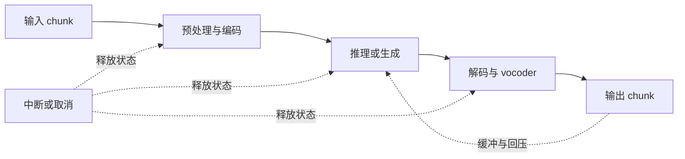

# HPCGame 2026：多模态与新工作负载

> [!abstract] 核心问题
> 工作负载的时间结构、状态和质量指标变化后，原有调度与性能结论还有哪些成立？先画一次任务怎样完成，再选择并行、cache 和硬件。

[[HPCGame 2026 - 00 MLSys 知识地图|知识地图]] · [[HPCGame 2026 - 03 推理状态与调度|推理]] · [[HPCGame 2026 - 07 数据与后训练闭环|数据和后训练]] · [[HPCGame 2026 - 08 集群效率与可靠性|集群]] · [[HPCGame 2026 - 06 前沿追踪|当前判断]]

## 1. 先区分时间结构

| 工作负载 | 一次任务的主要过程 | 容易被漏算的部分 | 优先指标 |
| --- | --- | --- | --- |
| 图像/视频理解 | 媒体解码 → encoder → 语言 prefill/decode | CPU 解码、分辨率/帧数、encoder state 传输与缓存 | 质量、端到端首响应、尾延迟、goodput |
| 图像/视频 diffusion 生成 | 条件编码 → 多轮去噪 → VAE/媒体解码 | 去噪步数、跨步复用、offload、输出编码 | 同质量下生成时间、显存、图像/视频吞吐与成本 |
| 音频/实时交互 | 输入 chunk → 编码/识别或推理 → talker/vocoder → 输出 chunk | 各阶段速率、缓冲、中断、回压、播放前等待 | 首音频延迟、chunk 间隔/抖动、RTF、识别或生成质量 |
| Agent 工作流 | 模型调用 ↔ 工具/环境 ↔ 状态恢复，直到完成 | 外部等待、重试、并行分支、验证与取消 | 任务成功率、完成时间/成本、尾延迟 |

这些是分析模型，不预设每个实现都包含所有阶段。实际以模型计算图和执行 trace 为准。

## 2. Diffusion：每一步都在重复什么

文本自回归的主要状态随 token 推进；diffusion 则反复更新 latent。由此产生另一组问题：

1. 哪些中间特征可以跨去噪步复用？复用是精确的，还是引入近似误差？
2. 减少步数、蒸馏和缓存分别改变了多少计算、多少质量？需分别消融。
3. sequence/ring/Ulysses/TP 如何切分空间或时空 token？通信是否抵消单卡容量收益？
4. encoder、多个 DiT、VAE 是否能同时驻留？offload 能否在下一阶段前完成？
5. 分辨率、帧数、batch、LoRA 变化是否触发重新编译？冷启动如何摊销？

SGLang 团队 2026-01-16 的报告明确介绍了 layerwise prefetch/offload、混合并行和 Cache-DiT 集成。这是已核的机制起点；文中性能来自特定 dev 镜像的项目自测，不能作为所有模型/质量条件的结论。[原始报告](https://www.lmsys.org/blog/2026-01-16-sglang-diffusion/)

沿 [[HPCGame 2026 - 02 稀疏模型与数值格式|质量与数值格式]] → [[HPCGame 2026 - 05 Kernel、DSL 与硬件|编译与硬件]] → [[HPCGame 2026 - 04 通信与内存层级|搬运层级]] 展开，能把同一个“少算一步”放回完整成本账本。

## 3. 音频：平均快于实时，还要看什么时候能听见

RTF（real-time factor）通常表示处理耗时除以音频时长。必须说明分子包含哪些阶段，是否批处理，以及输入/输出如何计时。离线 RTF 很低，并不能单独证明交互首包或流式尾延迟达标。

逐阶段检查：batch 机会、首包门槛、慢阶段积压、跨阶段 state ownership，以及取消后 GPU/CPU/transport buffer 是否回收。多阶段中的一段支持 streaming，不代表整条路径都低延迟。

SGLang-Omni 官方仓库把 preprocessing、encoder、autoregressive engine、talker、decoder、vocoder 等建模为协调阶段，并分别调度；它还列出控制面与张量传输后端。这支持“多模态服务需要阶段级编排”的判断。仓库同时区分 CUDA 支持与 Apple Silicon/Intel XPU 的实验性范围；具体模型和功能组合需查对应版本/guide。[官方实现与范围](https://github.com/sgl-project/sglang-omni)

本页 2026-09-15 读取的是可变仓库的机制描述，未核定其中每个能力的首次发布日期，不将其自动归入本周新增。

### 准入位置改变内存边界，也改变评测分母

2026-09-21 增量核验：SGLang-Omni 0.1.6 的 ASR HTTP 准入发生在波形解码前。引擎限制并发只约束下游；已经读入前端内存的长音频仍可能无界积累。

这里应将“提交总数 → 接纳数 → 正确完成数 → SLO 内完成数”一起记录；拒绝、重试和取消仍属于完整服务账本。若某配置通过 503 筛掉大部分样本，仅在余下样本统计 WER，输入分布与分母都变了，不能据此断言质量提高。具体作者测试限制见 [[MLSys - 证据台账#E-20260921-04]]、[ASR #2163](https://github.com/sgl-project/sglang-omni/pull/2163)；跨阶段资源回收接回 [[HPCGame 2026 - 08 集群效率与可靠性]]。

## 4. Agent：把外部世界也计入关键路径

工具调用等待期间，模型可以让出 GPU，但 session state、KV、环境进程和重试预算仍可能占用资源。需要把模型内调度接到 workflow 调度：

- **何时提交**：ready turn 是否立即进入模型队列，还是等待更合适的全局顺序？
- **保留什么**：prefix、KV、工具状态和环境快照的保留成本如何比较？
- **何时终止**：取消、超时、失败重试和预算耗尽如何传到所有阶段？
- **如何评价**：同样的任务分布与成功标准下，完成更多任务花费多少模型 token、环境时间和总成本？

2026-09 的 turn-release 论文提供一个具体调度实例；它是论文结果与作者实验，不能推成 workflow 调度的“第一个实例”或生产保证。[[MLSys - 证据台账#E-20260915-02|证据与优先性勘误]] · [原论文](https://arxiv.org/abs/2609.10964)

同一批环境执行还可进入 RL 训练，接回 [[HPCGame 2026 - 07 数据与后训练闭环]]；失败恢复与多租户问题接回 [[HPCGame 2026 - 08 集群效率与可靠性]]。

## 5. 每次看到新模型，填这张小表

| 维度 | 必须回答 |
| --- | --- |
| 任务与质量 | 理解还是生成？离线还是交互？质量阈值/人工评价/成功标准是什么？ |
| 工作量 | token、帧数、分辨率、去噪步数、音频时长、工具轮数分别多少？ |
| 状态与时间 | 哪些阶段串行、可并行或可流式？状态何时增大、复用、释放？ |
| 执行组合 | 模型/版本 × dtype × cache/近似 × 并行模式 × backend × 硬件是否实际跑通？ |
| 指标边界 | 是否计入媒体预处理、模型载入/编译、传输、外部环境、重试和输出编码？ |
| 泛化条件 | 收益是否只存在于某些长度/shape/质量档位？换 workload 后哪个瓶颈变了？ |

## 6. 持续观察的问题

- 跨去噪步缓存与蒸馏的收益，在同等画面质量和更高分辨率下能否保持？
- 音频/视频多阶段 serving 的批处理，怎样满足首包与连续输出的双重约束？
- Diffusion language model 的迭代、重遮蔽和缓存语义，与现有 prefix/KV 抽象怎样对应？初次纳入时先查作者计算图，避免套用图像 diffusion 或 AR 假设。
- 更多任务能否共享阶段/状态接口，同时保留不同调度策略？
- Agent 的主要瓶颈在 GPU、工具、环境启动还是验证？优化顺序应由 trace 决定。

## 7. 资料与追踪入口

- [SGLang-Diffusion 原始机制报告](https://www.lmsys.org/blog/2026-01-16-sglang-diffusion/)
- [SGLang-Omni 官方仓库](https://github.com/sgl-project/sglang-omni)
- [Diffusers releases](https://github.com/huggingface/diffusers/releases)
- [PyTorch：编译、动态 shape、LoRA 与 offload](https://pytorch.org/blog/torch-compile-and-diffusers-a-hands-on-guide-to-peak-performance/)
- [[MLSys - 追踪规则与来源|T7 追踪规则]] · [[HPCGame 2026 - 06 前沿追踪|当前判断]]
