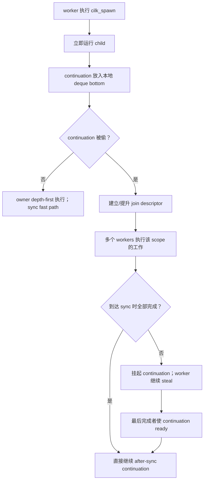

# Stanford CS149 - Lecture 05 - Performance Optimization I: Work Distribution and Scheduling

> [!abstract]
> 本讲集中讨论 assignment 与 scheduling：怎样让所有处理器持续做有用工作，同时不让调度、同步和通信开销反客为主。前半讲比较静态、半静态和动态分配，并用共享工作队列解释 task granularity；后半讲以 Cilk 的 fork–join 语义和 continuation stealing 为例，展示运行时如何把大量逻辑工作高效映射到固定数量的 worker threads。

## 来源与范围

- [Lecture 5 视频：Performance Optimization I](https://www.youtube.com/watch?v=mmO2Ri_dJkk)
- [官方课件 PDF](https://gfxcourses.stanford.edu/cs149/fall23content/media/perfopt1/05_progperf1.pdf)
- [CS149 Fall 2023 课程主页](https://gfxcourses.stanford.edu/cs149/fall23/)

本文以视频为主线，尤其记录课堂中的性能诊断过程、调度队列图解和 Cilk 执行语义；课件用于补全图示和术语。

## 视频索引

| 时间 | 内容 |
|---|---|
| [00:09](https://www.youtube.com/watch?v=mmO2Ri_dJkk&t=9s) | 回顾三道 barrier，导出三份轮转 `diff` 的一 barrier 解法 |
| [05:29](https://www.youtube.com/watch?v=mmO2Ri_dJkk&t=329s) | 本讲目标：工作分配、调度和负载均衡 |
| [06:23](https://www.youtube.com/watch?v=mmO2Ri_dJkk&t=383s) | 优化方法：先做最简单的正确版本，再测量 |
| [09:00](https://www.youtube.com/watch?v=mmO2Ri_dJkk&t=540s) | Mandelbrot 展示等量数据不等于等量工作 |
| [11:56](https://www.youtube.com/watch?v=mmO2Ri_dJkk&t=716s) | 静态与半静态 assignment 何时有效 |
| [16:50](https://www.youtube.com/watch?v=mmO2Ri_dJkk&t=1010s) | 动态 assignment：共享计数器 / work queue |
| [24:02](https://www.youtube.com/watch?v=mmO2Ri_dJkk&t=1442s) | 动态负载均衡与同步开销的权衡 |
| [26:18](https://www.youtube.com/watch?v=mmO2Ri_dJkk&t=1578s) | 用 useful work 的测量值判断还有多少优化空间 |
| [29:34](https://www.youtube.com/watch?v=mmO2Ri_dJkk&t=1774s) | 批量取任务：granularity 的选择 |
| [32:18](https://www.youtube.com/watch?v=mmO2Ri_dJkk&t=1938s) | 已知成本时先调度大任务，缩短尾部 |
| [36:48](https://www.youtube.com/watch?v=mmO2Ri_dJkk&t=2208s) | 从数据并行转向 task / fork–join abstraction |
| [39:23](https://www.youtube.com/watch?v=mmO2Ri_dJkk&t=2363s) | Quicksort 的递归任务图 |
| [42:23](https://www.youtube.com/watch?v=mmO2Ri_dJkk&t=2543s) | `cilk_spawn` 与 `cilk_sync` 的语义 |
| [48:19](https://www.youtube.com/watch?v=mmO2Ri_dJkk&t=2899s) | 合法的顺序实现与“逻辑工作不等于线程” |
| [55:08](https://www.youtube.com/watch?v=mmO2Ri_dJkk&t=3308s) | child 与 continuation |
| [57:43](https://www.youtube.com/watch?v=mmO2Ri_dJkk&t=3463s) | child stealing 和 continuation stealing |
| [61:50](https://www.youtube.com/watch?v=mmO2Ri_dJkk&t=3710s) | 为何 thief 应偷队列顶部较老、较大的工作 |
| [67:53](https://www.youtube.com/watch?v=mmO2Ri_dJkk&t=4073s) | 随机选择 victim 的理由 |
| [69:21](https://www.youtube.com/watch?v=mmO2Ri_dJkk&t=4161s) | 递归地并行生成任务，避免串行 spawn 瓶颈 |
| [70:54](https://www.youtube.com/watch?v=mmO2Ri_dJkk&t=4254s) | `sync` 的 bookkeeping 与 greedy join |

## 1. 从上一讲的一 barrier 解法开始

上一讲的求解器用同一个 `global_diff` 承担三个阶段的状态：当前轮归约、上一轮检查、下一轮重置，所以需要三道 barrier 防止生命周期重叠。

把它改成三份轮转状态：

```c
current  = iteration % 3;
previous = (iteration + 2) % 3;
next     = (iteration + 1) % 3;
```

每一轮只同步真正的数据依赖；不同轮的读写落在不同槽位，不再为了复用一个地址而互相等待。这是本讲调度主题的一个引子：**先去掉不必要的依赖，再让 scheduler 安排剩下的工作。**

## 2. 并行优化的三个冲突目标

高性能 assignment 通常同时希望：

1. **Balance workload**：每个处理器获得近似相同的工作量；
2. **Reduce communication**：让相关计算靠近其数据，减少迁移和共享；
3. **Reduce overhead**：少做队列操作、同步和调度 bookkeeping。

三者经常冲突：

- 把任务切得很细，动态调度容易均衡，但队列和同步变多；
- 把相邻数据固定给同一处理器，可改善局部性，但某些处理器可能提前空闲；
- 集中式队列容易找到工作，却可能成为争用热点。

可用一个分析模型概括：

$$
T_P \approx \frac{W}{P} + T_{imbalance} + T_{schedule} + T_{communication}
$$

其中 `W/P` 是理想下界，其余项是并行化引入或暴露出来的损失。

## 3. 先做最简单的正确版本，再测量

视频给出的工程顺序非常重要：

1. 先实现最简单、可验证的串行版本；
2. 再实现最简单、正确的并行版本；
3. 测量时间花在哪里、离理论上限还有多远；
4. 只有收益足够大时，再加入复杂调度策略。

复杂策略本身可能更慢，也更难验证。没有 profile 就直接上复杂 scheduler，容易优化一个并非瓶颈的部分。

## 4. Load imbalance 是尾部串行化

即使总工作量能均分，如果某个 worker 最后仍有长任务，其余 worker 都只能等待：

```text
worker 0: ████████████
worker 1: ███████░░░░░
worker 2: ████████░░░░
worker 3: ██████░░░░░░
                    ↑ 完成时间由最长 worker 决定
```

静态分配下，近似有：

$$
T_P = \max_j W_j
$$

而不是平均值 `W/P`。尾部空闲在 timeline 上看起来像并行度逐渐塌缩，因此负载不均可视为一种有效串行段。

### 4.1 Mandelbrot：数据量相同，计算量不同

判断一个点是否属于 Mandelbrot 集所需的迭代次数差别很大。把相同数量的像素分给每个 worker，并不保证工作相等。

如果相邻行代价相似，interleaved rows 可能把高成本区域摊开；若数据分布不同，结论也会不同。assignment 必须基于 **cost distribution**，不能只数元素数量。

## 5. Static assignment

静态分配是指 assignment 不依赖任务执行过程中的动态行为。它仍可在运行时根据 `N`、`P` 等参数计算，并不等于“写死在编译期”。

适用情形：

- 每个任务成本相同；
- 成本可以预先准确估计；
- 每个 worker 获得很多独立样本，成本方差可被平均；
- 数据局部性和最少通信比瞬时平衡更重要。

优点是几乎没有运行时协调；缺点是无法纠正不可预测的偏斜。

### 5.1 Semi-static assignment

某些 simulation mesh 或训练 workload 会缓慢变化。可以：

1. 根据当前状态估算各区域成本；
2. 生成一份 assignment；
3. 在若干轮中重复使用；
4. 分布明显改变后重新计算。

这在 locality 与适应性之间折中：不必每个任务都动态入队，也不会永远沿用过期分配。

## 6. Dynamic assignment：空闲者主动取工作

当任务成本无法预测时，把可执行工作放入共享队列。每个 worker 完成任务后继续领取：

```c
while (true) {
    lock(queue_lock);
    int i = next++;
    unlock(queue_lock);

    if (i >= N) break;
    process(i);
}
```

在视频的 primality checking 例子中，“检查一个数”就是一个工作单元；数组加共享 counter 已足以充当队列。

动态分配的优势是反馈式均衡：快 worker 自然领取更多任务，慢任务不会永久绑死某个静态分区。代价是：

- 每次取任务需要同步；
- 共享队列可能争用；
- task metadata 和 cache movement 增加；
- 太细的任务会使 orchestration 超过 useful work。

## 7. 任务粒度：balance 与 overhead 的旋钮

不要只创建和线程数相同的任务。4 核上只有 4 个任务时，一个长任务就足以制造严重尾部；创建远多于 worker 数量的逻辑任务，scheduler 才有选择空间。

但“越多越好”同样错误。可让一次队列操作领取一批工作：

```c
start = atomic_fetch_add(&next, GRANULARITY);
for (i = start; i < min(start + GRANULARITY, N); ++i)
    process(i);
```

- `GRANULARITY` 小：平衡精细，队列/原子操作频繁；
- `GRANULARITY` 大：调度成本低，最后一个 chunk 可能造成长尾。

一个实用准则是让单个工作块的 useful work 远大于一次调度成本，同时保留足够多的块让 `P` 个 worker 都能持续取到工作。

## 8. 用“可消除时间”判断值不值得优化

视频给出两组假设测量：总时间约 5.9 s。

- 如果 useful computation 已占 5.75 s，那么调度相关部分最多只有约 0.15 s；即使把它完全消除，收益也很小。
- 如果 useful computation 只有约 2.5 s，说明超过一半时间耗在调度、同步或等待上，值得继续分析。

这可以写成一个非常实用的上界：

$$
\text{最大可节省时间} \leq T_{total} - T_{unavoidable}
$$

先测 headroom，再决定是否增加系统复杂度。

## 9. 已知成本时：优先安排长任务

即使总任务相同，顺序也影响结尾：若把长任务最后才交给 worker，其他线程可能在尾部全部等待它。

成本可估计时，常用策略是 **largest processing time first**：先运行大任务，小任务留在最后填缝。这样既让大任务尽早暴露后续工作，也降低单个长任务拖尾的风险。

## 10. 分布式队列减少争用

单个中心队列简单，却会让所有线程争抢同一个锁和 cache line。改进方式是：

- 每个 worker 有本地队列；
- 平时从本地取任务，局部操作无需全局同步；
- 本地无工作时，从别的 worker 获取一部分任务。

这引出了后半讲的 work stealing：让 locality 是默认路径，只在负载不均时付出跨 worker 协调成本。

## 11. 从数据并行到 fork–join

### 11.1 数据并行

OpenMP parallel loop、CUDA grid 和 ISPC `foreach` 都要求程序员给出一组独立迭代。并行性一次性、规则地暴露出来。

### 11.2 直接线程编程

程序显式创建固定 workers，自己处理共享队列、锁、条件变量和生命周期。表达能力强，但把大量 scheduler 责任交给程序员。

### 11.3 Task / fork–join

递归算法的工作图会随执行逐步展开。以 quicksort 为例：

1. partition 当前数组；
2. 左子数组和右子数组可以并行排序；
3. 子数组继续递归地产生工作；
4. 两边完成后 join。

这类不规则并行适合让程序声明 logical tasks，由 runtime 把它们安排到固定 worker pool。

## 12. Cilk 的核心语义

课堂用 Cilk 作为 fork–join 模型：

```c
cilk_spawn foo();
bar();
cilk_sync;
```

- `cilk_spawn foo()` 表示当前函数后续执行可以与 `foo` 并发；
- 普通调用 `bar()` 仍是当前控制流的一部分；
- `cilk_sync` 等待当前函数直接 spawn 的工作完成；
- 函数返回前存在隐式 sync。

`spawn` 创建的是可并行的逻辑工作，不承诺创建系统线程，也不承诺立刻并发执行。

### 12.1 Sequential elision

把 `cilk_spawn` 和 `cilk_sync` 关键字擦掉，顺序运行整个程序，是一种合法实现。为每个 spawn 创建新线程也可能满足语义，却通常非常低效。

这个思维检查很有用：

- 程序应当在合法顺序执行下仍然正确；
- 没有同步保护的数据竞争不能靠“我猜 scheduler 会按这个顺序”解决；
- 语义定义允许的执行集合，运行时从中选择高效 schedule。

## 13. Parallel quicksort：暴露足够多但不过细的任务

```c
void quicksort(int *a, int n) {
    if (n < CUTOFF) {
        serial_sort(a, n);
        return;
    }

    int q = partition(a, n);
    cilk_spawn quicksort(a, q);
    quicksort(a + q, n - q);
    cilk_sync;
}
```

递归不断产生 task parallelism，但很小的子数组继续 spawn 会让 runtime overhead 大于排序本身。因此小于 `CUTOFF` 后转为顺序排序。

cutoff 影响性能而非算法正确性。它和前半讲的 batching 是同一个粒度问题。

## 14. Spawn 点的两个选择

> [!question]
> 这里我需要更细致地思考，包括老师在视频里留给学生证明的题目，以及随机选择 victim 与争用的关系。

> [!answer] 先建立主线
> `cilk_spawn` 只暴露出两条 logical strands：spawned child 与 caller 剩余的 continuation。当前 worker 必须选一条立即执行，把另一条放进 deque。Cilk 选择立即执行 child、开放 continuation 给其他 worker 偷；owner 因而保持类似串行程序的 depth-first 顺序，thief 则从另一端偷较老、通常较大的 continuation。随机 victim 负责在没有中心负载表的前提下，把偷取请求分散到各个 workers。

遇到：

```c
cilk_spawn child();
continuation();
```

有两个逻辑分支：

- **child**：被 spawn 的函数；
- **continuation**：spawn 后当前函数剩余的控制流。

worker 只能立即执行一边，另一边进入 deque。

### 14.1 Continuation-first / child stealing

当前 worker 继续执行 continuation，把 child 放入 deque 等待别人偷：

```text
cilk_spawn foo();
bar();

owner:       立即执行 bar
owner deque: [foo]
```

对于循环中连续 spawn `N` 个任务，owner 会沿 continuation 不断运行循环，把 `foo(0), foo(1), ...` 逐个加入自己的 deque：

```text
正在运行：for-loop continuation
deque: [foo(0), foo(1), foo(2), ..., foo(k)]
```

这形成 breadth-first 行为：先生成大量同层 child，再由 workers 消费。若生成快于消费，单个 deque 可以积累 `Θ(N)` 个 ready children。

优点是并行任务很快变得可见；缺点是：

- 可能需要很大 ready-queue 空间；
- owner 的执行顺序明显偏离普通串行调用；
- child 的局部栈/数据可能在另一个 worker 上开始，locality 较难预测；
- 每次 spawn 都要把 child 发布到可偷取结构，增加 common-path overhead。

它叫 **child stealing**，因为被公开给 thief 的是 spawned child。

### 14.2 Child-first / continuation stealing

当前 worker 像普通函数调用一样立即进入 child，把 caller 剩余部分放入 deque：

```text
cilk_spawn foo();
bar();

owner:       立即执行 foo
owner deque: [continuation: bar]
```

如果没有其他 worker 来偷，owner 完成 `foo` 后从本地 deque 取回 `bar`，执行顺序与擦除 `spawn/sync` 后的串行程序相同。这叫 **continuation stealing**，因为被 thief 拿走的是 caller 剩余控制流。

它带来两个重要性质：

1. **Work-first / serial-order fast path**：没有 steal 时尽量像普通函数调用，spawn 的常见路径保持便宜；
2. **Depth-first locality**：owner 沿递归深度继续处理刚访问的数据，把“以后再做”的分支留在 deque。

这里的 child-first 只是 scheduler 的执行选择，并不改变 `spawn` 的语义。child 与 continuation 仍然可以并行；只是没有空闲 worker 时，系统优先按串行顺序运行 child。

### 14.3 用 `for + spawn` 走一遍 continuation stealing

```c
for (int i = 0; i < N; ++i)
    cilk_spawn foo(i);
cilk_sync;
```

只有 worker 0 时：

```text
worker 0 执行 foo(0)
deque 里保存 continuation: 从 i=1 继续循环
```

`foo(0)` 完成后，worker 0 取回 continuation，运行 `i=1`，然后立即进入 `foo(1)`。它仍近似串行执行。

若 worker 1 空闲，它可以偷走 `i=1` 的 continuation：

```text
worker 0: foo(0)
worker 1: continuation i=1
          → spawn foo(1)
          → 立即执行 foo(1)
          → 把 continuation i=2 放到自己的 deque
```

之后 worker 0 若先完成，可能再把 `i=2` 的 continuation 偷回来。视频所谓 continuation “在 workers 之间 bouncing”，指的是 **代表循环剩余部分的唯一控制权不断迁移**，不是全部 `foo(i)` 在同一线程间来回搬运。

### 14.4 两种策略对照

| | Continuation-first / child stealing | Child-first / continuation stealing |
|---|---|---|
| owner 立即运行 | caller 的剩余部分 | spawned child |
| 开放给 thief | child | continuation |
| 单线程顺序 | 与普通串行调用不同 | 接近普通串行调用 |
| 遍历倾向 | breadth-first | depth-first |
| ready work 空间 | 可能快速积累很多 children | 更接近串行调用栈规模 |
| locality | child 容易迁移 | owner 延续当前递归工作集 |
| 典型 Cilk 选择 | 否 | 是 |

## 15. Work-stealing deque：为什么 owner 与 thief 操作不同端

每个 worker 拥有一个双端队列：

```text
top / oldest                                      bottom / newest
     [较老、通常较大的 continuation] ... [局部刚生成的小任务]
          ↑ thieves steal                       owner push/pop ↑
```

### 15.1 Owner 从 bottom push/pop

owner 继续 depth-first 执行，最近产生的 continuation 通常对应当前递归附近的工作：

- 栈帧和数据更可能仍在本地 cache；
- 本地 push/pop 是 common path，应尽量不与别人同步；
- owner 先处理最新工作，行为接近普通调用栈的 LIFO。

### 15.2 Thief 从 top 偷 oldest continuation

以较平衡的 recursive quicksort 为例：

```text
第一次递归：把 [100, 200) 放入 deque，owner 处理 [0, 100)
第二次递归：把 [50, 100)  放入 deque，owner 处理 [0, 50)
第三次递归：把 [25, 50)   放入 deque，owner 处理 [0, 25)
```

所以 deque top 较老的 continuation 往往位于 spawn tree 较浅处，代表更大的子问题；bottom 较新的 continuation 往往更小。thief 偷 top 有三重收益：

1. **摊销 steal 成本**：偷一次大工作，较长时间不必再次同步；
2. **继续暴露并行性**：大递归子问题还会产生自己的 deque 和更多 tasks；
3. **减少长尾**：让最大工作尽早开始，避免最后只剩一个大任务。

“oldest 通常更大”依赖 divide-and-conquer 的结构，不是任意程序的绝对定律；理论上更准确的说法是偷 spawn DAG 中较浅的 ready continuation。

### 15.3 两端操作怎样降低争用

绝大多数时候，owner 只访问 bottom；只有 idle workers 才访问 victim 的 top：

```text
owner 的高频本地操作  → bottom
thief 的低频远端操作  → top
```

这样 owner 与 thief 通常不修改同一个 deque 位置。只有 deque 接近空、双方可能争夺最后一项时，才需要原子操作或更谨慎的同步协议。

这比所有 workers 每完成一个 task 都访问同一个中心队列好得多：有本地工作时完全不需要跨 worker 协调，只有负载失衡时才发生 steal。

### 15.4 Continuation stealing 的空间界直觉

child-first 让每个 worker 沿一条 depth-first 路径执行。它的 deque 中保存的是这条路径上尚未执行的 continuations，类似串行调用栈中挂起的返回点。

设同一程序串行 depth-first 执行的最大栈空间为 `S_1`，在 fully strict fork–join 计算中，可建立直觉界：

$$
S_P = O(P S_1)
$$

证明思路是：

1. 每个 worker 当前执行路径加本地 deque，可对应到一份合法的串行 depth-first 栈；
2. 单个 worker 因而只保留 `O(S_1)` 量级的活跃 frames/continuations；
3. `P` 个 workers 合计至多 `O(P S_1)`。

与之相比，continuation-first 的 spawn loop 可以在一个 worker 上直接堆出 `Θ(N)` 个 children，即使串行程序的调用栈本来只有常数深度。

## 16. 为什么随机选择 victim

> [!question]
> 既然我们想偷“大任务”，为什么不直接寻找工作最多的 worker？随机选择会不会经常失败？它怎样减少 contention？

### 16.1 “寻找最忙 worker”需要一个昂贵的全局事实

要准确知道谁最忙，系统必须不断收集每个 deque 的长度或预计工作量。但：

- queue length 不等于实际剩余计算量；
- 读取所有队列本身需要通信；
- 集中的负载表会成为新的共享热点；
- 信息刚收集完就可能因 spawn、完成和其他 steals 而过时。

因此“每次都挑全局最忙”可能为调度决策付出比一次普通 steal 更高的成本。

### 16.2 Deterministic hottest-victim 会产生惊群

假设 7 个 workers 同时空闲，都观察到 worker 0 最忙：

```text
thief 1 ─┐
thief 2 ─┤
thief 3 ─┤
...      ├──→ worker 0 deque top
thief 7 ─┘
```

所有请求会争用同一个 deque/cache line/lock。第一个 thief 取走大 continuation 后，其余请求看到的状态已经过期，可能争夺较小任务或直接失败。

随机选择让请求近似散布到不同 victims。它不能消除单个 deque 上的多-thief collision，但避免所有 idle workers 由同一规则确定性地冲向同一个热点。

### 16.3 一次随机 steal 的成功概率

设系统有 `P` 个 workers，其中 `B` 个 worker 的 deque 非空。均匀随机选择 victim 时：

$$
p_{success}=\frac{B}{P}
$$

在状态暂时不变的简化模型下，找到一个非空 victim 所需尝试次数服从几何分布：

$$
E[attempts]=\frac{P}{B}
$$

- 工作广泛分布、`B` 大时，通常很快成功；
- 只剩少量关键路径工作、`B` 小时，失败次数会增加。

后者并不一定说明策略差：当全系统本来就只剩少量可并行工作时，任何 scheduler 都无法让所有 processors 保持忙碌。

实际 Cilk 并不需要先神奇地知道“哪个随机队列有工作”；thief 随机挑 victim，失败就重试。随机性使其不依赖中心目录。

### 16.4 理论保证在保证什么

定义：

- `T_1`：单处理器执行的总工作量 work；
- `T_∞`：无限处理器下仍无法缩短的 critical-path length / span；
- `P`：processors 数量。

任何 scheduler 都有下界：

$$
T_P^* \ge \max\left(\frac{T_1}{P},\ T_\infty\right)
$$

对 fully strict fork–join 计算，经典 randomized work-stealing 分析给出期望时间：

$$
E[T_P] = \frac{T_1}{P} + O(T_\infty)
$$

直觉上：

- `T_1/P` 是不可避免的 useful work；
- 额外的 steal 尝试可以摊销到 critical path 的推进上；
- 期望成功/失败 steals 总量为 `O(P T_∞)`，除以 `P` 个 processors 后形成 `O(T_∞)` 时间项。

又因为：

$$
\frac{T_1}{P}+T_\infty
\le 2\max\left(\frac{T_1}{P},T_\infty\right)
$$

所以它在渐近意义上落在最优调度的常数因子内。老师在视频中的“random is asymptotically optimal”应理解为这个 **期望渐近界**，不是每一次随机决定都等于最优选择。

### 16.5 两种减少 contention 的设计要合起来看

| 设计 | 主要减少什么争用？ |
|---|---|
| Per-worker deque | 消除所有 workers 对单一中心队列的持续争用 |
| Owner bottom / thief top | 降低 owner 与 thief 对同一 deque 位置的争用 |
| Random victim | 分散多个 thieves 对同一 victim 的争用 |

随机 victim 不是孤立技巧，而是分布式 deques 设计的第三层配套机制。

## 17. 老师留的推导：为什么普通 spawn loop 串行地揭示工作

视频在 [69:21](https://www.youtube.com/watch?v=mmO2Ri_dJkk&t=4161s) 请学生课后说服自己：

```c
for (int i = 0; i < N; ++i)
    cilk_spawn foo(i);
cilk_sync;
```

虽然 `foo(0)...foo(N-1)` 可以并行执行，但产生它们的控制流仍是一条链：

```text
spawn foo(0)
   → continuation i=1
       → spawn foo(1)
           → continuation i=2
               → spawn foo(2)
                   → ...
```

要执行 `spawn foo(i+1)`，必须先执行第 `i` 次循环的 continuation。任意时刻只有一个 continuation 持有“下一次循环迭代”的控制权。

- child stealing：原 owner 沿 continuation 顺序产生所有 children；
- continuation stealing：这份控制权可在 workers 间迁移，但依赖链没有分叉；仍然一次只产生下一项。

所以 task-generation work 为 `Θ(N)`，其 span 也是：

$$
T_\infty^{generate}=\Theta(N)
$$

即使有无限 workers，也不能在少于线性步数内揭示全部 `N` 个 tasks。这是 control plane 的串行瓶颈。

### 17.1 用递归二分并行地产生工作

```c
void parallel_for(int lo, int hi) {
    if (hi - lo <= GRAIN) {
        for (int i = lo; i < hi; ++i)
            foo(i);
        return;
    }

    int mid = lo + (hi - lo) / 2;
    cilk_spawn parallel_for(lo, mid);
    parallel_for(mid, hi);
    cilk_sync;
}
```

它形成平衡二叉生成树：

```text
[0, N)
├── [0, N/2)
│   ├── [0, N/4)
│   └── [N/4, N/2)
└── [N/2, N)
    ├── [N/2, 3N/4)
    └── [3N/4, N)
```

树的总生成 work 仍是 `Θ(N)`，但不同子树可以并行展开，生成 span 降为：

$$
T_\infty^{generate}=\Theta(\log N)
$$

一个 thief 偷走上层 continuation 后，会得到半个迭代域；它还能继续二分并产生更多 work。这说明 decomposition 不仅决定叶子任务是否独立，也决定 **暴露这些任务的速度**。

实际 parallel-for 会在 `GRAIN` 处停止递归，以免为每个元素创建内部 task。Cilk parallel loop 的 runtime/compiler 可以采用类似的递归分解。

## 18. `sync`、steal 与 greedy join

> [!question]
> 课上关于如何实现 `sync`，我也需要更细致地思考：任务可能已经被其他 workers 偷走，runtime 怎样知道该等谁？等待时 worker 做什么？最后又由哪个 worker 继续？

> [!answer] 一句话版本
> `cilk_sync` 等待的是一个 **logical spawn scope**，不是一组固定 OS threads。没有发生 steal 时，depth-first 执行已经自然完成所有 children，sync 走极便宜的 fast path；发生 steal 后，runtime 为该作用域维护 join descriptor，记录未完成工作和 sync 后的 continuation。到达 sync 但条件未满足的 worker 不阻塞，而是继续偷别的工作；最后完成该作用域工作的 worker 使 continuation ready，并可直接继续执行它。

### 18.1 `sync` 在语义上等待什么

```c
cilk_spawn foo();
cilk_spawn bar();
baz();
cilk_sync;
after_sync();
```

`cilk_sync` 保证当前 spawning function / sync region 中尚未完成的 spawned children，在 `after_sync()` 开始前全部完成。child 内部递归 spawn 的工作也必须作为 child 完成条件的一部分结束。

它不表示：

- 等待系统中所有 tasks；
- 等待所有 worker threads 退出；
- 要求最初执行 `spawn` 的 worker 回来；
- 按 spawn 顺序逐个执行 OS `join`。

可以把 sync 前的区域记作 block A：

```text
block A:
    spawn foo
    spawn bar
    baz
    sync  ───── 必须等 A 派生的逻辑工作完成

continuation after A:
    after_sync
```

### 18.2 Case 1：continuation 从未被偷

continuation stealing 的 owner 总是先运行 child：

```text
owner: foo → 取回 continuation → bar → 取回 continuation
       → baz → sync
```

若保存 block A continuation 的 deque entry 从未被 thief 取走，那么：

- owner 每次都是完成 child 后才恢复 caller；
- 走到 `sync` 时，前面的 children 已按 depth-first 顺序完成；
- 没有其他 worker 持有 A 的平行分支。

所以 runtime 可以让 sync 走接近 no-op 的 fast path。这里“no-op”强调无需跨 worker 等待或做重型 join，并不承诺机器码绝对为零条指令。

这体现 work-first 思想：把开销放到发生 steal 的少数路径，而不是让每次 spawn 都支付昂贵的全局 bookkeeping。

### 18.3 Case 2：continuation 被偷以后发生了什么

假设 worker 0 正在执行 `foo(0)`，block A 的 continuation 被 worker 1 偷走：

```text
worker 0: foo(0)

worker 1: stolen continuation of A
          → 继续产生/执行 foo(1), foo(2), ...
          → 最终到达 sync
```

此时 block A 的逻辑状态已经分散到多个 workers。runtime 需要一个可共享的 descriptor；概念上可以写成：

```c
struct JoinDescriptor {
    atomic<int> outstanding;      // A 中尚未完成的工作
    Continuation afterSync;       // sync 之后从哪里继续
    atomic<State> state;          // running / waiting / ready
};
```

视频使用 `spawn count` 与 `done count` 解释同一件事：

```text
全部完成  ⇔  completed == spawned
```

真实 Cilk runtime 的 frame 和计数实现会更复杂，也会尽量延迟分配共享 descriptor；这里保留的是调度所需的最小逻辑状态。

### 18.4 一个三 worker 时间线

假设 A 派生三份工作 `a0, a1, a2`：

```text
时间 →

worker 0:  a0 ─────────────── complete A work ─→ steal other work
worker 1:     continuation → a1 ── complete ───→ steal other work
worker 2:                    a2 ───────────────→ last complete
                              │
continuation after sync:      └── parked until all A work completes
```

更细地看：

1. worker 1 偷到 continuation，runtime 把 block A 标记为发生了并行分叉；
2. A 的工作被多个 workers 执行，descriptor 跟踪 outstanding/completed；
3. 某个 worker 先到 `sync`，发现仍有未完成工作；
4. 它把 `afterSync` continuation 登记为 waiting，然后去偷别的工作；
5. 每份 A 工作完成时，原子地更新计数；
6. worker 2 完成最后一份工作，使 outstanding 变成零；
7. worker 2 将 `afterSync` 标记为 ready，并可以直接执行它或放入自己的 deque。

最初 spawn 的是 worker 0，最终越过 sync 的却可能是 worker 2。程序语义只要求依赖顺序正确，不要求 logical continuation 绑定某个 OS worker。

### 18.5 到达 sync 的 worker 为什么不能原地阻塞

一种朴素实现是：

```c
while (outstanding != 0) {
    // 原地等待
}
```

这会浪费一个 hardware context。更糟的是，如果很多 workers 都在 join 点睡眠，系统可能明明还有 ready work，却没人执行。

Cilk 采用 greedy scheduling：

- sync 未满足：挂起 logical continuation；
- 当前 software worker 立即从本地或其他 deque 寻找 ready work；
- 只有全系统没有可执行工作时，worker 才真正 idle。

所以“等待的是 continuation，不是 worker”。这和 `pthread_join` 的直觉不同：OS thread 不必因某个逻辑 fork–join scope 未完成而被占住。

### 18.6 最后完成者怎样安全唤醒 continuation

以下概念代码展示必要协议，但不是 Cilk 的具体源码：

```c
spawn_work(join) {
    atomic_fetch_add(&join->outstanding, 1);
}

complete_work(join) {
    if (atomic_fetch_sub(&join->outstanding, 1) == 1)
        make_ready(join->afterSync);
}

sync(join) {
    if (atomic_load(&join->outstanding) != 0) {
        register_waiting_continuation_atomically(join);
        suspend_current_continuation_and_steal();
    }
}
```

`register...atomically` 很关键。否则可能出现 lost wake-up：

```text
sync worker: 读到 outstanding = 1
child worker: 完成最后任务，把 outstanding 改成 0；没看到 waiter
sync worker:  登记 waiter，然后永远等待
```

实际协议必须用原子状态转换、CAS、锁或等价机制，使“检查计数并登记 waiter”与“最后完成并发布 continuation”之间没有缝隙。

同时需要合适的 memory ordering：children 对结果的写入必须 happens-before sync 后 continuation 的读取。也就是说，sync 不只控制调度，还建立内存可见性边界。

### 18.7 为什么 continuation 可以由最后完成者继续

continuation 保存的是恢复执行所需的逻辑状态：

- program counter / resume point；
- 活跃 frame 中需要继续使用的局部变量；
- 指向 join descriptor 和父作用域的链接。

只要这些状态位于可迁移的 runtime frame/closure 中，任何 worker 都能恢复。它不是“把原 OS thread 的整个栈随便搬走”，而是 runtime/compiler 把可并行控制流表示成可调度的数据记录。

这与 Lecture 4 的原则一致：

```text
logical continuation  ≠  software thread  ≠  hardware context
```

### 18.8 Quicksort 中的 sync

```c
cilk_spawn quicksort(left);
quicksort(right);
cilk_sync;
combine_or_return();
```

可能的执行是：

1. worker 0 立即递归处理 `left`；
2. worker 1 偷走 continuation，处理 `right`；
3. worker 1 先到 sync，但 `left` 未完成，于是挂起 parent continuation，继续偷工作；
4. worker 2 最终完成 `left` 的最后一个后代；
5. worker 2 使 parent continuation ready，并执行 `combine_or_return()`。

`cilk_sync` 等待的是左右递归子树的逻辑完成，不关心这棵子树途中用了哪些 workers。

### 18.9 Greedy join 的收益与边界

Greedy join 尽量满足：

> 只要 computation DAG 中还有 ready node，就让空闲 worker 去找它，而不是因为自己遇到 join 就停下来。

收益是提高 processor utilization，并让运行时间接近：

$$
E[T_P] = \frac{T_1}{P}+O(T_\infty)
$$

但 scheduler 无法执行尚未 ready 的节点。如果所有剩余工作都依赖某个长串行链，即使 workers 一直尝试 steal，也没有额外并行性可用。这时空闲来自程序 span，不是调度器不够积极。

### 18.10 把整个机制串起来



最终可以用三句话记忆：

1. **Spawn 决定哪里可以分叉，sync 决定哪里必须汇合。**
2. **被挂起和恢复的是 logical continuation，不是固定 OS thread。**
3. **没有 steal 时保持便宜；发生 steal 后才支付共享计数和同步成本。**

## 19. 对 AI Infra 的启发

### 19.1 动态 shape 与不规则 workload

MoE token routing、变长序列、稀疏计算和请求级 serving 的任务成本很难静态预测。动态队列可改善平衡，但必须批量领取工作，避免 atomic/RPC 成本占主导。

### 19.2 Local queues + stealing

CPU data loader、推理 runtime 和 DAG executor 常采用 per-worker queues：正常路径保留 NUMA/cache locality，worker 饿死时才跨队列偷取。偷“大而老”的工作也更容易摊销数据迁移成本。

### 19.3 Tail latency

服务系统的 batch 完成时间由最慢请求/最慢 shard 决定，与并行循环中的长尾相同。先安排已知长任务、把未知任务切成可再分配的块，都是降低 straggler 影响的方法。

### 19.4 控制面也要有并行性

一个 coordinator 逐个生成上百万个小任务，本身会成为串行瓶颈。递归分解、分层调度或 worker 自主产生子任务可以并行化 control plane。

## 20. 本讲结论

1. 高性能 assignment 要在负载平衡、通信和调度开销之间权衡。
2. 静态分配适合成本可预测或可平均的工作；半静态分配适合缓慢变化的 workload。
3. 动态分配通过 work queue 改善不可预测的负载，但引入同步和争用。
4. task granularity 是核心旋钮：太粗造成长尾，太细被调度成本吞没。
5. 先测 useful work 和优化 headroom，再决定是否引入复杂 scheduler。
6. `spawn` 表达逻辑并行性，不等于创建线程。
7. continuation stealing 用本地 depth-first 执行保持 locality，用 steal 恢复全局平衡。
8. thief 偷 oldest / large continuation，并随机选 victim，可摊销开销并减少热点。
9. 普通 spawn loop 的 task-generation span 仍是 `Θ(N)`；递归二分才能把生成过程并行化到 `Θ(log N)`。
10. `sync` 等待 logical spawn scope，而不是固定 workers；没有 steal 时走 fast path，发生 steal 后通过 join descriptor 与 greedy join 完成汇合。

## 21. 自测题

1. static assignment 为什么不等于 compile-time assignment？
2. Mandelbrot 中平均分配像素为什么仍可能严重失衡？
3. 调大 `GRANULARITY` 会同时改善和恶化什么？
4. 总时间 10 s，其中理论上不可消除的计算已占 9.7 s，调度优化最多能节省多少？
5. Cilk 的 `spawn` 和创建系统线程有什么根本区别？
6. child stealing 为什么可能产生 `O(N)` 的 breadth-first 队列？
7. continuation stealing 为什么有利于 locality？
8. thief 为什么从 deque top 偷，并随机选择 victim？
9. 为什么顺序 spawn 循环本身可能成为瓶颈？怎样改变 decomposition？
10. 若 `P` 个 workers 中有 `B` 个 deque 非空，随机偷取的成功概率与期望尝试次数分别是多少？
11. 为什么 continuation 从未被偷时，`cilk_sync` 可以接近 no-op？
12. 到达 sync 的 worker 为什么应该继续偷工作，而不是阻塞等待 children？
13. “最后完成 child 的 worker 可以继续 after-sync continuation”为什么不违反程序语义？
14. join counter 的检查和 waiter 登记若不是原子的，会发生什么 lost wake-up？

## 参考资料

- Stanford CS149 Fall 2023, *Lecture 5: Performance Optimization I*（视频与官方课件）
- Robert D. Blumofe et al., *Cilk: An Efficient Multithreaded Runtime System*, 1995
- Robert D. Blumofe and Charles E. Leiserson, [*Scheduling Multithreaded Computations by Work Stealing*](https://sites.cs.ucsb.edu/~cappello/190B/papers/CilkJACMp720-blumofe.pdf), JACM, 1999
