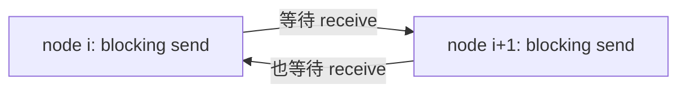
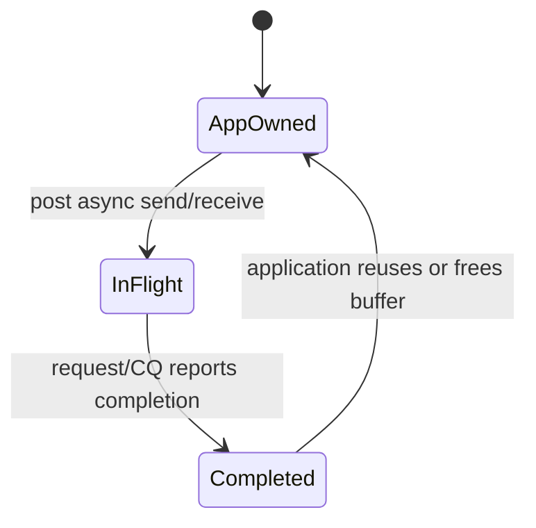

# Stanford CS149 - Lecture 06 - Performance Optimization II: Locality, Communication, and Contention

> [!abstract]
> 本讲把“通信”从分布式系统一路追到单核 cache：共享地址空间隐藏了数据移动，但 load/store 背后仍是请求、传输和等待。课程用消息传递版网格求解器讲解 ghost rows、blocking deadlock 与异步 buffer 生命周期；随后区分 inherent / artifactual communication，通过二维分块、cache blocking、loop fusion 和 Roofline 模型说明如何提高 arithmetic intensity。

## 来源与范围

- [Lecture 6 视频：Performance Optimization II](https://www.youtube.com/watch?v=Mhdny2JNhmc)
- [官方课件 PDF](https://gfxcourses.stanford.edu/cs149/fall23content/media/perfopt2/06_progperf2.pdf)
- [CS149 Fall 2023 课程主页](https://gfxcourses.stanford.edu/cs149/fall23/)

本文以视频讲解为主，公式和通信量再用课件校对。课件最后关于 fixed problem size / strong scaling 的补充页不在主视频讲解范围内，放在文末扩展部分。

## 视频索引

| 时间 | 内容 |
|---|---|
| [00:35](https://www.youtube.com/watch?v=Mhdny2JNhmc&t=35s) | 从负载均衡转向通信与同步成本 |
| [01:37](https://www.youtube.com/watch?v=Mhdny2JNhmc&t=97s) | 简单的共享地址空间抽象背后是复杂硬件 |
| [06:13](https://www.youtube.com/watch?v=Mhdny2JNhmc&t=373s) | 双路系统与 NUMA：访问成本不均匀 |
| [07:44](https://www.youtube.com/watch?v=Mhdny2JNhmc&t=464s) | Message passing 的私有地址空间与显式 send/receive |
| [11:29](https://www.youtube.com/watch?v=Mhdny2JNhmc&t=689s) | 把网格求解器搬到 cluster |
| [14:38](https://www.youtube.com/watch?v=Mhdny2JNhmc&t=878s) | Ghost rows / halo exchange |
| [20:52](https://www.youtube.com/watch?v=Mhdny2JNhmc&t=1252s) | 无共享状态的归约与广播 |
| [24:24](https://www.youtube.com/watch?v=Mhdny2JNhmc&t=1464s) | Blocking send/receive 的完成语义 |
| [27:19](https://www.youtube.com/watch?v=Mhdny2JNhmc&t=1639s) | 所有人先 blocking send 导致 deadlock |
| [30:21](https://www.youtube.com/watch?v=Mhdny2JNhmc&t=1821s) | Async send/receive 与 buffer 生命周期 |
| [36:33](https://www.youtube.com/watch?v=Mhdny2JNhmc&t=2193s) | 从寄存器到远端内存的扩展层级 |
| [38:22](https://www.youtube.com/watch?v=Mhdny2JNhmc&t=2302s) | 带宽受限执行：延迟可隐藏，传输时间不能消失 |
| [45:05](https://www.youtube.com/watch?v=Mhdny2JNhmc&t=2705s) | Arithmetic intensity 与两类通信 |
| [47:11](https://www.youtube.com/watch?v=Mhdny2JNhmc&t=2831s) | 网格分区的 work / communication 比较 |
| [52:21](https://www.youtube.com/watch?v=Mhdny2JNhmc&t=3141s) | Artifactual communication 与 cache capacity |
| [56:05](https://www.youtube.com/watch?v=Mhdny2JNhmc&t=3365s) | Cache blocking / traversal reordering |
| [60:01](https://www.youtube.com/watch?v=Mhdny2JNhmc&t=3601s) | Loop fusion 提高算术强度 |
| [64:09](https://www.youtube.com/watch?v=Mhdny2JNhmc&t=3849s) | Office-hours 类比解释 contention |
| [69:12](https://www.youtube.com/watch?v=Mhdny2JNhmc&t=4152s) | Roofline 模型 |
| [75:44](https://www.youtube.com/watch?v=Mhdny2JNhmc&t=4544s) | FLOP/s 不等于完成得快：减少总工作也可能更好 |

## 1. 共享内存把通信藏起来了

程序写一条 load，看起来只是“读取地址 `x`”。硬件实际可能需要：

1. 查询本地 cache；
2. 沿片上网络寻找拥有该 cache line 的 slice/core；
3. 请求内存控制器；
4. 在 socket 间发送 coherence message；
5. 等待数据返回并填入 cache。

视频展示了环形片上互连、crossbar 和分片 LLC。一个重要观察是：互连本身可能占据与核心相当的芯片面积。通信不是附属细节，而是现代处理器的主要成本之一。

### 1.1 NUMA

双 socket 机器中，每个 socket 连接自己的内存。一个线程访问本地内存和远端 socket 内存的延迟、带宽不同，即使它们处于同一虚拟地址空间。

因此 shared address space 并不意味着 uniform access cost。线程 placement、首次触页策略和数据分区都可能影响性能。

## 2. Message passing：把数据移动写进程序

消息传递模型中，每个执行节点拥有私有地址空间：

- 节点 A 的地址 `x` 与节点 B 的地址 `x` 没有天然关系；
- 节点之间只能显式 `send` / `receive` 数据；
- 没有普通共享变量，也就没有共享内存式 data race。

课堂类比：

- shared memory 像所有人读写同一块公告板；
- message passing 像每个人有自己的办公室，只能寄信交换副本。

消息传递让通信量、参与者和同步点变得清晰，但要求程序显式管理 buffer、顺序和协议。

## 3. 网格求解器的分布式分解

把 `N×N` 网格按连续行分给 `P` 个节点。每个节点只保存自己的内部行：

```text
node 0: rows [0, n/P)
node 1: rows [n/P, 2n/P)
...
```

更新块边界时需要相邻节点的数据。解决办法是多分配两行：

```text
top ghost row
owned rows
bottom ghost row
```

每轮迭代前或阶段间，节点把首尾 owned row 发给邻居，接收对方边界写入 ghost row。之后 stencil 内核可以统一读取 `localA[i-1]` 和 `localA[i+1]`，无需为边界点写复杂分支。

Ghost cells / halo exchange 是 stencil、有限差分、卷积分块和 domain decomposition 中的通用模式。

## 4. SPMD：同一程序，不同本地数据

每个节点运行相同 worker 程序，通过 `rank` 决定：

- 自己拥有哪段全局网格；
- 上下邻居是谁；
- 哪些本地行对应全局边界；
- 发送和接收哪个 buffer。

本地数组通常有 `rows_per_worker + 2` 行，其中 `+2` 是 ghost rows。算法只需把全局索引转换为本地相对索引。

> [!question]
> 与 shared memory 相比，message passing 代码里没有 lock，因为没有 shared state。应该怎样准确理解这句话？

> [!answer] 准确说法
> 不同进程/rank 的普通 load/store 不能直接访问同一个应用对象，所以本地数组和本地累加器没有“多个 ranks 同时修改同一内存位置”的竞争，不需要用 shared-memory lock 保护。它不表示 message passing 没有同步、不会竞争或底层实现不使用锁；依赖关系改由 send/receive、completion 和 ownership 协议表达。

### 4.1 Shared memory 与 message passing 在保护什么

共享内存版本中，多个 workers 都能直接执行：

```c
global_diff += my_diff;
```

`global_diff` 是同一个物理/逻辑对象，`+=` 又是 read–modify–write，因此需要 lock、atomic 或 reduction。

消息传递版本中，每个 rank 只有自己的对象：

```text
rank 0 address space: local_diff_0, total_diff
rank 1 address space: local_diff_1
rank 2 address space: local_diff_2
```

rank 1 无法用普通 store 修改 rank 0 的 `total_diff`，只能发送一条消息。rank 0 独占地接收并累加：

```c
// rank 1, rank 2, ...
send(root, my_diff);

// only rank 0 writes total_diff
for (rank = 1; rank < P; ++rank) {
    receive(rank, &incoming);
    total_diff += incoming;
}
```

只有 rank 0 修改 `total_diff`，所以应用层无需围绕它加锁。mutual exclusion 来自 **single ownership**，不是来自硬件自动保证消息安全。

### 4.2 没有显式 barrier，不等于没有 barrier 语义

本例的收敛协议是：

1. 每个非零节点把 `my_diff` 发给 root；
2. root 求和并判断 `done`；
3. root 把 `done` 广播给全部节点。


root 必须收齐所有消息才能广播，其他 ranks 必须收到广播才能进入下一轮。这个 gather/reduce + broadcast pattern 本身形成了 barrier-like phase boundary，只是同步边写在通信协议中，没有单独调用 `barrier()`。

类似地，halo `receive` 未完成时不能计算边界点，它也建立了一条明确的 happens-before 关系：

```text
neighbor 完成 send buffer
    → message transfer
        → local ghost row receive complete
            → boundary computation
```

### 4.3 Message passing 仍然会有哪些并发问题

| 情形                             | 仍需解决的问题                                     |
| ------------------------------ | ------------------------------------------- |
| 两边都 blocking send              | circular wait / deadlock                    |
| async send 后修改 buffer          | 传输读到混合或新数据                                  |
| 多条消息无序到达                       | sequence number、tag、matching                |
| 多个本地 threads 共用一个 rank/runtime | 本地锁、thread-safe queue 或 serialized MPI mode |
| 多个 senders 汇聚到一个 root          | network/root contention，虽然没有 data race      |
| RDMA write 到同一远端位置             | 远端原子操作、ownership 或更高层协议                     |

所以更完整的结论是：

> Message passing 用私有状态消除了跨 rank 的普通 shared-memory data race，但把正确性责任转化成消息匹配、顺序、完成、buffer lifetime 和 protocol progress。

## 5. Blocking send / receive

课堂使用的抽象语义是：

- blocking `send` 在接收方已经取得数据、发送 buffer 可以安全复用后返回；
- blocking `receive` 在匹配消息已经复制到接收 buffer 后返回。

具体库的完成条件可能更细，但分析任何 API 都要问同一问题：**函数返回时，谁已经拥有数据？原 buffer 何时能修改或释放？**

### 5.1 对称代码产生死锁

如果每个节点都这样写：

```c
send(top_neighbor, top_row);
send(bottom_neighbor, bottom_row);
recv(top_neighbor, top_ghost);
recv(bottom_neighbor, bottom_ghost);
```

并且 send 必须等待接收方发布匹配 receive，那么所有节点都可能卡在第一个 send，没有任何人走到 receive：



这不是性能下降，而是 circular wait 导致的 deadlock。

### 5.2 奇偶配对打破环

让偶数节点先 send 后 receive，奇数节点先 receive 后 send，就能让每对邻居至少有一方发布接收：

```c
if (rank % 2 == 0) {
    send(...);
    recv(...);
} else {
    recv(...);
    send(...);
}
```

真实代码还要分别处理上、下邻居和边界，但核心是给通信建立无环顺序。

## 6. Asynchronous communication

非阻塞操作立即返回一个 request / handle：

```c
Request s = async_send(dst, send_buf);
Request r = async_recv(src, recv_buf);

do_independent_work();

wait(s);
wait(r);
```

优点：

- 多个传输可以并发；
- 通信可以和独立计算重叠；
- 不必在每个 send 点阻塞，较容易避免简单对称 deadlock。

但立即返回不等于传输完成：

- `send_buf` 在 `s` 完成前不能修改、释放或复用；
- `recv_buf` 在 `r` 完成前不能读取；
- 需要 `wait` / fence 建立完成关系；
- 多条消息的到达顺序不能想当然，除非 API 明确保证，通常还需 source/tag 匹配。

异步编程把“等待”从调用点移开，也把 buffer lifetime 和 dependency tracking 的责任交给程序员/runtime。

## 7. Copy、zero-copy、RDMA 与 buffer ownership

> [!question]
> 视频里学生问：与 shared memory 相比，message passing 看起来额外多了复制。实际系统如何用 zero-copy、DMA、RDMA 等方式减少复制？采用异步通信后，为什么必须特别关注数据状态、ownership 和 lifetime？

> [!answer] 核心权衡
> Copy-based transport 先复制数据，因此通信层很快得到一份稳定快照，应用可以较早复用原 buffer；zero-copy/RDMA 让 NIC 直接访问应用 buffer，减少 CPU copy 和内存带宽消耗，却要求该 buffer 在硬件完成访问前保持已注册、有效且内容不变。省掉 copy 的代价，是更严格的 ownership、completion 和 memory-registration 管理。

### 7.1 “多一次复制”具体发生在哪里

一个保守的 two-sided message path 可能是：

```text
sender user buffer
    → sender runtime/kernel buffer
        → NIC DMA / network packets
            → receiver runtime/kernel buffer
                → receiver user buffer
```

这里至少存在两类成本：

- **数据必须跨机器移动**：NIC 从发送端内存读取，经网络到接收端内存；这是通信本身，无法凭空消失；
- **额外 memory-to-memory copy**：用户 buffer 与 runtime buffer 之间的复制；这部分有机会减少。

Shared memory 让另一个线程直接读同一物理对象，看起来没有显式 copy，但数据仍可能通过 cache coherence 在 cache/内存层级间移动。两种模型的差异更多是 **谁负责表达和管理移动**，不是一种“移动数据”、另一种“完全不移动”。

### 7.2 为什么小消息反而常愿意 copy：eager protocol

小消息可以立即复制进 runtime 的内部 buffer：

```text
post send
→ 快速 copy 到 eager buffer
→ send buffer 很快可复用
→ runtime 稍后传输
```

优点：

- 不必等待 receiver 先发布 receive；
- sender 较快拿回 buffer ownership；
- 协议往返少，小消息 latency 低。

缺点是额外 copy、内部 buffer 容量和 memory bandwidth。消息很大时，复制整块数据往往不划算，runtime 常改用 rendezvous：发送方和接收方先交换地址/许可，再直接传输大 payload。

### 7.3 Zero-copy：省的是软件 copy，不是 wire transfer

zero-copy path 可以近似为：

```text
application send buffer
    ← NIC 直接 DMA read
        → network
            → NIC 直接 DMA write
                → application receive buffer
```

CPU 不必先把 payload 搬进中间 buffer；NIC 使用 DMA 直接读写 application memory。这会减少：

- CPU load/store 指令；
- 额外 DRAM traffic；
- 大消息的内存带宽占用和 latency。

但“zero-copy”不表示零数据移动：cache line/packet 仍要穿过内存控制器、PCIe/片上互连和网络。它通常表示 **避免额外的 host-side software copies**。

### 7.4 为什么需要 registered / pinned memory

NIC 要异步访问一个虚拟地址，必须保证传输期间：

- 对应物理页不会被换出或重新映射；
- 设备有访问权限；
- 地址转换和 protection key 有效。

因此 RDMA/verbs 风格 API 常先进行 memory registration，得到 memory region 和 local/remote key。注册可能涉及 pin pages、建立 IOMMU/NIC translation，成本不低，所以高性能程序通常：

- 预先注册并长期复用 buffer pool；
- 避免每条消息都 register/deregister；
- 用固定大小 slabs 或 arena 管理可通信内存。

这也是 zero-copy 不一定适合极小、一次性消息的原因：setup cost 可能超过省下的 copy。

### 7.5 RDMA 的 one-sided 含义

传统 two-sided send/receive 需要两端参与匹配。RDMA read/write 可以由一端提交 work request，让 NIC 直接读写对方预先暴露的 registered region：

```text
local application posts RDMA WRITE
→ local NIC reads local registered buffer
→ remote NIC writes remote registered buffer
→ remote CPU 不必执行 matching receive
```

这降低远端 CPU participation，但没有自动解决高层语义：

- remote application 何时知道新数据已到？
- 多个 writers 会不会覆盖同一位置？
- payload 和“ready flag”的可见顺序是什么？
- 远端 buffer 何时可以回收？

常见做法是 completion queue、doorbell、sequence number、单独通知消息或 RDMA atomic。RDMA 消除了 receive-side copy/CPU involvement 的一部分，并没有消除 synchronization protocol。

### 7.6 Async buffer 的 ownership 状态机

最稳妥的思考方式不是“调用返回了吗”，而是给 buffer 明确状态：



#### Send buffer

```text
AppOwned：应用可写
InFlight：通信层/NIC 可能随时读，应用必须只读且不能释放
Completed：本地通信语义完成，应用重新获得修改/释放权
```

`async_send(buf)` 返回只表示 request 已被接受，不表示 NIC 已经读取 `buf`。若应用立即修改：

```c
Request r = async_send(buf);
buf[0] = new_value;             // 可能早于 NIC DMA read，产生错误消息
```

#### Receive buffer

```text
AppOwned：应用可准备/分配
InFlight：NIC/runtime 可能正在写，应用不能读取或修改
Completed：消息完整到达，应用可以读取
```

这正是课程“把包放在门口后，UPS 还没取走就改内容”的类比。

### 7.7 Local completion 不等于 remote application 已处理

completion 的具体含义必须查 API：

- send completion 通常至少表示本地 send buffer 可安全复用；
- 它可能只表示数据已复制进内部 buffer，而不是 receiver 已经处理；
- receive completion 才表示本地 receive buffer 已包含可读消息；
- RDMA write 的本地 completion 也不自动等于远端应用已经观察并消费数据。

以 MPI nonblocking communication 为例，标准明确区分 start 与 completion：send buffer 在 operation complete 前不可修改；send complete 表示 sender 可以复用该 buffer，却不一定表示消息已经在远端完成消费。

因此不要把下面三件事混为一谈：

```text
API 调用已返回
≠ 本地 buffer 可复用
≠ 远端应用已处理数据
```

### 7.8 用 ping-pong buffers 重叠通信与计算

若算法每轮都要发送边界，可以准备两套 buffers：

```text
iteration k:
    NIC 发送 buffer A
    CPU 同时计算/填充 buffer B

iteration k+1:
    NIC 发送 buffer B
    CPU 重新使用已经完成的 buffer A
```

双缓冲没有取消 lifetime 约束，而是确保应用计算和 NIC 传输使用不同 storage version。它与 Lecture 4 的三份 `diff` 属于同一种“用空间换并发”思想。

### 7.9 实用检查清单

看到 async/zero-copy/RDMA API 时，逐项确认：

1. start call 返回代表什么？
2. local completion 何时发生，buffer 何时可复用？
3. remote completion/visibility 怎样通知？
4. buffer 是否必须 registered/pinned，注册成本如何摊销？
5. 谁在每个阶段拥有读权和写权？
6. 多个 outstanding operations 的 ordering 是否有保证？
7. 失败、取消或超时后谁回收 buffer/request？

> [!important]
> 更少 copy 往往意味着更长时间的 buffer 借用。性能优化的实质不是“没有 ownership”，而是把 ownership 从隐式 copy 转成显式状态机。

## 8. 把内存层级看成通信层级

从计算单元向外：

```text
register → L1 → L2 → LLC → local DRAM → remote DRAM / network
```

每跨一层都可以理解为发起请求、移动 cache line / packet、接收响应。shared-memory load/store 只是把消息协议隐藏在 ISA 和 cache coherence 下。

因此分布式算法的思想也适用于单机：

- 把工作放到数据附近；
- 批量传输；
- 重用已经搬进快速层级的数据；
- 减少需要跨边界共享的状态。

> [!question]
> 下面是视频对上一张 latency/bandwidth 时序图提出的四个问题，需要逐个想清楚。


### 8.1 先建立读图模型

把一次 cache-line load 拆成两段：

```text
发出 load ── 固定等待/寻址 latency ── 数据以带宽 B 返回 ── 完成
                                      <--- blue bar --->
```

设：

- 固定等待部分为 `L` seconds；
- 每次传输 cache line / message 大小为 `S` bytes；
- 总线带宽为 `B` bytes/s。

一条数据的传输占用时间为：

$$
t_{service}=\frac{S}{B}
$$

从发请求到整条 line 返回的时间近似：

$$
t_{response}=L+\frac{S}{B}
$$

图中的 blue rectangle 代表总线实际传输 payload 的区间；gray horizontal distance 表示请求已发出但数据尚未开始返回的等待。pink regions 则表示处理器没有 ready arithmetic instructions、正在等数据。

### 8.2 问题一：怎样看出 memory bus 已完全利用

观察 blue transfer bars：前一条 cache line 刚传完，下一条立即开始，中间没有空白：

```text
memory bus: [line 0][line 1][line 2][line 3]...
             没有 idle gap
```

总线利用率可以写成：

$$
U_{bus}=\frac{\text{timeline 中实际传输数据的时间}}
               {\text{观察区间总时间}}
$$

blue bars 连续覆盖时间轴意味着 `U_bus≈100%`。处理器 timeline 中仍有 pink stalls 并不矛盾：**memory bus 可以一直忙，而 processor 因数据生产速度跟不上计算需求而空闲。** 这正是 bandwidth-bound 的典型图像。

不能仅凭“有很多 outstanding loads”断言总线已满；真正证据是传输资源在稳态没有空槽，或 profiler 测得 achieved bandwidth 接近 sustainable peak。

### 8.3 问题二：只增加 memory latency，图怎样变化

保持 `S` 和 `B` 不变，blue bar 宽度 `S/B` 不变；增加的是请求发出到 blue bar 开始之间的水平距离：

```text
原来：load ── L ── [blue S/B]
更高：load ────── L' ────── [blue S/B]     L' > L
```

由于 memory requests 可以 pipeline，只要系统能保持足够多的 independent requests in flight，稳态 blue bars 仍可首尾相接：

```text
更长 latency：启动阶段更晚看到第一条返回
稳定阶段：    [line 0][line 1][line 2]...  吞吐不变
```

因此更高 latency 不必降低长期 bandwidth utilization，但需要更多 memory-level parallelism。用 Little's Law 可以估算填满管线所需的在途请求数：

$$
Q_{needed}\approx \frac{B\cdot L}{S}
$$

如果 hardware threads、prefetcher、out-of-order window 或 MSHRs 无法提供这么多 requests，blue bars 之间会出现空隙，latency 就无法完全隐藏，吞吐也会下降。

### 8.4 问题三：增加 memory bandwidth，图怎样变化

保持 cache-line 大小 `S` 不变而提高 `B`：

$$
t_{service}=\frac{S}{B}\downarrow
$$

所以 blue bars 在水平方向变窄，同样时间能返回更多 cache lines：

```text
旧带宽：[  line 0  ][  line 1  ][  line 2  ]
新带宽：[line0][line1][line2][line3][line4]...
```

处理器等下一批数据的 pink regions 会缩短，直到另一个资源成为瓶颈。

但更高 peak bandwidth 不保证应用自动用满：

- request issue rate 可能不够；
- outstanding requests 数量可能不足；
- 计算可能已经成为瓶颈；
- 访问不连续导致 transactions 利用率低。

此时变窄的 blue bars 之间会出现 idle gaps，实际 bandwidth 小于新峰值。

### 8.5 问题四：显著提高 math/load 比例后还会 stall 吗

如果增加的是能够在数据传输期间执行的有用、独立 arithmetic，处理器可以用计算填满原来的 pink regions：

```text
低 math/load： compute → load → 等待 → compute → load → 等待
高 math/load： compute compute compute ...（下一批数据同时传输）
```

设每批数据需要 `F` 次运算、移动 `S` bytes，arithmetic intensity 为：

$$
I=\frac{F}{S}
$$

当计算这批数据所需时间足以覆盖下一批数据的传输时间时，bandwidth stall 可以消失，kernel 从 bandwidth-bound 转为 compute-bound。Roofline 的分界条件是：

$$
I \ge \frac{P_{peak}}{B}
$$

右侧是 ridge-point intensity。

但“数学指令更多”不总能隐藏 latency：

- 若新增指令依赖尚未返回的 load，它们仍不能执行；
- 若只是做无用计算，虽然 stall 少了，wall time 未必更短；
- 若工作集产生新的 loads，memory traffic 也可能同时增加。

因此准确结论是：**足够多的 independent useful math 可以隐藏 memory transfer 并提高 ALU utilization；dependency-chain latency 仍需 MLP、prefetching 或 hardware multithreading 来隐藏。**

### 8.6 四个问题的统一视角

| 改动 | Blue bar 宽度 | 请求到 blue bar 的距离 | 稳态吞吐 | 需要更多 MLP？ |
|---|---:|---:|---:|---:|
| latency 增加 | 不变 | 增大 | 足够并发时不变 | 是 |
| bandwidth 增加 | 变窄 | 固定部分可不变 | 上升 | 为吃满新带宽，通常是 |
| math/load 增加 | 不直接改变 | 不直接改变 | memory 吞吐可不变 | 对 latency hiding 的依赖可降低 |

这张图最重要的训练目标是：**latency 决定一项请求多久返回，bandwidth 决定流水线稳定后多久完成一项传输；二者必须分别在图上找对应的水平距离。**

## 9. Latency 与 bandwidth

- **Latency**：从发出请求到第一份数据可用的时间；
- **Bandwidth**：稳定状态下单位时间能传多少数据。

并发独立请求、硬件多线程和异步执行可以隐藏一部分 latency，但不能让必须传输的字节消失。大量流式数据的时间下界近似：

$$
T_{transfer} \geq \frac{\text{Bytes}}{\text{Bandwidth}}
$$

当计算单元等待数据流而非单次依赖链时，程序是 bandwidth-bound。此时仅增加 ALU 或提高峰值 FLOP/s 通常无效。

## 10. Arithmetic intensity

算术强度定义为每搬运一个 byte 做多少计算：

$$
I = \frac{\text{Arithmetic operations}}{\text{Bytes communicated}}
$$

课堂有时用“操作数 / 数据元素”简化计数；做 Roofline 时通常使用 FLOP/byte。它是 communication-to-computation ratio 的倒数。

提高 `I` 的两条路：

1. 在数据已处于快速存储时做更多有用计算；
2. 完成同样工作时搬更少数据。

## 11. Inherent 与 artifactual communication

> [!question]
> Inherent / artifactual communication 应该怎样区分？为什么改变分区可以“减少 inherent communication”，而 cache blocking 又被归为减少 artifactual communication？

> [!answer] 判断标准
> 先固定“算法、数据 ownership 和输出语义”，再问：即使机器能按任意粒度传输、拥有无限理想本地存储，这份数据是否仍必须跨执行单元边界？如果必须，就是该设计下的 inherent communication；如果只因 cache line、有限容量、中间数组、packet granularity 或不良遍历而多搬了一次，就是 artifactual communication。

### 11.1 Inherent communication

由 logical dependency 与 ownership 决定。如果一个 stencil 的边界点由 processor A 更新，却需要 processor B 拥有的邻居值，那么这个值必须以某种形式跨边界：

```text
B owns x
A computes f(..., x, ...)
→ x 或等价信息必须从 B 到 A
```

典型例子：

- domain decomposition 的 halo exchange；
- distributed reduction / all-reduce 中合并 partial results；
- tensor parallel layer 之间交换 activation/partial output；
- producer 与 consumer 位于不同节点时传递任务结果。

这类通信不能仅靠“更大的 cache”消失，因为数据最初就在另一个 owner 那里。

但 inherent 不是脱离设计的绝对常数。改变 decomposition / assignment 可以让更多依赖落在同一 owner 内，从而缩短跨边界部分；改变算法甚至可能改变 dependency graph。二维 square tiling 正是通过减少每个 tile 的 perimeter，降低所选 partition 下不可避免的 halo traffic。

### 11.2 Artifactual communication

logical dependencies 没要求这些额外移动，它们由实现机器的粒度、容量和执行顺序造成：

- cache 按整条 line 搬运，但程序只用其中少量元素；
- 数据在复用前因 cache capacity 被逐出，稍后重新加载；
- 分阶段算子把中间结果写回内存，再马上读回来；
- 不恰当布局造成 false sharing；
- 小 payload 被包装进最小 packet，header/填充占很大比例；
- 本可直接传入最终 buffer 的数据先经过 staging buffer。

它通常可通过 traversal、blocking、layout 和 fusion 消除或减少。

### 11.3 用 ideal-machine test 分类

做一个思想实验：

```text
假设每个 processor 有无限大的、完美管理的 local memory；
可以只传需要的单个 byte；
数据一旦到达就永不被意外逐出。
```

然后问：

- halo 还要传吗？要，因为邻居值归另一 processor 所有 → inherent；
- 同一 cache line 中没用的 60 bytes 还要传吗？不用 → artifactual；
- 临时 tensor 还必须写回 HBM 再读吗？如果下一个算子可直接消费寄存器/SRAM 中的值，则不用 → artifactual；
- all-reduce 还要交换 partial sums 吗？要，除非改变算法/placement → inherent。

这个测试不是物理实现，而是帮助区分 dependency lower bound 与 implementation overhead。

### 11.4 分类取决于讨论边界

同一数据移动在不同抽象层可能有不同标签。例如一次 halo value：

- 从 node B 到 node A 是算法/partition 必需的 inherent network communication；
- 因最小 packet 又附带许多无用 bytes，是 artifactual network traffic；
- 到达 A 后因遍历不当被 cache 反复逐出和重载，是 artifactual memory traffic。

因此不要简单记成“network 是 inherent、cache 是 artifactual”。应逐层比较 minimum required bytes 与 actual moved bytes：

$$
C_{actual}=C_{required}+C_{granularity}+C_{capacity}+C_{materialization}+\cdots
$$

其中 `C_required` 对当前算法/partition 是 inherent，其余项是不同来源的 artifacts。

### 11.5 两类通信的优化顺序

| 类型 | 优先改变什么 | 典型手段 |
|---|---|---|
| Inherent | dependency graph、decomposition、assignment、placement | square tiling、把 producer/consumer colocate、通信避免算法 |
| Artifactual | execution order、layout、storage hierarchy 使用方式 | cache blocking、loop fusion、AoS↔SoA、batching、zero-copy |

一个实用诊断流程：

1. 计算当前算法至少必须跨边界的 bytes；
2. 用 profiler/计数器测 actual bytes；
3. 若 actual 远高于 lower bound，先找 artifacts；
4. 若已接近 lower bound 仍通信受限，再改变 partition、placement 或算法。

## 12. 网格分区的通信量分析

> [!question]
> 这里的分析方法很重要。怎样从头推导 row blocks、interleaved rows 和 square tiles 的 work/communication ratio，并把它推广到其他问题？

> [!answer] 通用思路
> 先算每个 worker 负责的“体积”——它决定 computation；再算需要跨 ownership boundary 的“表面积”——它决定 communication。比较时必须统一成 per-worker 或 whole-system 口径，并补上 message latency、halo width、bytes/element 等常数。

### 12.1 第一步：固定口径与单位

对 `N×N` 网格、`P` 个 processors，假设：

- 每个格点每轮做常数次运算；
- 分配负载均匀；
- stencil 只访问上下左右一层邻居；
- 暂时用“格点更新数 / 传输元素数”作为简化 arithmetic intensity。

则每个 processor 的计算量是：

$$
W = \Theta\left(\frac{N^2}{P}\right)
$$

后面所有 `C` 也都使用 **每个 processor、每轮** 的通信元素数，避免把全系统 bytes 与单 worker work 混在一个比值里。

若要得到真正 FLOP/byte，还要乘上：

```text
每格点 FLOPs
halo 宽度
每元素 bytes
读写方向和消息次数
```

渐近分析先忽略这些常数，用来比较 scaling trend。

### 12.2 连续行块：一维 decomposition

每个 processor 拿约 `N/P` 行，只需交换上下两条长度 `N` 的边界：

```text
local shape: (N/P) × N
area/work:  N²/P
communicating boundary: top N + bottom N
```

$$
C_{row}=2N=\Theta(N)
$$

$$
\frac{W}{C_{row}}
=\frac{N^2/P}{2N}
=\frac{N}{2P}
=\Theta\left(\frac{N}{P}\right)
$$

最左/最右的 physical boundary 和第一/最后一个 processor 可能少一侧通信，只影响常数，不改变 `Θ(N/P)`。

### 12.3 Interleaved rows：边界几乎遍布整个区域

每个 processor 拿每第 `P` 行。它仍拥有约 `N/P` 行、每行 `N` 个点，所以 work 不变：

$$
W=\frac{N^2}{P}
$$

但每一条 owned row 的上下邻居通常属于别的 processor，因此每行要交换约 `2N` 个元素：

$$
C_{interleaved}\approx \frac{N}{P}\cdot 2N
=\frac{2N^2}{P}
$$

$$
\frac{W}{C_{interleaved}}
=\frac{N^2/P}{2N^2/P}
=\frac{1}{2}
=\Theta(1)
$$

也就是说每做常数个点更新就要跨 processor 搬常数个元素，`N` 变大也不会改善 compute/communication ratio。

> [!note] 视频口头表达的单位
> 视频在这里快速说到 `2N²`，但按“每 processor”口径应理解为约 `2N²/P`；否则会把 whole-system communication 与 per-processor work 混用。最终得到的 `1/2` ratio 也验证了分母应包含 `/P`。

### 12.4 二维方块：让 surface/volume ratio 更小

让每个 processor 拿约 `(N/√P) × (N/√P)` 的方块。面积仍是 `N²/P`：

```text
local side length: l = N/√P
area/work:         l² = N²/P
perimeter:         4l = 4N/√P
```

$$
C_{tile}\approx \frac{4N}{\sqrt P}
$$

$$
\frac{W}{C_{tile}}
=\frac{N^2/P}{4N/\sqrt P}
=\frac{N}{4\sqrt P}
=\Theta\left(\frac{N}{\sqrt P}\right)
$$

与一维行块的 `Θ(N/P)` 相比，二维块随 `P` 增长下降得更慢，因而扩展到大 core count 时更好。忽略常数时，改进量级约为：

$$
\frac{N/\sqrt P}{N/P}=\sqrt P
$$

几何本质是：相同面积下，让 region 尽量紧凑，减少暴露给其他 owners 的周长。

### 12.5 数值例子：`N=4096, P=64`

每个 processor 都更新：

$$
W=\frac{4096^2}{64}=262{,}144\ \text{points}
$$

| 分区 | 每 worker 通信元素数（约） | `W/C` |
|---|---:|---:|
| 连续行块 | `2×4096 = 8192` | `32` |
| Interleaved rows | `2×262144 = 524288` | `0.5` |
| `512×512` square tile | `4×512 = 2048` | `128` |

二维块和连续行块做同样多点更新，但边界元素少 4 倍；与 interleaved 相比则是数量级差异。

### 12.6 只数 bytes 还不够：加入 message latency

通信时间常用 alpha-beta 模型：

$$
T_{comm}=m\alpha+V\beta
$$

- `m`：消息条数；
- `α`：每条消息的启动/网络 latency；
- `V`：总 bytes；
- `β=1/B`：每 byte 传输时间。

两种 partition 即使总 bytes 相同，发很多小消息的一方也会支付更大的 `mα`。所以实际分析还要问：

- 有几个 neighbors？
- 每个 neighbor 发几条消息？
- 能否把 halo 打包？
- communication 能否与 interior computation overlap？

无 overlap 时：

$$
T_{step}\approx T_{compute}+T_{comm}
$$

理想 overlap 时：

$$
T_{step}\approx \max(T_{compute},T_{comm})
$$

### 12.7 推广到 `d` 维：volume/surface law

对 `d` 维、每边长度 `N` 的问题，`P` 个近似超立方分区：

```text
每个 local side:  N / P^(1/d)
local volume:      N^d / P
local surface:     Θ((N/P^(1/d))^(d-1))
```

因此：

$$
\frac{W}{C}
=\Theta\left(\frac{N}{P^{1/d}}\right)
$$

- 1D partition：ratio `Θ(N/P)`；
- 2D square partition：ratio `Θ(N/√P)`；
- 3D cubic partition：ratio `Θ(N/∛P)`。

这就是并行科学计算里反复出现的 surface-to-volume reasoning。

### 12.8 Strong scaling 与 weak scaling

**Strong scaling**：固定全局 `N`，增加 `P`。

$$
\frac{W}{C}=\Theta\left(\frac{N}{P^{1/d}}\right)\downarrow
$$

local region 越切越小，surface 相对 volume 越大，最终通信主导。

**Weak scaling**：让每个 processor 的 local side 保持不变；二维中相当于 `N∝√P`。此时：

$$
\frac{N}{\sqrt P}=\Theta(1)
$$

每个 worker 的 work 与 communication 都近似不变，系统更容易维持效率。

### 12.9 为什么不用理论上周长更小的圆

连续平面上，固定面积的圆周长最小。但矩形网格通常要被无缝、无重叠地覆盖：

- circles 不能规则铺满平面，会留下空隙或重叠；
- 边界索引和 ownership 变得不规则；
- neighbor 数、消息碎片和 load imbalance 可能增加；
- 判断哪些格点属于圆本身也增加工作。

square 是规则网格上 surface/volume、可铺性、连续内存和简单消息协议之间的好折中。若 stencil 或网络是 anisotropic，最佳 tile 也可能是按各方向成本调整过的 rectangle，而不必严格为正方形。

### 12.10 可复用分析模板

以后看到分区问题，可以依次写：

1. 全局问题规模和维度是什么？
2. 每个 worker 的 local volume/work 是多少？
3. 哪些 dependency edges 穿过 ownership boundary？
4. 每个 worker 的 boundary size、neighbors 和 message count 是多少？
5. `W/C` 如何随 `N`、`P` scaling？
6. 再乘 FLOPs/point、bytes/element、halo width 等常数；
7. 用 `mα+Vβ` 加入 latency/bandwidth；
8. 最后考虑 overlap、contention、cache layout 与 load balance。
## 13. Cache capacity 与 traversal

视频的简化例子中：

- 每条 cache line 容纳 4 个元素；
- cache 只能容纳 6 条 line（24 个元素）；
- row-major 遍历一个宽 stencil 时，等走到下一行需要复用数据，旧 line 已被逐出。

于是同一数据被反复从下一级加载，产生 capacity misses。虽然算法依赖没变，通信量却因遍历顺序变大。

### 13.1 Cache blocking / tiling

把大迭代域切成能装进 cache 的小块：

```text
先完成 tile 0 的多行/多列
→ 在 line 被逐出前重用
→ 再处理 tile 1
```

视频图示中，原顺序大致用 3 条 line 产生 4 个输出；重新分块后可用 2 条 line 产生 6 个输出。具体数字来自玩具 cache，但原理适用于大矩阵和 tensor：**安排执行顺序，让复用距离小于 cache capacity。**

仅仅把整行反向遍历通常不够；当一行本身远大于 cache，仍需真正的二维 tiling。

## 14. Loop fusion

假设表达式分三步计算：

```text
tmp1 = A + B
tmp2 = tmp1 * C
E    = tmp2 + D
```

若每一步都形成完整临时数组，每个算子对每个元素做 1 次运算、1 次读 A/读 B、1 次写输出，简化强度约为：

$$
I_{separate}=\frac{1}{3}
$$

融合后：

```c
E[i] = (A[i] + B[i]) * C[i] + D[i];
```

每个元素有 3 次算术运算、4 次输入读取和 1 次输出写入：

$$
I_{fused}=\frac{3}{5}
$$

中间值保留在寄存器，不再写回并重读。对 bandwidth-bound 程序，吞吐提升往往与 arithmetic intensity 的提升近似相关。

深度学习编译器进行 operator fusion，核心收益之一正是消除巨大 tensor intermediates 的 memory traffic，而不仅是减少 kernel launch。

## 15. Contention：流量相同，时间分布不同

视频用 office hours 做类比：

- 总学生数、每人服务时间、步行时间都不变；
- 若所有人同时到达，门口排长队；
- 若错峰预约，资源持续工作但个体等待显著降低。

在并行系统中，请求集中到同一资源会产生 contention：

- 所有线程更新同一个 `diff`；
- 所有 workers 访问同一个 task queue；
- 多个核心争用同一 memory controller / cache line；
- 多个节点同时向同一接收端发送消息。

常见手段是分片、局部聚合、批处理和随机化。它们未必减少总 useful work，却能避免请求在时间和空间上形成热点。

## 16. Roofline 模型

Roofline 把程序的 arithmetic intensity 与硬件的两个峰值联系起来：

- 横轴 `I`：FLOP/byte；
- 纵轴 `Performance`：FLOP/s；
- 内存带宽上限 `B`：byte/s；
- 计算峰值 `P_peak`：FLOP/s。

$$
P_{attainable} \leq \min(P_{peak},\ B \cdot I)
$$


- 斜坡区：bandwidth-bound，提高峰值算力帮助不大；
- 平顶区：compute-bound，继续减少 bytes 可能不再提升吞吐；
- ridge point：`B·I = P_peak`，两个上限相交。

实际点若明显低于 roof，说明还有其他损失，例如指令依赖、向量化不足、负载不均或同步等待。

### 16.1 硬件算力增加会把 ridge point 推右

若计算峰值提高 4 倍、内存带宽不变，要继续吃满计算单元，程序也需要约 4 倍 arithmetic intensity。现代加速器算力增长快于内存带宽时，fusion、tiling 和数据复用会越来越重要。

### 16.2 向左移动不一定是坏事

Roofline 纵轴是计算速率，不是总 wall-clock time。若新算法减少了总 FLOPs，即使 arithmetic intensity 和 FLOP/s 降低，也可能更早完成。

总时间近似：

$$
T = \frac{\text{Total work}}{\text{Achieved performance}}
$$

所以优化既可以提高分母，也可以减少分子。不能只用“FLOP/s 更高”判断程序更快。

## 17. Slides 补充：固定问题规模的扩展极限

课件补充页讨论 fixed problem size / strong scaling：`N` 固定而 `P` 增加时，每个 processor 的本地工作 `N²/P` 持续下降，但边界通信不会同速消失。最终每个 processor 只剩很小的 tile，通信和同步占主导，再加处理器反而没有收益。

这与前面的二维块公式一致：

$$
\frac{W}{C}=\Theta\left(\frac{N}{\sqrt P}\right)
$$

固定 `N` 时，`P` 越大，每份工作的 compute-to-communication ratio 越低。

## 18. 对 AI Infra 的启发

### 18.1 Tensor parallelism 的分区边界

按哪个维度切 tensor 会决定 collective 的种类和字节数。与网格行块/二维块一样，计算量均衡只是第一步，还要比较每种 partition 的边界通信和复用机会。

### 18.2 Async collectives 与 buffer ownership

`all_reduce_async` 或 CUDA stream 上的异步 copy 返回后，tensor 未必已经可读写。event、stream dependency 和 request handle 本质上都在管理视频所讲的异步 buffer lifetime。

### 18.3 Kernel fusion 和 tiling

Transformer 中 elementwise chain、normalization 和 attention 子图的 fusion 可以避免写回中间 tensor。FlashAttention 一类 tiled 算法则通过重排计算，在片上 SRAM 中复用数据，用额外或重算的 arithmetic 换更少 HBM traffic。

### 18.4 Roofline 是第一层诊断，不是最终答案

先判断 kernel 位于 bandwidth-bound 还是 compute-bound 区域，再选择 fusion/tiling 或向量化/算力优化。若实际点远低于 roof，还要查 occupancy、依赖、load imbalance、同步和 contention。

### 18.5 NUMA 与 serving

CPU inference、KV cache 管理和 data loader 若忽略 NUMA placement，逻辑上的本地访问可能变成跨 socket traffic。worker affinity 和 memory ownership 应与分片策略共同设计。

## 19. 本讲结论

1. shared memory 只隐藏通信，不会消除通信。
2. message passing 通过私有地址空间和显式 send/receive 让数据移动、同步和 ownership 更清晰。
3. blocking 通信必须设计无环顺序，否则对称代码可能 deadlock。
4. async communication 可重叠计算与传输，但必须显式管理完成、顺序和 buffer lifetime。
5. decomposition / assignment 决定 inherent communication；二维块通常比一维行块更具扩展性。
6. cache blocking 和 loop fusion 减少 artifactual communication，提高 arithmetic intensity。
7. contention 来自请求集中，可用分片、局部聚合、错峰或随机化分散。
8. Roofline 用 `min(P_peak, B·I)` 判断性能上限，但最终仍应比较 wall-clock time。
9. message passing 的 private state 消除了跨 rank 的普通 shared-memory data race，但同步仍存在于消息顺序、completion 和 ownership 协议中。
10. zero-copy/RDMA 减少额外 software copies，却要求 registered memory、明确的 buffer lifetime 和 local/remote completion 语义。
11. latency 增加主要拉长 pipeline；bandwidth 增加缩短每份数据的 service time，二者需要分开分析。
12. 网格分区可以统一为 volume/surface 分析，再用 `mα+Vβ` 加入消息 latency 与 bytes 成本。

## 20. 自测题

1. shared address space 为什么不代表 uniform memory access？
2. ghost row 解决了什么问题？它付出了什么代价？
3. 为什么所有节点都先 blocking send 可能死锁？奇偶协议怎样打破等待环？
4. async send 返回后，为什么仍不能立刻修改 send buffer？
5. inherent communication 和 artifactual communication 各举两个例子。
6. 对 `N×N` 网格，为什么二维方块分区的 work/communication 比是一维行块的 `√P` 倍量级？
7. cache blocking 改变了算法依赖吗？它实际改变了什么？
8. 分离的三个 elementwise kernel 融合后，memory traffic 为什么减少？
9. 某机器内存带宽 1 TB/s，kernel 强度 10 FLOP/byte，带宽 roof 是多少 FLOP/s？
10. 为什么 achieved FLOP/s 下降的算法仍可能更快？
11. 为什么 message passing 代码没有共享变量 lock，却仍然可能 deadlock 或产生 buffer race？
12. `async_send()` 返回、send completion 和 remote application 已消费数据，三者有什么区别？
13. 为什么 zero-copy buffer 通常必须 registered/pinned，并在 completion 前保持不变？
14. memory latency 增加但 bandwidth 不变时，时序图中的哪些部分变长、哪些保持不变？
15. 若系统带宽为 `B`、latency 为 `L`、每次传输 `S` bytes，大约需要多少 outstanding requests 才能填满管线？
16. 怎样用 ideal-machine test 区分 inherent 与 artifactual communication？
17. 在 `d` 维规则网格中，超立方分区的 work/communication ratio 为什么是 `Θ(N/P^(1/d))`？
18. 为什么两个 partition 即使传输总 bytes 相同，message count 不同仍可能有明显性能差异？

## 参考资料

- Stanford CS149 Fall 2023, *Lecture 6: Performance Optimization II*（视频与官方课件）
- Samuel Williams, Andrew Waterman, David Patterson, *Roofline: An Insightful Visual Performance Model for Multicore Architectures*, 2009
- MPI Forum, [*MPI 5.0 — Communication Initiation and Completion*](https://www.mpi-forum.org/docs/mpi-5.0/mpi50-report/node75.htm)
- NVIDIA, [*RDMA Aware Networks Programming User Manual*](https://docs.nvidia.com/rdma-aware-networks-programming-user-manual-1-7.pdf)
