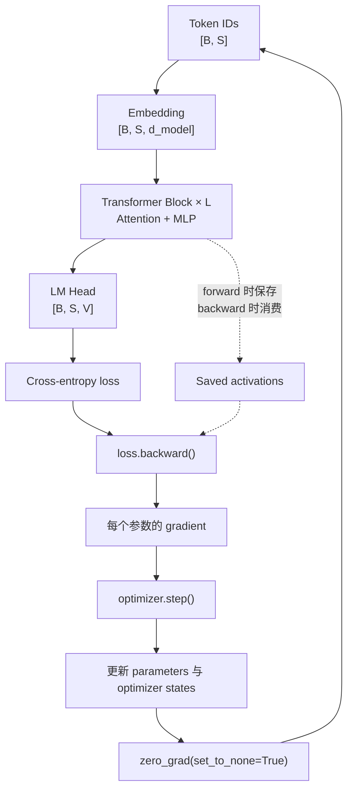

# Lecture 02：PyTorch and Resource Accounting

> [!abstract] 本讲一句话
> PyTorch 只是操作 tensor 的工具；真正可迁移的能力，是把模型拆成 shape、dtype、device、FLOPs、显存字节数和数据搬运量，然后判断系统究竟受 compute、memory capacity 还是 memory bandwidth 限制。

## 来源与范围

- 课程：Stanford CS336 — Language Modeling from Scratch, Spring 2026
- 讲师：Percy Liang
- 上课日期：2026-04-01
- [课程视频](https://www.youtube.com/watch?v=kuYAsz7zspQ)，时长 1:17:25
- [课程主页](https://cs336.stanford.edu/)
- [官方 recording 版可执行讲义](https://cs336.stanford.edu/lectures/?trace=lecture_02_recording)
- 本讲覆盖：PyTorch tensor、dtype、device、einops、FLOPs、MFU、arithmetic intensity、autograd、optimizer、gradient accumulation 和 activation checkpointing
- 本讲不展开：Transformer 的具体架构、分布式并行、通信模型和高性能 kernel；这些内容将在后续讲次继续

> [!warning] 来源边界
> 知识结构、公式、代码思路和示例数值以官方 recording 版可执行讲义为准。下面的时间点用于视频导航，是根据公开视频索引与讲义顺序校准的近似位置；当前环境无法稳定导出 YouTube 章节面板，因此本笔记不是逐字稿，也不把无法核对的课堂口头补充写成课程原话。

## 视频索引

| 时间 | 视频内容 | 对应笔记 |
| --- | --- | --- |
| [00:00](https://www.youtube.com/watch?v=kuYAsz7zspQ&t=0s) | Course update and overview | [1. 为什么先学资源核算](#1-为什么先学资源核算) |
| [01:57](https://www.youtube.com/watch?v=kuYAsz7zspQ&t=117s) | Resource accounting questions | [2. 两个数量级估算](#2-两个数量级估算) |
| [04:49](https://www.youtube.com/watch?v=kuYAsz7zspQ&t=289s) | Tensors and memory | [3. Tensor 的四个基本属性](#3-tensor-的四个基本属性) |
| [09:03](https://www.youtube.com/watch?v=kuYAsz7zspQ&t=543s) | FP32, FP16 and BF16 | [4. Dtype 与数值表示](#4-dtype-与数值表示) |
| [11:27](https://www.youtube.com/watch?v=kuYAsz7zspQ&t=687s) | Mixed precision | [4.3 Mixed precision](#43-mixed-precision) |
| [15:15](https://www.youtube.com/watch?v=kuYAsz7zspQ&t=915s) | Low-bit formats and quantization | [4.4 FP8、FP4 与量化](#44-fp8fp4-与量化) |
| [17:03](https://www.youtube.com/watch?v=kuYAsz7zspQ&t=1023s) | CPU and GPU tensors | [5. Device 与异步执行](#5-device-与异步执行) |
| [17:59](https://www.youtube.com/watch?v=kuYAsz7zspQ&t=1079s) | Einops | [6. 用 einops 表达 tensor 变换](#6-用-einops-表达-tensor-变换) |
| [27:20](https://www.youtube.com/watch?v=kuYAsz7zspQ&t=1640s) | FLOPs | [7. FLOPs：计算量的账本](#7-flops计算量的账本) |
| [35:07](https://www.youtube.com/watch?v=kuYAsz7zspQ&t=2107s) | Benchmarking and MFU | [8. Benchmark 与 MFU](#8-benchmark-与-mfu) |
| [40:27](https://www.youtube.com/watch?v=kuYAsz7zspQ&t=2427s) | Arithmetic intensity | [9. Arithmetic intensity 与 roofline](#9-arithmetic-intensity-与-roofline) |
| [57:11](https://www.youtube.com/watch?v=kuYAsz7zspQ&t=3431s) | Deep-network resource accounting | [10. 深层网络的资源账本](#10-深层网络的资源账本) |
| [59:16](https://www.youtube.com/watch?v=kuYAsz7zspQ&t=3556s) | Gradient FLOPs | [11. Autograd 与训练 FLOPs](#11-autograd-与训练-flops) |
| [1:06:48](https://www.youtube.com/watch?v=kuYAsz7zspQ&t=4008s) | Optimizers and AdaGrad | [12. Optimizer 与最小训练循环](#12-optimizer-与最小训练循环) |
| [1:11:42](https://www.youtube.com/watch?v=kuYAsz7zspQ&t=4302s) | Gradient accumulation | [13. Gradient accumulation](#13-gradient-accumulation) |
| [1:14:38](https://www.youtube.com/watch?v=kuYAsz7zspQ&t=4478s) | Activation checkpointing | [14. Activation checkpointing](#14-activation-checkpointing) |
| [1:16:16](https://www.youtube.com/watch?v=kuYAsz7zspQ&t=4576s) | Summary | [17. 本讲结论](#17-本讲结论) |

## 1. 为什么先学资源核算

第一讲把语言模型问题写成：

$$
\text{quality}
=
f(\text{model},\text{data},\text{optimization})
\quad
\text{subject to resource constraints}
$$

第二讲开始建立描述这些约束的共同语言。

当我们看到一段 PyTorch 代码时，不应只问“它能否运行”，还应该问：

1. 每个 tensor 的 shape 是什么？
2. 使用什么 dtype，每个 element 占多少 bytes？
3. tensor 在 CPU、GPU 还是其他 device？
4. 运算需要多少 FLOPs？
5. 需要从 HBM 搬运多少 bytes？
6. 当前 bottleneck 是算力、显存容量、显存带宽还是通信？
7. 真实吞吐距离硬件峰值还有多远？

本讲将要学习的内容也可以分成三类：

| 类型 | 本讲内容 | 可迁移价值 |
| --- | --- | --- |
| Mechanics | PyTorch、einops、autograd、optimizer API | 知道如何实现 |
| Mindset | 对 FLOPs、memory 和 bandwidth 做数量级估算 | 知道为什么慢、为什么放不下 |
| Intuition | 哪些算子通常 compute-bound 或 memory-bound | 能快速定位优化方向 |

> [!tip] 先算再跑
> 大模型实验很贵。资源核算的价值，是在分配数百甚至数千张 GPU 之前，先排除量级上不可能或明显低效的方案。

## 2. 两个数量级估算

### 2.1 训练 70B 模型需要多久

对 dense Transformer 训练，课程稍后会推导常用近似：

$$
\text{training FLOPs}
\approx
6ND
$$

其中：

- $N$：模型参数量；
- $D$：训练 token 数量。

若训练一个 70B 参数模型，并使用 15T tokens：

$$
6
\times
70\times10^9
\times
15\times10^{12}
=
6.3\times10^{24}
\text{ FLOPs}
$$

若计算设备数量为 $G$，每张卡的 dense BF16 峰值为 $P$，实际 Model FLOPs Utilization 为 $u$，则：

$$
\text{time}
\approx
\frac{6ND}{G\times P\times u}
$$

官方讲义的 back-of-the-envelope 取值为：

- $G=1024$；
- $P=989.5$ TFLOP/s；
- $u=50\%$。

结果约为：

$$
144\text{ days}
$$

> [!warning] 这是容量规划近似
> `6ND` 没有包含所有算子和通信，峰值 FLOP/s 也不等于持续吞吐。课程代码使用的是约 989.5 TFLOP/s 的 dense BF16 假设；不要在没有统一型号、稀疏性和精度口径时直接比较厂商宣传数字。

### 2.2 8 张 80 GB GPU 能装下多大的模型

如果训练使用：

- BF16 parameters：2 bytes/parameter；
- BF16 gradients：2 bytes/parameter；
- Adam 的两个 FP32 moments：$4+4=8$ bytes/parameter；

则仅持久状态就需要：

$$
2+2+4+4
=
12\text{ bytes/parameter}
$$

8 张 80 GB GPU 一共有约 640 GB，因此理想上界为：

$$
\frac{640\text{ GB}}{12\text{ bytes}}
\approx
53.3\text{B parameters}
$$

但这个结果尚未计入：

- Activations；
- CUDA context；
- 通信 buffer；
- 临时 workspace；
- allocator fragmentation；
- 可能存在的 FP32 master weights；
- checkpoint、数据和其他运行时状态。

所以它只能回答“绝对不可能超过多少”，不能回答“实际上能稳定训练多少”。

## 3. Tensor 的四个基本属性

语言模型中的几乎所有对象最终都是 tensor：

- Parameters；
- Gradients；
- Optimizer states；
- Input data；
- Activations；
- Logits；
- Attention/KV cache。

检查一个 tensor 时，至少记录四项：

```python
x.shape
x.dtype
x.device
x.numel() * x.element_size()
```

### 3.1 Shape

`shape` 决定数学语义，也经常直接决定计算和内存复杂度。

例如：

```python
x = torch.randn(4, 8)
```

其 shape 为 $[4,8]$，element 数量为：

$$
\operatorname{numel}(x)
=
4\times8
=
32
$$

### 3.2 Memory

连续 tensor 的 payload 大小可用下面的基础式估算：

$$
\text{memory bytes}
=
\operatorname{numel}(x)
\times
\operatorname{element\_size}(x)
$$

如果 `x` 为 FP32，每个 element 为 4 bytes：

$$
32\times4
=
128\text{ bytes}
$$

GPT-3 规模的一块 FFN projection matrix 可以是：

$$
[4d,d]
=
[49152,12288]
$$

FP32 payload 大约为：

$$
49152
\times
12288
\times
4
\approx
2.25\text{ GiB}
$$

一块矩阵就达到 GB 级，这说明 dtype 并不是实现细节。

> [!note] Storage 不总等于逻辑 tensor 大小
> View、stride、shared storage、padding 和 allocator 行为会让实际分配量与 `numel × element_size` 不完全相同。这个公式是第一层核算，不是完整的显存 profiler。

## 4. Dtype 与数值表示

浮点数通常由三部分组成：

$$
\text{value}
\approx
(-1)^{\text{sign}}
\times
\text{mantissa}
\times
2^{\text{exponent}}
$$

在位数固定时：

- exponent bits 决定动态范围；
- mantissa bits 决定有效精度；
- 更低位宽降低存储和数据搬运，并可能获得更高硬件吞吐。

### 4.1 FP32、FP16 与 BF16

| Dtype | 总位数 | Exponent | Mantissa | Bytes | 特点 |
| --- | ---: | ---: | ---: | ---: | --- |
| FP32 | 32 | 8 | 23 | 4 | 范围和精度都较高 |
| FP16 | 16 | 5 | 10 | 2 | 精度较好，但动态范围明显更窄 |
| BF16 | 16 | 8 | 7 | 2 | 保留 FP32 的 exponent 范围，牺牲尾数精度 |

课程用 $10^{-8}$ 说明差异：

- 转为 FP16 时可能 underflow 为 0；
- 转为 BF16 时仍能表示，但会发生舍入。

因此 BF16 很适合神经网络训练：它将 payload 减半，又保留较宽的动态范围。

### 4.2 数值范围与数值精度不是同一件事

- 能否表示极大或极小的数，是 range 问题；
- 能否区分两个相近的数，是 precision 问题。

BF16 对 range 友好，但对小增量的分辨能力不如 FP32。优化器更新和某些 reduction 因此经常仍保留 FP32。

### 4.3 Mixed precision

Mixed precision 的核心不是“所有东西都换成低精度”，而是按数值敏感性和资源成本分配 dtype。

一种常见训练账本是：

| 对象/计算 | 常见 dtype |
| --- | --- |
| Parameters | BF16 |
| Activations | BF16 |
| Gradients | BF16 或 FP32，取决于实现 |
| Adam moments | FP32 |
| Matmul | 低精度输入，硬件内部高精度 accumulation |
| 敏感的 reduction / exp | 通常提升精度 |

PyTorch Automatic Mixed Precision 会让适合低精度的算子走低精度路径，同时让数值敏感算子保持更安全的精度。

> [!warning] Mixed precision 不是免费转换
> Cast 本身可能产生 kernel 和访存开销；dtype 改变还可能影响 kernel 选择、Tensor Core 使用、通信量和数值稳定性。必须测端到端吞吐与收敛。

### 4.4 FP8、FP4 与量化

课程进一步展示了：

- FP8 E4M3：较多 mantissa bits，精度更高，范围较窄；
- FP8 E5M2：更大动态范围，精度更低；
- FP4/NVFP4：可表示值极少，需要配合 block scaling；
- 1-bit/低 bit 模型：通过量化、缩放或特殊训练方法继续压缩。

低 bit 的基本 tradeoff 是：

```text
位宽下降
├─ 参数/activation/通信字节数下降
├─ 特定硬件上的理论吞吐提高
└─ 表示误差、scale metadata 和 kernel 复杂度上升
```

低 bit 并不自动等于端到端更快。若硬件没有相应算力、需要频繁反量化，或 workload 原本不受这些 tensor 的带宽限制，收益会变小。

## 5. Device 与异步执行

PyTorch tensor 默认创建在 CPU：

```python
x = torch.randn(32, 32)
```

可以搬到 GPU：

```python
x = x.to("cuda:0")
```

也可以直接在目标 device 创建，避免一次额外搬运：

```python
x = torch.randn(32, 32, device="cuda:0")
```

### 5.1 Device 是数据位置，不只是执行位置

GPU kernel 要消费的数据必须位于可访问的 device memory。一次看似简单的计算，可能同时包含：

1. Host 端发起 kernel；
2. 输入从 host 搬到 device；
3. 从 HBM 读入执行单元；
4. GPU 执行；
5. 结果写回 HBM；
6. 必要时再回到 host。

如果把 transfer 混入计时，测到的就不只是算子速度。

### 5.2 CUDA 默认是异步的

CPU 发起 CUDA kernel 后通常立即继续执行。错误的 benchmark：

```python
start = time.time()
y = x @ w
elapsed = time.time() - start
```

可能只测到 kernel launch 时间。基础的正确做法是：

```python
torch.cuda.synchronize()
start = time.time()
y = x @ w
torch.cuda.synchronize()
elapsed = time.time() - start
```

正式 benchmark 还应包括：

- Warm-up；
- 多轮重复；
- 排除初始化和 compilation；
- 固定 shape、dtype 和 device；
- 必要时使用 CUDA events；
- 记录 median/percentile，而不是只看一次结果。

## 6. 用 einops 表达 tensor 变换

传统 PyTorch API 常按轴编号操作：

```python
x.transpose(-2, -1)
```

当 tensor rank 增大时，`-2` 和 `-1` 很难表达语义。einops 将 dimension name 写进表达式，让代码更接近 shape algebra。

### 6.1 `einsum`：乘法与归约

普通矩阵乘：

```python
einsum(
    x, w,
    "batch hidden, hidden output -> batch output"
)
```

对应：

$$
[B,D]
\times
[D,K]
\rightarrow
[B,K]
$$

Batch 内两组序列的相似度：

```python
einsum(
    x, y,
    "batch seq1 hidden, batch seq2 hidden"
    " -> batch seq1 seq2"
)
```

对应：

$$
[B,T_1,D]
\times
[B,T_2,D]
\rightarrow
[B,T_1,T_2]
$$

规则是：出现在输入却不出现在输出的 dimension 被求和。

### 6.2 `reduce`：按命名轴聚合

```python
reduce(x, "... hidden -> ...", "sum")
```

这表示对 `hidden` dimension 求和，同时保留其余所有 dimension。

### 6.3 `rearrange`：拆分、合并和换轴

将 hidden 拆为 heads：

```python
rearrange(
    x,
    "... (heads head_dim) -> ... heads head_dim",
    heads=8,
)
```

对应：

$$
[\ldots,Hd_h]
\rightarrow
[\ldots,H,d_h]
$$

再合并回去：

```python
rearrange(
    x,
    "... heads head_dim -> ... (heads head_dim)"
)
```

> [!tip] Einops 的真正价值
> Named dimensions 既是实现，也是局部文档和 shape contract。它不能替代 runtime shape checking，但能显著降低“代码能运行、轴语义却错了”的风险。

## 7. FLOPs：计算量的账本

### 7.1 FLOP 与 FLOP/s

- **FLOP**：一次浮点运算；用于描述总计算量；
- **FLOPs**：上下文中常指 floating-point operations 的总数；
- **FLOP/s**：每秒可执行的浮点运算；用于描述速度。

不同资料可能对 fused multiply-add 的计数口径不同。本课把一次 multiply 和一次 add 分别算作一个 FLOP。

> [!question] Q-CS336-L02-3001：Linear layer 与 Transformer、`2BDK`、`2BN`、`6BN` 是什么关系？
> - [x] #question 我不理解 linear layer 的概念，以及它和 Transformer 的关系，因此也不理解 `2BDK`、`2BN`、`6BN`。
> - 来源：[视频 30:01](https://www.youtube.com/watch?v=kuYAsz7zspQ&t=1801s)
> - 结论：Linear layer 是对每个 token 的 hidden vector 做矩阵变换；Transformer 中 Q/K/V/O projection、MLP 和 LM head 的主要计算都由 linear layer 构成。`2BDK` 是一层的 forward FLOPs，令该层参数量 $N=DK$ 后得到 `2BN`；backward 约为 forward 的两倍，所以一次 forward + backward 约为 `6BN`。

#### 先把 Linear layer 看成“向量换一个表示空间”

一个 linear layer 接收长度为 $D$ 的向量，并输出长度为 $K$ 的向量：

$$
y
=
xW+b
$$

其中：

$$
x\in\mathbb R^D,
\qquad
W\in\mathbb R^{D\times K},
\qquad
b\in\mathbb R^K,
\qquad
y\in\mathbb R^K
$$

它的作用不是“拟合一条二维直线”，而是把一个 $D$ 维表示投影到 $K$ 维表示空间。PyTorch 中：

```python
layer = torch.nn.Linear(
    in_features=D,
    out_features=K,
)
y = layer(x)
```

参数主要来自 weight matrix：

$$
N_{\text{layer}}
=
DK
$$

Bias 还有 $K$ 个参数，但在大矩阵中通常远小于 $DK$，课程做 FLOPs 粗算时会忽略。

#### Linear layer 在 Transformer 的什么位置

Transformer block 并不是只有一个 linear layer，而是包含很多个：

```text
Hidden states [batch, sequence, d_model]
│
├─ Attention
│  ├─ W_Q：hidden → query
│  ├─ W_K：hidden → key
│  ├─ W_V：hidden → value
│  └─ W_O：多头结果 → hidden
│
└─ MLP
   ├─ W_up / W_gate：hidden → d_ff
   └─ W_down：d_ff → hidden

最后还有 LM head：hidden → vocabulary logits
```

Attention 中的 $QK^\top$ 和 $PV$ 也是 matrix multiplication，但它们是 activation 与 activation 相乘，不是一个带独立 weight parameter 的 linear layer。`Q/K/V/O` projection 和 MLP projection 才是典型的 parameterized linear layers。

对整个 batch，Transformer 输入通常是：

$$
X
\in
\mathbb R^{B_{\text{batch}}\times S\times D}
$$

Linear layer 独立作用于每个 token position。做 FLOPs 核算时，可以把前两维展平：

$$
M
=
B_{\text{batch}}S
$$

$$
X_{\text{flat}}
\in
\mathbb R^{M\times D}
$$

这里 $M$ 是这次 forward 一共处理的 token positions。课程公式中的 $B$ 泛指“data points 数量”，在语言模型里更准确地说通常是 token positions，而不只是 dataloader 的 batch size。

#### 三个公式怎样一步步连接

为避免字母重名，先使用：

- $M$：这次计算处理的 token positions；
- $D$：输入 hidden dimension；
- $K$：输出 dimension；
- $N_{\text{layer}}=DK$：这一层的 weight parameters；
- $N_{\text{model}}$：整个 dense 模型中参与计算的参数量。

一层 forward：

$$
\underbrace{2MDK}_{\text{multiply + add}}
=
\underbrace{2M N_{\text{layer}}}_{N_{\text{layer}}=DK}
$$

把模型内所有主要 linear layers 加起来：

$$
\operatorname{FLOPs}_{\text{model forward}}
\approx
2M N_{\text{model}}
$$

Backward 需要计算 input gradient 和 weight gradient，两次 matmul 合计约为 forward 的两倍：

$$
\operatorname{FLOPs}_{\text{backward}}
\approx
4M N_{\text{model}}
$$

所以一次 forward + backward：

$$
\boxed{
\operatorname{FLOPs}_{\text{training}}
\approx
6M N_{\text{model}}
}
$$

课程把 $M$ 也写成 $B$ 时，就是：

$$
2BDK
\rightarrow
2BN
\rightarrow
6BN
$$

若把整次训练处理的 token 总数记为 $D_{\text{data}}$，则得到更常见的：

$$
\boxed{
\operatorname{FLOPs}_{\text{whole training run}}
\approx
6N_{\text{model}}D_{\text{data}}
}
$$

> [!warning] 同一个字母 `D` 的两种含义
> `2BDK` 中的 $D$ 是 hidden/input dimension；`6ND` 中的 $D$ 常指整个训练集处理的 data points 或 tokens。它们不是同一个量。为了不混淆，可以始终写成 `2M d_in d_out` 和 `6P T_train`。

### 7.2 Linear layer 的 FLOPs

设：

$$
X\in\mathbb{R}^{B\times D},
\qquad
W\in\mathbb{R}^{D\times K}
$$

输出：

$$
Y=XW
\in
\mathbb{R}^{B\times K}
$$

每个 $Y_{bk}$ 需要对 $D$ 个元素进行 multiply-add，约为 $2D$ FLOPs。一共有 $BK$ 个输出：

$$
\operatorname{FLOPs}(XW)
\approx
2BDK
$$

如果参数量：

$$
N=DK
$$

则 linear forward：

$$
\operatorname{FLOPs}_{fwd}
\approx
2BN
$$

这个关系很重要：当大矩阵乘占主导时，forward FLOPs 近似与“处理的数据点数 × 参数量”成正比。

> [!question] Q-CS336-L02-3232：怎样理解课堂上关于 cubic matrix multiplication 的问答？
> - [x] #question 希望解释学生与老师关于 cubic matrix multiplication 的问题和回答。
> - 来源：[视频约 32:32](https://www.youtube.com/watch?v=kuYAsz7zspQ&t=1952s)
> - 结论：“矩阵乘是 cubic”只是在三个相关 dimension 都按同一个 $n$ 增长时的简称；一般矩阵乘的复杂度是 $2MDK$。Transformer 中 token 数 $M$ 与 hidden dimension $D$ 是不同变量，因此不能不说明缩放对象就笼统地说它是 cubic。

#### 课堂问答的核心：到底是对哪个变量三次方

如果两个矩阵都是 $n\times n$：

$$
[n,n]
\times
[n,n]
\rightarrow
[n,n]
$$

则经典 matrix multiplication 的 FLOPs 为：

$$
2n^3
$$

这就是常说的 **cubic matrix multiplication**。因为：

- 输出有 $n^2$ 个元素；
- 每个输出元素需要长度为 $n$ 的 dot product；
- 所以总工作量为 $n^2\times 2n=2n^3$。

但一般形状是：

$$
[M,D]
\times
[D,K]
\rightarrow
[M,K]
$$

它的 FLOPs 是：

$$
2MDK
$$

只有在：

$$
M=D=K=n
$$

并让它们一起扩大时，才退化成：

$$
2n^3
$$

#### 为什么 Transformer linear 不一定对 hidden size 呈 cubic

对一个常见的 $D\times D$ projection：

$$
[M,D]
\times
[D,D]
\rightarrow
[M,D]
$$

FLOPs 是：

$$
2MD^2
$$

若 token positions $M$ 固定，只扩大 hidden size $D$，它对 $D$ 是 quadratic：

$$
O(D^2)
$$

若同时令 $M$ 也与 $D$ 成比例增长，例如 $M=D=n$，才得到：

$$
O(n^3)
$$

所以课堂问答真正要纠正的是一句不完整的话：

> “Matrix multiplication 是 cubic。”

更准确的说法是：

> **Square matrix multiplication 在所有边长都按 $n$ 一起缩放时是 cubic；一般矩阵乘应保留各 dimension，写成 $O(MDK)$。**

这也解释了为什么可以把 linear FLOPs 写成 $2MN$：

$$
N
=
D^2
$$

$$
2MD^2
=
2MN
$$

对固定 token 数 $M$，计算量与 parameter count $N$ 线性增长。它同时对 hidden size $D$ 是 quadratic，这两种说法并不矛盾。

> [!note] 理论上的 sub-cubic 算法
> Strassen 等算法能降低 square matrix multiplication 的渐近指数，但深度学习的实际 resource accounting 通常使用经典 GEMM 的 $2MDK$：真实矩阵常是 rectangular，GPU kernel 更看重常数、并行性、内存访问和数值行为，模型 FLOPs 也需要统一的可比较口径。

### 7.3 为什么只做近似

真实 Transformer 还包括：

- Attention score 和 value aggregation；
- Softmax；
- Normalization；
- Activation function；
- Embedding；
- Loss；
- Data movement；
- Kernel launch 和通信。

在 hidden dimension 大、上下文不太长的 dense Transformer 中，大矩阵乘通常主导，所以可用参数量做近似。长上下文下 Attention 的 $T^2$ 项会变得重要，`2BN`/`6ND` 需要重新检查。

## 8. Benchmark 与 MFU

### 8.1 理论峰值不是实际吞吐

硬件规格表给出的 peak FLOP/s 通常要求：

- 特定 dtype；
- 适合 Tensor Core 的 shape；
- 足够大的并行工作量；
- 理想的数据供给；
- 某些数字还假设结构化 sparsity。

所以“某 GPU 有多少 TFLOP/s”必须同时说明：

- Dense 还是 sparse；
- FP32、TF32、BF16、FP16、FP8 还是其他格式；
- 是否包含 sparsity 倍增；
- 测的是单 kernel 还是端到端模型。

### 8.2 Model FLOPs Utilization

常见定义：

$$
\operatorname{MFU}
=
\frac{
\text{模型按约定公式计算的实际 FLOP/s}
}{
\text{硬件理论峰值 FLOP/s}
}
$$

也可以从训练吞吐估算：

$$
\operatorname{MFU}
\approx
\frac{
6N\times\text{tokens/s}
}{
G\times P
}
$$

其中 $G$ 是 GPU 数，$P$ 是单卡峰值 FLOP/s。

课程把 50% 左右视为不错的数量级，但 MFU 不是跨系统直接可比的绝对指标，因为它依赖：

- FLOPs 计数模型；
- 峰值规格口径；
- 是否计入 recomputation；
- 是否计入 attention 等非参数项；
- Pipeline bubble、通信和 data loading；
- 实际 sequence length 与 padding。

> [!warning] 高 MFU 不等于好模型
> MFU 只说明硬件有多少峰值算力被“模型 FLOPs”利用。一个算错任务但很快的实现，也可能有很高 MFU；最终仍需同时检查 correctness、quality、tokens/s、latency 和 cost。

## 9. Arithmetic intensity 与 roofline

FLOPs 只回答“要算多少”，没有回答“数据能否及时送到计算单元”。

一个 GPU operation 的简化过程是：

```text
HBM 读取输入
→ Tensor Core / CUDA Core 计算
→ HBM 写回输出
```

### 9.1 两个 intensity

Workload 的 arithmetic intensity：

$$
I_{\text{op}}
=
\frac{\text{FLOPs}}{\text{bytes moved}}
\quad
[\text{FLOP/byte}]
$$

Accelerator 的机器平衡点：

$$
I_{\text{hw}}
=
\frac{\text{peak FLOP/s}}{\text{memory bandwidth}}
$$

课程用 H100 dense BF16 的近似：

$$
I_{\text{hw}}
=
\frac{989.5\times10^{12}}
{3.35\times10^{12}}
\approx
295
\text{ FLOP/byte}
$$

于是：

- $I_{\text{op}}<I_{\text{hw}}$：通常 memory-bandwidth-bound；
- $I_{\text{op}}>I_{\text{hw}}$：通常 compute-bound。

理想执行时间下界：

$$
t
\ge
\max\left(
\frac{\text{bytes moved}}{\text{bandwidth}},
\frac{\text{FLOPs}}{\text{peak FLOP/s}}
\right)
$$

### 9.2 Roofline 模型

可达计算吞吐上界为：

$$
\text{attainable FLOP/s}
\le
\min\left(
\text{peak FLOP/s},
I_{\text{op}}\times\text{bandwidth}
\right)
$$

```text
achievable FLOP/s
^
|                   ───────── compute roof
|                 /
|               /
|             /    memory-bandwidth roof
|___________/____________________________> arithmetic intensity
            knee = peak FLOP/s ÷ bandwidth
```

### 9.3 常见算子的数量级

以下均为课程中的理想化 BF16 估算：

| Operation | 近似 FLOPs | 近似 bytes | Arithmetic intensity | 判断 |
| --- | ---: | ---: | ---: | --- |
| ReLU，$n$ elements | $n$ | $4n$ | $0.25$ | 强 memory-bound |
| GELU，$n$ elements | $20n$ | $4n$ | $5$ | 仍 memory-bound |
| Dot product | $2n$ | $4n$ | $0.5$ | memory-bound |
| $n\times n$ matrix-vector | $2n^2$ | $\approx2n^2$ | $\approx1$ | memory-bound |
| $1024^2$ square matmul | $\approx2n^3$ | $\approx6n^2$ | $\approx n/3=341$ | 理想条件下 compute-bound |

ReLU 的读写量为：

$$
2n\text{ bytes read}
+
2n\text{ bytes written}
=
4n\text{ bytes}
$$

因此：

$$
I_{\text{ReLU}}
\approx
\frac{n}{4n}
=
0.25
\text{ FLOP/byte}
$$

GELU 的 FLOPs 明显更多，但仍远低于 295 FLOP/byte。因此孤立的 GELU 未必比 ReLU 慢很多：两者都可能主要在等待数据搬运。

> [!note] 为什么 kernel fusion 有用
> 若 linear 的输出先写回 HBM，再由 activation kernel 读出，会产生额外往返。Fusion 让中间值尽量留在更近的存储层，减少 bytes moved；它优化的不只是 kernel launch 数量。

### 9.4 Training 和 decoding 的差异

- Training 使用较大 batch/token matrix，weight 可被许多 token 复用，matmul 容易获得较高 arithmetic intensity；
- Autoregressive decoding 每步处理的 token 数少，更像 matrix-vector 或 skinny matrix multiplication；
- Decoding 需要反复读取大批 weights，常常更受 HBM bandwidth 限制；
- 增大 batch 能提高 weight reuse，却会增加 KV cache 和调度压力。

这就是为什么同一个模型在 training 与 inference 阶段会面对不同 bottleneck。

## 10. 深层网络的资源账本

考虑 $L$ 层、hidden dimension 为 $D$ 的简化网络，每层一个 $D\times D$ weight matrix：

$$
N
=
LD^2
$$

若 batch size 为 $B$，并粗略地每层保存一个 $[B,D]$ BF16 activation，则：

$$
M_{\text{activation}}
\approx
2BDL\text{ bytes}
$$

### 10.1 持久训练状态

若参数和梯度为 BF16，Adam moments 为 FP32：

| 对象 | 单参数 bytes | 总量 |
| --- | ---: | ---: |
| Parameters | 2 | $2N$ |
| Gradients | 2 | $2N$ |
| First moment | 4 | $4N$ |
| Second moment | 4 | $4N$ |
| 合计 | 12 | $12N$ |

总显存的第一层近似为：

$$
M
\approx
12N
+
M_{\text{activations}}
+
M_{\text{temporary}}
+
M_{\text{runtime}}
$$

如果 gradients 为 FP32，或额外保存 FP32 master weights，每参数字节数还会继续增加。

> [!warning] 关于官方演示中的倍数
> Recording 版讲义的一段小型内存示例，把已经乘过 dtype bytes 的 `parameter_memory` 再乘 2/4 来表示 gradient/optimizer state，和前文“BF16 gradient、两个 FP32 Adam states”的统一口径并不完全一致。这里按每个状态的真实 dtype 重新列账，不直接复用那段演示变量的倍数。

### 10.2 显存问题要拆开看

```text
模型放不下
├─ Persistent states 太大
│  ├─ parameters
│  ├─ gradients
│  └─ optimizer states
├─ Activations 太大
├─ Temporary buffers / fragmentation 太大
└─ 单卡容量不足，但总集群容量可能足够
```

不同原因对应不同方案：

| 主要问题 | 常见方向 |
| --- | --- |
| Parameters / gradients / optimizer states | 低精度、sharding、ZeRO/FSDP |
| Activations | Microbatch、gradient accumulation、checkpointing |
| Temporary peak | Kernel/workspace 调优、减少 materialization |
| 单卡容量 | Tensor/pipeline/data-state sharding |

Gradient accumulation 不能缩小参数和 optimizer state；activation checkpointing 也不能解决 optimizer state 过大。必须先知道是哪一项占用显存。

## 11. Autograd 与训练 FLOPs

### 11.1 Autograd 的最小例子

设：

$$
\hat y
=
x^\top w,
\qquad
\mathcal L
=
\frac12(\hat y-5)^2
$$

其中：

$$
x=[1,2,3],
\qquad
w=[1,1,1]
$$

预测为：

$$
\hat y=6
$$

梯度：

$$
\frac{\partial\mathcal L}{\partial w}
=
(\hat y-5)x
=
[1,2,3]
$$

在 PyTorch 中：

```python
w = torch.tensor(
    [1.0, 1.0, 1.0],
    requires_grad=True,
)
prediction = x @ w
loss = 0.5 * (prediction - 5) ** 2
loss.backward()
print(w.grad)
```

Autograd 在 forward 中构建计算图，并在 backward 中按 chain rule 反向传播。默认情况下，gradient 累积在需要梯度的 leaf tensor 上。

### 11.2 一层 linear 的 backward FLOPs

Forward：

$$
Y=XW
$$

需要：

$$
2BDK
\text{ FLOPs}
$$

Backward 要计算：

$$
\frac{\partial\mathcal L}{\partial X}
=
\frac{\partial\mathcal L}{\partial Y}W^\top
$$

以及：

$$
\frac{\partial\mathcal L}{\partial W}
=
X^\top
\frac{\partial\mathcal L}{\partial Y}
$$

这两项都是同量级 matmul，因此：

$$
\text{backward FLOPs}
\approx
2
\times
\text{forward FLOPs}
$$

合起来：

$$
\text{training FLOPs}
\approx
3
\times
\text{forward FLOPs}
$$

对于以大矩阵乘为主的网络：

$$
\text{forward}
\approx
2ND,
\qquad
\text{backward}
\approx
4ND
$$

所以：

$$
\boxed{
\text{training FLOPs}
\approx
6ND
}
$$

### 11.3 `6ND` 的适用边界

它适合：

- Dense Transformer；
- Matmul 占主导；
- 用于容量规划和数量级比较。

> [!question] Q-CS336-L02-5916：`6ND` 怎样用于 MoE，哪些遗漏项会变成关键因素？
> - [x] #question 非稠密模型呢？例如变为 MoE 时，下面这些因素会有所不同、变为关键项吗？
> - 来源：[视频 59:16](https://www.youtube.com/watch?v=kuYAsz7zspQ&t=3556s)
> - 结论：MoE 必须区分 total parameters 与 active parameters。Matmul FLOPs 主要随每个 token 激活的参数量增长，而模型权重、optimizer state 和 checkpoint 容量仍随总参数量增长；expert dispatch 的 all-to-all 通信、负载不均和 padding/capacity factor 会成为 dense 模型中没有或较弱的关键项。

#### Dense 模型只有一个 $N$，MoE 至少有两个

设一个 MoE 模型包含：

- $N_{\text{shared}}$：Attention、embedding、normalization 等共享参数；
- $E$：expert 数；
- $N_{\text{expert}}$：单个 expert 的参数量；
- $k$：每个 token 选择的 experts 数，通常 $k\ll E$。

总参数量：

$$
N_{\text{total}}
=
N_{\text{shared}}
+
E N_{\text{expert}}
$$

每个 token 实际经过的参数量近似为：

$$
N_{\text{active}}
\approx
N_{\text{shared}}
+
kN_{\text{expert}}
$$

于是 dense 模型中的粗略公式：

$$
6N D_{\text{tokens}}
$$

在 MoE 中更接近：

$$
\boxed{
\text{training matmul FLOPs}
\approx
6N_{\text{active}}D_{\text{tokens}}
}
$$

而不是：

$$
6N_{\text{total}}D_{\text{tokens}}
$$

例如有 64 个同样大小的 experts，但每个 token 只路由到 top-2 experts，那么 expert 部分每个 token 只执行 $2/64$ 的总 expert 参数。MoE 的目标正是以接近较小 dense 模型的 per-token compute，获得更大的 parameter capacity。

> [!warning] `active parameters` 也只是近似
> Shared layers、router、attention、shared expert、不同 expert shape 和 activation function 仍要单独计数。判断一个公开 MoE 模型的 FLOPs 时，要先看其文档中的 total/active parameter 定义，不能只拿模型名称中的总参数代入 `6ND`。

#### MoE 的 compute、memory 和 communication 不是按同一个 $N$ 缩放

| 资源 | 主要随什么增长 | 原因 |
| --- | --- | --- |
| Expert matmul FLOPs | $N_{\text{active}}$ | 每个 token 只执行 top-$k$ experts |
| Weight memory | $N_{\text{total}}$ | 所有 experts 的 weights 都必须存放在某处 |
| Gradient memory | 本 step 被使用的参数；实现中通常仍为所有本地参数预留 | 不同 batch 会激活不同 experts |
| Optimizer state | $N_{\text{total}}$ | 每个可训练 expert parameter 都有 moments/state |
| Checkpoint size | $N_{\text{total}}$ | 需要保存所有 experts |
| Activation memory | Token 数、top-$k$、expert hidden size、capacity | Token 会被 dispatch、复制或 padding |
| Communication | Routed token activation bytes | Expert parallel 通常需要 all-to-all |

这意味着 MoE 可能：

- Compute 上很“稀疏”；
- Memory capacity 上仍然很“大”；
- Communication 上比 dense 模型更困难。

#### 原来被 `6ND` 忽略的哪些项会变关键

1. **Router FLOPs 与 routing decision**

   Router 通常计算每个 token 对各 experts 的分数，并选 top-$k$。它的纯 FLOPs 往往小于 expert MLP，但会影响后续所有数据分布。

2. **All-to-all communication**

   若 experts 分布在不同 GPU，每个 token activation 要先被发送到目标 expert 所在 GPU，计算后再送回原来的位置：

   ```text
   local tokens
   → router
   → all-to-all dispatch
   → local expert compute
   → all-to-all combine
   → original token order
   ```

   因此 step time 更像：

   $$
   t_{\text{step}}
   \gtrsim
   \max(
   t_{\text{expert compute}},
   t_{\text{all-to-all}},
   t_{\text{other layers}}
   )
   $$

3. **Load imbalance**

   若大量 tokens 都选中少数 experts，这些 GPU 会成为 straggler；其他 GPU 即使已经完成计算，也必须等待。此时平均 active FLOPs 不大，但 wall-clock utilization 很差。

4. **Capacity factor、padding 与 dropped tokens**

   为了形成规则的 batched GEMM，系统常为每个 expert 设置 capacity。负载不均可能导致：

   - 为最大 expert load 做 padding，执行无效 FLOPs；
   - 超出 capacity 的 tokens 被丢弃或改路由；
   - 为降低丢弃率提高 capacity，却增加 activation memory。

5. **Attention 与其他 dense 部分**

   MoE 通常只替换 Transformer 的 FFN/MLP，不会让 Attention 也自动稀疏。Expert compute 相对下降后，Attention、normalization、embedding 等原本次要的部分会占据更高的 FLOPs 或时间比例。

6. **Auxiliary losses**

   Load-balancing loss、router z-loss 等会增加一些计算，更重要的是影响 token 能否均匀分配和训练是否稳定。

因此 MoE 的第一层资源账本应写成：

$$
\text{step FLOPs}
\approx
6D_{\text{tokens}}N_{\text{active}}
+
\text{router/attention/other FLOPs}
+
\text{padding/recompute FLOPs}
$$

再单独建立：

$$
\text{memory}
\sim
N_{\text{total}}
$$

和：

$$
\text{communication bytes}
\sim
\text{routed token activations}
$$

三个账本，不能再用一个 $N$ 同时代表所有资源。

它会遗漏或弱化：

- Attention 的 context-dependent FLOPs；
- Embedding、normalization、softmax 和 loss；
- Optimizer update；
- Activation recomputation；
- Padding；
- MoE 的 activated parameters 与总参数差异；
- 通信和 pipeline bubble。

因此它是估算器，不是 profiler。

## 12. Optimizer 与最小训练循环

### 12.1 几种 optimizer 的关系

课程用一条演进路线帮助理解状态量：

```text
SGD
└─ Momentum：维护梯度的一阶指数移动平均
   └─ Adam：再加入梯度平方的二阶移动平均

AdaGrad：累计历史梯度平方
└─ RMSProp：将累计改为指数移动平均
```

AdaGrad 的简化更新：

$$
G_t
=
G_{t-1}
+
g_t^2
$$

$$
\theta_t
=
\theta_{t-1}
-
\eta
\frac{g_t}
{\sqrt{G_t+\epsilon}}
$$

每个参数需要额外保存一个 accumulator，因此 optimizer 的算法选择也是内存选择。

### 12.2 最小训练循环

```python
for batch in data_loader:
    prediction = model(batch["input"])
    loss = loss_fn(prediction, batch["target"])

    loss.backward()
    optimizer.step()
    optimizer.zero_grad(set_to_none=True)
```

> [!question] Q-CS336-L02-6648：训练循环各阶段怎样占用显存，它与 Transformer 是什么关系？
> - [x] #question `forward → loss → backward → step → zero_grad` 分别占用哪些 memory？能否画出这些步骤和常见 Transformer 的关系？
> - 来源：[视频 1:06:48](https://www.youtube.com/watch?v=kuYAsz7zspQ&t=4008s)
> - 结论：这四步是所有 PyTorch 模型通用的训练生命周期，Transformer 决定每一步里面的具体 tensor。Forward 保存 Transformer activations；backward 一边读取/释放 activations，一边创建 gradients；optimizer step 读取 gradients 和 optimizer states 并更新 parameters；`zero_grad(set_to_none=True)` 最后释放 gradient buffers。

#### 训练循环与 Transformer 的关系

`model(batch)` 不是与 Transformer 无关的抽象步骤；如果 `model` 是 Transformer，它就会执行 embedding、每层 Attention/MLP 和 LM head。训练循环只是把任意模型的计算统一成同一套生命周期。



对应到代码：

| 代码 | Transformer 中发生的事 |
| --- | --- |
| `prediction = model(input)` | Embedding → $L$ 个 Transformer blocks → LM head |
| `loss = loss_fn(...)` | 用 logits 和 target token 计算 cross-entropy |
| `loss.backward()` | 从 loss 反向经过 LM head、MLP、Attention、embedding |
| `optimizer.step()` | 根据各参数的 gradient 和 optimizer state 更新所有 Transformer weights |
| `zero_grad(set_to_none=True)` | 丢弃本 step 的 gradient tensor，为下一 step 做准备 |

#### 先定义六类 memory

记：

- $M_P$：parameters；
- $M_G$：gradients；
- $M_O$：optimizer states；
- $M_A$：为 backward 保存的 activations；
- $M_T$：当前 kernel 的 temporary/workspace；
- $M_R$：CUDA context、allocator、communication buffers 等 runtime memory。

训练峰值不是把所有“曾经出现过”的 tensor 永远相加，而是：

$$
M_{\text{peak}}
=
\max_t
\left[
M_P(t)
+
M_G(t)
+
M_O(t)
+
M_A(t)
+
M_T(t)
+
M_R(t)
\right]
$$

不同对象的生命周期不同，峰值可能出现在 forward 末尾、backward 开始时，或 optimizer step 中。

#### 四个阶段的显存生命周期

以下假设：

- Parameters 已经在 GPU；
- Adam state 已初始化；
- 使用 `zero_grad(set_to_none=True)`；
- 没有 gradient accumulation；
- 暂不考虑 sharding。

| 时间点 | Parameters | Optimizer states | Activations | Gradients | Temporary | 典型总量 |
| --- | --- | --- | --- | --- | --- | --- |
| Step 开始 | 有 | 有 | 无 | 无 | 少量 | $M_P+M_O+M_R$ |
| Forward 中 | 有 | 有 | 逐层增加 | 无 | 每个算子临时出现 | $M_P+M_O+M_A+M_T+M_R$ |
| Forward 结束 | 有 | 有 | 接近本 step 最大 | 无 | Loss/logits 等 | $M_P+M_O+M_A+M_T+M_R$ |
| Backward 开始 | 有 | 有 | 仍然较多 | 开始分配 | Backward workspace | 可能出现 $M_P+M_O+M_A+M_G+M_T+M_R$ |
| Backward 进行中 | 有 | 有 | 反向经过后逐层释放 | 逐层增加 | 动态变化 | $M_A$ 下降、$M_G$ 上升 |
| Backward 结束 | 有 | 有 | 大部分释放 | 完整 | 少量 | $M_P+M_O+M_G+M_R$ |
| `optimizer.step()` | 有 | 读写 | 已释放 | 有 | Update/cast workspace | $M_P+M_O+M_G+M_T+M_R$ |
| `zero_grad(None)` 后 | 有 | 有 | 无 | 释放为 `None` | 少量 | $M_P+M_O+M_R$ |

> [!note] 第一次 Adam step
> PyTorch optimizer state 常在第一次 `optimizer.step()` 时 lazy initialization。于是第一步之前 $M_O$ 可能还不存在，第一次 step 会突然分配两个 moments，显存显著上升。

#### 1. Forward 怎样计算 memory

持久参数：

$$
M_P
=
N\times b_P
$$

其中 $N$ 是参数数，$b_P$ 是每参数 bytes。

输入和每层 activation 的基础 shape 是：

$$
[B,S,d_{\text{model}}]
$$

单个 BF16 hidden-state tensor 的 payload：

$$
2BSd_{\text{model}}\text{ bytes}
$$

但一层 Transformer 为 backward 保存的不只有一个 hidden state，还可能包括：

- Residual stream；
- Normalization input/statistics；
- $Q,K,V$；
- Attention probabilities 或其重计算所需状态；
- MLP intermediate，例如 $[B,S,d_{\text{ff}}]$；
- Activation function 的输入；
- Dropout mask；
- Kernel-specific metadata。

因此 activation memory 常写成近似：

$$
M_A
\approx
c_A
LBSd_{\text{model}}b_A
$$

其中 $c_A$ 不是普适常数，它取决于 architecture、kernel、checkpointing 和哪些 tensor 被保存。

Naive Attention 若 materialize attention scores/probabilities，还会出现：

$$
O(BHS^2)
$$

的 activation。FlashAttention 类实现避免把完整 $S\times S$ 矩阵写回 HBM，所以 memory 账本会明显不同。

#### 2. Backward 怎样计算 memory

Backward 需要：

1. 读取保存的 activations；
2. 计算每层 input gradients；
3. 为每个 parameter 计算并累计 parameter gradients；
4. 经过某一节点后释放不再需要的 activation。

完整 parameter gradients：

$$
M_G
=
N\times b_G
$$

若 BF16 gradient：

$$
M_G
=
2N\text{ bytes}
$$

若 FP32 gradient：

$$
M_G
=
4N\text{ bytes}
$$

Backward 期间 $M_A$ 大体下降、$M_G$ 大体上升，但两者不会严格一换一；某些层还要分配 temporary gradient/communication buffers，所以实际峰值必须用 memory profiler 测量。

#### 3. `optimizer.step()` 怎样计算 memory

以 BF16 parameters、BF16 gradients、FP32 Adam moments 为例：

$$
M_P=2N
$$

$$
M_G=2N
$$

$$
M_O
=
(4+4)N
=
8N
$$

因此 step 前的持久训练状态为：

$$
M_P+M_G+M_O
=
12N\text{ bytes}
$$

Optimizer step 会读取 gradient、一阶 moment 和二阶 moment，更新 moments 和 parameters。若框架另存 FP32 master weights、使用 fused optimizer workspace 或 foreach tensor lists，还会高于 12 bytes/parameter。

#### 4. `zero_grad(set_to_none=True)` 做了什么

PyTorch 的 gradients 默认累积：

```python
loss.backward()  # grad += current_grad
```

如果不清理，下一 step 会把新 gradient 加到旧 gradient 上。

```python
optimizer.zero_grad(set_to_none=True)
```

将 parameter 的 `.grad` 设为 `None`，gradient storage 可以被 allocator 回收复用。注意：

- `memory_allocated()` 可能下降；
- `nvidia-smi` 或 `memory_reserved()` 不一定下降，因为 PyTorch caching allocator 可能保留这块显存供后续重用；
- Gradient accumulation 则故意在多个 microbatches 之间不执行这一步。

#### 一个 7B 模型的持久状态数量级

若 $N=7\times10^9$，使用上面的 12 bytes/parameter 账本：

$$
12N
=
84\times10^9\text{ bytes}
\approx
78.2\text{ GiB}
$$

这还没有 activations、temporary buffers 和 runtime memory。它说明单张 80 GB GPU 不能仅凭“7B × BF16 = 14 GB”就断言可以完成 Adam training；14 GB 只算了 weights。

四个核心阶段：

1. Forward：创建 activations 和 loss；
2. Backward：计算并累积 gradients；
3. Step：用 optimizer state 更新 parameters；
4. Zero grad：为下一次更新清理 gradients。

`set_to_none=True` 不只是语法偏好：它可以释放或避免清零 gradient buffer，并能区分“没有梯度”与“梯度恰好为零”。

### 12.3 Checkpoint 要保存什么

- `model.state_dict()`：parameters 与 registered buffers；
- `optimizer.state_dict()`：moments、step count 等 optimizer state；
- Scheduler state；
- Random number generator state；
- Data loader/sampler progress；
- Mixed-precision scaler（若使用）；
- 训练配置与代码版本。

只保存 model weights 可以做推理，却未必能精确恢复训练。

## 13. Gradient accumulation

大 batch 往往让 gradient estimate 更稳定，但 activation memory 近似随 microbatch size 增长。

Gradient accumulation 将 effective batch 拆成多个 microbatches：

```python
optimizer.zero_grad(set_to_none=True)

for microbatch in microbatches:
    loss = model(microbatch) / num_microbatches
    loss.backward()

optimizer.step()
```

设：

- Effective batch size：$B$；
- Microbatch size：$b$；
- Accumulation steps：$K=B/b$。

每次只保存 $b$ 个样本的 activations，因此 peak activation memory 近似从：

$$
O(BDL)
$$

降到：

$$
O(bDL)
$$

### 13.1 为什么 loss 要缩放

如果目标是 batch mean gradient，每个 microbatch 的 loss 应除以 $K$，或在最后对累计梯度做等价缩放。否则 gradients 会是 $K$ 个 microbatch mean 的和，学习率语义随 accumulation steps 改变。

### 13.2 它没有省掉什么

- 总 forward/backward FLOPs 基本不变；
- Parameters、gradients 和 optimizer states 不变；
- Microbatch 太小可能降低 matmul 效率；
- 多轮 Python/kernel launch 会增加 overhead；
- 分布式训练需要避免每个 microbatch 都做不必要的 gradient synchronization。

因此 gradient accumulation 是“用更多时间步骤换 peak activation memory”，不是免费扩大 batch。

## 14. Activation checkpointing

Backward 需要 forward 中的中间 activation。如果全部保留：

- Backward 快；
- Activation memory 约随层数 $L$ 线性增长。

Checkpointing 只保存一部分边界 activation；backward 需要内部值时，重新执行一段 forward：

```text
Forward
segment 1 → save checkpoint
segment 2 → save checkpoint
segment 3 → save checkpoint

Backward
reload checkpoint
→ recompute segment
→ compute gradients
```

PyTorch 的基本接口：

```python
from torch.utils.checkpoint import checkpoint

x = checkpoint(layer, x)
```

### 14.1 Memory–compute tradeoff

课程给出的概念比较：

| 保存策略 | Activation memory | Recomputation |
| --- | --- | --- |
| 保存所有层 | $O(L)$ | 无 |
| 几乎不保存 | $O(1)$ | 最坏可达 $O(L^2)$ |
| 每隔约 $\sqrt L$ 层保存 | $O(\sqrt L)$ | 约 $O(\sqrt L)$ 级额外工作 |

现代框架通常按 block/segment checkpoint，实际开销取决于：

- 哪些 tensor 被保存；
- segment 长度；
- recompute 的算子占比；
- RNG/dropout 状态；
- kernel fusion；
- 分布式并行边界。

> [!note] 推理的内存账本不同
> 普通无梯度推理不需要为 backward 保存整网 activations，但 autoregressive inference 需要 KV cache。Activation checkpointing 主要是训练技术，不能拿来解决 serving 的 KV cache 问题。

> [!question] Q-CS336-L02-7438：怎样系统计算训练与推理的内存？
> - [x] #question 希望详细理解内存计算；如果推理章节后面会涉及，可以先建立基本账本。
> - 来源：[视频 1:14:38](https://www.youtube.com/watch?v=kuYAsz7zspQ&t=4478s)
> - 结论：内存计算应区分 capacity、peak allocation 和 memory traffic。训练主要核算 parameters、gradients、optimizer states、saved activations 与 temporary buffers；推理没有 gradients/optimizer/saved-for-backward activations，但 autoregressive decoding 增加了随 batch、context length 和 KV heads 线性增长的 KV cache。

#### “占多少内存”可能在问三件不同的事

1. **Memory footprint / capacity**

   某个时刻需要同时驻留多少 bytes，决定模型能否放进 GPU。

2. **Peak allocated/reserved memory**

   一整个 step 的最高点是多少，决定是否 OOM。PyTorch allocator 的 reserved memory 还可能高于 tensor 实际 allocated memory。

3. **Memory traffic**

   算子总共从 HBM 读写多少 bytes，决定 memory-bound 算子的速度。一个 tensor 只占 2 GB，不代表整个 step 只搬运 2 GB；它可能被反复读取很多次。

本节前半的 arithmetic intensity 关注第 3 项，activation checkpointing 主要改善前两项。两者不能混为一谈。

#### 训练内存的通用计算模板

对每一类 tensor，先写：

$$
\text{bytes}
=
\prod_i \text{shape}_i
\times
\text{bytes per element}
$$

再按生命周期判断哪些 tensor 会同时存在。

##### A. Model states

若参数量为 $N$：

$$
M_{\text{model states}}
=
N
\left(
b_P+b_G+\sum_j b_{O_j}+b_{\text{master}}
\right)
$$

例如 BF16 parameters、BF16 gradients、两个 FP32 Adam moments、没有 master weights：

$$
M_{\text{model states}}
=
N(2+2+4+4)
=
12N\text{ bytes}
$$

若再保存一份 FP32 master weights：

$$
M_{\text{model states}}
=
16N\text{ bytes}
$$

##### B. Activations

简化的 Transformer activation 主项：

$$
M_{\text{hidden}}
\sim
LBSd_{\text{model}}b_A
$$

MLP intermediate 主项：

$$
M_{\text{MLP}}
\sim
LBSd_{\text{ff}}b_A
$$

Naive Attention 可能额外 materialize：

$$
M_{\text{attention matrix}}
\sim
LBHS^2b_A
$$

真实总量应写成：

$$
M_A
=
\sum_{\text{saved tensors}}
\operatorname{numel}(x_i)
\operatorname{element\_size}(x_i)
$$

而不是假设每层只保存一个 `[B,S,D]`。FlashAttention、fused MLP、dropout、normalization 和 checkpoint policy 都会改变 saved tensors。

##### C. Temporary 与 runtime

还要留出：

- GEMM/cuBLAS workspace；
- Fused kernel workspace；
- Gradient buckets；
- All-reduce/all-to-all buffers；
- CUDA graph memory pool；
- NCCL buffers；
- Allocator fragmentation；
- CUDA context；
- Logits/loss 的临时 materialization。

这些项目很难只由 parameter count 推出，通常通过实测补齐：

```python
torch.cuda.reset_peak_memory_stats()

loss = model(batch)
loss.backward()
optimizer.step()

peak_allocated = torch.cuda.max_memory_allocated()
peak_reserved = torch.cuda.max_memory_reserved()
```

正确工作流是：

```text
先用 shape × dtype 做理论账本
→ 预测峰值可能出现在哪个阶段
→ 用 profiler / peak stats 实测
→ 用实测减去已知 tensor payload
→ 定位 workspace、allocator 或通信开销
```

#### Gradient accumulation 与 checkpointing 分别改变哪一项

设 effective batch 为 $B$，microbatch 为 $b$：

$$
K
=
\frac{B}{b}
$$

Gradient accumulation 让 activation memory 近似从：

$$
O(LBSd)
$$

降为：

$$
O(LbSd)
$$

但下面这些不变：

$$
M_P,\quad M_G,\quad M_O
$$

Activation checkpointing 则减少 `saved tensors` 集合，所以降低 $M_A$，代价是在 backward 中重新执行一部分 forward；它也不会降低 parameters 或 optimizer states。

#### 推理内存先记住这个账本

无梯度推理通常没有：

- Parameter gradients；
- Optimizer states；
- 为 backward 保存的全网络 activations。

因此基础式变为：

$$
M_{\text{inference}}
\approx
M_{\text{weights}}
+
M_{\text{KV cache}}
+
M_{\text{current activations/workspace}}
+
M_{\text{runtime}}
$$

权重：

$$
M_{\text{weights}}
=
Nb_W
$$

Autoregressive decoding 的 KV cache，设：

- $L$：层数；
- $B$：并发 sequences；
- $T$：当前 cached tokens；
- $H_{\text{kv}}$：KV heads 数；
- $d_h$：每个 head dimension；
- $b_{\text{kv}}$：每个 KV element bytes。

因为每层同时存 Key 和 Value：

$$
\boxed{
M_{\text{KV}}
=
2LBTH_{\text{kv}}d_hb_{\text{kv}}
}
$$

如果使用标准 multi-head attention：

$$
H_{\text{kv}}
=
H
$$

如果使用 GQA/MQA：

$$
H_{\text{kv}}
<
H
$$

KV cache 会按比例减小。

例如：

- $L=32$；
- $B=1$；
- $T=4096$；
- $H_{\text{kv}}=32$；
- $d_h=128$；
- BF16 KV，$b_{\text{kv}}=2$。

则：

$$
M_{\text{KV}}
=
2
\times32
\times1
\times4096
\times32
\times128
\times2
=
2\text{ GiB}
$$

若改用 8 个 KV heads 的 GQA，其他条件不变：

$$
M_{\text{KV}}
=
0.5\text{ GiB}
$$

这只是 cache payload，尚未包含 allocator block、page table、fragmentation 和 serving framework metadata。

> [!tip] 先保留到推理章节的问题
> Prefill 与 decoding 的 activation/workspace、continuous batching、paged KV cache、prefix sharing、KV quantization 和 tensor parallel 下的 KV 分片，会在推理/serving 章节形成更完整的账本。这里先记住：训练峰值常由 model states + saved activations 决定；长上下文推理则常由 weights + KV cache 决定。

## 15. AI Infra 视角

### 15.1 Shape

资源核算从 shape 开始。以 Transformer 为例：

| 对象 | Shape |
| --- | --- |
| Hidden states | $[B,T,D]$ |
| Q/K/V projection weights | $[D,D]$ |
| Q/K/V | $[B,T,H,d_h]$ |
| Attention scores | $[B,H,T,T]$ |
| MLP up projection | $[D,D_{ff}]$ |
| Logits | $[B,T,V]$ |

Shape 能直接暴露风险：

- $[B,H,T,T]$ 随 context length 二次增长；
- $[B,T,V]$ 在大词表上可能形成巨型 logits；
- 把 head dimension 拆错，代码可能仍能运行却语义错误。

### 15.2 Compute

每次看到 matmul：

$$
[M,K]\times[K,N]\rightarrow[M,N]
$$

先写：

$$
2MKN\text{ FLOPs}
$$

再检查：

- 这个 shape 能否充分利用 Tensor Core？
- 实际 dtype 对应哪个硬件峰值？
- Batch/sequence 是否太小？
- 是否因为 padding 做了无效 FLOPs？
- Checkpointing 是否引入 recomputation？

### 15.3 Memory capacity

训练显存应至少拆成：

$$
M_{\text{total}}
=
M_{\text{params}}
+
M_{\text{grads}}
+
M_{\text{optimizer}}
+
M_{\text{activations}}
+
M_{\text{temporary}}
+
M_{\text{runtime}}
$$

只说“模型参数占多少 GB”无法判断能否训练。

### 15.4 Memory bandwidth

很多 elementwise operation 的 FLOPs 很少，性能上限来自 bytes moved。优化方向通常是：

- Fusion；
- 避免 intermediate materialization；
- 提高 data reuse；
- 合理 batching；
- 降低 dtype/压缩表示；
- 调整 layout，让访存连续。

### 15.5 Communication

本讲尚未正式建模通信，但资源核算可以自然扩展：

$$
t_{\text{step}}
\gtrsim
\max(
t_{\text{compute}},
t_{\text{memory}},
t_{\text{communication}}
)
$$

分布式训练还要记录：

- 每步需要传多少 bytes；
- 通信发生几次；
- Latency 与 bandwidth 各占多少；
- 能否与计算 overlap；
- Gradient accumulation 是否减少同步频率。

单卡 roofline 只能解释单卡内的数据搬运，不能替代 cluster-level communication model。

### 15.6 Runtime

端到端性能还受以下因素影响：

- Data loader 是否让 GPU 空等；
- CUDA 是否异步，计时是否正确；
- Kernel launch 是否过碎；
- Compile/warm-up 是否计入稳态；
- Allocator fragmentation 是否造成峰值；
- Checkpoint 保存是否阻塞训练；
- Logging/evaluation 是否形成周期性停顿。

Profiler 告诉我们“发生了什么”，resource accounting 让我们知道“这个结果是否合理”。

## 16. 我的理解与推导

### 16.1 优化前先识别是哪种资源约束

```text
训练/推理慢
├─ Compute-bound
│  ├─ 减少 FLOPs
│  ├─ 使用更合适的 dtype/kernel
│  └─ 改善 Tensor Core utilization
├─ Memory-bandwidth-bound
│  ├─ Fusion
│  ├─ 提高 reuse/batch
│  └─ 减少 bytes moved
├─ Memory-capacity-bound
│  ├─ Sharding
│  ├─ Gradient accumulation
│  └─ Activation checkpointing
└─ Communication/runtime-bound
   ├─ 减少同步
   ├─ Overlap
   └─ 修复 data/launch/I/O stalls
```

这些方案不是互换的。例如 checkpointing 会增加 FLOPs，适合 capacity-bound，却可能恶化 compute-bound；更大的 batch 能提高 arithmetic intensity，却会增加 activation/KV memory。

### 16.2 `6ND` 与 roofline 回答的是两类问题

- `6ND`：总共要做多少数学工作？
- Roofline：硬件完成这些工作时，受到计算还是数据供给限制？

两者结合才能估算时间：

1. 用模型结构得到 FLOPs 和 bytes；
2. 用硬件峰值与带宽得到两个时间下界；
3. 取较大者；
4. 再加入通信、调度和其他 overhead。

### 16.3 训练与推理不能共用一套粗糙直觉

Training 具有：

- 大 token batch；
- Forward + backward；
- Activations 和 optimizer state；
- 更好的 weight reuse；
- Gradient communication。

Autoregressive decoding 具有：

- 每步 token 数小；
- 无 optimizer；
- 反复读 weights；
- KV cache 随 context 增长；
- 通常更 memory-bandwidth-sensitive。

因此“matmul 通常 compute-bound”只在 shape 足够大、reuse 足够高时成立。

### 16.4 Resource accounting 是模型设计与系统实现的接口

一个 modeling choice 会改变系统账本：

- Hidden size 改变 $D^2$ 参数和 matmul；
- Context length 改变 activation、attention 和 KV cache；
- Dtype 改变容量、带宽、吞吐与数值行为；
- Optimizer 改变 state bytes；
- MoE 改变总参数、激活参数和通信；
- Checkpointing 改变 memory–compute tradeoff。

所以 AI Infra 并不是模型完成后的部署工作，而是模型设计本身的一部分。

## 17. 本讲结论

1. Tensor 应同时从 shape、dtype、device 和 memory bytes 四个维度理解。
2. BF16 用 FP32 级 exponent range 换取较低 mantissa precision，是训练中常用的 16-bit 格式；mixed precision 要按数值敏感性分配 dtype。
3. Einops 用 named dimensions 表达 contraction、reduction 和 rearrangement，能降低复杂 tensor 代码的轴语义错误。
4. Linear forward 约为 $2BDK$ FLOPs；dense Transformer 训练常用 $6ND$ 做数量级估算，但它不是精确 profiler。
5. MFU 衡量模型有效计算吞吐相对硬件峰值的比例，比较时必须统一 dtype、稀疏性和 FLOPs 口径。
6. Arithmetic intensity 将 FLOPs 与 bytes moved 联系起来；小于硬件平衡点时通常 memory-bound，大于时通常 compute-bound。
7. Parameters、gradients、optimizer states、activations 和 temporary buffers 必须分开核算，因为它们对应不同的显存优化方法。
8. Gradient accumulation 用更多 microsteps 换较小的 peak activation memory；activation checkpointing 用额外 recomputation 换 activation memory。
9. 性能优化的第一步不是套用某项技巧，而是先判断 bottleneck 属于 compute、bandwidth、capacity、communication 还是 runtime。

## 18. 自测问题

1. 为什么 `numel × element_size` 只是 tensor memory 的第一层估算？
2. FP16 与 BF16 都是 2 bytes，为什么 BF16 更不容易 underflow？
3. 为什么 mixed precision 仍常用 FP32 保存 optimizer states？
4. `einsum("b t d, d k -> b t k")` 的输出 shape 和 FLOPs 分别是什么？
5. 为什么 benchmark CUDA kernel 时需要 synchronize 和 warm-up？
6. MFU 的分子、分母分别是什么？为什么不同系统报告的 MFU 未必可直接比较？
7. H100 的机器平衡点约为 295 FLOP/byte，而一个算子只有 5 FLOP/byte，它大概率受什么限制？
8. 为什么孤立的 GELU 即使比 ReLU 多很多 FLOPs，也未必慢很多？
9. 从一层 linear 的 backward 中，怎样推导出 dense 训练的 $6ND$？
10. 70B 参数、15T tokens 的模型为什么约需要 $6.3\times10^{24}$ FLOPs？
11. BF16 参数、BF16 梯度、两个 FP32 Adam moments 为什么合计为 12 bytes/parameter？
12. Gradient accumulation 为什么通常要缩放每个 microbatch 的 loss？
13. Gradient accumulation、activation checkpointing 和 optimizer sharding 分别减少哪一类显存？
14. 为什么训练中的大矩阵乘可能 compute-bound，而逐 token decoding 更容易 memory-bound？
15. 如果一个优化减少显存却增加 FLOPs，应怎样判断它在当前 workload 上是否值得？

## 参考资料

- [Stanford CS336 Spring 2026](https://cs336.stanford.edu/)
- [Lecture 02 recording executable lecture](https://cs336.stanford.edu/lectures/?trace=lecture_02_recording)
- [Lecture 02 video](https://www.youtube.com/watch?v=kuYAsz7zspQ)
- [PyTorch Tensor Attributes](https://pytorch.org/docs/stable/tensor_attributes.html)
- [PyTorch Automatic Mixed Precision](https://pytorch.org/docs/stable/amp.html)
- [PyTorch Autograd](https://pytorch.org/docs/stable/autograd.html)
- [PyTorch Activation Checkpointing](https://pytorch.org/docs/stable/checkpoint.html)
- [Einops documentation](https://einops.rocks/)
