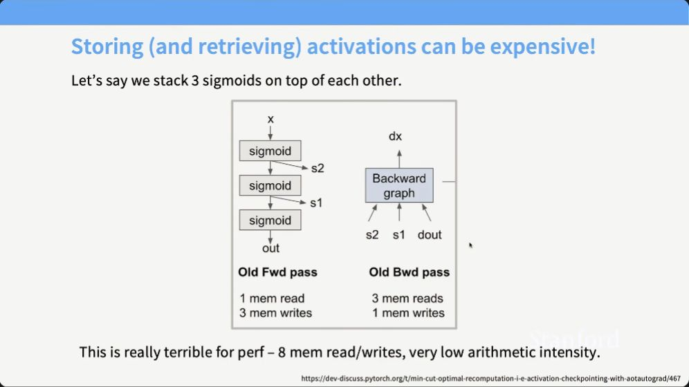
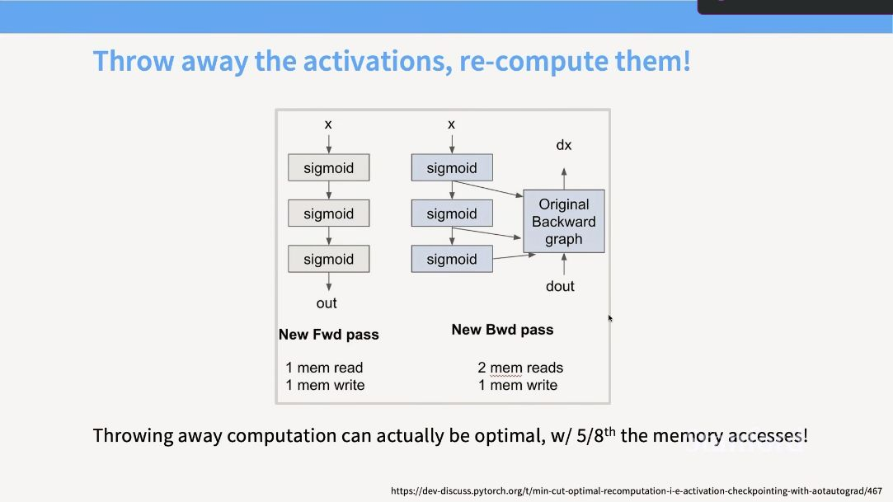
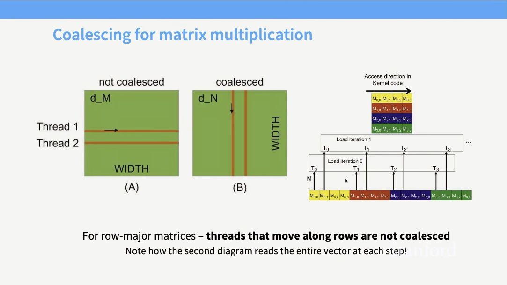
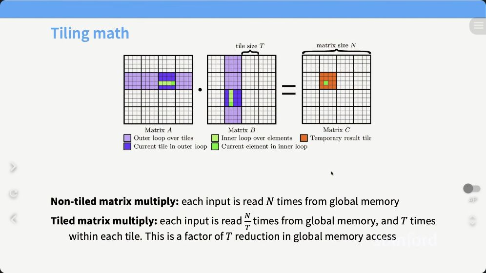
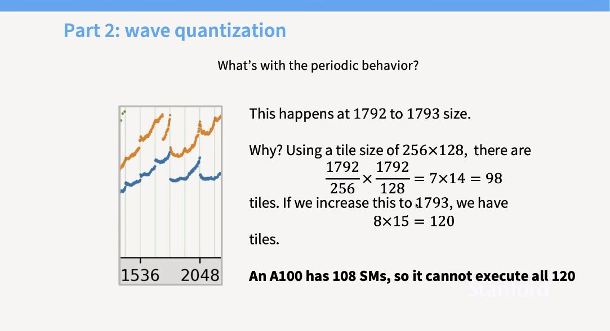
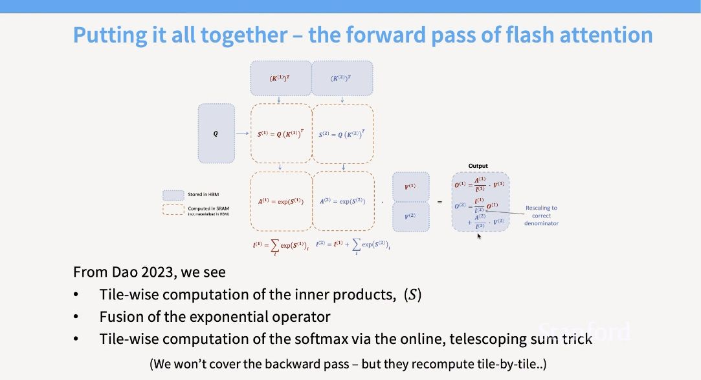
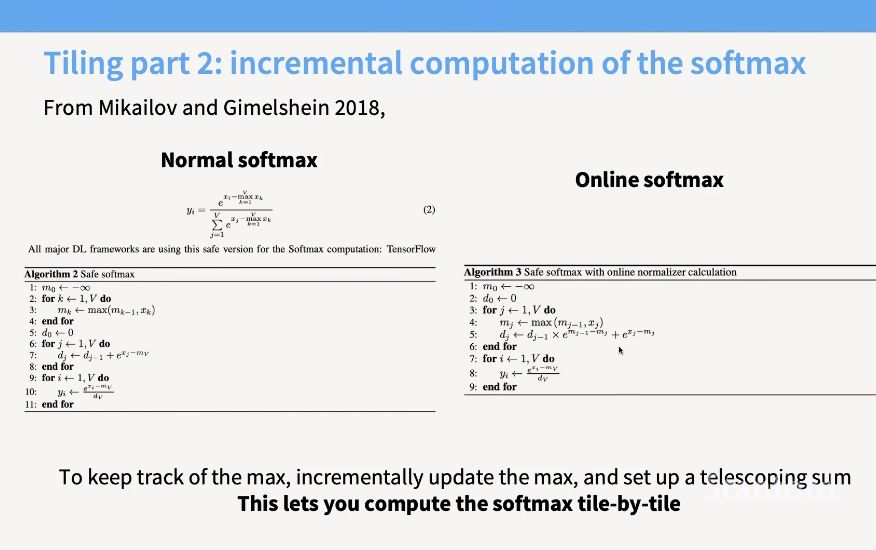

# Lecture 05：GPUs and TPUs

> [!abstract] 本讲一句话
> GPU/TPU 的高吞吐来自大规模并行矩阵计算，但算力增长快于内存带宽；高性能算法的核心因此不是“少做每一个 FLOP”，而是让数据沿 memory hierarchy 高复用、少回 HBM，并让并行工作持续填满计算单元。
## 来源与范围

- 课程：Stanford CS336 — Language Modeling from Scratch, Spring 2026
- 讲师：Tatsunori Hashimoto
- 上课日期：2026-04-13
- [课程视频](https://www.youtube.com/watch?v=izZba4UA7iY)，时长 1:18:39
- [课程主页](https://cs336.stanford.edu/)
- [官方 Lecture 5 PDF](https://github.com/stanford-cs336/lectures/blob/main/lecture_05.pdf)
- 本讲覆盖：GPU execution model、memory hierarchy、TPU 对比、roofline、low precision、fusion、recomputation、coalescing、tiling、wave quantization，以及 FlashAttention 的硬件动机
- 本讲不展开：CUDA/Triton kernel 的完整实现、分布式通信、FlashAttention backward；这些分别留给第 6–8 讲和 Assignment 2

> [!note] 视频核对说明
> 正文按 2026 官方视频与 Lecture 5 PDF 的课堂主线组织；下面的章节时间戳已按官方视频
> `izZba4UA7iY` 重新核对。SM/block/warp、TPU 对比和低精度拓展以视频语境为起点，
> 再用 CUDA、Transformer Engine 等官方文档补足课程没有展开的实现边界。硬件参数会随
> 芯片代际和精度口径改变，本文侧重不随型号变化的分析方法。
## 视频结构索引

| 顺序 | 课堂内容 | 视频 | 对应笔记 |
| --- | --- | --- | --- |
| 1 | 课程动机；CPU vs GPU | [00:25](https://www.youtube.com/watch?v=izZba4UA7iY&t=25s)、[05:31](https://www.youtube.com/watch?v=izZba4UA7iY&t=331s) | [[#1. 为什么语言模型离不开加速器\|1–2]] |
| 2 | GPU execution/memory；TPU 对比 | [10:45](https://www.youtube.com/watch?v=izZba4UA7iY&t=645s)、[15:51](https://www.youtube.com/watch?v=izZba4UA7iY&t=951s) | [[#3. GPU execution model\|3–4]] |
| 3 | Matmul、memory wall 与 performance | [23:51](https://www.youtube.com/watch?v=izZba4UA7iY&t=1431s)、[30:17](https://www.youtube.com/watch?v=izZba4UA7iY&t=1817s) | [[#5. Roofline：先判断瓶颈再优化\|5]] |
| 4 | 低精度；fusion；recomputation | [35:04](https://www.youtube.com/watch?v=izZba4UA7iY&t=2104s)、[47:44](https://www.youtube.com/watch?v=izZba4UA7iY&t=2864s)、[50:15](https://www.youtube.com/watch?v=izZba4UA7iY&t=3015s) | [[#6. 低精度同时改变算力与流量\|6–8]] |
| 5 | Coalescing、tiling 与 shape effects | [52:54](https://www.youtube.com/watch?v=izZba4UA7iY&t=3174s)、[57:51](https://www.youtube.com/watch?v=izZba4UA7iY&t=3471s) | [[#9. Memory coalescing：让访问合并成大事务\|9–11]] |
| 6 | 用硬件视角理解 FlashAttention | [1:11:52](https://www.youtube.com/watch?v=izZba4UA7iY&t=4312s) | [[#12. FlashAttention：把这些技巧组合起来\|12]] |
## 1. 为什么语言模型离不开加速器

Scaling law 告诉我们，在合适的数据与模型配比下，更多有效训练 compute 往往能带来可预测的 loss 改善。
但传统 Dennard scaling 已经停滞：无法继续依靠“晶体管更小、频率更高、功耗密度不变”免费获得单线程加速。现代训练规模主要来自：
1. 芯片内部并行：更多执行单元；
2. 专用数据通路：Tensor Core、systolic array；
3. 低精度：每秒处理更多低位宽乘加；
4. 多芯片并行：把工作分给大量 accelerator；
5. 软件优化：提高实际利用率，减少无效搬运和等待。
因此，硬件峰值只是上限：
$$\text{useful throughput} = \text{peak throughput} \times \text{utilization}$$
若内存、shape、kernel launch 或通信让执行单元空闲，增加理论 FLOP/s 不会等比例加速。
## 2. CPU 与 GPU：latency machine 和 throughput machine

CPU 通常为少量复杂线程优化：
- 强大的 branch prediction；
- 大 cache；
- out-of-order execution；
- 较高单线程性能；
- 目标是让单个任务尽快完成。
GPU 通常为大量相似工作优化：
- 很多较轻量的计算单元；
- 大量并发线程；
- 较少的复杂控制逻辑；
- 用其他 ready warp 隐藏 memory latency；
- 目标是提高单位时间完成的总工作量。
这解释了两个常见现象：
- 大而规则的 matrix multiplication 非常适合 GPU；
- 分支复杂、并行度低、工作量很小的任务未必适合 GPU。

> [!important] GPU 不是“更快的 CPU”
> GPU 用吞吐换取了控制灵活性。把串行 CPU 程序原样搬到 GPU，通常既不能产生足够并行度，也不能形成良好的内存访问。
## 3. GPU execution model

### 3.1 从 grid 到 thread

CUDA 风格的抽象可以写成：

```text
kernel launch
└── grid
    ├── thread block / CTA
    │   ├── warp 0: 32 threads
    │   ├── warp 1: 32 threads
    │   └── ...
    └── ...
```
- **Thread**：处理一个或几个数据元素；
- **Warp**：硬件共同调度的一组线程，NVIDIA GPU 通常为 32 threads；
- **Thread block / CTA**：共享片上 shared memory、可同步的一组线程；
- **Grid**：一次 kernel launch 的全部 blocks；
- **SM（Streaming Multiprocessor）**：调度和执行 block/warp 的硬件单元。
一个 block 会放到一个 SM 上执行。block 内线程可通过 shared memory 和 barrier 协作；跨 block 协作通常需要 global memory 或拆成多个 kernel。

> [!question] SM 跟 thread block、warp 是什么关系？
> **回答：**SM 是物理硬件，block 和 warp 是 kernel 的执行组织。
>
> - 一个 block 被调度后，会在**同一个 SM** 上驻留到执行结束，不能拆到多个 SM；block 内 threads 才能使用同一份 shared memory 和 block barrier。
> - block 会按每 32 个 threads 划分成 warps。SM 的 warp schedulers 从所有 resident warps 中挑选 ready warp，把指令发给 CUDA cores、load/store units 或 Tensor Cores。
> - 一个 SM 通常能同时驻留多个 blocks，也会随时间执行更多 blocks，并非“一个 SM 对应一个 block”。能同时驻留多少，取决于每个 block 占用的 threads/warps、registers、shared memory 以及硬件上限。
>
> 例如一个 256-thread block 含 8 个 warps；若 register/shared-memory 预算允许一个 SM 同时容纳 4 个这样的 blocks，则该 SM 有 32 个 resident warps。等待内存的 warp 暂停时，scheduler 可切换到其他 ready warps 来隐藏 latency；这也是 occupancy 有用的原因。
>
> 对应课程：[视频 10:45 起](https://www.youtube.com/watch?v=izZba4UA7iY&t=645s)

### 3.2 SIMT 与 control divergence

GPU 使用 SIMT（Single Instruction, Multiple Threads）：同一 warp 中的线程执行同一条指令，但作用于不同数据。

>[!note] diferent input data, same instruction

如果一个 warp 内不同线程进入不同分支：

```python
if predicate[i]:
    path_a(i)
else:
    path_b(i)
```
硬件往往需要分别执行两条路径，并 mask 掉当前不活跃的线程。近似地：
$$T_{\text{diverged}} \approx T_A + T_B$$
而不是理想的 $\max(T_A,T_B)$。所以真正有害的是**warp 内分歧**，不是代码中出现 `if` 本身。
### 3.3 Latency hiding 与 occupancy

当一个 warp 等待 HBM 数据时，SM 可以切换到另一个 ready warp。要隐藏 latency，必须有足够的 resident warps。
但 resident 数量受以下资源限制：
- 每个 thread 使用的 registers；
- 每个 block 使用的 shared memory；
- 每个 SM 的最大 threads、warps 和 blocks；
- block 大小。
Occupancy 可粗略理解为：
$$\text{occupancy} = \frac{\text{active warps per SM}} {\text{maximum warps per SM}}$$
高 occupancy 不等于高性能：让每个 thread 做更多工作可能降低 occupancy，却减少调度和数据搬运。它是约束，不是单一优化目标。
## 4. Memory hierarchy：越近越小、越快

典型 GPU memory hierarchy：

| 层级 | 作用域 | 容量 | 相对速度 | 典型用途 |
| --- | --- | ---: | ---: | --- |
| Registers | thread 私有 | 极小 | 最快 | 标量、局部 accumulator |
| Shared memory / L1 | block / SM | 小 | 很快 | tile、线程协作 |
| L2 cache | 整个 GPU | 中等 | 较快 | 跨 SM 缓存 |
| HBM / global memory | 整个 GPU | 大 | 最慢 | weights、activations、主 tensor |
| Host memory | CPU | 更大 | 经 PCIe/CXL 更慢 | 数据准备、offload |
核心矛盾是：
$$\text{compute growth} > \text{memory bandwidth growth}$$
Tensor Core 可以极快地消费矩阵 tile，但若每个数据只使用一次就丢回 HBM，计算单元会等待数据。
### 4.1 容量、带宽、延迟不要混为一谈

- **Capacity**：能否放下；
- **Bandwidth**：每秒能搬多少 bytes；
- **Latency**：一次访问需要等多久。
增加显存容量不一定提高 bandwidth；高 bandwidth 也不表示小型随机访问延迟低。
### 4.2 Tensor Core 与通用 ALU

现代 GPU 中，matrix multiply-accumulate 通常有专用 Tensor Core：
$$C \leftarrow A B + C$$
其低精度矩阵吞吐可能远高于普通标量/向量 FLOP 吞吐。因此“FLOPs 相同”的两个程序，若一个能映射到 Tensor Core、另一个不能，运行时间可能完全不同。
### 4.3 TPU：相似目标，不同执行取舍

> [!question] GPU 与 TPU 的相同点和关键差异是什么？
> **回答：**两者都在用高带宽内存和低精度矩阵单元服务大规模张量计算，差异主要在
> “控制由谁完成”和“为不规则计算保留多少灵活性”，而不是简单的谁峰值 FLOP/s 更高。

| 对比维度 | GPU | TPU（概念性概括） |
| --- | --- | --- |
| 计算组织 | 很多 SM；每个 SM 含通用 ALU、warp scheduler 和 Tensor Cores | 较少、较大的 tensor/matrix cores，数据流围绕大规模矩阵单元组织 |
| 调度抽象 | SIMT；threads 组成 32-thread warps，硬件在 ready warps 间切换 | 课程中概括为没有 GPU 式 warp；更多依靠编译器安排较大计算 blocks 和数据移动 |
| 延迟隐藏 | 大量 resident warps + hardware scheduling | 静态/编译期调度、software pipelining 和规则数据流 |
| 擅长工作 | Dense matmul，也较适合 elementwise、reduction、动态 shape 和较不规则算子 | 大而规则的 matmul/卷积及可编译的张量程序；不规则路径更依赖编译器转换 |
| 片上复用 | Registers/shared memory/cache + Tensor Core tiles | 大片上 SRAM/vector memory + systolic/dataflow 式矩阵单元 |
| 编程栈 | CUDA、Triton、PyTorch 等，显式 kernel 优化生态成熟 | XLA/JAX、PyTorch/XLA 等，编译器承担更多 fusion、layout 和 scheduling |
| 多芯片扩展 | PCIe、NVLink/NVSwitch 等，拓扑随平台变化 | TPU ICI/pod 网络，通常从芯片设计阶段联合考虑 scale-out |

> [!important] 两个避免过度简化的边界
> 1. GPU 也有高度专用的 Tensor Cores，TPU 也不只会做一次矩阵乘；现代加速器是在趋同。
> 2. “GPU 更通用、TPU 更规则”是执行模型层面的概括，具体性能仍由芯片代际、shape、
>    compiler、memory 和 cluster topology 决定。
>
> 对应课程：[视频 15:51 起](https://www.youtube.com/watch?v=izZba4UA7iY&t=951s)；
> 讲师在 [18:07](https://www.youtube.com/watch?v=izZba4UA7iY&t=1087s) 附近集中比较两者。

TPU 和 GPU 都围绕三件事设计：
1. 轻量控制；
2. 大规模矩阵乘单元；
3. 高带宽片上/片外内存与互连。
TPU 常以较大的 matrix unit / systolic array 为中心。数据沿阵列规律传播并被重复使用：

```text
A values  → → →
            PE  PE  PE
B values  ↓ PE  PE  PE
          ↓ PE  PE  PE
```
对于矩阵乘，systolic dataflow 能让 operands 在片上跨 processing elements 复用，降低外部流量。
相对而言，GPU 的 SM + SIMT 模型更通用，适合 elementwise、reduction、irregular workloads 与 matmul 的混合；TPU 的矩阵数据通路更显式，编译器通常承担更多排布工作。

> [!note] 不要把“GPU vs TPU”简化成峰值表
> 真正差异还包括 compiler stack、supported dtype、网络 topology、collective implementation、host integration 和 workload shape。第 7–8 讲会讨论互连。
## 5. Roofline：先判断瓶颈再优化

### 5.1 Arithmetic intensity

对某个 kernel：
$$I = \frac{\text{FLOPs}} {\text{bytes transferred from bottleneck memory}} \quad [\text{FLOP/byte}]$$
硬件的 balance point：
$$I^* = \frac{P_{\text{peak}}} {B_{\text{memory}}}$$
其中 $P_{\text{peak}}$ 是目标 dtype 的峰值 FLOP/s，$B_{\text{memory}}$ 是目标 memory level 的 bandwidth。
可达性能上界：
$$P_{\text{attainable}} \le \min\left( P_{\text{peak}}, I B_{\text{memory}} \right)$$
- $I < I^*$：memory-bound；
- $I > I^*$：compute-bound。
等价的理想时间模型：
$$T \ge \max\left( \frac{\text{bytes}}{B_{\text{memory}}}, \frac{\text{FLOPs}}{P_{\text{peak}}} \right)$$
### 5.2 注意课堂中的倒数口径

Arithmetic intensity 通常写成 FLOP/byte，但有时课件会写 bytes/FLOP。两者互为倒数：
$$I_{\text{FLOP/byte}} = \frac{1}{I_{\text{byte/FLOP}}}$$
例如 FP32 ReLU 对每个元素读 4 bytes、写 4 bytes、做约 1 个操作：
$$I \approx \frac{1}{8}\text{ FLOP/byte}$$
若写成流量/计算量，则是 $8$ bytes/FLOP。比较 roofline 前必须统一方向。
## 6. 低精度同时改变算力与流量

对应课程：[视频 35:04 起](https://www.youtube.com/watch?v=izZba4UA7iY&t=2104s)。

将 FP32 改为 BF16/FP16，通常同时带来：
- tensor bytes 减半；
- HBM traffic 减少；
- cache/shared memory 可容纳更多元素；
- Tensor Core 吞吐提高；
- 数值范围或精度风险增加。
因此低精度不是单纯的“压缩模型”，而是同时移动 roofline 中的 workload 点和 hardware ceiling。
FP8、MXFP8、FP4 等格式还引入 block scaling。若每 32 或 16 个值共享 scale，真实账本必须包括：
$$\text{effective bits/value} = \text{payload bits} + \frac{\text{scale bits}}{\text{block size}}$$
转置也可能需要重新分组和 requantize；不能假定低比特 tensor 的 transpose 只是修改 stride。

### 6.1 哪些部分适合低精度，哪些需要较高精度

核心判断不是“这是权重还是 activation”，而是这个操作更像**大规模乘加**，还是更像
**归约、指数、除法或小量更新**。前者通常有较强的误差平均效应并能利用 Tensor Core，
后者容易放大舍入误差。

| 模型/训练环节 | 常见精度策略 | 原因 |
| --- | --- | --- |
| 大型 GEMM 的 weights 与 inputs | BF16/FP16；FP8/MXFP8 训练会把 GEMM 输入量化到低精度 | 吞吐和流量收益最大，block scaling 可控制局部动态范围 |
| GEMM accumulator | FP32 或至少 BF16；即使乘数是 FP8 也不应按 FP8 累加 | 大量乘积求和会累积误差 |
| Attention 的 $QK^\top$、$PV$ matmul | 保守配方常用 BF16/FP16；新硬件/配方可用 FP8 | score、长序列归约和 mask 对误差较敏感，需要单独验证 |
| Softmax 的 max、exp、sum、division | 通常在 FP32 或更稳定的 mixed-precision kernel 中完成 | 指数会放大误差，分母归约还可能 overflow/underflow |
| LayerNorm/RMSNorm 的统计量与除法 | mean/variance/RMS 常用 FP32；输入输出可回到 BF16 | 小方差、平方和及除法对精度敏感 |
| Residual stream | 通常保留 BF16/FP16 | 层层累加；若每层都低比特 requantize，误差会持续积累 |
| Backward GEMM | 可按 FP8 配方量化输入；梯度归约/accumulation 通常更高精度 | gradient 动态范围和微小更新更敏感 |
| Master weights、optimizer $m/v$ | 通常 FP32；模型计算副本可为 BF16/FP16/FP8 | 参数更新量可能远小于参数本身，低精度会吞掉更新 |
| Logits、loss 与全局 reductions | 通常 BF16/FP32，关键 reductions 用 FP32 | 小 logit 差异会改变概率/排序，跨大量元素归约易积累误差 |

> [!tip] 实际配方
> “FP8 training”通常不表示端到端每个 tensor 都是 FP8，而是让主要 GEMM 的输入使用
> FP8/MXFP8，accumulation、normalization、softmax、optimizer state 等仍保留更高精度。
> 最终边界要通过 per-layer amax、overflow、loss curve 和下游精度验证。

### 6.2 MXFP8 的 scaling-factor matrix

MXFP8 通常让 reduction 维上的每 32 个连续元素共享一个 E8M0 power-of-two scale；
在 NVIDIA Transformer Engine 的 MXFP8 配方中，数据本身统一用 FP8 E4M3 表示。逻辑上：

$$
q_{i,k}=Q_{\rm FP8}\!\left(\frac{x_{i,k}}{s_{i,b}}\right),
\qquad
x_{i,k}\approx s_{i,b}q_{i,k},
\qquad b=\left\lfloor\frac{k}{32}\right\rfloor.
$$

对 GEMM $C=AB$，$A\in\mathbb R^{M\times K}$、$B\in\mathbb R^{K\times N}$：

- $A$ 的逻辑 scale matrix 为 $S_A\in\mathbb R^{M\times\lceil K/32\rceil}$；
- $B$ 沿同一 reduction 维 $K$ 分组，逻辑 scale matrix 为
  $S_B\in\mathbb R^{\lceil K/32\rceil\times N}$；
- 实际 GPU tensor 会用适合 Tensor Core 的 tiled/swizzled scale layout，不能仅凭上述逻辑 shape
  推断物理 stride。

于是一个 dot product 可理解为：

$$
C_{ij}\approx
\sum_b s^A_{i,b}s^B_{b,j}
\sum_{k\in\text{block }b}q^A_{i,k}q^B_{k,j}.
$$

若 scale 是 8 bits 且每 32 个 values 共享，忽略对齐与 metadata，scale overhead 为
$8/32=0.25$ bit/value；所以“8-bit payload”真实占用略高于 8 bits/value。

### 6.3 为什么 transpose 往往需要重新 quantize

MXFP8 的 scale 属于**一组 32 个数**，不是可以随单个 element 一起任意搬动的属性。
转置后，新的 GEMM reduction 方向改变，原来同组的 32 个元素通常不再是新方向上连续的一组，因此：

$$
Q_{\rm MXFP8}(X)^\top
\ne
Q_{\rm MXFP8}(X^\top).
$$

可靠做法是保留 BF16/FP16 high-precision source，并从它分别生成 $X$ 的 MXFP8 表示和
$X^\top$ 的 MXFP8 表示，或同时缓存两种 orientation。不要先量化 $X$，再 dequantize 后
requantize 出转置版本；double quantization 会叠加误差。这里的“requantize”本质上是按新
orientation 重新计算每个 block 的 amax/scale，而不只是改 stride。

### 6.4 为什么 first/last layer 往往更难量化

> [!question] Why are the first and last layers hard to quantize?
> **回答：**这是常见经验而不是绝对定律，而且要区分 first/last Transformer block 与
> embedding/LM head。
>
> - **第一层：**它直接接收 embedding 或原始特征，分布可能更不均匀、存在 outlier channels，
>   也没有前序 Transformer blocks 帮助重塑 representation；即使 block 自身有 pre-norm，输入的
>   跨 token/channel 动态范围仍可能难校准。其量化误差还会
>   穿过后续全部层，容易被累计或放大。
> - **最后一层/LM head：**它把 hidden state 投影为巨大词表上的 logits。很多候选 token 的
>   logit margin 很小，轻微误差就可能交换排序；autoregressive generation 选错一次后，错误 token
>   又会成为下一步输入。若 embedding 与 LM head tied，共享权重还同时承担输入表示和输出分类两种角色。
> - **PTQ 校准难度：**少量 calibration data 未必覆盖稀有 token、长尾 activation 和不同序列位置；
>   用单个 per-tensor scale 时尤其容易让 outliers 浪费大部分量化区间。
>
> 工程上常把 embedding、第一层、最后一层/LM head 保留 BF16，其他层低比特化；因为它们占层数少，
> 成本有限。更精细的做法是做逐层 sensitivity test，并尝试 per-channel/per-block scaling、outlier
> handling、SmoothQuant 或 QAT。若这些方法验证后精度稳定，首尾层也可以量化，不能把“首尾永远不能量化”当规则。


## 7. Operator fusion：避免中间结果往返 HBM

若逐步计算：
$$y = \sin^2(x) + \cos^2(x)$$
naive eager execution 可能生成多个 kernels，并把每个中间 tensor 写回 HBM：

```text
x → sin → HBM → square → HBM
x → cos → HBM → square → HBM
                     add → y
```
Fused kernel 可在 registers/shared memory 中保留中间值：

```text
x → [sin, square, cos, square, add] → y
```
收益包括：
- 更少 HBM reads/writes；
- 更少 kernel launches；
- 更少中间 tensor allocation；
- 更高 arithmetic intensity。
但 fusion 也可能增加 register pressure，降低 occupancy；融合太大的 kernel 还可能难以调度。优化目标不是“融合次数最多”，而是端到端时间最短。
## 8. Recomputation：用 FLOPs 换 memory traffic

对应课程：[视频 50:15 起](https://www.youtube.com/watch?v=izZba4UA7iY&t=3015s)，
[官方讲义第 34–36 页](https://github.com/stanford-cs336/lectures/blob/main/lecture_05.pdf)。

Backward 需要 forward activations。直接保存全部 activation 可减少重算，但占用 HBM capacity，并在 backward 中再次读取。



> 视频关键帧：[51:00，保存中间 activation](https://www.youtube.com/watch?v=izZba4UA7iY&t=3060s)。



> 视频关键帧：[52:20，丢弃 activation 后重算](https://www.youtube.com/watch?v=izZba4UA7iY&t=3140s)。

课程用三层 sigmoid 的简化例子比较 HBM accesses：

| 策略 | Forward | Backward | 合计 |
| --- | ---: | ---: | ---: |
| 保存每层 activation | 1 read + 3 writes | 3 reads + 1 write | 8 |
| 丢弃中间 activation 后重算 | 1 read + 1 write | 2 reads + 1 write | 5 |

这里的 $8$ 和 $5$ 是用于说明机制的 toy accounting，不是任意网络的固定比例。关键是：

$$
\text{extra FLOPs}
\quad\longleftrightarrow\quad
\text{fewer saved activations and fewer HBM transfers}.
$$

Activation checkpointing 选择丢弃一部分 activation，backward 时重新计算：
$$\Delta \text{memory} < 0, \qquad \Delta \text{FLOPs} > 0$$
当额外计算落在闲置 compute capacity，而 memory traffic 是瓶颈时，**多做计算反而可能更快**。这也是为什么不能只用 FLOP 数判断算法优劣。

> [!note] 三个边界
> - 实际训练通常保存少量 checkpoint，而不是只保留网络输入；checkpoint 间的 forward 在 backward 中重放。
> - 这是 activation recomputation，不是把 model checkpoint 写到磁盘。
> - Dropout、随机算子和有副作用的算子必须恢复相同 RNG/state，否则重算出的 forward 不再等价。

## 9. Memory coalescing：让访问合并成大事务

对应课程：[视频 52:54 起](https://www.youtube.com/watch?v=izZba4UA7iY&t=3174s)，
[官方讲义第 37–39 页](https://github.com/stanford-cs336/lectures/blob/main/lecture_05.pdf)。

HBM/DRAM 并不是逐 byte 高效读取，而是按 aligned memory transaction 批量传输。一次 warp
load 中，硬件会把 32 个线程请求的地址合并为尽可能少的 transactions；这就是
**memory coalescing**。



> 视频关键帧：[55:00，matrix multiplication 的 coalescing](https://www.youtube.com/watch?v=izZba4UA7iY&t=3300s)。图中比较的是同一条 load 指令下相邻线程的访问方向。

可以把一段内存想成连续的 transaction/burst sections：

```text
address:   0  1  2  3 | 4  5  6  7 | 8  9 10 11 | 12 13 14 15
section:   └──── A ───┘ └──── B ───┘ └──── C ───┘ └──── D ───┘

coalesced warp:      threads 的地址集中在 A/B       → 少量 transactions
strided warp:        threads 分散到 A/B/C/D/...     → 多个 transactions
```

若同一 warp 的 32 个 threads 访问连续地址：

```text
thread:  0  1  2  3 ... 31
addr:    x x+4 x+8 ... x+124
```
硬件可以把访问合并为少量大 transaction。
若 threads 以大 stride 访问：

```text
addr: x, x+s, x+2s, ...
```
就可能产生许多 transactions，读入的大部分 cache line 没有被使用。逻辑 bytes 不变，物理 bytes 却显著增加。
因此 row-major 矩阵中，让相邻 threads 沿连续列移动通常更容易 coalesce。若
$A\in\mathbb R^{M\times N}$、element size 为 $s$：

$$
\operatorname{addr}(A[i,j])
=
\operatorname{base}+(iN+j)s.
$$

- thread $t$ 访问 $A[i,j+t]$：相邻线程地址只差 $s$，通常容易 coalesce；
- thread $t$ 访问 $A[i+t,j]$：相邻线程地址差 $Ns$，通常需要很多 transactions。

> [!warning] “沿行移动”的视角容易说反
> 关键不是某一个 thread 的循环方向，而是**同一条 load 指令下，相邻 thread IDs 的地址差**。
> 访问矩阵列时常需要 transpose、改变 thread-to-data mapping，或先 coalesced load 到
> shared-memory tile，再从片上按另一方向读取。

## 10. Tiling：把全局复用变成片上复用

对应课程：[视频 57:51 起](https://www.youtube.com/watch?v=izZba4UA7iY&t=3471s)，
[官方讲义第 40–44 页](https://github.com/stanford-cs336/lectures/blob/main/lecture_05.pdf)。

> [!question] 这部分内容根据视频再补充一下；特别是增加图示。
> **回答：**Tiling 不是只把矩阵“切小”，而是同时设计 **block/thread mapping、HBM
> 合并读取、shared-memory layout、Tensor Core fragment 与 accumulator 生存期**。目标是
> 让一次昂贵的 HBM load 在片上被重复使用。

### 10.1 Naive matmul 的两个问题

考虑：
$$C_{ij} = \sum_{k=1}^{K} A_{ik}B_{kj}$$
naive 的 one-thread-per-output 思路可能同时出现：

1. **重复读取：**相邻 $C_{ij}$ 会重复使用相同的 $A_{ik}$ 或 $B_{kj}$，但每个 thread
   又各自从 HBM 读取；
2. **不合并访问：**某个 operand 的 thread-to-address mapping 可能让同一 warp 跨行跳跃。

### 10.2 分 phase 计算 output tile

选择 $T_M\times T_N$ 的 output tile，并沿 reduction 维每次处理 $T_K$：



> 视频关键帧：[1:00:30，Tiling 的矩阵视角](https://www.youtube.com/watch?v=izZba4UA7iY&t=3630s)。紫色区域是当前 tiles，绿色区域是内层循环正在使用的元素，橙色区域是正在累积的 output tile。

每一个 $K$-phase 的逻辑步骤是：

```text
for k_tile:
    1. cooperative/coalesced load A_tile, B_tile: HBM → shared memory
    2. synchronize：确保 tile 已完整到达
    3. 多个 warps 从 shared memory 取 fragment，执行 MMA
    4. partial C 一直保存在 registers
    5. synchronize：进入下一 phase 前避免覆盖仍在使用的 shared-memory buffer
all K tiles done:
    store C_tile once: registers → HBM
```

实际高性能 kernel 会用 double buffering / software pipelining，让下一 tile 的 load 与当前
tile 的 MMA overlap，但“HBM → shared memory → registers/Tensor Core”的层级关系不变。

### 10.3 为什么能减少 global-memory traffic

对方阵和边长 $T$ 的简化例子：

- non-tiled matmul：每个 input element 可能从 HBM 被读取约 $N$ 次；
- tiled matmul：约从 HBM 读取 $N/T$ 次，每次装入 shared memory 后在 tile 内复用约 $T$ 次；
- 理想 global-memory reads 因而减少约 $T$ 倍。

一般的 $T_M\times T_N\times T_K$ phase 做：

$$
2T_MT_NT_K\ \text{FLOPs},
$$

却只需从 HBM 载入约：

$$
T_MT_K+T_KT_N\ \text{elements}.
$$

这正是 tiling 提高 arithmetic intensity 的来源。

### 10.4 Tile size 的多目标约束

更大的 tile 增加数据复用，却消耗更多：
- shared memory；
- registers；
- resident threads；
- synchronization；
- 边界处理成本。
所以 tile size 必须同时适配：
1. matrix shape；
2. Tensor Core 支持的 fragment；
3. alignment/coalescing；
4. shared-memory capacity；
5. register pressure；
6. SM 数量与 wave scheduling。

当 matrix dimension 不能整除 tile size 时，边缘 block 会出现 masked/idle lanes；当 row
stride 或 tile 起点不能匹配 transaction/Tensor Core alignment 时，同样会增加访问次数。
因此 padding 虽增加少量 FLOPs，却可能让 load、MMA fragment 和 block grid 都更规整，从而
降低 wall-clock time。

## 11. Wave quantization：shape 为什么会让性能突然跳变

Blocks 以 waves 分配给 SM。假设 GPU 有 $S$ 个 SM，每个 SM 因当前 kernel 的资源占用可同时
驻留 $R$ 个 blocks，总 block 数为 $G$，则简化的并发 block 容量为 $W=SR$：

$$\text{waves} = \left\lceil \frac{G}{W} \right\rceil.$$

最后一 wave 的利用率应写成：

$$
u_{\text{last}}
=
\begin{cases}
1, & G\bmod W=0,\\
\dfrac{G\bmod W}{W}, & \text{otherwise}.
\end{cases}
$$

原先直接写 $(G\bmod S)/S$ 会在恰好整除时错误地得到 $0$；课程例子隐含使用 $R=1$。

如果 $G$ 刚超过 $W$ 的整数倍，就会增加一个几乎为空的 wave，时间可能阶跃式上升。
课件中的方阵例子使用 $256\times128$ output tile：
- $1792$ 的维度产生 $7\times14=98$ tiles；
- $1793$ 需要向上取整为 $8\times15=120$ tiles；
- A100 有 108 个 SM，120 blocks 需要第二 wave，而第二 wave 只有 12 blocks。
这说明：
- 理论 FLOPs 几乎没变；
- 实际时间却可能显著变差；
- “更大矩阵效率更高”并非处处单调。
Padding 到更合适的 shape 有时会增加 FLOPs，却提高 Tensor Core alignment 和 block utilization，从而降低 wall-clock time。

```text
1792：98 blocks
wave 1  [98 个 SM 工作][10 个 SM 空闲]                  → 1 wave

1793：120 blocks
wave 1  [108 个 SM 全部工作]
wave 2  [12 个 SM 工作][96 个 SM 空闲]                  → 2 waves
```



> 视频关键帧：[1:09:00，wave quantization](https://www.youtube.com/watch?v=izZba4UA7iY&t=4140s)。矩阵边长只增加 1，却让 block 数从 98 增至 120；A100 的 108 个 SM 无法在一个 wave 中完成。

课程第二部分可以归纳为三条数据移动策略：

1. **减少 HBM accesses：**coalescing 减少 transactions，fusion 消除中间读写；
2. **把数据留在片上：**tiling 在 shared memory/registers 中复用数据；
3. **用其他资源换 memory：**low precision 用精度与 scaling 换 bytes，recomputation 用 FLOPs 换 activation 存储。

## 12. FlashAttention：把这些技巧组合起来

对应课程：[视频 1:11:52 起](https://www.youtube.com/watch?v=izZba4UA7iY&t=4312s)，
[官方讲义第 50–54 页](https://github.com/stanford-cs336/lectures/blob/main/lecture_05.pdf)。

FlashAttention 把前面的 tiling、fusion、online normalization 和 backward recomputation
组合到一个 IO-aware exact-attention algorithm 中：



> 视频关键帧：[1:16:49，FlashAttention forward pass](https://www.youtube.com/watch?v=izZba4UA7iY&t=4609s)。蓝色块存于 HBM，虚线块在 SRAM 中按 tile 计算而不 materialize 回 HBM。

标准 attention：
$$A = \frac{QK^\top}{\sqrt d}, \qquad P = \operatorname{softmax}(A), \qquad O = PV$$
其中：
- $Q,K,V \in \mathbb{R}^{B\times H\times L\times d}$；
- score/probability matrix 为 $A,P\in\mathbb{R}^{B\times H\times L\times L}$。
Naive 实现把 $A$ 和 $P$ materialize 到 HBM，产生 $O(L^2)$ 中间流量与容量。
FlashAttention 的硬件视角是：
1. 将 $Q,K,V$ 切成 tiles；
2. 把 tiles 搬入 SRAM/shared memory；
3. 在片上计算局部 $QK^\top$；
4. 将 scale、mask、softmax 融合；
5. 用 online softmax 逐 tile 更新归一化统计量；
6. 直接累积 output tile；
7. 不在 HBM 中保存完整 $A$、$P$；
8. backward 再按 tile 重算必要中间量。
### 12.1 Online softmax 的状态

固定一个 query tile $Q_i$，依次流过所有 causal-allowed $K_j,V_j$ tiles：



> 视频关键帧：[1:14:30，增量计算 softmax](https://www.youtube.com/watch?v=izZba4UA7iY&t=4470s)。Online softmax 在流过 tile 时增量更新最大值与归一化分母，因此不必先保存完整 score matrix。

对每个 query row 维护：
- 当前最大值 $m$；
- 以当前最大值为基准的指数和 $\ell$；
- 同样缩放、尚未除以分母的输出 accumulator $\widetilde O$。

对 score tile $A_{ij}$，先应用 scale 和 mask，再更新：

$$
m_i'
=
\max\!\left(m_i,\operatorname{rowmax}(A_{ij})\right),
\qquad
\alpha_i=e^{m_i-m_i'}.
$$

令当前 tile 的未归一化 numerator 为：

$$
\widetilde P_{ij}=e^{A_{ij}-m_i'},
$$

则：

$$
\ell_i'
=
\alpha_i\ell_i+\operatorname{rowsum}(\widetilde P_{ij}),
$$

$$
\widetilde O_i'
=
\alpha_i\widetilde O_i+\widetilde P_{ij}V_j.
$$

全部 $K/V$ tiles 处理完后：

$$
O_i=\frac{\widetilde O_i}{\ell_i},
\qquad
\operatorname{LSE}_i=m_i+\log\ell_i.
$$

只要按上述比例重缩放旧 numerator，这只是对同一个 softmax sum 重新分组，因此在舍入误差
范围内仍是 **exact attention**，不是稀疏或 kernel approximation。Forward 通常保存 output
和 log-sum-exp；backward 按 tile 重算 scores/probabilities，避免保存 $L\times L$ 的 $P$。

### 12.2 它不是减少 attention 的渐近 FLOPs

> [!question] 是否有必要把 FlashAttention 的几篇论文都读一遍？
> **回答：**有必要读，但不建议现在按版本从头到尾全啃。对当前 CS336/AI Infra 学习阶段，
> 先真正读懂 FlashAttention-1 的算法和 IO model，再按目标选择后续论文：
>
> | 优先级 | 材料 | 现在重点看什么 |
> | --- | --- | --- |
> | 必读 | [FlashAttention-1](https://arxiv.org/abs/2205.14135) | memory hierarchy/IO complexity、Algorithm 1、online softmax、backward recomputation；第一遍可跳过完整 lower-bound proof |
> | 推荐精读/二读 | [FlashAttention-2](https://arxiv.org/abs/2307.08691) | 为什么 FA1 仍未接近 GEMM 峰值；sequence 维 parallelism、thread-block/warp work partition、减少 non-matmul FLOPs |
> | 硬件专项再读 | [FlashAttention-3](https://arxiv.org/abs/2407.08608) | Hopper 的 TMA、warp specialization、异步 copy/compute overlap、FP8；学 H100 kernel 时价值最大 |
> | 实现跟踪 | [官方仓库中的 FlashAttention-4](https://github.com/Dao-AILab/flash-attention) | CuTeDSL、Hopper/Blackwell 实现与接口；变化较快，不是理解本讲的前置条件 |
>
> 推荐顺序是：本节推导 → FA1 图 1 与 Algorithm 1 → 自己写一个小型 online-softmax/tiled
> attention → Lecture 6 的 Triton → 再读 FA2。若目标只是模型训练/应用，读到 FA1+FA2 已足够；
> 若目标是 kernel/compiler engineer，再继续 FA3/FA4。

Exact dense attention 的主要 matmul 仍是：
$$\mathcal O(BHL^2d)$$
FlashAttention 的关键收益是减少 HBM IO 和中间 materialization，而不是把 exact attention 变成线性复杂度。
## 13. AI Infra 资源视角

### Shape

- 小、不规则或未对齐的维度会降低 Tensor Core 和 tiling 效率；
- sequence length 影响 attention 的 $L^2$ score shape；
- batch/head/layout 决定 block mapping 和 coalescing。
### Compute

- 目标 dtype 决定可用计算单元和峰值；
- matmul 是否足够大、足够规则，决定能否接近峰值；
- recomputation 增加 FLOPs，但可能降低端到端时间。
### Memory

- 先区分 capacity、bandwidth、latency；
- HBM bytes 不是 tensor 逻辑大小：cache line、重复读取、中间写回都会放大实际流量；
- fusion、tiling、FlashAttention 都在提高片上复用。
### Communication

- 单 GPU 内不同 memory levels 的搬运也是 communication；
- 跨 GPU 时，链路 bandwidth/latency 会形成新的 roofline；
- TPU/GPU 的集群价值不仅取决于芯片，还取决于 topology。
### Runtime

- Kernel launch 过多会让小算子被 launch overhead 支配；
- occupancy、divergence、coalescing、wave quantization 共同决定实际执行；
- 优化应使用 profiler 验证，而不是只凭 FLOP 公式。
## 14. 自己的推导与易错点

### 14.1 Tiling 为什么提高 arithmetic intensity

对 $T\times T$ 的 output tile，沿 $K$ 方向每次加载两个 $T\times T$ 输入 tile。
每一 phase 的计算约：
$$2T^3\text{ FLOPs}$$
BF16 输入流量约：
$$2 \times T^2 \times 2 = 4T^2\text{ bytes}$$
忽略 output 与 cache 后：
$$I \approx \frac{2T^3}{4T^2} = \frac{T}{2} \text{ FLOP/byte}$$
Tile 越大，复用越多，intensity 越高；但硬件资源限制了 $T$ 不能无限增大。
### 14.2 Fusion、tiling、checkpointing 的共同本质

三者表面不同：
- Fusion 合并 operators；
- Tiling 分解大 operator；
- Checkpointing 删除 activations 后重算。
共同目标都是改变数据生存期和移动路径：
$$\text{HBM traffic} \longrightarrow \text{on-chip reuse or recompute}$$
### 14.3 常见误区

1. **FLOPs 少就一定快**：memory-bound kernel 的 FLOPs 不是主导项。
2. **显存大就一定快**：capacity 与 bandwidth 是不同指标。
3. **occupancy 越高越好**：它只是隐藏 latency 的手段。
4. **所有 `if` 都很慢**：真正问题是同一 warp 内 divergence。
5. **low precision 永远无损**：还要处理 overflow、underflow、scale 和 accumulation precision。
6. **FlashAttention 是近似 attention**：它是 IO-aware 的 exact attention 实现。
7. **矩阵维度只影响 FLOPs**：alignment、tile count 和 waves 可造成不连续性能。
8. **TPU 只是没有 CUDA 的 GPU**：执行、编译和互连模型的取舍不同。
## 15. 本讲结论

1. GPU 用 SIMT 和大量并发线程追求 throughput；TPU 更显式地围绕矩阵数据流组织硬件。
2. 现代 accelerator 的核心矛盾是 compute 增长快于 memory bandwidth。
3. Roofline 用 arithmetic intensity 把 workload 与硬件 balance point 联系起来。
4. Low precision、fusion、recomputation、coalescing 和 tiling 都在减少昂贵搬运或提高数据复用。
5. Shape 会通过 alignment、tile 数和 wave quantization 改变实际性能。
6. FlashAttention 是本讲思想的综合案例：tile、fusion、online softmax 和 recomputation 避免 $S^2$ 中间 tensor 往返 HBM。
7. 好的 AI Infra 分析应同时核算 shape、compute、memory、communication 和 runtime，而不是只看峰值 FLOP/s。
## 16. 自测问题

1. 为什么 GPU 适合吞吐型工作，但不一定降低单个小任务的 latency？
2. Thread、warp、block、grid 和 SM 分别是什么关系？
3. 什么条件下 `if` 会产生 control divergence？
4. Registers、shared memory、L2、HBM 的作用域和典型用途有何不同？
5. 如何由峰值 FLOP/s 和 HBM bandwidth 计算 hardware balance point？
6. 一个 kernel 的 arithmetic intensity 低于 balance point 时，应该优先优化什么？
7. 为什么降低 dtype 位宽既能降低流量，又可能提高计算峰值？
8. Operator fusion 为什么可能降低 HBM traffic？它有什么副作用？
9. Memory coalescing 与 row-major layout 有什么关系？
10. 为什么 tiled matmul 能把同一输入元素复用多次？
11. Wave quantization 为什么让相邻的两个 matrix shapes 运行时间突然不同？
12. FlashAttention 如何在不 materialize 完整 score matrix 的情况下计算 softmax？
13. FlashAttention 改变了 exact dense attention 的 $O(S^2d)$ FLOPs 吗？
14. 什么时候多做 recomputation 反而可能更快？
## 参考资料

- [Stanford CS336 Spring 2026](https://cs336.stanford.edu/)
- [CS336 Lecture 5 PDF](https://github.com/stanford-cs336/lectures/blob/main/lecture_05.pdf)
- [Lecture 5 video](https://www.youtube.com/watch?v=izZba4UA7iY)
- [CUDA C++ Programming Guide](https://docs.nvidia.com/cuda/cuda-c-programming-guide/)
- [NVIDIA GPU Performance Background User's Guide](https://docs.nvidia.com/deeplearning/performance/dl-performance-gpu-background/index.html)
- [JAX Scaling Book: GPUs](https://jax-ml.github.io/scaling-book/gpus/)
- [FlashAttention: Fast and Memory-Efficient Exact Attention with IO-Awareness](https://arxiv.org/abs/2205.14135)
- [FlashAttention-2: Faster Attention with Better Parallelism and Work Partitioning](https://arxiv.org/abs/2307.08691)
- [FlashAttention-3: Fast and Accurate Attention with Asynchrony and Low-precision](https://arxiv.org/abs/2407.08608)
- [Dao-AILab FlashAttention official implementation](https://github.com/Dao-AILab/flash-attention)
- [Online normalizer calculation for softmax](https://arxiv.org/abs/1805.02867)
- [NVIDIA Transformer Engine: FP8、MXFP8 与 NVFP4 Primer](https://docs.nvidia.com/deeplearning/transformer-engine/user-guide/examples/fp8_primer.html)
- [NVIDIA: Introducing NVFP4 for Efficient and Accurate Low-Precision Inference](https://developer.nvidia.com/blog/introducing-nvfp4-for-efficient-and-accurate-low-precision-inference/)
