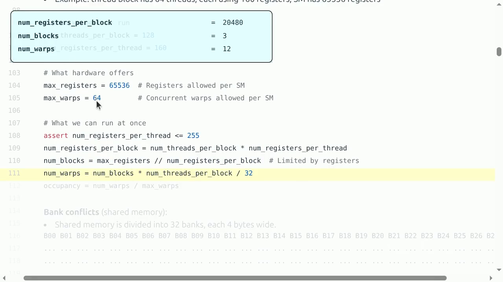
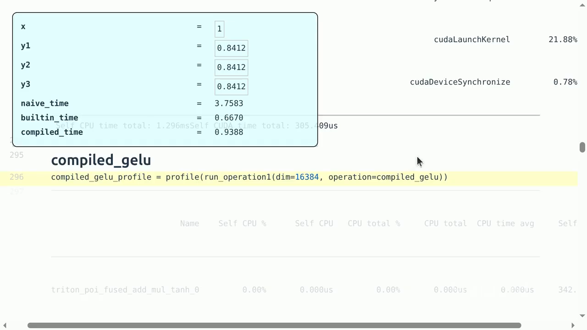
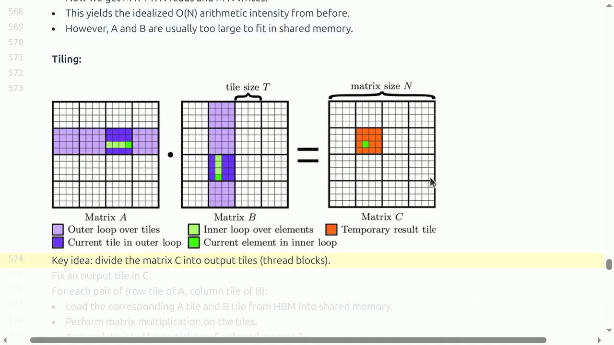

# Lecture 06：Kernels and Triton

> [!abstract] 本讲一句话
> 高层 tensor 表达最终会变成 GPU kernels；性能工程就是用可靠 benchmark/profile 找出瓶颈，再通过 fusion、coalescing、tiling 和合适的 block mapping，让 kernel 用最少的 HBM 往返完成最多的片上工作。
## 来源与范围

- 课程：Stanford CS336 — Language Modeling from Scratch, Spring 2026
- 讲师：Percy Liang
- 上课日期：2026-04-15
- [课程视频](https://www.youtube.com/watch?v=xnDHaNUvHBg)，时长 1:26:41
- [课程主页](https://cs336.stanford.edu/)
- [官方可执行讲义](https://cs336.stanford.edu/lectures/?trace=lecture_06)
- 本讲覆盖：benchmarking、profiling、kernel fusion、Triton programming model、elementwise/reduction/matmul kernels、PTX、occupancy、bank conflict、coalescing 和 tiling
- 本讲与 Assignment 2 直接相关：profile Transformer components，并实现/优化 Triton FlashAttention

> [!warning] 来源边界
> 正文按公开视频完整英文字幕的播放顺序重核，并用 2026 官方 `lecture_06.py` 与运行 trace 校正代码、数值和专有名词。字幕是自动生成的，时间点可用于定位，但不把字幕文本当成经过人工审校的逐字稿。XLA、完整 FlashAttention 推导和 GPU DSL 横向比较属于笔记拓展，已与课堂内容分开标记。
## 视频时间索引

| 时间 | 课堂内容 | 对应笔记 |
| --- | --- | --- |
| [00:05](https://www.youtube.com/watch?v=xnDHaNUvHBg&t=5s) | GPU hierarchy 与 programming model 回顾 | [[#2. Programming model 与硬件约束\|2]] |
| [11:17](https://www.youtube.com/watch?v=xnDHaNUvHBg&t=677s) | Register pressure 与 occupancy 算例 | [[#2.3 课堂算例：occupancy、bank conflict 与 wave quantization\|2.3]] |
| [14:24](https://www.youtube.com/watch?v=xnDHaNUvHBg&t=864s) | Shared-memory bank conflict | [[#2.2 三类常见性能问题\|2.2]] |
| [16:53](https://www.youtube.com/watch?v=xnDHaNUvHBg&t=1013s) | HBM memory coalescing 与 block occupancy | [[#2.2 三类常见性能问题\|2.2]] |
| [21:55](https://www.youtube.com/watch?v=xnDHaNUvHBg&t=1315s) | Benchmark 与 profiler 实测 | [[#3. Benchmark 回答“多快”，profile 回答“慢在哪里”\|3]] |
| [30:14](https://www.youtube.com/watch?v=xnDHaNUvHBg&t=1814s) | GeLU：naive、builtin、compiled | [[#4. GeLU 案例：fusion 为什么有效\|4]] |
| [36:57](https://www.youtube.com/watch?v=xnDHaNUvHBg&t=2217s) | 第一个 Triton elementwise kernel | [[#5. Triton 的 programming model\|5]] |
| [50:41](https://www.youtube.com/watch?v=xnDHaNUvHBg&t=3041s) | Triton 生成的 PTX | [[#5.3 PTX 能告诉我们什么\|5.3]] |
| [57:40](https://www.youtube.com/watch?v=xnDHaNUvHBg&t=3460s) | Softmax、row sum 与 reduction tiling | [[#6. Fused softmax：一行装入一个 program\|6–7]] |
| [1:11:57](https://www.youtube.com/watch?v=xnDHaNUvHBg&t=4317s) | Tiled GEMM 与 fused activation | [[#8. Tiled matmul：把复用放进一个 program\|8]] |
| [1:24:22](https://www.youtube.com/watch?v=xnDHaNUvHBg&t=5062s) | 其他 GPU DSL 与课程收束 | [[#13. 本讲结论\|13]] |
## 1. 从 tensor operation 到 kernel

用户在 PyTorch 中写：

```python
y = torch.nn.functional.gelu(x)
z = x @ w
```
GPU 并不直接理解 Python 或 tensor abstraction。实际路径大致是：

```text
Python / model code
    ↓
PyTorch operators or compiled graph
    ↓
CUDA library / Triton / generated code
    ↓
PTX virtual ISA
    ↓
GPU machine instructions
    ↓
SMs, warps, registers, shared memory, HBM
```
**Kernel** 是一次在 accelerator 上并行执行的函数。一次 launch 通常定义：
- grid 中有多少 programs/blocks；
- 每个 program 处理哪部分 tensor；
- 如何 load、compute、store；
- 边界 mask；
- compile-time tile/block parameters。
Kernel boundary 也经常是 HBM boundary：一个 kernel 的输出若成为下一个 kernel 的输入，naive eager execution 往往需要写回并重新读出。
## 2. Programming model 与硬件约束

### 2.1 CUDA 与 Triton 的抽象层次

CUDA 倾向于描述“每个 thread 做什么”，能细粒度控制：
- threads 和 warps；
- shared-memory allocation；
- synchronization；
- vectorized loads；
- warp-level instructions。
Triton 倾向于描述“每个 program instance / block 处理一个什么样的 tile”：

```text
load tile from HBM
→ operate/reduce/dot on tile
→ store result to HBM
```
编译器负责把 tile operations 映射到 threads、warps、shared memory 和 PTX。抽象更高，但性能仍受底层硬件约束。
### 2.2 三类常见性能问题

1. **Warp divergence**：同一 warp 执行不同分支；
2. **Resource occupancy**：register/shared-memory 使用限制 resident warps/blocks；
3. **Memory access**：
   - HBM 访问未 coalesce；
   - shared memory bank conflict；
   - 中间结果反复进出 HBM。
Shared memory 常分成 32 banks。多个 threads 同周期访问同一 bank 的不同地址会串行化；swizzling 可以重排逻辑坐标到 bank 的映射。
HBM 侧则希望一个 warp 的访问落在连续、aligned 的 cache line 中。两者不要混淆：
- Bank conflict 是 shared memory 问题；
- Coalescing 是 global/HBM transaction 问题。

### 2.3 课堂算例：occupancy、bank conflict 与 wave quantization

视频没有只停在名词层面，而是现场算了一次 register-limited occupancy。若一个 block 有 128 threads，每个 thread 使用 160 registers，则：

$$
R_{\text{block}}=128\times160=20{,}480
$$

若一个 SM 有 65,536 registers，最多同时驻留：

$$
\left\lfloor\frac{65{,}536}{20{,}480}\right\rfloor=3\text{ blocks}
$$

也就是 $3\times128/32=12$ 个 active warps；相对每个 SM 最多 64 warps，occupancy 为：

$$
\frac{12}{64}=0.1875
$$



> 视频关键帧：[13:55](https://www.youtube.com/watch?v=xnDHaNUvHBg&t=835s)。这个算例说明“block 数很多”不等于“SM 上同时有足够多的 warps”；register pressure 会先限制 resident blocks。

课堂随后补了两个容易漏掉的边界：

- 多个 block 可以共享一个 SM，但若第一个 block 已把 tensor cores 或其他关键资源占满，增加 resident block 未必提高吞吐；
- block 不能被拆到不同 SM。若 B200 有 148 个 SM、grid 有 160 个 blocks，第二个 wave 只剩 12 blocks，会出现明显尾部利用率损失。调 block size/grid shape 是减少 wave quantization 的一种方式。
## 3. Benchmark 回答“多快”，profile 回答“慢在哪里”

### 3.1 正确 benchmark 的最小流程

GPU execution 对 host 是异步的。下面这种计时是错的：

```python
start = time.time()
y = x @ w
elapsed = time.time() - start
```
它可能主要测到 launch latency，而没有等 kernel 完成。
课堂给出的基本流程：

```python
def benchmark(run, num_warmups=1, num_trials=3):
    for _ in range(num_warmups):
        run()
    torch.cuda.synchronize()
    times = []
    for _ in range(num_trials):
        start = torch.cuda.Event(enable_timing=True)
        end = torch.cuda.Event(enable_timing=True)
        start.record()
        run()
        end.record()
        torch.cuda.synchronize()
        times.append(start.elapsed_time(end))
    return sum(times) / len(times)
```
关键点：
- **Warmup**：排除首次 compilation、cache initialization 和 allocator 等影响；
>[!note] lazily compiled

- **CUDA events**：在 GPU timeline 上计时；
- **Synchronize**：确保结果已完成；
- **重复 trials**：观察 variance；
- **固定环境**：dtype、shape、layout、GPU、clock 和软件版本都要记录。

> [!tip] Benchmark 应该扫描 shape
> 一个 kernel 在 $1024^2$ 上快，不表示它在 $128^2$ 或非对齐 shape 上快。小 shape 可能被 launch overhead 主导，大 shape 才进入计算复杂度主导区。

课堂在同一台机器上实际扫描了 square matmul；这些数字用于理解曲线形状，不应移植成别的 GPU 的性能基线：

| Dimension | 256 | 512 | 1024 | 2048 | 4096 | 8192 |
| ---: | ---: | ---: | ---: | ---: | ---: | ---: |
| 课堂时间（ms） | 0.615 | 0.593 | 0.591 | 0.701 | 2.560 | 17.604 |

在小矩阵区间，launch、调度和固定开销盖过了 $O(n^3)$；只有矩阵变大后，计算量增长才主导时间。这也是为什么单点 benchmark 很容易得出错误结论。
### 3.2 Profiling

Profiler 提供：
- 实际调用了哪些 CUDA/Triton kernels；
- 每个 kernel 的 CPU/CUDA 时间；
- 调用次数；
- host-device gaps；
- memory allocation/copy；
- kernel 名字透露的 architecture、dtype、tile 等。
例如 kernel 名中的 `sm100` 指向 Blackwell architecture，`64x64x16` 可能是 tile shape。
视频中的 profiler 例子进一步展示了 shape 会改变实现选择：2048 方阵 matmul 约 329.345 μs，对应 CUTLASS `64×64×16` kernel；128 方阵约 4.544 μs，并采用不同 tile。Profiler 名称不是装饰信息，而是验证“框架到底选了哪个 kernel”的证据。
但 profile 本身也有 overhead。合理工作流是：

```text
benchmark baseline
→ profile representative case
→ form hypothesis
→ change implementation
→ benchmark again
→ profile only when needed
```
## 4. GeLU 案例：fusion 为什么有效

Tanh approximation：
$$\operatorname{GeLU}(x) \approx \frac{x}{2} \left[ 1+ \tanh\left( \sqrt{\frac{2}{\pi}} \left(x+0.044715x^3\right) \right) \right]$$
Naive PyTorch 表达式：

```python
def naive_gelu(x):
    return 0.5 * x * (
        1 + torch.tanh(0.79788456 * (x + 0.044715 * x * x * x))
    )
```
Eager execution 可能为 multiply、add、tanh 等启动多个 kernels，并 materialize 中间 tensors。
比较三种实现：
1. naive eager expression；
2. PyTorch builtin fused GeLU；
3. `torch.compile(naive_gelu)` 生成的 fused kernel。

课堂这次运行的结果是：

| 实现 | 时间（ms） | profiler 中的 kernel 数 |
| --- | ---: | ---: |
| naive eager | 3.7583 | 9 |
| PyTorch builtin | 0.6670 | 1 |
| `torch.compile` | 0.9388 | 1 |



> 视频关键帧：[34:40](https://www.youtube.com/watch?v=xnDHaNUvHBg&t=2080s)。讲师特别强调：这一次 builtin 比 compiled 快，上一年或另一代硬件可能相反；“融合通常有效”不等于“某个编译路径永远最快”。
Builtin/compiled 通常更快，不是因为数学 FLOPs 大幅减少，而是：
$$\text{many HBM reads/writes + launches} \rightarrow \text{one input read + one output write + one launch}$$
这类 elementwise workload arithmetic intensity 很低，fusion 的收益尤其明显。
## 5. Triton 的 programming model

### 5.1 Program ID、offset 和 mask

课堂的 1D GeLU kernel 核心：

```python
@triton.jit
def gelu_kernel(x_ptr, y_ptr, n, BLOCK_SIZE: tl.constexpr):
    pid = tl.program_id(axis=0)
    offsets = pid * BLOCK_SIZE + tl.arange(0, BLOCK_SIZE)
    mask = offsets < n
    x = tl.load(x_ptr + offsets, mask=mask)
    # fused GeLU arithmetic
    y = ...
    tl.store(y_ptr + offsets, y, mask=mask)
```
Host wrapper 决定 grid：

```python
num_blocks = triton.cdiv(x.numel(), BLOCK_SIZE)
gelu_kernel[(num_blocks,)](
    x, y, x.numel(), BLOCK_SIZE=BLOCK_SIZE
)
```
Shape 账本：
- Input/output：$x,y\in\mathbb{R}^N$；
- 每个 program 逻辑处理 `BLOCK_SIZE` 个 elements；
- program 数：$\lceil N/\text{BLOCK\_SIZE}\rceil$；
- 最后一块用 mask 防止 out-of-bounds。
### 5.2 `tl.constexpr`

`BLOCK_SIZE: tl.constexpr` 表示 compile-time constant。它允许编译器：
- 静态展开；
- 决定 register/shared-memory layout；
- 为不同配置生成 specialized variants。
代价是不同 meta-parameters 可能触发新的 compilation 和 cache entry。
### 5.3 PTX 能告诉我们什么

Triton 会编译为 PTX。观察 PTX 能帮助理解：
- `ld.global` / `st.global`：global-memory load/store；
- block/thread IDs；
- register 类型；
- 编译器是否 vectorize 或 thread-coarsen；
- 某些操作是否映射到预期指令。
课堂示例中，一个 thread 可能同时处理 8 个 elements；Triton 的 tile abstraction 不等于“一个 Triton value 对应一个 CUDA thread”。
## 6. Fused softmax：一行装入一个 program

对 $X\in\mathbb{R}^{M\times N}$：
$$Y_{ij} = \frac{\exp(X_{ij}-m_i)} {\sum_k \exp(X_{ik}-m_i)}, \qquad m_i=\max_k X_{ik}$$
Naive eager 实现依次：
1. row max；
2. subtract；
3. exp；
4. row sum；
5. divide。
课堂账本约为：
$$\text{reads}=5MN+M, \qquad \text{writes}=3MN+2M$$
理想 fused kernel 则接近：
$$\text{reads}=MN, \qquad \text{writes}=MN$$
Triton mapping：

```python
row = tl.program_id(0)
cols = tl.arange(0, BLOCK_SIZE)
x = tl.load(
    x_ptr + row * row_stride + cols,
    mask=cols < N,
    other=-float("inf"),
)
x = x - tl.max(x, axis=0)
num = tl.exp(x)
y = num / tl.sum(num, axis=0)
tl.store(..., y, mask=cols < N)
```
其中：
$$\text{BLOCK\_SIZE} = \operatorname{next\_power\_of\_2}(N)$$
Padding lanes 用 $-\infty$，保证：
- 不改变 max；
- $\exp(-\infty)=0$，不改变 sum。
### 6.1 边界

若一整行太大，不能高效放进一个 program 的 registers/shared memory，就需要 multi-stage reduction 或 streaming/online algorithm。FlashAttention 的 online softmax 正是更复杂的实例。
## 7. Row sum：一行装不下时做 tiling

设 $X\in\mathbb{R}^{M\times N}$，但 `BLOCK_SIZE < N`。
可以让每个 program 负责一行，并沿列方向分 tiles：

```python
acc = tl.zeros([BLOCK_SIZE], tl.float32)
for start in range(0, N, BLOCK_SIZE):
    cols = start + tl.arange(0, BLOCK_SIZE)
    x = tl.load(..., mask=cols < N, other=0.0)
    acc += x
result = tl.sum(acc, axis=0)
```
两级 reduction：
1. 每个 logical lane 跨 tiles 累积；
2. 对 `BLOCK_SIZE` 个 accumulators 做最终 reduction。
Accumulator 用 FP32 可以降低低精度长 reduction 的误差。对大 reduction，正确性测试不能只使用很宽松的 `allclose`；应检查 dtype-aware tolerance 和 adversarial input。
## 8. Tiled matmul：把复用放进一个 program

计算：
$$A\in\mathbb{R}^{M\times K}, \quad B\in\mathbb{R}^{K\times N}, \quad C=AB\in\mathbb{R}^{M\times N}$$
### 8.1 Naive mapping

每个 output element：

```text
for k:
    load A[m,k]
    load B[k,n]
    acc += A[m,k] * B[k,n]
store C[m,n]
```
约有 $MKN$ 级别重复 reads，arithmetic intensity 为 $O(1)$。
### 8.2 Tile mapping

课堂使用：

```python
BLOCK_M = 64
BLOCK_N = 64
BLOCK_K = 32
grid = (
    ceil_div(M, BLOCK_M),
    ceil_div(N, BLOCK_N),
)
```
一个 program 负责：
$$C_{\text{tile}} \in \mathbb{R}^{B_M\times B_N}$$
沿 $K$ 方向循环：

```python
acc = tl.zeros([BLOCK_M, BLOCK_N], tl.float32)
for k in range(0, K, BLOCK_K):
    a = load A_tile  # [BLOCK_M, BLOCK_K]
    b = load B_tile  # [BLOCK_K, BLOCK_N]
    acc += tl.dot(a, b)
```
最后把 activation 融入 store 之前：

```python
acc = tl.maximum(acc, 0.0)
store C_tile
```
这避免先写 $AB$，再由第二个 ReLU kernel 读写一次。
### 8.3 Stride 决定地址，不等于 shape

二维 tensor 的地址：
$$\operatorname{addr}(i,j) = \operatorname{base} + i\cdot s_0 + j\cdot s_1$$
Shape 相同的 contiguous tensor 和 transpose view 可能 strides 不同。Kernel 若假定 contiguous，必须 assert；若支持任意 layout，就要显式传 strides 并检查 coalescing。
### 8.4 Arithmetic intensity

一个 $(B_M,B_N,B_K)$ phase：
$$\text{FLOPs} \approx 2B_MB_NB_K$$
输入 elements：
$$B_MB_K+B_KB_N$$
忽略 output，若 $B_M=B_N=T$：
$$I \propto \frac{2T^2B_K} {2TB_K} = O(T)$$
这就是课堂所说的 tiled matmul intensity 为 $O(\text{tile size})$。



> 视频关键帧：[1:17:10](https://www.youtube.com/watch?v=xnDHaNUvHBg&t=4630s)。紫色 tile 表示当前加载的 $A/B$ 分块，橙色区域是一个 output tile；绿色元素说明一次 inner-loop 累加的数据依赖。

## 9. 拓展：XLA 与 torch.compile——从 graph 到 fused kernel

> [!tip] 拓展边界
> 课堂只用 `torch.compile` 展示 GeLU fusion，没有讲授 XLA。下面保留编译器视角，用于把手写 Triton 与 graph compiler 联系起来。

手写 Triton 是显式 kernel engineering；compiler stack 尝试自动完成部分工作。
典型编译路径：

```text
tensor program
→ capture graph / IR
→ canonicalization
→ shape and layout analysis
→ fusion
→ buffer/liveness planning
→ target-specific code generation
→ executable
```
### 9.1 XLA 的定位

XLA 接收来自 JAX/TensorFlow 等前端的计算图/IR，并针对 accelerator 做：
- operator fusion；
- constant folding；
- layout assignment；
- buffer reuse；
- collective lowering；
- device-specific code generation。
它的优势是可以跨 operator 观察全局 graph；限制包括：
- dynamic shape/control flow 可能阻碍 specialization；
- compilation latency；
- graph break；
- 自动生成代码未必优于专家手写 kernel；
- target/backend 与版本行为会变化。
### 9.2 `torch.compile`

课堂 GeLU 示例展示 `torch.compile` 可以把 naive PyTorch expression 融成一个 Triton kernel。
但正确比较应分开：
$$T_{\text{first call}} = T_{\text{compile}} + T_{\text{execute}}$$
与：
$$T_{\text{steady state}} \approx T_{\text{execute}}$$
长训练通常关注 steady state；低 latency、shape 高频变化的 serving 还要考虑 compilation/cache。
## 10. 拓展：与 FlashAttention 的联系

> [!tip] 拓展边界
> 视频在 softmax 段落中提示其与 Assignment 2 FlashAttention 有关；下面的系统化拆解是笔记延伸，不是本节视频里的完整推导。

FlashAttention 可以被看作第 6 讲所有 kernel 技巧的组合：

| 技巧 | 在 FlashAttention 中的作用 |
| --- | --- |
| Tiling | 分块加载 $Q,K,V$，提高片上复用 |
| Fusion | score、scale、mask、softmax、$PV$ 在一个计算流程完成 |
| Online reduction | 分块维护 row max 和 normalizer |
| Recomputation | backward 重算部分中间量 |
| Masking | 处理 causal/bounds |
| Layout/coalescing | 让 tile load/store 高效 |
| Specialization | 针对 head dimension、dtype、causal mode 选配置 |
Assignment 2 的重点不只是把公式翻译成 Triton，而是：
1. 证明 forward/backward correctness；
2. 画清楚每个 program 的 tensor tile；
3. 核算 HBM IO；
4. 用 benchmark 扫 sequence/head shapes；
5. 用 profiler 验证生成 kernel；
6. 与 PyTorch/reference 实现公平比较。
## 11. AI Infra 视角

### Shape

- `BLOCK_SIZE`、`BLOCK_M/N/K` 与 tensor shape 共同决定 grid；
- power-of-two padding、alignment、strides 会影响浪费和 coalescing；
- dynamic shape 影响 compiler specialization/cache。
### Compute

- Kernel 必须映射到正确 dtype 的 Tensor Core 才能接近 peak；
- reduction 常用 FP32 accumulator；
- fusion 可能不减 FLOPs，但减少 IO/launch。
### Memory

- 统计逻辑 tensor bytes 不够，还要统计 intermediate materialization；
- register pressure、shared-memory capacity 限制 tile；
- fusion 太大可能 spill registers 到 local/global memory。
### Communication

- 本讲主要是单 GPU memory hierarchy；
- kernel 内的 load/store 和 shared-memory exchange 也是 communication；
- 下一讲把相同分析扩展到 GPU-to-GPU collectives。
### Runtime

- GPU 异步执行要求正确同步计时；
- compilation、autotuning、kernel cache 与 launch overhead 都属于 runtime；
- profiler 是定位工具，benchmark 才是最终性能判据。
## 12. 自己的推导与易错点

### 12.1 Fusion 的 IO 下界

若一个纯 elementwise chain 有 $k$ 个 operators，tensor 有 $N$ elements、每个 $b$ bytes：
naive 每个 operator 至少一读一写：
$$\text{traffic}_{\text{naive}} \approx 2kNb$$
理想 fused chain：
$$\text{traffic}_{\text{fused}} \approx 2Nb$$
理论流量改善约为 $k$ 倍；真实改善受 cache、launch、register spill 和计算开销影响。
### 12.2 Tiled GEMM 不能只追求大 tile

增大 tile 提高 reuse，但：
$$\text{registers} \propto B_MB_N$$
而输入 tile shared memory：
$$\text{shared bytes} \propto (B_MB_K+B_KB_N)b$$
超过硬件资源会降低 occupancy 或无法 launch。最佳 tile 是 hardware/workload-specific。
### 12.3 常见误区

1. **Python 行数等于 kernel 数**：operator 可能展开多个 kernels，也可能被 fusion。
2. **计时无需 synchronize**：会只测到异步 launch。
3. **一次 trial 足够**：warmup、clock 和系统噪声都会影响结果。
4. **profile 中最长项就是唯一瓶颈**：还要看 gaps、copies、调用次数和端到端占比。
5. **Triton program 等于 CUDA thread**：它描述的是一个 logical tile/block。
6. **mask 只影响正确性**：padding lanes 也消耗资源。
7. **shape 相同意味着地址模式相同**：stride/layout 可能不同。
8. **fusion 总是更快**：可能增加 register pressure 和 compilation cost。
9. **compiler 可以取代性能理解**：自动编译仍受 graph、shape 和硬件约束。
10. **通过单一 shape 就算完成优化**：必须覆盖实际 workload distribution。
## 13. 本讲结论

1. PyTorch/Triton/PTX/硬件是不同抽象层；正确性可在高层表达，性能最终由低层映射决定。
2. Benchmark 测 wall-clock，profile 解释 kernel timeline；两者缺一不可。
3. Triton 用 program/tile 作为基本抽象，典型模式是 load、compute/reduce、store。
4. Elementwise GeLU 说明 fusion 如何删除中间 HBM 往返。
5. Softmax 和 row sum 展示了单 program reduction 与 tiled reduction。
6. Matmul 的关键是 $M/N/K$ 三维 tiling、片上复用、FP32 accumulation 和融合 epilogue。
7. XLA/`torch.compile` 能自动做 graph-level fusion 与 code generation，但仍需处理 compilation、dynamic shape 和生成代码质量。
8. FlashAttention 是 kernel thinking 的完整案例，不只是一个 attention 公式变体。
## 14. 自测问题

1. PyTorch operator、GPU kernel、PTX 和 SM 的关系是什么？
2. 为什么 HBM kernel boundary 会让 intermediate tensor 昂贵？
3. Benchmark 为什么需要 warmup、CUDA events 和 synchronize？
4. Benchmark 与 profiler 分别回答什么问题？
5. Naive GeLU 为什么会比 fused GeLU 慢？
6. Triton 的 `program_id`、`tl.arange`、mask 和 `tl.constexpr` 各有什么作用？
7. 为什么 softmax padding lanes 应该 load 为 $-\infty$？
8. 一行放不进一个 program 时，row reduction 如何分两级完成？
9. Matmul 的 grid 为什么通常沿 $M,N$，而 $K$ 放进 loop？
10. Stride 如何参与二维 tensor 的地址计算？
11. 为什么 tiled matmul 的 arithmetic intensity 随 tile size 增长？
12. 增大 tile 会受到哪些硬件资源限制？
13. XLA/`torch.compile` 自动 fusion 的收益和风险分别是什么？
14. FlashAttention 用到了本讲的哪些 kernel 技巧？
## 参考资料

- [Stanford CS336 Spring 2026](https://cs336.stanford.edu/)
- [CS336 Lecture 6 executable notes](https://cs336.stanford.edu/lectures/?trace=lecture_06)
- [Lecture 6 video](https://www.youtube.com/watch?v=xnDHaNUvHBg)
- [Triton documentation](https://triton-lang.org/main/index.html)
- [Triton fused softmax tutorial](https://triton-lang.org/main/getting-started/tutorials/02-fused-softmax.html)
- [Triton matrix multiplication tutorial](https://triton-lang.org/main/getting-started/tutorials/03-matrix-multiplication.html)
- [PyTorch Profiler](https://pytorch.org/tutorials/recipes/recipes/profiler_recipe.html)
- [PyTorch `torch.compile`](https://pytorch.org/docs/stable/torch.compiler.html)
- [OpenXLA documentation](https://openxla.org/)
- [CUDA PTX ISA](https://docs.nvidia.com/cuda/parallel-thread-execution/)
- [FlashAttention](https://arxiv.org/abs/2205.14135)
