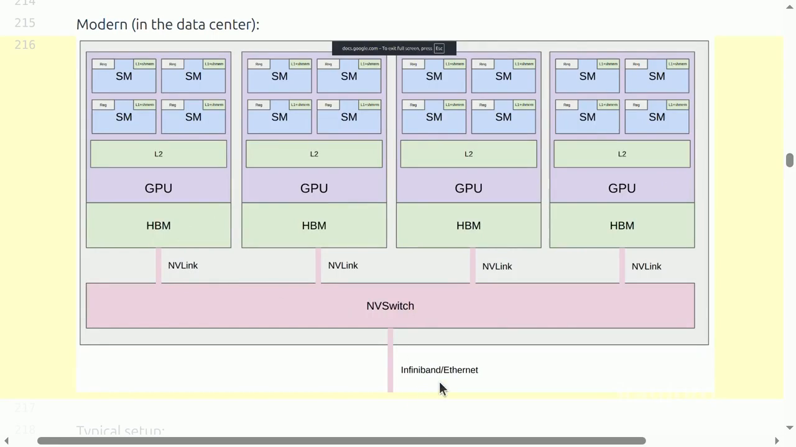
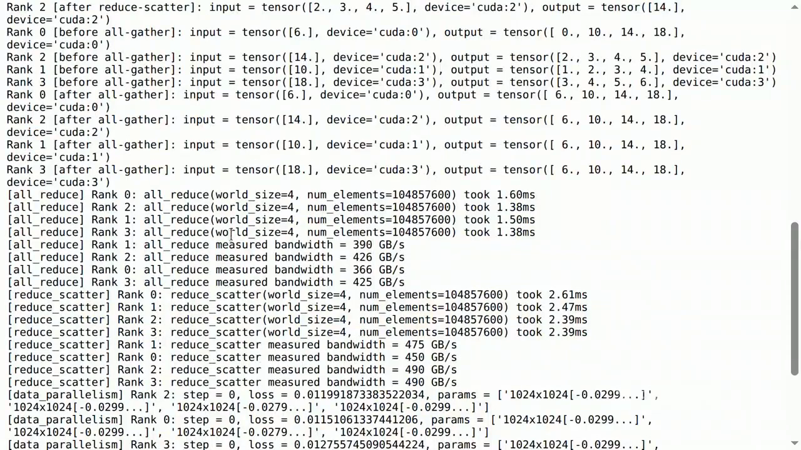

# Lecture 07：Parallelism I

> [!abstract] 本讲一句话
> 多 GPU 训练不是把单卡代码复制 $P$ 份，而是在 batch、width、depth、sequence 或 experts 中选择 sharding dimension，再用 collective operations 恢复数学依赖；真正的代价由每个 rank 的显存、通信量、链路 topology、同步频率和可重叠程度共同决定。
## 来源与范围

- 课程：Stanford CS336 — Language Modeling from Scratch, Spring 2026
- 讲师：Percy Liang
- 上课日期：2026-04-20
- [课程视频](https://www.youtube.com/watch?v=SzpOcwdIL0Y)，时长 1:21:03
- [课程主页](https://cs336.stanford.edu/)
- [官方可执行讲义](https://cs336.stanford.edu/lectures/?trace=lecture_07)
- 本讲覆盖：collectives、network hierarchy、NCCL/PyTorch Distributed、collective benchmark、data/tensor/pipeline parallel 的最小实现
- 本讲只概览：FSDP/ZeRO、sequence/context parallel、expert parallel 和多维并行；第 8 讲继续讨论其显存与通信取舍

> [!warning] 来源边界
> 正文按公开视频完整英文字幕重核，并用 2026 官方 `lecture_07.py` 与分布式运行输出校正代码和数值。时间点来自字幕轨；网络数字是课堂使用的特定代际/口径示例，部署时仍必须以目标拓扑上的 NCCL benchmark 为准。
## 视频时间索引

| 时间 | 课堂内容 | 对应笔记 |
| --- | --- | --- |
| [00:05](https://www.youtube.com/watch?v=SzpOcwdIL0Y&t=5s) | 单卡 tiling 与多卡 sharding 的统一动机 | [[#1. 为什么需要多 GPU\|1]] |
| [07:19](https://www.youtube.com/watch?v=SzpOcwdIL0Y&t=439s) | Gather、reduce、all-to-all 等 collectives | [[#3. Collective operations：分布式编程积木\|3]] |
| [15:45](https://www.youtube.com/watch?v=SzpOcwdIL0Y&t=945s) | All-reduce = reduce-scatter + all-gather | [[#3.3 All-reduce 的分解\|3.3]] |
| [22:10](https://www.youtube.com/watch?v=SzpOcwdIL0Y&t=1330s) | NVLink/NVSwitch/InfiniBand 与 RDMA | [[#4. 拓扑决定同一种 collective 有多贵\|4]] |
| [30:05](https://www.youtube.com/watch?v=SzpOcwdIL0Y&t=1805s) | NCCL 根据 topology 选择算法 | [[#4.2 NCCL\|4.2]] |
| [36:29](https://www.youtube.com/watch?v=SzpOcwdIL0Y&t=2189s) | PyTorch Distributed 实现 | [[#5. PyTorch Distributed 与通信 benchmark\|5]] |
| [40:01](https://www.youtube.com/watch?v=SzpOcwdIL0Y&t=2401s) | Collective 的真实 tensor 输出 | [[#3.3 All-reduce 的分解\|3.3]] |
| [47:00](https://www.youtube.com/watch?v=SzpOcwdIL0Y&t=2820s) | All-reduce/reduce-scatter 带宽实测 | [[#5.2 正确 benchmark\|5.2]] |
| [56:38](https://www.youtube.com/watch?v=SzpOcwdIL0Y&t=3398s) | Data-parallel demo | [[#6. Data parallelism：沿 batch 切分\|6]] |
| [1:02:59](https://www.youtube.com/watch?v=SzpOcwdIL0Y&t=3779s) | 简化 tensor-parallel MLP | [[#7. Tensor parallelism：沿 width 切分\|7]] |
| [1:09:42](https://www.youtube.com/watch?v=SzpOcwdIL0Y&t=4182s) | 2-rank pipeline + microbatches | [[#8. Pipeline parallelism：沿 depth 切分\|8]] |
| [1:14:23](https://www.youtube.com/watch?v=SzpOcwdIL0Y&t=4463s) | DDP gradient-ready overlap 与课程收束 | [[#6.2 最小 DDP 逻辑\|6.2]] |
## 1. 为什么需要多 GPU

两类原因：
1. **Capacity**：parameters、gradients、optimizer states 和 activations 放不进单卡；
2. **Throughput**：想使用更多 FLOP/s 缩短训练 wall-clock time。
设单卡 step 时间为 $T_1$，$P$ 卡 step 时间为 $T_P$，speedup：
$$S(P)=\frac{T_1}{T_P}$$
并行效率：
$$E(P)=\frac{S(P)}{P}$$
理想情况 $S(P)=P$、$E(P)=1$。现实中：
$$T_P = T_{\text{compute}} + T_{\text{communication}} + T_{\text{bubble}} + T_{\text{imbalance}} + T_{\text{runtime}} - T_{\text{overlap}}$$
所以“能运行在 $P$ 卡”与“能被 $P$ 卡有效加速”是两件事。
## 2. 从 memory hierarchy 到 network hierarchy

第 5–6 讲在单 GPU 内减少数据搬运：

```text
register/shared memory
↕
L2
↕
HBM
```
第 7 讲把层次扩展为：

```text
same GPU: registers / shared / HBM
↕
same node: NVLink / NVSwitch, or PCIe
↕
different nodes: InfiniBand / RoCE / Ethernet
↕
storage / data pipeline
```
越远的链路通常 bandwidth 越低、latency 越高。因此 sharding 策略必须匹配 topology：
- 高频、细粒度 tensor-parallel collectives 放在高速 NVLink domain；
- 跨节点更适合较低频或较大粒度通信；
- pipeline stage boundary 可跨较慢链路，但要控制 bubble；
- data parallel 可通过大 bucket 和 overlap 摊薄 latency。



> 视频关键帧：[23:30](https://www.youtube.com/watch?v=SzpOcwdIL0Y&t=1410s)。课堂以 B200/NVLink 5 为例给出约 8 TB/s HBM、1.8 TB/s NVLink 的校准量级；它们用于建立“HBM 比跨卡链路更快、跨节点又更慢”的直觉，不是跨代际常量。
### 2.1 通信时间的基本模型

发送 $M$ bytes：
$$T_{\text{p2p}} \approx \alpha + \beta M$$
- $\alpha$：固定 latency；
- $\beta=1/B$：每 byte 时间；
- $B$：有效 bandwidth。
许多小 messages 由 $\alpha$ 主导；大 messages 由 $\beta M$ 主导。Gradient bucketing 的作用之一，就是把小 messages 合成大 collective。
## 3. Collective operations：分布式编程积木

### 3.1 Rank 与 world size

- **Rank**：一个参与通信的 process/device 编号；
- **World size** $P$：参与的 ranks 总数；
- **Process group**：某个 collective 的 ranks 集合。
训练系统往往建立多个 process groups，例如：
- data-parallel group；
- tensor-parallel group；
- pipeline-parallel group；
- expert-parallel group。
### 3.2 基础 collectives

| Operation      | 输入/输出直觉                          | 典型用途                         |
| -------------- | -------------------------------- | ---------------------------- |
| Broadcast      | 一个 rank → 所有 ranks               | 分发 checkpoint/metadata       |
| Scatter        | 一个完整 tensor → 各 rank shard       | 分片数据                         |
| Gather         | 各 rank shard → 一个 rank 完整 tensor | 收集结果                         |
| Reduce         | 各 rank tensor → 一个 rank 聚合结果     | 汇总统计                         |
| All-gather     | 各 rank shard → 每个 rank 完整 tensor | 临时重建 parameters/activations  |
| Reduce-scatter | 先 reduce，再把结果分片                  | 聚合且分片 gradients              |
| All-reduce     | 每个 rank 得到 reduce 后完整 tensor     | DDP gradient synchronization |
| All-to-all     | 每个 rank 向每个 rank 发不同 shard       | MoE token routing            |
记忆规则：
- `reduce` 包含 sum/min/max 等结合操作；
- `scatter` 与 `gather` 互逆；
- `all-` 表示结果目的地是所有 ranks。

#### 3.2.1 Rank 数量与 element 数量没有相等关系

设 world size 为 $P$、一个 tensor 有 $M$ 个 elements。$P$ 决定的是**通信中有几个来源/目的地**，而不是 tensor 必须有几个 elements。课件恰好使用“4 ranks、每 rank 4 elements”，只是为了把 all-to-all 画成直观的 $4\times4$ block transpose。

具体怎么切由 collective API 和显式 split metadata 决定，而不是 collective 自动采用某种固定 stride：

- `scatter`：root 准备长度为 $P$ 的 `scatter_list`，其中第 $r$ 个 tensor 整体发给 rank $r$。PyTorch 的 tensor `dist.scatter` 要求这 $P$ 个 tensor 等长、同 shape；若从一个长度为 $M$ 的 tensor 沿 dim 0 均分，通常要求 $M$ 能被 $P$ 整除，或先 padding。它通常是连续切片，不是 `x[r::P]` 这种 stride 切片；只有调用者事先这样重排数据时才会按 stride 分布。
- `all_to_all`：每个 source rank 都准备 $P$ 个块，第 $j$ 个块发给 destination rank $j$。把 rank $r$ 发往 rank $j$ 的块记为 $X_{r\to j}$，则 rank $j$ 收到并拼接 $X_{0\to j},\ldots,X_{P-1\to j}$。每个块可以含很多 elements。
- `all_to_all_single`：若省略 `input_split_sizes`/`output_split_sizes`，PyTorch 沿 dim 0 等分，因此该维需要被 $P$ 整除；显式提供 split sizes 时可不等长。唯一必须匹配的是两端 buffer：source $r$ 声明发给 $j$ 的数量，必须等于 destination $j$ 声明从 $r$ 接收的数量。

例如 $P=4$、rank 0 有 10 个 tokens，它完全可以按 `[4, 1, 3, 2]` 分别发给 ranks 0–3；其他 ranks 也可使用自己的不等长 split。这正是 MoE 中不同 experts 收到不同 token 数量时的常见情形。实际系统有时仍会 padding 到固定 capacity，以换取规则 shape 和更高 kernel/communication efficiency。
### 3.3 All-reduce 的分解

逻辑上：
$$\operatorname{all\_reduce} = \operatorname{reduce\_scatter} + \operatorname{all\_gather}$$

这个等式首先描述**结果语义**，并不保证任意两个 API 调用与任意 `all_reduce` kernel 的成本逐指令相同。固定为 ring algorithm 时，它又是字面上的实现分解：

1. 把大小为 $M$ 的 tensor 切成 $P$ 块，每块 $M/P$ bytes；
2. reduce-scatter 走 $P-1$ 轮，每轮每 rank 发送一个块，通信量为 $(P-1)M/P$；
3. all-gather 再走 $P-1$ 轮传播已经 reduce 好的块，通信量同样为 $(P-1)M/P$。

因此 ring all-reduce 每 rank 的总通信量和时间为：
$$
V_{\text{ring AR,rank}}
=\frac{P-1}{P}M+\frac{P-1}{P}M
=2\frac{P-1}{P}M,
$$
$$
T_{\text{ring AR}}
\approx 2(P-1)\alpha+2\frac{P-1}{P}\frac{M}{B}.
$$
这证明的是“一个 ring all-reduce”和“使用相同 chunk/ring 的 reduce-scatter + all-gather”成本相同；分成两个用户可见 API 调用时，还可能多一次 launch、同步或 buffer 管理开销。

在均匀、flat、只用 point-to-point 传输的带宽模型下，每个 element 的 $P$ 份贡献需要完成 reduction，并把结果分发到 $P$ 个 ranks；NCCL tests 据此得到 all-reduce 的理想 bus traffic 修正因子 $2(P-1)/P$。Ring 在大 message 的 bandwidth 项上已渐近最优，但它有 $2(P-1)$ 个 latency steps，不一定适合小 message。

所以 `all_reduce` 仍然可能有更优的**时延或拓扑适配**实现：

- tree/recursive doubling 用 $O(\log P)$ 轮降低小 message latency，代价可能是不同的 bandwidth/并发特征；
- recursive halving reduce-scatter + recursive doubling all-gather 同样利用这一逻辑分解；
- hierarchical algorithm 先在 node 内 reduce，再跨 node 通信，再在 node 内广播；
- NVSwitch/NVLS、SHARP 一类 in-network reduction 能让交换结构参与 reduction，超出简单 flat point-to-point 模型。

因此实践中应调用 `all_reduce` 让 NCCL 按 message size 和 topology 选 algorithm；“手写 reduce-scatter 再 all-gather”的主要价值是当中间 shard 本来就有用（如 FSDP），而不是保证比融合的 `all_reduce` 更快。

这个分解也连接了几种训练策略：
- DDP 需要完整 reduced gradients，用 all-reduce；
- FSDP/ZeRO 让每个 rank 只保存 gradient shard，可停在 reduce-scatter；
- forward 前需要完整 parameter 时，再 all-gather。

视频随后运行了四个 ranks 的例子。每个 rank 的输入为 `[0,1,2,3] + rank`：

- all-reduce 后，每个 rank 都得到 `[6,10,14,18]`；
- reduce-scatter 后，rank 0/1/2/3 分别只保留 `6/10/14/18`；
- 再 all-gather，所有 ranks 重新得到 `[6,10,14,18]`。

这组输出把“逻辑等价”落实到 tensor shape。课堂 Q&A 还澄清：gather/reduce 的目标 rank 由调用参数指定，不要求永远是 rank 0。
### 3.4 Ring collective 的带宽模型

设最终完整 tensor 大小为 $M$ bytes，world size 为 $P$。
Ring reduce-scatter 每 rank 约发送：
$$\frac{P-1}{P}M$$
Ring all-gather 同样约发送：
$$\frac{P-1}{P}M$$
所以 ring all-reduce 每 rank 网络量约：
$$V_{\text{AR,rank}} \approx 2\frac{P-1}{P}M$$
大 $P$ 时趋近 $2M$，而不是 $PM$。
时间粗略为：
$$T_{\text{ring AR}} \approx 2(P-1)\alpha + 2\frac{P-1}{P}\frac{M}{B}$$
Tree algorithm 可降低 latency steps，但实际选择由 NCCL 根据 message size 与 topology 决定。

> [!warning] “Algorithm bandwidth” 与 “bus bandwidth”
> NCCL benchmark 可能报告不同归一化指标。比较硬件峰值前，必须确认公式、单向/双向和 per-rank/aggregate 口径。
## 4. 拓扑决定同一种 collective 有多贵

典型现代集群：
- 一个 node 内若干 GPU；
- GPU 通过 NVLink 连接 NVSwitch，或通过 PCIe；
- node 通过 HCA/NIC 接入 InfiniBand 或 RoCE fabric；
- 更大 fault/network domain 之间可能使用 Ethernet。
### 4.1 RDMA

传统 host networking 可能经历：

```text
GPU → host memory → kernel/socket buffers → NIC
```
RDMA 允许 remote device memory 访问绕过 CPU data path，减少 copies 和 host overhead。GPUDirect RDMA 进一步支持 GPU memory 与 NIC 直接交换。
但“支持 RDMA”不等于达到线速，还取决于：
- PCIe topology；
- NIC/GPU affinity；
- switch oversubscription；
- routing；
- congestion；
- message size；
- NCCL algorithm/protocol。
### 4.2 NCCL
>[!note]which means NVIDIA Collective Communication Library

NCCL 把高层 collective 转成适配 topology 的 GPU kernels 和 data transfers：
1. 检测 NVLink、PCIe、NIC topology；
2. 选择 ring/tree 等 algorithm；
3. 建立 channels；
4. 分 chunk、发送、接收和 reduce；
5. 尽可能 overlap。
用户仍需保证 process placement 正确；错误的 rank-to-GPU/NIC mapping 会让流量绕远路。
## 5. PyTorch Distributed 与通信 benchmark

### 5.1 Process-per-GPU

典型模式是每张 GPU 一个 process：

```python
dist.init_process_group(
    backend="nccl",
    rank=rank,
    world_size=world_size,
)
torch.cuda.set_device(local_rank)
```
- NCCL：GPU collectives；
- Gloo：常用于 CPU 或调试；
- `MASTER_ADDR/PORT`：用于 rendezvous/control，不表示所有 tensor 都经过 rank 0。
Collective 调用必须在参与 ranks 上以兼容的顺序、shape 和 dtype 出现，否则可能 hang。

#### 5.1.1 `torch.multiprocessing.spawn`

`mp.spawn` 是**本机子进程启动与故障传播 helper**，不是 collective，也不会替用户初始化 process group：

```python
import os
import torch
import torch.distributed as dist
import torch.multiprocessing as mp

def worker(local_rank: int, world_size: int):
    # spawn 自动把进程编号作为第一个参数传入
    torch.cuda.set_device(local_rank)
    dist.init_process_group(
        backend="nccl",
        rank=local_rank,       # 单 node 时 global rank == local rank
        world_size=world_size,
    )
    try:
        train(local_rank)
    finally:
        dist.destroy_process_group()

if __name__ == "__main__":
    world_size = torch.cuda.device_count()
    os.environ["MASTER_ADDR"] = "127.0.0.1"
    os.environ["MASTER_PORT"] = "29500"
    mp.spawn(worker, args=(world_size,), nprocs=world_size, join=True)
```

调用 `mp.spawn(fn, args=(a, b), nprocs=P)` 会启动 $P$ 个进程，并分别调用 `fn(0, a, b)` 到 `fn(P-1, a, b)`。`fn` 必须定义在 module 顶层以便 pickle，入口必须放在 `if __name__ == "__main__"` 下。`join=True` 会等待全部子进程；任一子进程报错时，`spawn` 会终止其余进程并把 traceback 传回父进程，这比手工逐个 `Process.join()` 更不容易漏掉失败。

要特别区分：

- `spawn` 传入的第一个编号是 **local process index**；单 node 时可直接当 rank；
- 多 node 时通常是 `global_rank = node_rank * local_world_size + local_rank`，且每台机器都要各自启动本地进程；
- 实际多节点任务更常用 `torchrun --nproc-per-node=...`，由环境变量提供 `RANK/LOCAL_RANK/WORLD_SIZE` 和 elastic/fault handling；
- `spawn` 使用全新的 Python interpreter，传入的大 Python 对象需要序列化，不能把“父进程先加载完整数据再作为参数传给所有 workers”当成高效的数据管线。

### 5.2 正确 benchmark

CUDA 操作默认异步提交，直接用 CPU `time.time()` 包住调用只会测到 launch 时间。若目标是测“各 rank 对齐后，本 rank 的 collective 完成延迟”，基本流程应为：

```python
for _ in range(warmup):
    dist.all_reduce(x)
torch.cuda.synchronize()         # 本 rank 的 warmup GPU work 完成

dist.barrier()                   # 所有 ranks 到达本轮起点
torch.cuda.synchronize()
t0 = time.perf_counter()
dist.all_reduce(x)
torch.cuda.synchronize()         # 等本 rank 的 NCCL/CUDA work 真正完成
elapsed = time.perf_counter() - t0
```
需要同时记录：
- tensor bytes、dtype；
- world size；
- node/GPU/NIC mapping；
- collective；
- backend/version；
- warmup/trials；
- algorithm/bus bandwidth 口径；
- min/median/p95，而不是只看一个 rank 的一次结果。

`barrier` 与 `synchronize` 解决的是两个正交问题：

| 调用 | 同步范围 | 等待什么 | 不保证什么 |
| --- | --- | --- | --- |
| `torch.cuda.synchronize(device)` | 当前进程的一张本地 GPU | 该设备所有 CUDA streams 中此前提交的 kernels/copies 完成，CPU 才继续 | 不等待其他 ranks，也不要求它们运行到同一代码行 |
| `dist.barrier(group)` | 一个 process group | group 内每个 rank 都进入本次 barrier 后才放行 | 不是“清空集群所有 GPU 上任意 stream”的通用指令，也不交换训练 tensor |

可以把前者记为“**CPU 等本地 GPU**”，后者记为“**rank 等其他 ranks**”。在 NCCL process group 中，PyTorch 会用一个很小的 NCCL collective 实现 barrier，并让 CPU thread 等它完成；所有 ranks 必须以一致顺序调用，否则仍会 hang。

若把第二个 `dist.barrier()` 放进计时区间末尾，得到的就不再只是本 rank 的 collective latency，而是“最慢 rank 完成 + rendezvous overhead”的 step-level wall time：

```python
dist.barrier()
torch.cuda.synchronize()
t0 = time.perf_counter()
dist.all_reduce(x)
torch.cuda.synchronize()
dist.barrier()                   # 有意把 straggler 暴露到结果中
step_elapsed = time.perf_counter() - t0
```

两种测法都可能合理，但必须说明口径。生产代码不应为了“保险”到处加 barrier，它会破坏 communication–compute overlap；分析 overlap 应使用 `async_op=True`、CUDA streams/events 或 profiler，并只在真正消费通信结果前建立依赖。

课堂使用 4 GPUs、每 rank `100×1024²` 个 float 做实测：all-reduce 约 1.38–1.60 ms、366–426 GB/s；reduce-scatter 约 2.39–2.61 ms、450–490 GB/s。两者的“时间”不能脱离搬运字节数解释：all-reduce 逻辑上包含 reduce-scatter 与 all-gather，数据量约是单独 reduce-scatter 的两倍，而归一化后的有效带宽处在同一数量级。



> 视频关键帧：[50:33](https://www.youtube.com/watch?v=SzpOcwdIL0Y&t=3033s)。同一屏同时保留了 reduce-scatter/all-gather 的 tensor 输出，以及 all-reduce/reduce-scatter 的时间和带宽结果。
## 6. Data parallelism：沿 batch 切分

设 global batch：
$$X\in\mathbb{R}^{B\times D}$$
$P$ 个 ranks 时：
$$X^{(r)} \in \mathbb{R}^{(B/P)\times D}$$
每个 rank 保存完整 model parameters $\theta$，在本地 batch 上计算：
$$g_r = \nabla_\theta \frac{1}{B/P} \sum_{i\in\mathcal{B}_r}\ell_i$$
再平均：
$$g = \frac{1}{P} \sum_{r=1}^{P}g_r$$
所有 ranks 用相同 $g$ 更新后，parameters 保持一致。

### 6.1 “Each rank should load only its own data”


截图中的代码为了教学简单，把完整 `data` 作为 `main(..., data, ...)` 的参数交给每个进程，然后各 rank 才做：

```python
data[start_index:end_index].to(local_gpu)
```

数学结果没问题，但真实数据很大时有两种常见 bottleneck：

```text
反例 A：每个 rank 各自读取完整 dataset/global batch
storage → P 份重复 read/decode → P 份 host memory → 各自丢掉 (P-1)/P

反例 B：只有 rank 0 读取，再把 batch 分给所有 ranks
storage → rank 0 CPU/RAM → scatter/copy → 其他 ranks
                       ↑ 单点 I/O、内存带宽与发送瓶颈

正确方向：每个 rank 只产生本地 indices，只 read/decode/copy 自己会训练的 samples
storage shards → rank-local DataLoader workers → pinned memory → local GPU
```

“只加载自己的数据”并不一定要求把磁盘上的 dataset 物理复制成 $P$ 份。对 map-style dataset，通常每个 rank 都能看到相同 dataset 索引/metadata，但 `DistributedSampler` 只给它一份不重叠的 sample indices，真正的 file read、decode、augmentation 和 host-to-device copy 才只发生在所属 rank：

```python
from torch.utils.data import DataLoader, DistributedSampler

sampler = DistributedSampler(
    dataset,
    num_replicas=dist.get_world_size(),
    rank=dist.get_rank(),
    shuffle=True,
    drop_last=True,
)
loader = DataLoader(
    dataset,
    batch_size=local_batch_size,
    sampler=sampler,
    shuffle=False,              # 顺序由 sampler 控制
    num_workers=workers_per_rank,
    pin_memory=True,
)
device = torch.device("cuda", local_rank)

for epoch in range(num_epochs):
    sampler.set_epoch(epoch)    # 否则每个 epoch 会使用相同 shuffle 顺序
    for x, y in loader:
        x = x.to(device, non_blocking=True)
        y = y.to(device, non_blocking=True)
        train_step(x, y)
```

若 `local_batch_size=32`、DP world size 为 4，则一次同步 optimizer step 的 global batch 通常是 128（暂不计 gradient accumulation）。流式/WebDataset 场景还需同时按 distributed rank 和 DataLoader worker id 分 shard，否则不同 workers 仍可能重复消费。共享存储本身也可能成为总吞吐上限，因此大规模训练还会使用 node-local cache、预取和 dataset sharding。

### 6.2 最小 DDP 逻辑

```python
local_x = global_x[rank * local_B : (rank + 1) * local_B]
loss = model(local_x)
loss.backward()
for p in model.parameters():
    dist.all_reduce(p.grad, op=dist.ReduceOp.AVG)
optimizer.step()
optimizer.zero_grad(set_to_none=True)
```
真实 DDP 会：
- 将 gradients 分 buckets；
- autograd 中 gradient ready 后触发 async all-reduce；
- 与剩余 backward compute overlap；
- 处理 unused parameters、mixed precision 等。

#### 6.2.1 为什么 average gradients 对应 global mean loss

严格地说，DDP 为了训练必须同步的是 **gradients**，不必同步 scalar loss。设每个 rank 有同样大小的 local batch $B_r=B/P$，并在本地用 `loss.mean()`：

$$
L_r=\frac{1}{B_r}\sum_{i\in\mathcal B_r}\ell_i,
\qquad
g_r=\nabla_\theta L_r.
$$

所有 local batches 的并集就是 global batch，因此单卡在 global batch 上计算的 mean loss 为：

$$
L_{\text{global}}
=\frac{1}{B}\sum_r\sum_{i\in\mathcal B_r}\ell_i
=\frac{1}{P}\sum_r L_r.
$$

求导是线性的：

$$
\nabla_\theta L_{\text{global}}
=\frac{1}{P}\sum_r\nabla_\theta L_r
=\frac{1}{P}\sum_r g_r.
$$

所以对 local mean-loss gradients 做 `AVG all_reduce`，恰好复现 global mean loss 的 gradient；若 backend 使用 `SUM`，再除以 $P$ 即可。所有 ranks 得到相同 gradient 并从相同参数出发，optimizer step 后参数仍相同。

有三个容易遗漏的边界：

1. 若各 rank 的有效 sample 数 $B_r$ 不相等，不能简单平均 rank means，否则小 batch rank 权重过大；应使用 $\sum_r B_r g_r/\sum_r B_r$，或先对 local summed loss 求导再除全局有效 sample 数。
2. 若本地 loss 使用 `reduction="sum"`，再对 gradients 除 $P$ 并不等于 global sample mean，还差 local batch size 的 scale。
3. 用于日志的 global mean loss 需要另行 reduce `loss_sum` 与 `sample_count`；gradient 已同步不代表每个 rank 上显示的 local loss 相同。

视频 demo 中各 rank 使用不同 local batch，local loss 因而不同；gradient 做 `AVG all_reduce` 后，参数更新仍保持一致。讲师在结尾补充：真实 DDP 不必等整个 backward 完成，某层 gradient ready 后即可启动对应 bucket 的异步通信，这正是 communication–compute overlap 的来源。
### 6.3 显存与通信

若 model states 总大小为 $S_{\text{model}}$：
$$\text{model-state memory per rank} \approx S_{\text{model}}$$
并没有随 $P$ 下降。Activation 则因 local batch 降为 $B/P$ 而下降。
若 gradient tensor 总大小为 $G$ bytes，ring all-reduce 每 rank 每 step：
$$V_{\text{DDP}} \approx 2\frac{P-1}{P}G$$
因此 DDP：
- 容易实现、compute scaling 好；
- 不能解决巨大 model state 的单卡 capacity；
- global batch 随 $P$ 增长，需要学习率/optimization 调整；
- strong scaling 最终会因 local batch 太小与通信占比上升而饱和。
## 7. Tensor parallelism：沿 width 切分

课堂用 deep MLP 说明：
$$X\in\mathbb{R}^{B\times D}, \quad W\in\mathbb{R}^{D\times D}$$
沿 output dimension 切 $W$：
$$W = \left[ W^{(0)}\,W^{(1)}\,\cdots\,W^{(P-1)} \right], \quad W^{(r)}\in\mathbb{R}^{D\times D/P}$$
每个 rank 计算：
$$Y^{(r)} = XW^{(r)} \in \mathbb{R}^{B\times D/P}$$
若下一层需要完整 $Y$，则 all-gather：
$$Y = \operatorname{concat} \left( Y^{(0)},\dots,Y^{(P-1)} \right) \in \mathbb{R}^{B\times D}$$
### 7.1 更实用的 column/row pairing

> [!tip] 拓展边界
> 视频代码演示的是“每层 column shard 后 all-gather activation”的简化 MLP；下面的 column/row pairing 是成熟 Transformer TP 的工程延伸，不是本节 demo 的完整实现。

如果每层都 all-gather 完整 activation，通信很重。Transformer MLP 常成对使用：
1. Column-parallel first projection：产生 sharded hidden；
2. Elementwise activation 在 shard 上本地完成；
3. Row-parallel second projection：每 rank 得到 partial output；
4. All-reduce/reduce-scatter 合并 partial sums。
这样可以让两个 linear 之间不 materialize 完整 expanded hidden。

#### 7.1.1 Forward：column 产生 shard，row 合并 partial sum

把 batch 与 sequence 展平为 $N=BS$ 个 tokens。以 MLP 为例：

$$
Z=XA,\qquad H=\phi(Z),\qquad Y=HB,
$$

其中 $X\in\mathbb R^{N\times D}$、$A\in\mathbb R^{D\times H}$、$B\in\mathbb R^{H\times D}$。令 first projection 沿 output columns 切分：

$$
A=[A_0,\ldots,A_{P-1}],\qquad A_r\in\mathbb R^{D\times H/P}.
$$

每个 rank 都拿到 replicated $X$，但只计算自己的 hidden shard：

$$
Z_r=XA_r,\qquad H_r=\phi(Z_r)\in\mathbb R^{N\times H/P}.
$$

GELU/SwiGLU 等 elementwise operation 不跨 hidden elements，因此可完全本地执行。再把 second projection 沿 input rows 以相同边界切分：

$$
B=\begin{bmatrix}B_0\\ \vdots\\ B_{P-1}\end{bmatrix},
\qquad B_r\in\mathbb R^{H/P\times D}.
$$

各 rank 计算 partial output：

$$
\widetilde Y_r=H_rB_r\in\mathbb R^{N\times D},
\qquad
Y=\sum_{r=0}^{P-1}\widetilde Y_r.
$$

最后的求和正是一次 all-reduce；若下一处希望 activation 继续保持 sequence-sharded，也可用 reduce-scatter。这样 expanded hidden $H$ 从未在任何 rank 上完整 materialize。Transformer attention 采用同样思路：Q/K/V projection 按 heads 做 column parallel，每个 rank 本地计算一部分 heads，output projection 再做 row parallel。

#### 7.1.2 Backward：参数梯度留在 shard，本层输入梯度需要求和

设上游梯度 $G_Y=\partial L/\partial Y$。对 row-parallel second projection，每个 rank 本地得到：

$$
\nabla B_r=H_r^\top G_Y,
\qquad
G_{H_r}=G_YB_r^\top.
$$

经过 elementwise activation 的导数：

$$
G_{Z_r}=G_{H_r}\odot\phi'(Z_r).
$$

再对 column-parallel first projection：

$$
\nabla A_r=X^\top G_{Z_r},
\qquad
\widetilde G_{X,r}=G_{Z_r}A_r^\top.
$$

$\nabla A_r$ 和 $\nabla B_r$ 本来就对应本 rank 持有的 parameter shards，所以 **TP group 内不需要把这些 weight gradients all-reduce 成完整矩阵**。但完整输入 $X$ 对所有 hidden shards 都有贡献，因此：

$$
G_X=\sum_{r=0}^{P-1}\widetilde G_{X,r},
$$

这里需要 all-reduce，或在上一层期望 sharded gradient 时用 reduce-scatter。若外面还套了 data parallel，则“持有同一 TP shard 的 DP ranks”仍要在各自的 DP group 中同步 $\nabla A_r,\nabla B_r$。

视频的简化版在 forward 每层做 activation all-gather；对应 backward 需要把各 rank 对完整 activation 产生的梯度聚合并切回原 shard，典型通信是 reduce-scatter。实用的 column/row pairing 把通信移到一对 linear 的边界，从而减少完整 activation 的 materialization 次数。

### 7.2 TP 的计算、显存与通信特征

在理想均匀切分下，每个 TP rank 的大矩阵乘 FLOPs、parameters、parameter gradients 和 optimizer states 约降为 $1/P$；部分输入/输出 activation 仍 replicated，中间 hidden activation 则可 sharded。通信搬运的主要是 activation 或 activation gradient，规模通常随 $BSD$ 变化，而不是只看 parameter bytes。

Forward 与 backward 都在 layer 内有通信依赖，并且下一计算往往立即消费结果，所以 TP collective 频率高、较难像 DDP gradient buckets 那样跨很多 layers 隐藏。它对 latency/bandwidth 敏感，通常放在 node 内高速 NVLink domain。
粗略通信时间：
$$T_{\text{TP}} \propto L \left( \alpha_{\text{collective}} + \frac{B S D b}{B_{\text{link}}} \right)$$
其中 $L$ 是 layers，$S$ 是 sequence length，$b$ 是 activation bytes/element。它解释了 TP 为什么对小 microbatch 和跨慢网络不友好。
## 8. Pipeline parallelism：沿 depth 切分

将 $L$ 层分给 $P$ 个 stages，每 stage 大约：
$$\frac{L}{P} \text{ layers}$$
Stage boundary 只发送 activations/activation gradients，不需要每层都 collective。
设 microbatch activation：
$$A\in\mathbb{R}^{B_\mu\times S\times D}$$
一次 forward boundary 的 payload：
$$M_A = B_\mu S D b$$
Backward 通常发送同 shape gradient，故每个 boundary 每 microbatch 约双向 $2M_A$ 数据。
### 8.1 为什么需要 microbatches

先区分三个概念。若 data-parallel size 为 $P_{\text{DP}}$，pipeline 中每个 replica 一次 optimizer step 收到的 local batch 是：

$$
B_{\text{local}}=\frac{B_{\text{global}}}{P_{\text{DP}}}.
$$

再把它切成 $m$ 个 microbatches：

$$
B_\mu=\frac{B_{\text{local}}}{m}.
$$

**每个 microbatch 都会依次经过所有 pipeline stages**，不是 stage 0 训练 microbatch 0、stage 1 训练 microbatch 1。某个时刻不同 stages 恰好在处理不同 microbatches，才形成流水线。若同时使用 tensor parallel，则一个 TP group 的所有 ranks 共同处理同一个 stage、同一个 microbatch，只是各持有不同 width shard。

若完整 batch 依次通过 stages：

```text
stage 0: compute → idle → idle
stage 1: idle → compute → idle
stage 2: idle → idle → compute
```
把 batch 切成 $m$ 个 microbatches 后，可以让 stages 同时处理不同 microbatch。

例如 $P=3,m=4$，只画 forward，`Fμ` 表示该 stage 对 microbatch $\mu$ 做 forward：

```text
time     0   1   2   3   4   5
stage 0  F0  F1  F2  F3  ·   ·
stage 1  ·   F0  F1  F2  F3  ·
stage 2  ·   ·   F0  F1  F2  F3
```

没有 microbatch 时，后面的 stages 要等前面处理完整 batch；切分后，从 time 2 开始三张卡能同时工作。填满 pipeline 需要 $P-1$ 个 slots，排空也留下尾部 idle，这些空位就是 bubble。

只考虑 forward 的简单流水线，bubble fraction 约：
$$\frac{P-1}{m+P-1}$$
$m\gg P$ 时 bubble 小；但 microbatch 太小会降低 GEMM efficiency，并增加 launch/communication 次数。

### 8.2 Pipeline 中的 forward、backward 与 schedule

以两个 stages 为例，把模型写成：

$$
A_\mu=f_0(X_\mu;\theta_0),
\qquad
L_\mu=\ell(f_1(A_\mu;\theta_1)).
$$

对 microbatch $\mu$，数据流是：

1. **Forward stage 0**：计算 boundary activation $A_\mu$，保存 backward 所需的局部 intermediates，并把 $A_\mu$ 发给 stage 1；
2. **Forward stage 1**：继续计算 logits/loss，同样保存局部 intermediates；
3. **Backward stage 1**：从 loss 开始按 chain rule 反传，得到 $\nabla\theta_1$ 和 boundary gradient $G_{A_\mu}=\partial L_\mu/\partial A_\mu$，把 $G_{A_\mu}$ 发回 stage 0；
4. **Backward stage 0**：把收到的 $G_{A_\mu}$ 当作本 stage 输出的上游梯度，继续反传得到 $\nabla\theta_0$。

所以 stage boundary 上 forward 发送 activations，backward 反向发送同 shape 的 activation gradients；parameters 不在 stages 之间来回发送。手写跨进程 `send/recv` 时，普通 autograd graph 不会神奇地跨 process 延伸，必须显式实现反向 gradient 通信，或交给 pipeline runtime。

每个 microbatch 的 backward 会把贡献累加到本 stage 的 `param.grad`。通常处理完一次 local batch 的全部 $m$ 个 microbatches 后才做一次 optimizer step；若每个 microbatch loss 都是 mean，要用 $L_\mu/m$ 反传或等价地在最终除以 $m$，才能匹配整个 local batch 的 mean gradient。

完整训练需要安排 F/B 顺序：

- **GPipe / fill-drain**：先让全部 microbatches forward，再按反方向全部 backward。实现直观，但较早 microbatch 的 activations 要一直保存到 backward，峰值 activation memory 随 in-flight microbatches 增长。
- **1F1B**：warmup 后每个 stage 尽量交替执行一次 forward、一次 backward。它让旧 microbatch 更早释放 saved activations，主要收益是降低峰值 activation memory；基础版本仍有 fill/drain bubble。
- **Interleaved 1F1B**：每个 physical rank 放多个 virtual stages，让调度粒度更细，可降低 bubble/改善 balance，但 boundary communication 和调度更复杂。

一个 2-stage、4-microbatch 的 GPipe 顺序可写成：

```text
time     0   1   2   3   4   5   6   7   8   9
stage 0  F0  F1  F2  F3  ·   ·   B3  B2  B1  B0
stage 1  ·   F0  F1  F2  F3  B3  B2  B1  B0  ·
```

这里 backward 必须遵守反向依赖：stage 0 的 `B3` 只有在 stage 1 算完 `B3` 并传回 boundary gradient 后才能开始。1F1B 会把可执行的 backward 更早插入 forward 流，从而缩短 activation 的存活时间。

> [!tip] 课堂 demo 与拓展
> 课堂只实现了 2 ranks、4 layers、4 microbatches 的 forward `send/recv`，并明确没有处理通信–计算重叠。上面的 GPipe/1F1B/interleaved schedule 用于建立后续工程视角。
### 8.3 Stage balance

Pipeline step 受最慢 stage 限制：
$$T_{\text{steady}} \approx \max_r T_r$$
层数相等不代表时间相等：embedding、attention、MoE、loss head 的计算/通信不同。应按 profile 而不是只按 layer count partition。
## 9. 其他并行维度与边界

### 9.1 Sequence/context parallel

沿 sequence length 切分：
$$X^{(r)} \in \mathbb{R}^{B\times(S/P)\times D}$$
- **Sequence parallel** 常与 tensor parallel 配合，把 layernorm/dropout 等 activation 沿 sequence 分片；
- **Context parallel** 面向长上下文 attention，需要交换 K/V 或 partial attention statistics；
- exact attention 的依赖不能靠简单本地切片完全消除。
### 9.2 Expert parallel

MoE 将 experts 分到不同 ranks；router 按 token-expert assignment 进行 all-to-all。
若总 tokens 为 $T=BS$，每个 token 选择 top-$k$ experts，理想均衡时每 rank 处理约：
$$\frac{kT}{P} \text{ token-expert assignments}$$
但 routing imbalance 会产生 straggler；capacity factor、token dropping/padding 和 topology 都影响实际性能。
### 9.3 FSDP/ZeRO

DDP replicated model state；FSDP/ZeRO 把 state 分片：

| Strategy | Shard optimizer | Shard gradients | Shard parameters |
| --- | --- | --- | --- |
| DDP / ZeRO-0 | 否 | 否 | 否 |
| ZeRO-1 | 是 | 否 | 否 |
| ZeRO-2 | 是 | 是 | 否 |
| ZeRO-3 / full-shard FSDP | 是 | 是 | 是 |
ZeRO-3/FSDP forward/backward 中按 module all-gather parameters，backward 后 reduce-scatter gradients。它解决 capacity，但增加 communication 和 runtime complexity；第 8 讲展开。
## 10. AI Infra 视角

### Shape

- DP 切 batch；TP 切 hidden/head；PP 切 layers；CP 切 sequence；EP 切 experts；
- divisibility 不满足会 padding 或 load imbalance；
- local shape 太小会降低 GPU kernel efficiency。
### Compute

- DP 理想把 sample compute 分摊；
- TP 把单 layer matmul 分摊；
- PP 把 layers 分摊；
- bubble、imbalance 和 small GEMM 会损失有效算力。
### Memory

- DDP 复制 model state，只降低 activation batch；
- TP/PP/EP 分片一部分 parameters；
- FSDP/ZeRO 分片 parameters、gradients、optimizer states；
- collective buffers 和 temporary all-gather 也要进峰值显存账本。
### Communication

- 计算 bytes、次数、process group 和链路；
- 高频 TP 通常局限在高速 domain；
- DP gradient collective 容易 bucket/overlap；
- EP all-to-all 对 imbalance 和 fabric bisection bandwidth 敏感。
### Runtime

- Rank placement、NCCL topology、stream 和 bucket timing 决定 overlap；
- collective 顺序不一致会 deadlock；
- checkpoint/save/load 需要理解 state 是 replicated 还是 sharded。
## 11. 自己的推导与易错点

### 11.1 何时 DP strong scaling 饱和

每 rank compute 粗略：
$$T_{\text{comp}}(P) \approx \frac{T_{\text{comp}}(1)}{P}$$
而大 $P$ 下 ring all-reduce bandwidth 项趋近：
$$T_{\text{comm}} \approx \frac{2G}{B}$$
不会按 $1/P$ 下降。当两者相当：
$$\frac{T_{\text{comp}}(1)}{P} \approx \frac{2G}{B}$$
继续加卡的边际收益开始快速下降。
### 11.2 三种经典并行的通信位置

| 并行 | 切分维度 | 典型通信位置 | 通信频率 |
| --- | --- | --- | --- |
| DP | batch | backward gradients | 每 bucket/step |
| TP | width | layer 内 activations/partial sums | 每层多次 |
| PP | depth | stage boundary activations | 每 microbatch |
这张表比“哪个并行更快”的结论更有用：性能取决于实际 shape、链路与 schedule。
### 11.3 常见误区

1. **All-reduce 是把 tensor 发给所有 rank $P$ 次**：高效算法分 chunk，per-rank bytes 约趋近 $2M$。
2. **带宽规格可直接代入**：需要区分 topology 与 benchmark 口径。
3. **DP 能解决 model 放不下**：标准 DDP 完整复制 model states。
4. **TP 只分 parameters，不通信 activation**：层内依赖需要频繁 collective。
5. **PP 跨 stage 没有显存代价**：还要保存 in-flight microbatch activations。
6. **microbatch 越多越好**：会让 GEMM 变小、调度与通信次数增加。
7. **all-reduce 后一定要除 $P$**：取决于 collective 用 SUM/AVG，以及 local loss 是 sum 还是 mean。
8. **barrier 越多越安全**：不必要 barrier 会破坏 overlap、放大 straggler。
9. **ZeRO/FSDP 是另一种 TP**：它们主要分片 model states，计算图与通信时机不同。
10. **单一并行策略足够扩展到任意规模**：大模型通常组合 DP×TP×PP×CP/EP。
## 12. 本讲结论

1. 多 GPU 的统一问题仍是“compute 离 data 很远”，只是 memory hierarchy 扩展成 network hierarchy。
2. All-gather、reduce-scatter、all-reduce 和 all-to-all 是训练系统的核心通信积木。
3. All-reduce 可分解为 reduce-scatter + all-gather，这连接了 DDP 与 FSDP/ZeRO。
4. Data parallel 沿 batch 切分，简单高效但复制 model state。
5. Tensor parallel 沿 width 切分，减少单层参数/计算，却需要高频 activation collectives。
6. Pipeline parallel 沿 depth 切分，通信频率较低，但引入 microbatch bubble 和 stage imbalance。
7. Context/sequence/expert parallel 分别面向长序列与 MoE，并有不同 collective pattern。
8. 并行策略必须与 node/network topology、local kernel shape 和 runtime overlap 共同设计。
## 13. 自测问题

1. Capacity scaling 与 throughput scaling 有何区别？
2. $\alpha+\beta M$ 模型中的两项分别代表什么？
3. Broadcast、all-gather、reduce-scatter、all-reduce 和 all-to-all 各自做什么？
4. Rank 数量与 element 数量为何不必相等？`scatter` 和不等长 `all_to_all_single` 的 split 约束有何不同？
5. 为什么说 all-reduce 等于 reduce-scatter 加 all-gather？这个等式在哪些条件下也代表相同成本？
6. Ring all-reduce 每 rank 的通信量为什么约为 $2(P-1)M/P$？Tree 可能优化哪一项？
7. NVLink、PCIe、InfiniBand/RoCE 在 topology 中分别处于哪里？
8. NCCL 帮用户完成什么，不能帮用户解决什么？
9. `mp.spawn`、`init_process_group` 和 `torchrun` 各自负责什么？local rank 与 global rank 有何区别？
10. `torch.cuda.synchronize()` 与 `dist.barrier()` 分别在等待谁？把后置 barrier 放入计时区间会改变什么口径？
11. 为什么 DDP 中每个 rank 应只 read/decode 自己的 samples，而不应每个 rank 先加载完整数据？
12. 在等大 local batches 与 local mean loss 条件下，为什么 average gradients 等于 global mean-loss gradient？不等大时如何修正？
13. 标准 DDP 的 model-state memory 为什么不随 GPU 数下降？
14. Column-parallel 与 row-parallel linear 如何配对？Forward/backward 分别在哪一步需要合并 partial results？
15. 为什么 TP 通常放在高速 node 内互连？
16. Pipeline microbatch 与 DP local batch 有何区别？Forward activation 和 backward activation gradient 如何跨 stage 流动？
17. Pipeline bubble 如何随 stages 与 microbatches 变化？GPipe 与 1F1B 的主要 memory 差异是什么？
18. Context parallel 与 expert parallel 分别需要哪类通信？
19. ZeRO-1/2/3 分别 shard 哪些状态？
20. 如何判断继续增加 data-parallel ranks 已经得不偿失？
## 参考资料

- [Stanford CS336 Spring 2026](https://cs336.stanford.edu/)
- [CS336 Lecture 7 executable notes](https://cs336.stanford.edu/lectures/?trace=lecture_07)
- [Lecture 7 video](https://www.youtube.com/watch?v=SzpOcwdIL0Y)
- [PyTorch Distributed](https://pytorch.org/docs/stable/distributed.html)
- [PyTorch `torch.multiprocessing.spawn`](https://docs.pytorch.org/docs/stable/multiprocessing.html#spawning-subprocesses)
- [PyTorch DistributedDataParallel](https://pytorch.org/docs/stable/generated/torch.nn.parallel.DistributedDataParallel.html)
- [PyTorch DDP tutorial：Distributing input data](https://docs.pytorch.org/tutorials/beginner/ddp_series_multigpu.html#distributing-input-data)
- [PyTorch `torch.cuda.synchronize`](https://docs.pytorch.org/docs/stable/generated/torch.cuda.synchronize.html)
- [PyTorch Pipeline Parallelism](https://docs.pytorch.org/docs/stable/distributed.pipelining.html)
- [PyTorch FSDP](https://pytorch.org/docs/stable/fsdp.html)
- [NCCL documentation](https://docs.nvidia.com/deeplearning/nccl/user-guide/docs/)
- [NCCL Tests performance metrics](https://github.com/NVIDIA/nccl-tests/blob/master/doc/PERFORMANCE.md)
- [Megatron-LM: Efficient Large-Scale Language Model Training on GPU Clusters](https://arxiv.org/abs/1909.08053)
- [ZeRO: Memory Optimizations Toward Training Trillion Parameter Models](https://arxiv.org/abs/1910.02054)
- [GPipe](https://arxiv.org/abs/1811.06965)
