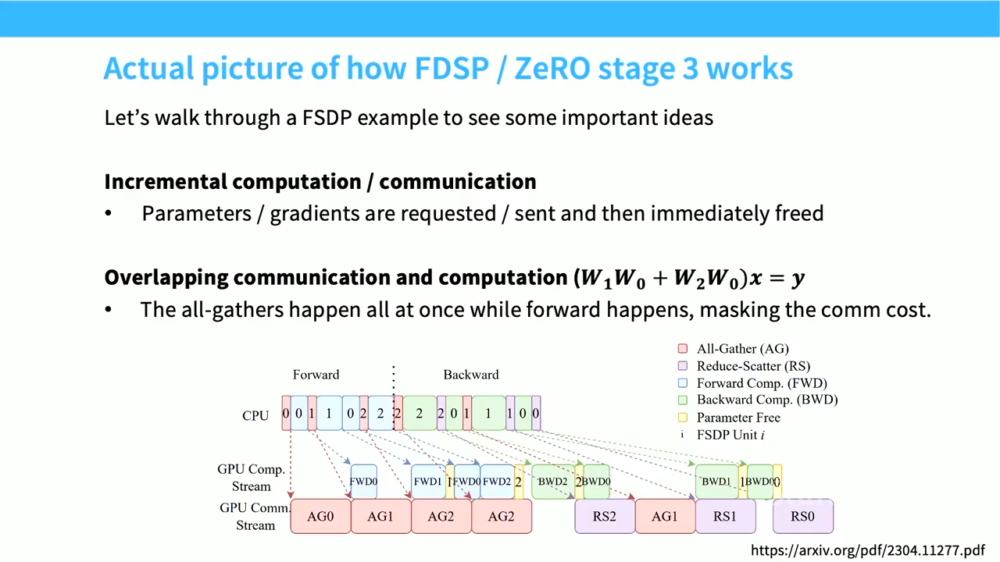
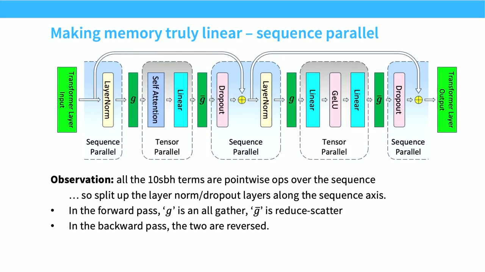

# Lecture 08：Parallelism II

> [!abstract] 本讲一句话
> 大模型训练没有一种万能并行法：ZeRO/FSDP 分片训练状态，tensor/expert parallel 利用高速域切 width，pipeline parallel 跨慢链路切 depth，sequence/context parallel 切 length，最后用 data parallel 填满剩余设备；组合的依据是“每 rank 放得下、collective 跑得动、local kernel 仍高效”。
## 来源与范围

- 课程：Stanford CS336 — Language Modeling from Scratch, Spring 2026
- 讲师：Tatsunori Hashimoto
- 上课日期：2026-04-22
- [课程视频](https://www.youtube.com/watch?v=6-cXp-aOmdg)，时长 1:20:11
- [课程主页](https://cs336.stanford.edu/)
- [官方 Lecture 8 PDF](https://github.com/stanford-cs336/lectures/blob/main/lecture_08.pdf)
- 本讲覆盖：accelerator network topology、DDP、ZeRO-1/2/3、FSDP、pipeline/tensor/sequence/context/expert parallel、activation memory、3D/4D parallelism 和训练配置思路
- 本讲不替代：具体框架版本的 FSDP/Megatron 配置文档、目标集群 NCCL benchmark、模型发布方的正式 technical report

> [!warning] 来源边界
> 正文按公开视频完整英文字幕与 2026 官方 PDF 交叉核对。时间点可以直接跳转；课件中的显存数字和公开模型配置是特定 dtype、硬件与训练阶段的快照，不能把同名模型的一次配置复制为通用答案。
## 视频时间索引

| 时间 | 课堂内容 | 对应笔记 |
| --- | --- | --- |
| [00:00](https://www.youtube.com/watch?v=6-cXp-aOmdg&t=0s) | TPU mesh、GPU switched topology 与 collectives | [[#1. 把 datacenter 视为一台计算机\|1–2]] |
| [11:25](https://www.youtube.com/watch?v=6-cXp-aOmdg&t=685s) | Data parallel 与 model-state 账本 | [[#3. DDP 的计算扩展与内存瓶颈\|3]] |
| [16:48](https://www.youtube.com/watch?v=6-cXp-aOmdg&t=1008s) | ZeRO-1/2/3 的逐级分片 | [[#4. ZeRO：逐步分片 replicated state\|4]] |
| [21:05](https://www.youtube.com/watch?v=6-cXp-aOmdg&t=1265s) | ZeRO-3 = FSDP | [[#4.3 ZeRO-3 / FSDP：再 shard parameters\|4.3]] |
| [22:49](https://www.youtube.com/watch?v=6-cXp-aOmdg&t=1369s) | FSDP incremental request/free 与 overlap | [[#5.1 Overlap\|5.1]] |
| [29:00](https://www.youtube.com/watch?v=6-cXp-aOmdg&t=1740s) | Batch-size resource 与 model parallel 动机 | [[#6. Pipeline parallel：沿 depth 切模型\|6]] |
| [32:13](https://www.youtube.com/watch?v=6-cXp-aOmdg&t=1933s) | Pipeline bubble 与 schedule | [[#6.1 Bubble：为什么 batch size 是资源\|6.1]] |
| [39:27](https://www.youtube.com/watch?v=6-cXp-aOmdg&t=2367s) | Tensor parallel | [[#7. Tensor parallel：沿 width 切 model\|7]] |
| [45:03](https://www.youtube.com/watch?v=6-cXp-aOmdg&t=2703s) | Activation memory 与 sequence parallel | [[#8. Activation memory 不会自动随 TP 线性下降\|8–9]] |
| [53:22](https://www.youtube.com/watch?v=6-cXp-aOmdg&t=3202s) | Expert parallel 与 process groups | [[#10. Expert parallel：沿 experts 切稀疏 MLP\|10]] |
| [1:04:00](https://www.youtube.com/watch?v=6-cXp-aOmdg&t=3840s) | 组合并行的 compute/communication 推导 | [[#11. 组合并行：从约束出发，而不是从名词出发\|11]] |
| [1:12:46](https://www.youtube.com/watch?v=6-cXp-aOmdg&t=4366s) | 公开模型的组合并行配置 | [[#11.3 课堂公开配置案例\|11.3]] |
## 1. 把 datacenter 视为一台计算机

单 GPU 扩展有两个硬上限：
- **Compute**：训练需要的总 FLOPs 远超单芯片可在合理时间完成的量；
- **Memory**：model states 与 activations 超过单卡 HBM。
理想多 GPU scaling 希望同时得到：
$$\text{aggregate compute} \propto P$$
以及：
$$\text{aggregate memory capacity} \propto P$$
但只有在通信没有压倒计算时，聚合资源才是有效资源。
### 1.1 两类 accelerator network
课件用两类极端帮助理解：
- **Mesh/torus**：每个 device 只连近邻，成本可控、结构规则，适合映射规则 tensor sharding；
- **Switched/fat-tree/all-to-all-like domain**：任意端点通信更灵活，适合 collectives 与不规则 expert routing，但交换网络昂贵。

#### TPU 与 GPU 的连接哲学

| | TPU mesh/torus（课堂概括） | GPU switched hierarchy（课堂概括） |
| --- | --- | --- |
| 物理连接 | 每颗芯片只连固定数量的近邻；规模增大时 degree 不必随之增长 | 节点内用 NVLink/NVSwitch 一类高速交换，节点间再接更大的 switched fabric |
| 擅长流量 | 邻近、规则、可预测的 tensor sharding/collective | 任意端点、动态或不规则的流量，例如 MoE token routing |
| 扩展代价 | 线缆、端口与功耗较可控，但远端通信要多跳 | 更灵活，但 switch radix、级数、布线、成本、功耗与故障域会增长 |
| 软件约束 | parallel layout 要贴合 mesh，避免热点和长路径 | mapping 更自由，但仍有 node 内外的明显带宽层级 |

课堂中的 TPU v4/v5 图强调规则 mesh；TPU v8i/v8t 已加入更接近 switched fabric 的 **Virgo** 层级，以适应现代 MoE 的 all-to-all 流量。也就是说，“TPU=永远只有 mesh、GPU=真正全互连”都过度简化：两者都在形成分层网络，只是历史设计点和软件映射习惯不同。


真实系统是分层的：

```text
GPU local HBM
↕
high-bandwidth scale-up domain
↕
scale-out fabric
↕
multiple pods / datacenter network
```
“为什么不把所有 GPU 全互连”的根本原因是：若做成 $P$ 个端点的物理 full mesh，每个端点需要 $P-1$ 个连接，总链路数为 $P(P-1)/2$，端口与布线呈二次增长；改用 switch 虽避免每对端点直连，却把成本转移到交换芯片、级数、功耗、路由与故障域。课堂以大量较弱芯片加高密度光互连的系统为例，说明 bandwidth、compute、power 与 cost 必须一起权衡。因此“新的计算单元是整个 datacenter”并不等于它是一块均匀的大 GPU。
## 2. Collective 的带宽下界

设 $P$ ranks，每 rank 的输入/最终完整结果为 $M$ bytes。
高带宽 ring 算法中：
$$\operatorname{allreduce} = \operatorname{reduce\_scatter} + \operatorname{all\_gather}$$
每 rank 通信量：
$$V_{\text{allreduce}} \approx 2\frac{P-1}{P}M$$
这是 bandwidth-limited regime 中重要的基线：如果一个方案声称精确 all-reduce 却远少于这个必要 data movement，需要检查是否改变了语义、精度、replication 或统计口径。
但 bandwidth-optimal 不等于 latency-optimal：
$$T_{\text{collective}} \approx n_{\text{steps}}\alpha + \frac{V}{B_{\text{effective}}}$$
小 message、跨大 world size 时，step 数和软件调度可能占主导。
## 3. DDP 的计算扩展与内存瓶颈

Naive data parallel 把 batch $B$ 分给 $P$ ranks：
$$B_{\text{local}} = \frac{B}{P}$$
每 rank 保存完整 parameters 和 optimizer state，独立 forward/backward，再 all-reduce gradients。

### 3.1 Model-state 显存账本
设参数量为 $N$，不同 state 的 bytes/parameter：
- model parameter：$b_p$；
- gradient：$b_g$；
- FP32 master weight（若有）：$b_m$；
- optimizer states：$b_o$。
DDP 每 rank：
$$M_{\text{state,DDP}} = N(b_p+b_g+b_m+b_o)$$
一个常见 mixed-precision AdamW 口径：

| State | bytes/parameter |
| --- | ---: |
| BF16 parameter | 2 |
| BF16 gradient | 2 |
| FP32 master weight | 4 |
| FP32 first moment | 4 |
| FP32 second moment | 4 |
| 合计 | 16 |

#### Master weight 和 Adam states 分别做什么

对第 $t$ 步的某个参数，AdamW 维护：

$$
\begin{aligned}
g_t &= \nabla_{\theta}\mathcal{L}_t,\\
m_t &= \beta_1m_{t-1}+(1-\beta_1)g_t,\\
v_t &= \beta_2v_{t-1}+(1-\beta_2)g_t^2,\\
\hat m_t &= \frac{m_t}{1-\beta_1^t},\qquad
\hat v_t = \frac{v_t}{1-\beta_2^t},\\
\theta_t &= (1-\eta\lambda)\theta_{t-1}
-\eta\frac{\hat m_t}{\sqrt{\hat v_t}+\epsilon}.
\end{aligned}
$$

- **Gradient $g_t$**：当前 batch 告诉参数“往哪个方向改、改多大”；做 gradient accumulation 时还要跨 microbatches 累加。
- **First moment $m_t$**：梯度的指数滑动平均，类似带方向记忆的 momentum。
- **Second moment $v_t$**：梯度平方的指数滑动平均，用于按参数自适应缩放步长。
- **FP32 master weight $\theta$**：优化器真正更新的高精度参数副本。很小的更新若直接加到 BF16 权重上可能因有效位不足而消失；先更新 FP32，再 cast/sync 到 BF16 forward weight，可保留这些增量。
- **BF16 parameter**：forward/backward matmul 使用的低精度权重副本，节省 HBM 与带宽。

所以答案是：**在 ZeRO 和常见显存账本里，FP32 master weight 通常和 $m,v$ 一起计入 optimizer-side state；但概念上它是高精度 parameter copy，严格的 Adam optimizer states 是 $m,v$（外加 step 等小量元数据）**。课堂把它们统称为 “optimizer state”，是在讨论“只在更新时才需要、可以交给某个 owner 分片”的系统属性。

一次 mixed-precision update 的数据流是：

```text
BF16 forward weight
→ forward/backward 得到 gradient
→（可选）unscale、clip、跨 microbatch/rank 聚合
→ 用 FP32 gradient/m/v 更新 FP32 master weight
→ cast 为下一步的 BF16 forward weight
```

若使用 pure BF16 update、低精度 optimizer state 或没有 FP32 master copy，数字会不同。不能死记“每参数 16 bytes”，应把实际框架 state dict 和 allocator 实测纳入。

课堂为了比较 ZeRO stages，另采用了 **12 bytes/parameter、8×A100 80GB** 的统一口径。由此得到的理论容量校准值是：

| 方法 | 最大参数量（课堂理想估算） |
| --- | ---: |
| Baseline DDP | 6.66B |
| ZeRO-1 | 16B |
| ZeRO-2 | 24.62B |
| ZeRO-3 / FSDP | 53.33B |

它们只比较 model states，没有扣除 activations、temporary all-gather、通信 buffers 和碎片，因此不是可直接部署的显存上限。
完整峰值还包括：
$$M_{\text{peak}} = M_{\text{state}} + M_{\text{activations}} + M_{\text{temp/buffers}} + M_{\text{fragmentation/runtime}}$$
DDP 只让 local-batch activation 下降，不让 model-state memory 随 $P$ 下降。
### 3.2 DDP 通信
令 gradient payload：
$$M_g = Nb_g$$
Ring all-reduce 每 rank 每 step：
$$V_{\text{DDP}} \approx 2\frac{P-1}{P}M_g$$
Global batch 必须足够大，让 local compute 能覆盖这部分 communication；否则 strong scaling 很快饱和。
## 4. ZeRO：逐步分片 replicated state

ZeRO 的核心不是改变 data-parallel 数学，而是：
1. 把无需始终 replicated 的状态分片；
2. 用 reduce-scatter/all-gather 在正确时机恢复所需视图；
3. 尽快释放 full materialization；
4. 用 prefetch/overlap 隐藏通信。
定义：
$$S_p=Nb_p,\quad S_g=Nb_g,\quad S_o=N(b_m+b_o)$$
### 4.1 ZeRO-1：shard optimizer states
每 rank 保留：
- 完整 parameters；
- 完整 gradients；
- $1/P$ optimizer states。
每 rank 静态 state：
$$M_{\text{Z1}} \approx S_p+S_g+\frac{S_o}{P}$$
逻辑流程：
1. 每 rank 在 local batch 计算完整 gradients；
2. reduce-scatter，让每 rank 得到负责 parameter shard 的 reduced gradient；
3. 各 rank 用本地 optimizer shard 更新自己的 parameter shard；
4. all-gather 更新后的 parameters。
通信仍约为一个 reduce-scatter 加一个 all-gather；当 gradient/parameter dtype 相同，大 message bandwidth regime 下与 DDP all-reduce 同量级。


以 4 ranks 为例，把参数扁平化成四个 shards $[\theta_0,\theta_1,\theta_2,\theta_3]$：

```text
每个 rank:  完整 BF16 theta + 完整 local gradient g^(r)
                         |
                         +-- reduce-scatter(sum)
rank 0 owns: g_0 -- Adam(m_0,v_0,master_0) --> theta_0'
rank 1 owns: g_1 -- Adam(m_1,v_1,master_1) --> theta_1'
rank 2 owns: g_2 -- Adam(m_2,v_2,master_2) --> theta_2'
rank 3 owns: g_3 -- Adam(m_3,v_3,master_3) --> theta_3'
                         |
                         +-- all-gather updated shards
每个 rank:  下一步重新拥有完整 BF16 theta'
```

它和 DDP 数学等价：DDP 的 all-reduce 可以分解成 reduce-scatter + all-gather；ZeRO-1 只把后一半 all-gather 的对象从“完整 reduced gradient”换成“更新后的参数”。因此在 parameter 与 gradient payload 相同的口径下，总 bytes 仍约为 $2S$，却避免每 rank 保存完整 master/$m$/$v$。

### 4.2 ZeRO-2：再 shard gradients
每 rank：
$$M_{\text{Z2}} \approx S_p+\frac{S_g+S_o}{P}$$
Backward 时，某 layer gradient ready 后立刻：
1. reduce-scatter；
2. 只保留本 rank shard；
3. 释放 full gradient buffer。
难点是不能在整个 backward 结束后才处理，否则峰值时仍实例化了完整 gradients，达不到预期节省。

#### 为什么每层 gradient 可以算完、通信、释放

以第 $l$ 个线性层为例：

$$H_l=H_{l-1}W_l,$$
$$\frac{\partial\mathcal L}{\partial W_l}=H_{l-1}^{\mathsf T}\frac{\partial\mathcal L}{\partial H_l},\qquad
\frac{\partial\mathcal L}{\partial H_{l-1}}=\frac{\partial\mathcal L}{\partial H_l}W_l^{\mathsf T}.$$

Backward 到达这一层时，autograd 用保存的 $H_{l-1}$ 和上游梯度 $\partial\mathcal L/\partial H_l$ 同时算出：

1. **parameter gradient** $\partial\mathcal L/\partial W_l$，给 optimizer 更新 $W_l$；
2. **input gradient** $\partial\mathcal L/\partial H_{l-1}$，继续传给前一层。

继续反传只依赖第 2 项，不再依赖完整的第 1 项。因此一旦本 rank 的 $\partial\mathcal L/\partial W_l$ ready，就能立刻对它做 reduce-scatter，只保留本 rank 负责的 $1/P$ global-gradient shard，然后释放该层完整 local-gradient 临时 buffer。

> [!important] “Shard gradient” 不等于“不计算其他参数的梯度”
> ZeRO-2 的每个 rank 仍保存完整模型、走完整 forward/backward，也会为每个参数算出基于自己 local batch 的完整 **local gradient**。被分片的是跨 data-parallel ranks 聚合后的、需要持久保存给 optimizer 的 **global gradient**。若想连矩阵计算本身也分片，那是 TP；若想让不同 rank 只跑部分 layers，那是 PP。

逐层时间线是：

```text
layer L:   compute dW_L, dH_{L-1} -> RS(dW_L) -> keep shard -> free full dW_L
layer L-1: compute dW_{L-1}, dH_{L-2} -> RS(dW_{L-1}) -> keep shard -> free ...
...
optimizer: 每个 rank 只更新自己拥有的 gradient/optimizer shards
AG params: 恢复下一 step 所需的完整 BF16 parameters
```


### 4.3 ZeRO-3 / FSDP：再 shard parameters
Steady-state 每 rank：
$$M_{\text{Z3}} \approx \frac{S_p+S_g+S_o}{P}$$
但执行某个 FSDP unit 时，需要临时 all-gather full parameters。最容易混淆的一点是：**FSDP 不是把 layer 0 放 rank 0、layer 1 放 rank 1**；每个 rank 都处理自己的 data shard，并按相同次序走过全部 layers。不同 rank 只是在平时分别拥有每个 FSDP unit 的一小片参数。

对 unit $U_l$，完整生命周期是：

```text
steady state: 每 rank 只有 shard(W_l)

forward:
  AG shard(W_l) -> 临时 materialize full W_l
  -> 用 local activations 做 forward
  -> 保存 backward 所需 activation
  -> reshard/free full W_l

backward:
  再次 AG shard(W_l) -> 临时 materialize full W_l
  -> 算 local dW_l 与 dH_{l-1}
  -> RS(dW_l)，owner 只留下 global-gradient shard
  -> reshard/free full W_l 与 full dW_l
```

Backward 为什么还要再 all-gather？因为默认在 forward 后已经释放了 full $W_l$，而 $dH_{l-1}=dH_lW_l^{\mathsf T}$ 仍需要它。也可以选择在 forward 后保留 full parameters 来省一次 all-gather，但这会失去核心显存收益；实际实现通过 reshard policy 在 memory 与 communication 间权衡。

因此峰值不是简单总 state 除以 $P$：
$$M_{\text{peak,Z3}} \approx \frac{S_p+S_g+S_o}{P} + M_{\text{largest all-gather unit}} + M_{\text{prefetch}} + M_{\text{activations}} + M_{\text{buffers}}$$
Wrap unit 太大，temporary full parameter 峰值高；太小，collective 数量多、latency 和调度 overhead 高。


图中“request/free”是 **unit 粒度** 的逻辑动作，不代表一定同步等待或真的把 allocator memory 归还给系统。runtime 常在 communication stream 上预取下一个 unit，并复用 buffer；真正重要的是 full parameter 不再作为长期 live tensor。


## 5. ZeRO/FSDP 的通信与边界

课件按“大 $P$、相同 parameter/gradient payload、忽略 latency”的归一化估算：

| 方法 | 近似 payload/step | 主要通信 |
| --- | ---: | --- |
| DDP | $2S$ | gradient all-reduce |
| ZeRO-1 | $2S$ | gradient reduce-scatter + parameter all-gather |
| ZeRO-2 | $2S$ | incremental gradient reduce-scatter + parameter all-gather |
| ZeRO-3/FSDP | $3S$ | forward/backward parameter all-gather + gradient reduce-scatter |
这里每个 collective 更精确地还要乘：
$$\frac{P-1}{P}$$
并按各自 dtype 替换 $S$。
为什么 ZeRO-3 约为 $3S$：
1. Forward 前 all-gather parameters：约 $S_p$；
2. Backward 前/中再次 all-gather parameters：约 $S_p$；
3. Backward reduce-scatter gradients：约 $S_g$。
实现可通过 caching、reshard policy 和 recomputation 改变次数/峰值。

这里“有很多层，为什么不是 $3LS$”的答案是：表里的 $S$ 已经代表 **全模型所有层 payload 的总和**。若第 $l$ 层参数大小为 $S_l$，则：

$$
\sum_{l=1}^{L}(S_l^{\text{fwd AG}}+S_l^{\text{bwd AG}}+S_l^{\text{grad RS}})
\approx 3\sum_{l=1}^{L}S_l=3S.
$$

collective 的**次数**确实随 units/layers 增长，因而 latency 项约为 $n_{\text{collectives}}\alpha$；只是 bandwidth bytes 求和后仍是 $3S$。这也是 wrap 得过碎时理论通信量没变、性能却变差的原因。

### 5.1 Overlap
理想 prefetch：

```text
compute unit i
       ├──────────────┤
all-gather unit i+1
          ├──────┤
```
可见通信时间近似：
$$T_{\text{visible comm}} \approx \max(0,T_{\text{comm}}-T_{\text{overlappable compute}})$$
Overlap 需要：
- 足够大的 compute unit；
- separate streams 与正确 dependency；
- 预留 next-unit buffer；
- 稳定 collective order；
- 网络没有被其他 groups 饱和。

图中的 overlap 具体是：compute stream 正在用 full $W_l$ 计算 unit $l$，communication stream 同时 all-gather $W_{l+1}$。只有当 $T_{\text{compute},l}\ge T_{\text{AG},l+1}$ 时，中间 steady-state 的通信才可能完全被遮住；第一个 prefetch、最后的 drain、依赖没有排好和显存不足都会留下可见 bubble。因此课堂说的“几乎 free”是吞吐区间判断，不是说 collective 没有成本。



> 视频关键帧：[23:10](https://www.youtube.com/watch?v=6-cXp-aOmdg&t=1390s)。课堂图的重点不是“所有 all-gather 一次发完”，而是 unit 级 request、compute、reduce-scatter、free，并尽量让下一 unit 的通信藏在当前计算后面。

### 5.2 FSDP 不解决什么
- 不自动减少 activation memory；
- 不消除 parameter communication；
- 不保证通信可完全 overlap；
- 不保证 checkpoint/optimizer migration 简单；
- 不替代 tensor/context/expert parallel；
- 不同框架所称 “FSDP” 和 ZeRO stage 的细节可能不同。


图中的趋势说明：随着 FSDP group 扩大，每 rank local batch/compute 可能变小，而 parameter collectives 并不会按同样比例消失，于是 communication 更难被隐藏；模型并行通过缩小单 rank 所需模型状态、改变 compute/communication 比，可把高利用率区间推向更小 batch。它是 workload 和硬件上的测量趋势，不是“FSDP 到某个 GPU 数必然失效”的固定阈值。

> [!important] ZeRO-1 “几乎免费”有条件
> 课件的结论针对大 message、bandwidth-limited、overhead 可忽略的理想区间。小 modules、大 world size、跨层碎片化 collectives 或网络拥塞会让 latency 显著。


## 6. Pipeline parallel：沿 depth 切模型

把 layers 分给 $P_{\text{PP}}$ stages。相比 FSDP 传 parameters，PP 主要在 stage boundary 传 activations。
Microbatch activation payload：
$$M_A = B_\mu S H b_a$$
它与 parameter count 无直接线性关系，所以当 model parameters 很大而 boundary activation 相对小时，PP 的通信性质很好，适合跨较慢 inter-node link。

> [!important] “PP 放在最慢网络上”是 mapping 结论
> 不是说慢网能让 PP 更快，而是一个集群若同时有 node 内高速链路和 node 间较慢链路，应把通信最频繁的 TP/EP 留在高速域，把相对通信友好的 PP 映射到慢链路。PP 每个 microbatch 在相邻 stage 间做 point-to-point $BSH$ activation transfer；TP/EP 则几乎每个 block 都做 collective/all-to-all。有限的快链路预算应优先给后者。


### 6.1 Bubble：为什么 batch size 是资源
Naive layer-wise model parallel 同一时刻只有一个 stage 工作，利用率约 $1/P_{\text{PP}}$。
将 minibatch 切成 $m$ microbatches 后，简单 schedule 的 bubble-to-useful ratio 近似：
$$\frac{P_{\text{PP}}-1}{m}$$
相应 bubble fraction：
$$f_{\text{bubble}} \approx \frac{P_{\text{PP}}-1} {m+P_{\text{PP}}-1}$$
因此 $m$ 要远大于 stage 数；但 microbatch 过小又会让 local matmul 效率下降。

设一次 optimizer step 中，每条 pipeline replica 消化 $m$ 个 microbatches，每个大小为 $B_\mu$，data-parallel degree 为 $P_{\text{DP}}$，则：

$$B_{\text{global}}=P_{\text{DP}}\,m\,B_\mu.$$

这揭示了课堂所说的 **batch size 是有限资源**：

- DP 用 batch 生成彼此独立的 replicas；固定 $B_{\text{global}}$ 时，增大 $P_{\text{DP}}$ 会减小每条 pipeline 的 $mB_\mu$。
- PP 用 batch 生成足够多的 microbatches 来填流水线；固定高效 GEMM 所需的 $B_\mu$ 时，只有增大 $m$ 才能降低 bubble。
- 不能无限增大 $B_{\text{global}}$：超过任务的 critical batch size 后，继续加样本对优化进度的边际收益下降，可能不如多走一个 optimizer step。

例如 $P_{\text{PP}}=8$：$m=8$ 时 bubble fraction 为 $7/(8+7)\approx46.7\%$；$m=56$ 时降到 $7/(56+7)\approx11.1\%$。但若 global batch 固定，把 56 个 microbatches 硬切得过小，又会损害单 stage kernel 效率。因此 batch 要同时在 **DP replicas、PP microbatches、local GEMM shape 与优化统计效率**之间分配。

### 6.2 Schedule 与 memory
- GPipe：全部 forward 后全部 backward，bubble 直观但 activation stash 大；
- 1F1B：warmup 后交替 forward/backward，减少 in-flight activations；
- Interleaved：每个 rank 多个 virtual stages，降低 bubble，增加通信/调度；
- Zero-bubble：把 backward 拆成 input-gradient 与 weight-gradient，利用 weight-gradient 的调度自由填空洞。
Stage memory 不只是 parameters，还包括：
$$M_{\text{stage}} = M_{\text{local state}} + n_{\text{in-flight}} M_{\text{activation/microbatch}}$$


#### Megatron 论文与课堂两张 schedule 图

Narayanan 等人的 Megatron 集群论文系统扫描了 DP/TP/PP、batch size 与重计算配置。课堂引用它不是为了记一组固定最优数字，而是说明三个可迁移结论：

1. 在 GPU 集群中，TP 往往先扩到单机高速互连域的上限；再扩大 TP 会跨慢链路且让 local GEMM 过窄。
2. 更深的 PP 必须配更多 microbatches；否则 stage 数增加带来的 bubble 会迅速压低吞吐。
3. Activation recomputation 虽增加 FLOPs，却可能释放显存以增大 microbatch/batch，反而提高 end-to-end throughput。

上图的 **interleaved 1F1B** 让一个 physical rank 持有多个不连续的 virtual pipeline chunks。rank 在等待一个 chunk 的依赖时可以运行另一个 chunk，等效缩短每个 virtual stage 的 compute slot、降低 bubble；代价是 stage boundary 次数增加，P2P bandwidth、调度和 activation bookkeeping 更复杂。


下图的 **zero-bubble** 利用 backward 的两类工作：

- $B$（input-gradient backward）：计算 $dH_{l-1}$，必须尽快传给上一个 stage，位于关键路径；
- $W$（weight-gradient backward）：计算 $dW_l$，只需在 optimizer step 前完成，可延后填入空洞。

普通 autograd 常把 $B$ 与 $W$ 绑在一起；zero-bubble schedule 先推进所有关键路径上的 $B$，再把 $W$ 填入空闲窗口。它能接近零 bubble，但前提是框架能拆分 backward、管理更复杂的依赖/通信，并且 $B/W$ 的耗时比例允许把空洞填满。

## 7. Tensor parallel：沿 width 切 model

Transformer block 的常见 sharding：

| Component                   | 常见切分                          |
| --------------------------- | ----------------------------- |
| QKV projection              | Column parallel               |
| Attention output projection | Row parallel                  |
| MLP up/gate projection      | Column parallel               |
| MLP down projection         | Row parallel                  |
| Norm/router/small ops       | Replicated 或 sequence-sharded |


### 7.1 Column/row pairing
第一层：
$$Y^{(r)} = XW_{\text{col}}^{(r)} \in \mathbb{R}^{BS\times H_{\text{ff}}/P_{\text{TP}}}$$
中间 activation 在 shard 上本地计算。第二层每 rank 得到 partial output：
$$Z^{(r)} = Y^{(r)}W_{\text{row}}^{(r)} \in \mathbb{R}^{BS\times H}$$
最终：
$$Z = \sum_r Z^{(r)}$$
通过 all-reduce 或 reduce-scatter 完成。

图中的 $f/g$ 还表达了 forward/backward 的共轭关系：

| Operator | Forward | Backward |
| --- | --- | --- |
| $f$（进入 column-parallel block） | identity/复制输入视图 | all-reduce input gradients |
| $g$（离开 row-parallel block） | all-reduce partial outputs | identity |

这样 column-parallel 的第一层和 row-parallel 的第二层中间无需 gather；只在 block 边界恢复 replicated output，避免每个 matmul 都来回聚合。

#### 什么时候用 TP：GPU 与 TPU 的差别


- **GPU 集群**：优先把 TP group 放进 node 内 NVLink/NVSwitch 一类最高带宽、最低延迟的 scale-up domain。课堂以常见 8-GPU node 为例说“TP 到 8”，这是拓扑经验值，不是算法上限；跨 node 后 collectives 频繁经过较慢 fabric，性能常出现断崖。
- **传统 TPU mesh**：没有同样尖锐的“8 卡机箱边界”，相邻芯片组成规则大 mesh。TP 的通信模式可规则映射到近邻链路，因此能使用比 GPU node 更大的 TP degree；代价是 mapping 不佳时会多跳、产生链路热点。
- **新 TPU 拓扑**：课堂展示的 TPU v8i/v8t 已增加 Virgo switched hierarchy，说明 TPU 也在为 MoE/all-to-all 提高任意端点通信能力。因此选择不能只看“GPU/TPU”标签，仍要看实际 slice topology 和 collective benchmark。

### 7.2 与 pipeline 的对比
- TP 没有 pipeline bubble；
- 不要求很大 batch；
- 每个 Transformer block 都有 blocking activation collectives；
- 通信量与 $BSH$ 和 layers 成正比；
- 适合低 latency、高 bandwidth 的 scale-up domain。

课件在其 Transformer/collective 口径下给出每层 TP activation communication：
$$V_{\text{TP,layer}} \approx 8BSH\frac{P_{\text{TP}}-1}{P_{\text{TP}}}.$$
常数 8 汇总了该实现一层 forward/backward 的 activation collectives；若改变 block、dtype、SP 融合或统计 send/receive 的方式，常数也会变。可迁移的结论是它与 $BSH$、layers 和 collective factor 成正比，并且频率远高于 PP boundary P2P。
TP degree 过大时：
- local GEMM 变窄，Tensor Core 利用率下降；
- collective latency 增长；
- 跨 node 后 bandwidth 急剧变差。
这就是实践中 TP 经常限制在单个高速互连 domain 的原因，而不是“TP 理论上最多只能 8”。
## 8. Activation memory 不会自动随 TP 线性下降


Parameters 被 tensor-shard 后，一部分 matmul activations 也被分片；但 block 中还有 replicated activations：
- LayerNorm input/output/statistics；
- Dropout masks；
- residual streams；
- attention/MLP input；
- 某些 attention intermediates。
可以写成：
$$M_{\text{act/layer}} = M_{\text{TP-sharded}} + M_{\text{replicated pointwise}} + M_{\text{attention quadratic}}$$
即使 $P_{\text{TP}}$ 增大：
$$M_{\text{TP-sharded}}\rightarrow \frac{1}{P_{\text{TP}}}M_{\text{TP-sharded}}$$
replicated 项不会下降。长序列时 quadratic attention 项还可能占主导；FlashAttention/recomputation 可避免保存部分 $S^2$ intermediates。

课件进一步给出一组统一口径的 activation memory 公式。令 $s$ 为 sequence length、$b$ 为 microbatch、$h$ 为 hidden size、$a$ 为 attention heads、$t$ 为 TP degree：

| 配置 | 每层 activation 近似 |
| --- | --- |
| 无并行 | $sbh(34+5as/h)$ |
| TP | $sbh(10+24/t+5as/(ht))$ |
| TP + SP | $sbh(34/t+5as/(ht))$ |
| TP + selective recompute | $sbh(10+24/t)$ |
| TP + SP + selective recompute | $34sbh/t$ |

其中 replicated 的 $10sbh$ 来自 LayerNorm 的 $4sbh$、dropout 的 $2sbh$、attention/MLP inputs 的 $4sbh$。Sequence parallel 的价值正是把这些逐 token pointwise 项也沿 sequence 切开。

### 8.1 手动推导 activation 公式

这些常数来自 Korthikanti 等人论文采用的特定 GPT Transformer 账本：activation 用 16-bit（每元素 2 bytes），dropout mask 用 1 byte，忽略 LayerNorm mean/variance 等较小的 $O(sb)$ buffer。因此公式给出的是**每层 bytes 近似**，不是适用于所有实现的自然常数。

#### 第一步：无并行时逐块相加

Attention block：

| Backward 需要保存的量 | Bytes |
| --- | ---: |
| output projection input | $2sbh$ |
| attention dropout mask | $sbh$ |
| Q/K/V projections 的共享 input | $2sbh$ |
| $QK^\mathsf T$ 所需的 $Q,K$ | $4sbh$ |
| softmax output | $2abs^2$ |
| softmax dropout mask | $abs^2$ |
| attention-over-$V$ 所需 dropout output 与 $V$ | $2abs^2+2sbh$ |
| **Attention 合计** | **$11sbh+5abs^2$** |

MLP 的两个 linear inputs 分别为 $2sbh$ 和 $8sbh$，GELU input 为 $8sbh$，dropout mask 为 $sbh$：

$$M_{\text{MLP}}=(2+8+8+1)sbh=19sbh.$$

两个 LayerNorm 各保存一个 16-bit input：

$$M_{\text{LN}}=2sbh+2sbh=4sbh.$$

所以：

$$
\begin{aligned}
M_0
&=(11+19+4)sbh+5abs^2\\
&=34sbh+5abs^2\\
&=sbh\left(34+5\frac{as}{h}\right).
\end{aligned}
$$

其中 $5abs^2$ 的 5 正好是 softmax output 的 2 bytes、softmax dropout mask 的 1 byte、dropout output 的 2 bytes。

#### 第二步：把 34 分成 TP 能切与不能切的部分

Megatron TP 会分片 attention/MLP 内部的大 matmul activations，但普通 TP 在 block 边界仍复制以下轻量区域：

$$10sbh=
\underbrace{4sbh}_{\text{two LayerNorm inputs}}+
\underbrace{2sbh}_{\text{two dropout masks}}+
\underbrace{4sbh}_{\text{attention/MLP inputs}}.
$$

因此 $34=10+24$，普通 TP 只把 $24sbh$ 和按 heads 分片的 quadratic attention 项除以 $t$：

$$
M_{\text{TP}}
=10sbh+\frac{24sbh}{t}+\frac{5abs^2}{t}
=sbh\left(10+\frac{24}{t}+5\frac{as}{ht}\right).
$$

#### 第三步：加入 SP 与 selective recomputation

SP 再把原来复制的 pointwise $10sbh$ 沿 sequence 分片：

$$
\begin{aligned}
M_{\text{TP+SP}}
&=\frac{10sbh}{t}+\frac{24sbh}{t}+\frac{5abs^2}{t}\\
&=sbh\left(\frac{34}{t}+5\frac{as}{ht}\right).
\end{aligned}
$$

Selective recomputation 不保存 $QK^\mathsf T\rightarrow$ softmax $\rightarrow$ dropout $\rightarrow AV$ 区域的 $5abs^2/t$，backward 时按需重算，于是：

$$M_{\text{TP+recompute}}=sbh\left(10+\frac{24}{t}\right),$$
$$M_{\text{TP+SP+recompute}}=\frac{34sbh}{t}.$$

> [!note] 为什么不把 24 也重算掉？
> 可以做 full-layer recomputation，但 MLP/linear 的大 GEMM 要重新执行，compute overhead 显著。Selective recomputation 只挑“占 HBM 很大、每个元素重算 FLOPs 较低”的 attention 中间量；课堂 [52:30](https://www.youtube.com/watch?v=6-cXp-aOmdg&t=3150s) 专门强调了这一取舍。FlashAttention 通过 tiled/online-softmax 本身也避免把完整 $S^2$ attention matrix 常驻 HBM，但具体保存策略要以所用 kernel 为准。



> 视频关键帧：[49:30](https://www.youtube.com/watch?v=6-cXp-aOmdg&t=2970s)。图中的 `g/ĝ` 在 forward/backward 分别对应 all-gather 与 reduce-scatter 的互换。
## 9. Sequence parallel 与 context parallel

两者都沿 sequence 切，但解决的范围不同。
### 9.1 Sequence parallel
目标主要是把 TP block 中原本 replicated 的 pointwise activations 分片：
$$X^{(r)} \in \mathbb{R}^{B\times(S/P_{\text{SP}})\times H}$$
LayerNorm、dropout、residual 等逐 token operations 可本地执行。
进入需要 tensor-parallel layout 的 linear 前后，用 all-gather / reduce-scatter 在 sequence-sharded 与 tensor-sharded layout 间转换。
收益：
$$M_{\text{pointwise act/rank}} \approx \frac{1}{P_{\text{SP}}} M_{\text{pointwise act}}$$
实践中 SP 常与 TP 使用同一个 group/degree。
### 9.2 Context parallel
Context parallel 面向超长 sequence 的 attention 与 KV/activation：
$$Q^{(r)},K^{(r)},V^{(r)} \in \mathbb{R}^{B\times H_{\text{heads}}\times(S/P_{\text{CP}})\times d}$$
但每个 query 仍依赖其他 shards 的 keys/values。Ring attention 类算法让 K/V blocks 在 ranks 间轮转，每 rank：
1. 计算 local $Q$ 对当前 K/V block 的 partial attention；
2. 用 online softmax 合并 max、normalizer 和 output；
3. 把 K/V block 传给下一个 rank。
KV/activation memory 可近似降到 $1/P_{\text{CP}}$，代价是与 sequence-sized K/V 相关的通信和更复杂的 causal load balance。

> [!note] SP 与 CP 不只是命名差异
> SP 常指 TP 周围的 pointwise activation sharding；CP 覆盖 attention context dependency。框架术语可能不同，判断时应看实际 tensor layout 和 collective。
## 10. Expert parallel：沿 experts 切稀疏 MLP


MoE 有 $E$ 个 experts，分到 $P_{\text{EP}}$ ranks。Router 为 $T=BS$ 个 tokens 选择 top-$k$ experts。
Dispatch：

```text
tokens on data ranks
→ pack by destination expert/rank
→ all-to-all
→ local expert GEMMs
→ reverse all-to-all
→ restore token order and combine
```
理想均衡的 token-expert assignments/rank：
$$\frac{kT}{P_{\text{EP}}}$$
Expert parameter memory：
$$M_{\text{expert params/rank}} \approx \frac{1}{P_{\text{EP}}} M_{\text{all expert params}}$$
### 10.1 为什么 EP 可能优于对 expert MLP 做 TP
- 每个 expert GEMM 可以保持较宽，减少 matmul fragmentation；
- 每 rank 只保存一部分 experts；
- 计算只激活 top-$k$ experts。
代价：
- 两次 all-to-all；
- token imbalance 导致 straggler；
- capacity padding/dropping；
- token 数不足时每个 expert batch 太小；
- 路由与 packing kernel overhead；
- fabric bisection bandwidth 压力。
### 10.2 Attention 与 MoE MLP 的并行需求不同


MoE 只替换 MLP，attention 仍是 dense。可能出现：
- Attention 希望较高 TP/CP；
- Expert MLP 希望较高 EP、较低 expert tensor parallel；
- 两部分使用不同 process-group factorization。
因此现代系统可能区分：

```text
attention: DP × TP × CP
experts:   EDP × ETP × EP
```
组合不再只是一个全模型统一 TP degree。

冲突来自 local GEMM shape：若全模型统一使用很大的 TP，attention 矩阵能被切开，但每个 expert 原本已经只接收部分 tokens，再把 expert 权重做高 degree ETP，会让 expert GEMM 又窄又小；若全模型统一使用很小 TP，expert GEMM 较好，dense attention 又可能放不下或算不动。因此执行流可以在同一 Transformer block 内切换 process-group 视图：

~~~text
attention:
  tokens stay in attention DP group
  -> TP/CP collectives
  -> dense attention

MoE:
  router scores locally
  -> reshape/redistribute into EP group
  -> token all-to-all to expert owners
  -> optional small ETP inside each expert
  -> reverse all-to-all and combine
~~~

这里的 EDP（expert data parallel）是 expert 参数的 replicas，和 dense attention 的 DP 不一定是同一组 ranks。图片中的 “decouple attention and MoE parallelism” 就是允许 attention 用一组 **TP/CP/DP**，expert MLP 用另一组 **ETP/EP/EDP**，而不是强迫一个 degree 套完整个 block。

### 10.3 怎样减少等待 routing 的延迟


Router 本身通常只是一个小 projection/top-$k$；更重的等待来自 token permutation、跨 rank dispatch all-to-all、最慢 expert，以及 combine all-to-all。关键路径可写成：

$$
T_{\text{MoE}}\approx
T_{\text{router/pack}}+
T_{\text{dispatch A2A}}+
\max_r T_{\text{expert},r}+
T_{\text{combine A2A}}+
T_{\text{unpack}}.
$$

因此优化不是单纯“换更快 router”，而是同时处理：

1. **减少软件/launch latency**：融合 top-$k$、prefix-sum、pack/permutation；使用 persistent 或低开销通信 kernel，避免大量碎小 messages。
2. **贴合网络层级**：node 内优先走 NVLink/scale-up，node 间聚合连续 token chunks，再用 topology-aware hierarchical all-to-all。
3. **通信与计算 overlap**：把 token 分 chunk；第一批到达即可开始 grouped GEMM，同时继续收后续 chunks；combine 也可与其他 expert 或下一 microbatch 的计算交叠。
4. **提高 payload 效率**：只传必要 activation/metadata，合理选择低精度通信、对齐与连续布局，避免反复 transpose/copy。
5. **控制 straggler**：auxiliary/load-balancing loss、capacity policy、expert placement 与动态 routing 让 $\max_r T_{\text{expert},r}$ 接近平均值。

课堂用 DeepEP 和 NVIDIA Hybrid EP 说明：frontier EP 的难点已经下沉到 GPU 网络指令、buffer ownership 与 kernel/collective 融合。能 overlap 的前提仍是有独立可执行的 compute；若所有 expert tokens 都未到或某个 rank 严重过载，异步 API 本身不会消除等待。
## 11. 组合并行：从约束出发，而不是从名词出发


总 GPU 数通常分解为：
$$P_{\text{total}} = P_{\text{DP}} \times P_{\text{TP}} \times P_{\text{PP}} \times P_{\text{CP}} \times P_{\text{EP}}$$
但某些 dimensions 可能共享/嵌套 process groups，尤其 MoE 中不能盲目相乘；应以实际 rank mesh 为准。
### 11.1 实用求解顺序
1. **单 rank memory ledger**
   - parameters、gradients、optimizer；
   - activations/KV；
   - temporary all-gather、collective buffers。
2. **先让模型放得下**
   - 高速域内使用 TP/EP；
   - 跨 node 用 PP；
   - 或在 bandwidth 足够时用 FSDP/ZeRO-3。
3. **检查 local kernel shape**
   - local hidden/head/expert tokens 是否仍足够大；
   - microbatch 是否能饱和 GEMM。
4. **检查 communication**
   - 每种 collective 的 bytes、次数、group、link；
   - 是否可 overlap。
5. **用 DP 使用剩余设备**
   - 但受 global batch 上限约束。
6. **若 batch 不够大**
   - gradient accumulation 提高有效 batch/通信效率；
   - 它不会减少每 token 总 compute。
### 11.2 Topology-aware mapping
常见启发式：

```text
within fastest scale-up domain:
    TP / EP
across nodes:
    PP or FSDP/DP depending on payload and bandwidth
remaining replicas:
    DP
long context:
    add CP
```
这是启发式，不是定理。若 node 内没有全带宽互连、跨节点 fabric 很强，或模型/shape 不同，结论会变化。

### 11.3 课堂公开配置案例

视频最后没有停留在抽象名词，而是对照公开资料展示组合配置：

| 案例 | 课堂列出的配置 | 应该读出的系统含义 |
| --- | --- | --- |
| OLMo 7B（Dolma data） | pure FSDP | 模型较小时，只用 FSDP 仍可扩到很多 GPUs；课堂口误/slide 的 “Dolma 7B” 指在 Dolma 上训练的 OLMo |
| DeepSeek（讲师口述） | ZeRO-1 + TP/SP + PP | 经典 dense 3D 组合；第 72 页汇总表却在 EP 栏列 8，与口述不完全一致，应保留此来源歧义 |
| DeepSeek V3 | ZeRO-1、TP1、EP64、PP16 | MoE 用跨 8 nodes 的大 EP domain，并用 1F1B 风格把 A2A 与 pipeline compute overlap |
| Yi / Yi-Lightning | Yi：ZeRO-1 + TP + PP；Lightning：以 EP 替代主要 TP | 从 dense 模型的 TP 转向 MoE 的 EP |
| Llama 3 405B 主预训练 | DP128、TP8、PP16、CP1 | dense 巨型模型：node 内 TP、跨 node PP、剩余规模给 DP；长上下文阶段提高 CP、降低 DP |
| Gemma 2 | ZeRO-3 + TP/SP + DP；课件表列 DP768、TP8、PP0 | TPU mesh 上可用较大 DP/TP 而不依赖 PP，体现拓扑差异 |
| Mixtral 8×22B | TP4、PP4、CP1、EP8，课件推测 DP2 以合计 256 GPUs | attention 仍用 TP，experts 用 EP；这是课堂从 Megatron 配置资料读取的示例 |
| Nemotron 3 Super 长上下文 | TP2、CP64、EP64；PP 未知/未用 | 长 context 把大量 devices 给 CP，MoE 同时需要 EP |
| Qwen 3（Megatron 示例） | TP2、EP32、PP8、CP1，DP 未列 | 大 EP + 中等 PP，TP 仍保持较小 |

> [!note] “课件表中的数字相乘不等于一定是总 GPU 数”
> Attention 和 expert 层可能采用不同 group factorization；“未知”表示公开材料/课堂没有给出，不应反推成 1。尤其 Mixtral、Nemotron、Qwen 3 三行主要是课堂读取 Megatron/Bridge 配置来说明实践选择，不能改写成模型发布方训练该 checkpoint 的确定历史。

> [!warning] 读配置表的方式
> 这些数字与 checkpoint 阶段、context length、global batch、cluster topology、框架版本绑定。应学习的是“约束改变时如何重新分解 rank mesh”，而不是背某个模型名对应的一组 degrees。

### 11.4 课堂问答：looped Transformer 会更容易并行吗

视频 [1:08:43](https://www.youtube.com/watch?v=6-cXp-aOmdg&t=4123s) 的问题是假设 Transformer 在 depth 上重复使用同一组 weights。讲师先明确没有认可相关传闻，只回答这种结构会怎样改变系统。

若同一个 block $F(\cdot;W)$ 循环 $K$ 次：

$$H_{k+1}=F(H_k;W),\qquad
\frac{\partial\mathcal L}{\partial W}
=\sum_{k=0}^{K-1}
\left.\frac{\partial\mathcal L}{\partial W}\right|_{\text{第 }k\text{ 次使用}}.$$

结论是“一部分更容易、一部分更难”：

- **更容易**：unique parameter count 下降，同一个 $W$ 可在多次迭代中复用；参数、master weight、Adam states 都更少，可能降低 TP/PP/FSDP 仅为“让权重放得下”而存在的必要性。
- **FSDP 策略要改变**：常规 FSDP 假定一层是 “all-gather → 用一次 → discard”，循环结构若每次都 discard/re-gather 会重复通信。显存允许时应让共享 unit 在 loop 期间 materialized/cached，最后再 reshard。
- **并非所有显存都更少**：unroll $K$ 次仍产生 $K$ 份 backward 所需 activations；若不做 recomputation/reversible 设计，activation memory 仍随有效深度增长。
- **compute 也没有免费减少**：共享参数减少的是 unique state，不是循环次数；仍要执行 $K$ 次 forward/backward，并把每次使用对同一 $W$ 的 gradient contribution 相加。
- **PP 会变得不同**：不能再简单按“不同 layers 拥有不同 weights”切 stage。可以在 microbatches/iterations 上设计 pipeline，但循环依赖、共享权重 ownership 与 activation 生命周期需要新的 schedule。

所以课堂的核心判断是：looped Transformer 会削弱传统 model-state sharding 的压力，却破坏 FSDP 的一次性 request/free 假设；它不是天然更容易或更难，而是瓶颈从 unique parameters 更偏向 repeated compute、activations 与循环调度。

## 12. 并行策略对比

| 方法          | 主要切分               |      Param state/rank |       Activation/KV | 主要通信                    | 主要限制                        |
| ----------- | ------------------ | --------------------: | ------------------: | ----------------------- | --------------------------- |
| DDP         | Batch              |                   不下降 |      local batch 下降 | 每 step gradient AR      | global batch、state capacity |
| ZeRO-1      | Optimizer          |                  部分下降 |                  不变 | RS grad + AG param      | parameters/grad replicated  |
| ZeRO-2      | Optimizer+grad     |                  更多下降 |                  不变 | incremental RS + AG     | parameters replicated       |
| ZeRO-3/FSDP | 全部 state           |               约 $1/P$ |                  不变 | param AG + grad RS      | latency、temp full params    |
| PP          | Layers/depth       |               约 $1/P$ |   in-flight buffers | boundary P2P            | bubble、stage balance        |
| TP          | Hidden/heads       |  sharded part 约 $1/P$ |                部分下降 | 每 block collectives     | 需要高速低延迟链路                   |
| SP          | Sequence pointwise |                  通常不变 |        约 $1/P$ 对相关项 | AG/RS layout change     | 与 TP layout 耦合              |
| CP          | Context            |                  通常不变 | sequence/KV 约 $1/P$ | K/V 或 partial attention | 长序列通信                       |
| EP          | Experts            | expert params 约 $1/P$ |     routing buffers | token all-to-all        | load balance、fabric         |


课堂表格最值得补充的是“每种方案消耗哪一种稀缺资源”：

- **DDP/ZeRO/FSDP 消耗 global-batch budget**：每增加一个 replica，都需要足够 local batch 才有计算可做并遮住 state communication。
- **PP 消耗 pipeline 内的 microbatch budget**：需要 $m\gg P_{\text{PP}}$ 才能降低 bubble，同时依赖 stage balance。
- **TP 消耗最快链路和 local matrix width**：不扩大 global batch，却在每层做同步 collective。
- **SP/CP 消耗 sequence 维度和通信窗口**：SP 多为 TP 的 activation-memory add-on；CP 面向长上下文，不是所有短序列训练都值得用。
- **EP 消耗 token density 与 fabric bisection bandwidth**：expert 分得越散，参数越省，但每个 expert 收到的 tokens 可能越少、all-to-all 越难。

这也解释了为什么没有单一“最佳并行”：一项技术释放 memory 时，常会转而消耗 batch、network、kernel shape 或 schedule complexity。


两张图给出同一套实践顺序：

1. 先在最快域内用 TP/EP，并尽量把 degree 控制在不会破坏 GEMM shape 的范围；
2. 仍放不下时用 PP 或 ZeRO-3/FSDP 穿过更慢的层级；
3. 模型能放下后，尽可能把剩余设备交给 DP；
4. 长序列再加 CP，activation 紧张时加 SP/selective recomputation；
5. local batch 太小导致 kernel/overlap 不佳时，用 gradient accumulation 合并多个 microbatches 后再 optimizer step。

图中 “minimize model parallelism, maximize data parallelism” 不是说 model parallel 不重要，而是 model parallel 会引入细粒度通信、变窄 GEMM 或 pipeline bubble；达到 memory/shape 约束所需的最小 degree 后，DP 通常最简单、局部 kernel 也最完整。

## 13. AI Infra 视角

### Shape
- 每个并行维度都改变 local tensor shape；
- divisibility、head/expert count、sequence shard 和 microbatch 决定 padding；
- local shape 太小会让通信赢了、kernel 输了。
### Compute
- DP 分 samples，TP 分 layer matmul，PP 分 layers，EP 分 active experts；
- bubble、routing imbalance、narrow GEMM 和 checkpoint recompute 都改变 useful FLOPs utilization；
- 只看 aggregate peak 会严重高估。
### Memory
- 区分 steady-state shard memory 和 temporary full materialization；
- FSDP prefetch、pipeline in-flight activations、EP routing buffers 会抬高峰值；
- ZeRO 不自动减少 activation，TP 也不自动分掉全部 activation。
### Communication
对每种 collective 做五元组：

```text
(payload bytes, frequency, process group, topology, overlap window)
```
缺任何一项，都无法预测性能。
### Runtime
- Process-group construction 与 collective order 必须一致；
- Async streams、prefetch depth、bucket/wrap size 是性能参数；
- Sharded checkpoint、failure recovery 和 elastic restart 是大规模训练必要组成。
## 14. 自己的推导与易错点

### 14.1 FSDP 是否值得：一个 overlap 条件
对一个 unit：
$$T_{\text{AG}} \approx \alpha_{\text{AG}} + \frac{P-1}{P} \frac{S_{\text{unit}}}{B}$$
若下一 unit compute：
$$T_{\text{compute,next}} \ge T_{\text{AG}}$$
则理想上可隐藏 all-gather；unit 太小会被 $\alpha$ 主导，太大又增加峰值 full parameters。这说明 wrap granularity 存在中间最优点。
### 14.2 PP 与 TP 的链路选择
PP 每 boundary payload 约：
$$B_\mu S H b$$
TP 每 block 多次 activation collective，且乘 layers。即使单次 payload 相似，TP 的频率更高、通常 blocking，因此对 latency/bandwidth 更敏感。这是 PP 更适合跨节点的主要原因。
### 14.3 EP 的最低 token 密度
理想每 expert assignments：
$$\frac{kBS}{E}$$
若这个值太小，expert GEMM 的 batch dimension 太小，算力利用率下降。增加 EP degree 虽节省 expert parameter memory，却不会凭空增加 tokens；需要增大 batch/sequence、减少 experts/group，或做 expert grouping。
### 14.4 常见误区
1. **ZeRO stage 越高一定越快**：更省 memory，通常也增加/碎片化通信。
2. **ZeRO-3 稳态除 $P$ 就是峰值**：还要加 all-gather unit 和 prefetch buffers。
3. **FSDP 等于 TP**：FSDP 在计算前恢复 parameters；TP 直接对 sharded math 求值。
4. **PP 不需要大 batch**：需要足够 microbatches 隐藏 bubble。
5. **TP degree 越大，单卡越省且越快**：local GEMM 变窄且 collective 增加。
6. **SP 与 CP 完全相同**：一个常分 pointwise activations，一个解决 attention context dependency。
7. **EP 只减少 parameters**：还引入 all-to-all、routing buffer 和 imbalance。
8. **DP×TP×PP×CP×EP 总能直接相乘**：groups 可能嵌套、共享或只应用于部分 block。
9. **框架报告 reserved memory 就是 tensor memory**：allocator cache、fragmentation 和 communication workspace 也在其中。
10. **公开模型的并行配置可直接复用**：训练阶段、硬件和 context 不同会改变最优点。
## 15. 本讲结论

1. Datacenter 是新的计算单元，network topology 是模型架构约束的一部分。
2. DDP 提供 compute scaling，但复制全部 model state。
3. ZeRO-1/2/3 依次 shard optimizer、gradients、parameters；FSDP/ZeRO-3 用临时 all-gather 换线性 state capacity。
4. FSDP 的真实峰值包含 full unit、prefetch、activation 与 buffers，通信约为两次 parameter all-gather 加一次 gradient reduce-scatter。
5. Pipeline parallel 切 depth，适合跨较慢链路，但需要 microbatches 与精细 schedule 控制 bubble。
6. Tensor parallel 切 width，没有 pipeline bubble，却每层依赖高速 collective。
7. Sequence/context parallel 分别处理 replicated pointwise activation 与长上下文 attention/KV。
8. Expert parallel 分片 experts，并用 all-to-all route tokens；load balance 是核心。
9. 3D/4D 并行是 topology-aware 的约束求解，不是把所有 degree 任意相乘。
10. 最终配置必须同时通过 memory ledger、communication model、local-kernel benchmark 和 end-to-end profile。
## 16. 自测问题

1. 为什么 accelerator domain 不能无限做成全互连？
2. DDP 的 parameter、gradient、master weight 和 Adam state 各占多少显存？
3. ZeRO-1/2/3 分别 shard 什么？
4. 为什么 ZeRO-1 的带宽通信量可以和 DDP 同量级？
5. 为什么 ZeRO-3/FSDP 的 normalized payload 常近似 $3S$？
6. FSDP steady-state memory 与 peak memory 有何不同？
7. FSDP wrap unit 太大和太小分别有什么问题？
8. Pipeline bubble ratio 如何随 stage 和 microbatch 变化？
9. 为什么 PP 经常比 TP 更适合跨节点？
10. Column/row TP 如何组合完成一个 MLP？
11. 为什么 TP 无法自动线性降低全部 activation memory？
12. Sequence parallel 和 context parallel 的语义差异是什么？
13. Ring attention 如何合并不同 K/V shards 的 softmax？
14. Expert parallel 为什么需要两次 all-to-all？
15. 哪些因素会造成 expert load imbalance？
16. 如何将总 GPU 数映射到 DP/TP/PP/CP/EP process groups？
17. 在选择并行度时，为什么必须检查 local GEMM shape？
18. 如何判断某个 collective 能否被 compute overlap？
## 参考资料

- [Stanford CS336 Spring 2026](https://cs336.stanford.edu/)
- [CS336 Lecture 8 PDF](https://github.com/stanford-cs336/lectures/blob/main/lecture_08.pdf)
- [Lecture 8 video](https://www.youtube.com/watch?v=6-cXp-aOmdg)
- [ZeRO](https://arxiv.org/abs/1910.02054)
- [PyTorch FSDP](https://pytorch.org/docs/stable/fsdp.html)
- [PyTorch FSDP tutorial](https://pytorch.org/tutorials/intermediate/FSDP_tutorial.html)
- [PyTorch FSDP: Experiences on Scaling Fully Sharded Data Parallel](https://arxiv.org/abs/2304.11277)
- [Megatron-LM](https://arxiv.org/abs/1909.08053)
- [Efficient Large-Scale Language Model Training on GPU Clusters Using Megatron-LM](https://arxiv.org/abs/2104.04473)
- [Reducing Activation Recomputation in Large Transformer Models](https://arxiv.org/abs/2205.05198)
- [GPipe](https://arxiv.org/abs/1811.06965)
- [Zero Bubble Pipeline Parallelism](https://arxiv.org/abs/2401.10241)
- [Ring Attention with Blockwise Transformers for Near-Infinite Context](https://arxiv.org/abs/2310.01889)
- [Megatron Core MoE documentation](https://docs.nvidia.com/megatron-core/developer-guide/latest/user-guide/features/moe.html)
- [Megatron Bridge Parallelisms Guide](https://docs.nvidia.com/nemo/megatron-bridge/latest/parallelisms.html)
- [DeepEP](https://github.com/deepseek-ai/DeepEP)
- [DeepSeek-V3 Technical Report](https://arxiv.org/abs/2412.19437)
- [The Llama 3 Herd of Models](https://arxiv.org/abs/2407.21783)
- [OLMo: Accelerating the Science of Language Models](https://arxiv.org/abs/2402.00838)
