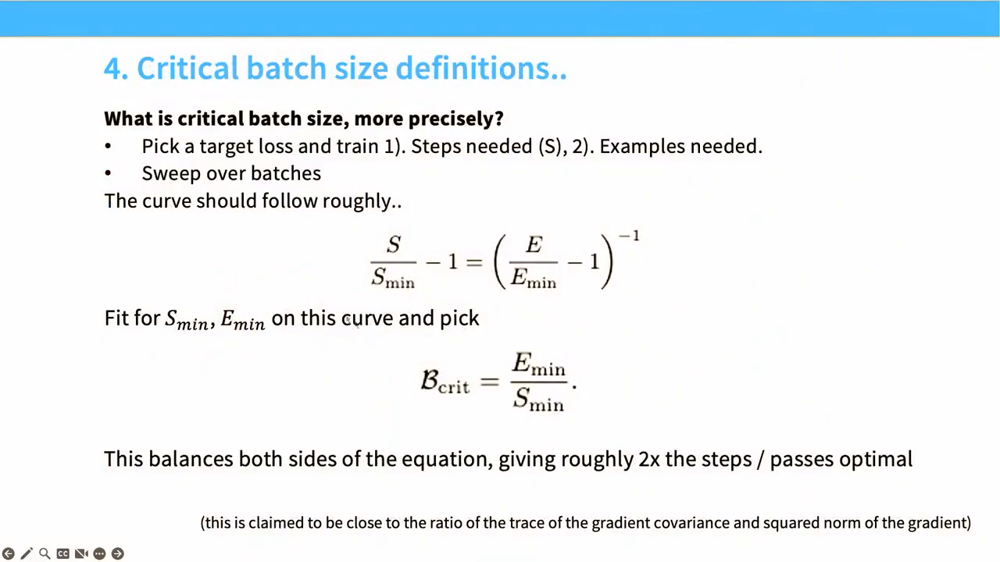
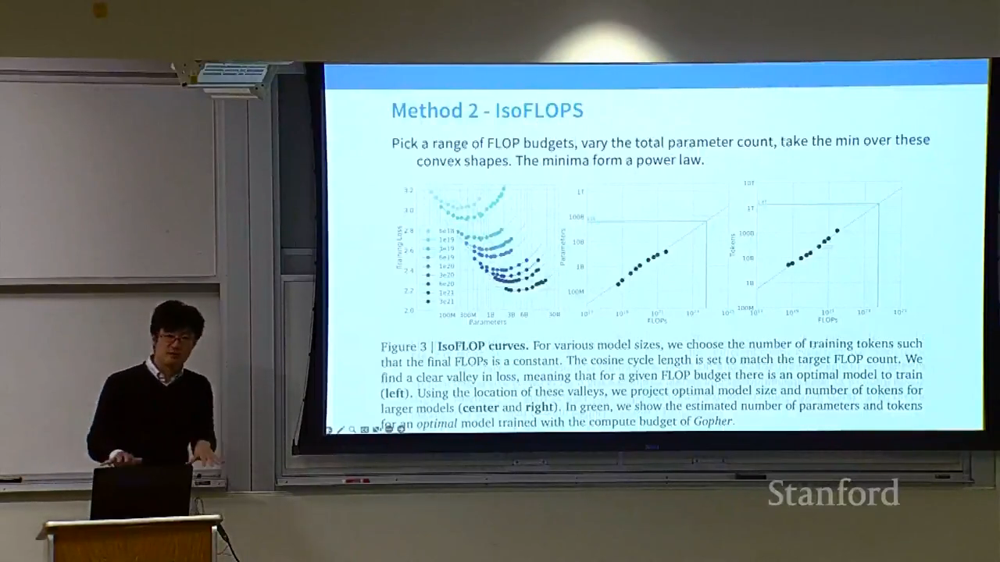

# Lecture 09：Scaling Laws I

> [!abstract] 本讲一句话
> Scaling law 不是“规模扩大后一切自然变好”的定律，而是一套用小规模、受控实验拟合经验响应曲线，再据此选择架构、数据量、模型大小和训练预算的工程方法；它的价值来自预测，也受制于口径、实验设计和外推不确定性。

## 来源与范围

- 课程：Stanford CS336 — Language Modeling from Scratch, Spring 2026
- 讲师：Tatsunori Hashimoto
- 上课日期：2026-04-27
- [课程视频](https://www.youtube.com/watch?v=Q15rhEWZPQ4)，时长 1:17:57
- [课程主页](https://cs336.stanford.edu/)
- [官方 Lecture 09 PDF](https://github.com/stanford-cs336/lectures/blob/main/lecture_09.pdf)
- 主要论文：[Hestness et al., 2017](https://arxiv.org/abs/1712.00409)、[Kaplan et al., 2020](https://arxiv.org/abs/2001.08361)、[Hoffmann et al., 2022](https://arxiv.org/abs/2203.15556)
- 本讲覆盖：data scaling、model/compute scaling、架构和超参数比较、critical batch size、联合 data-model scaling，以及 Chinchilla 的 compute-optimal 方法
- 本讲不覆盖：如何系统设计实验、估计误差条带和稳健外推；这些在 Lecture 11 深入

> [!warning] 来源边界
> 正文按公开视频完整英文字幕与 2026 官方 PDF 交叉核对，并用论文原文校正符号和适用条件。下表是可跳转的真实时间点；字幕用于定位和恢复课堂例子，不把自动识别文本当作经人工审校的逐字引语。

## 视频索引

| 视频位置 | 内容结构 | 对应笔记 |
| --- | --- | --- |
| [00:00](https://www.youtube.com/watch?v=Q15rhEWZPQ4&t=0s) | 为什么要做 scaling experiments | [[#1. 为什么需要 scaling law\|1]] |
| [04:32](https://www.youtube.com/watch?v=Q15rhEWZPQ4&t=272s) | Sample complexity 到经验 scaling 的历史 | [[#2. 什么是 scaling law\|2]] |
| [11:28](https://www.youtube.com/watch?v=Q15rhEWZPQ4&t=688s) | Data scaling 与幂律直觉 | [[#3. 从统计估计理解幂律\|3]] |
| [21:35](https://www.youtube.com/watch?v=Q15rhEWZPQ4&t=1295s) | Data mixture 与 repetition | [[#4. 数据不只是数量\|4]] |
| [25:20](https://www.youtube.com/watch?v=Q15rhEWZPQ4&t=1520s) | 架构、优化器、depth/width | [[#5. 用 scaling 进行模型工程\|5]] |
| [42:19](https://www.youtube.com/watch?v=Q15rhEWZPQ4&t=2539s) | Critical batch size | [[#6. Critical batch size\|6]] |
| [48:25](https://www.youtube.com/watch?v=Q15rhEWZPQ4&t=2905s) | Learning-rate scaling 与 μP | [[#5.3 Learning rate 与参数化\|5.3]] |
| [51:11](https://www.youtube.com/watch?v=Q15rhEWZPQ4&t=3071s) | Upstream loss 与 downstream metric | [[#7. 联合模型与数据 scaling\|7]] |
| [1:03:17](https://www.youtube.com/watch?v=Q15rhEWZPQ4&t=3797s) | Chinchilla method 1 | [[#8.2 Chinchilla 的三种方法\|8.2]] |
| [1:04:28](https://www.youtube.com/watch?v=Q15rhEWZPQ4&t=3868s) | IsoFLOP / method 2 | [[#8.2 Chinchilla 的三种方法\|8.2]] |
| [1:12:20](https://www.youtube.com/watch?v=Q15rhEWZPQ4&t=4340s) | Method 3 的重新取点与拟合 | [[#8.3 为什么结果会差很多\|8.3]] |
| [1:15:20](https://www.youtube.com/watch?v=Q15rhEWZPQ4&t=4520s) | Train-optimal 与 deployment-optimal | [[#9. 训练最优不等于部署最优\|9]] |

## 1. 为什么需要 scaling law

设想你有一万张 B200、一个月时间和一个目标：训练尽可能好的开放语言模型。

基础设施和数据准备完成后，仍有一组昂贵问题：

- 模型应该多大？
- 应该更深还是更宽？
- 多训练 token，还是增加参数？
- Transformer、MoE 或另一种架构，谁在目标规模更好？
- 小模型上的最佳 learning rate 和 batch size 能否直接搬到大模型？
- 在训练预算有限时，哪些实验值得跑？

直接在最大规模上做 grid search 几乎不可行。Scaling law 的核心承诺是：

> 在一组小规模、受控实验上识别稳定趋势，然后预测尚未训练的大规模配置。

这把“照抄已有模型”改写成一个可检验的流程：

```text
定义目标和资源口径
→ 设计小规模实验网格
→ 拟合响应曲线
→ 检查残差与外推稳定性
→ 在目标预算下优化 N、D 与超参数
→ 用少量较大规模实验校准
```

Scaling law 的目标不是解释神经网络的一切，而是降低昂贵决策的成本。

## 2. 什么是 scaling law

### 2.1 一个典型经验形式

设 $D$ 是训练数据量，$L(D)$ 是 held-out loss。常见形式是：

$$
L(D)
=
L_\infty
+
A D^{-\alpha}
$$

其中：

- $L_\infty$：在当前数据分布、模型族和训练方法下的 irreducible loss 或渐近项；
- $A$：曲线的垂直偏移；
- $\alpha>0$：数据扩展的收益速度；
- $D$：必须明确是 unique examples、tokens，还是包含 repetition 的训练 tokens。

若暂时忽略 $L_\infty$：

$$
\log L
=
\log A
-
\alpha \log D
$$

因此幂律在 log-log 图上近似直线：

- 斜率为 $-\alpha$；
- 截距为 $\log A$；
- 每把数据扩大相同比例，loss 的相对改善近似相同。

> [!warning] “直线”依赖变换和区间
> $L_\infty$ 不可忽略时，直接对原始 $L$ 取 log 不再是严格直线。有限范围内看似线性的曲线，也可能在更大范围发生 regime change。

### 2.2 经验律，不是物理定律

语言模型的 scaling curve 依赖：

- 数据分布和 tokenizer；
- 模型族与参数计数口径；
- 优化器、learning-rate schedule、batch size；
- 训练是否充分；
- 目标是 loss 还是下游准确率；
- 计算预算是否包含 embedding、attention、通信和失败运行。

因此更准确的句子是：

> 在固定实验协议和有限观测区间内，某个指标常能被简单函数良好近似。

算法改变会移动曲线，数据耗尽会弯折曲线，评测饱和会压平曲线。

### 2.3 Scaling curve 是 best-achievable envelope

同一数据量或算力预算下，不同超参数会产生许多训练曲线。我们通常关心的是：

$$
L^*(C)
=
\min_{h\in\mathcal H}
L(C,h)
$$

其中 $h$ 表示 architecture、optimizer、batch size、schedule 等选择。

这个 minimum 是**观测过的配置集合中的经验前沿**，不是对所有未来算法的数学下界。新算法完全可以把整条前沿下移。

## 3. 从统计估计理解幂律

### 3.1 均值估计

设：

$$
x_1,\ldots,x_n
\sim
\mathcal N(\mu,\sigma^2)
$$

样本均值：

$$
\hat{\mu}
=
\frac{1}{n}
\sum_{i=1}^n x_i
$$

均方误差为：

$$
\mathbb E[(\hat{\mu}-\mu)^2]
=
\frac{\sigma^2}{n}
$$

取对数：

$$
\log \operatorname{MSE}
=
-\log n
+
2\log\sigma
$$

这是指数为 $1$ 的精确 scaling law。它说明幂律并非语言模型特有：很多估计误差天然按样本量的多项式速度衰减。

### 3.2 非参数估计与 intrinsic dimension

灵活模型不是只估计有限维参数，而是逼近复杂函数。一个粗略的 $d$ 维空间分箱直觉会产生：

$$
\operatorname{Error}(n)
\propto
n^{-1/d}
$$

维度越高，指数越小，数据收益越慢。这启发了一种解释：

> 神经网络 data-scaling exponent 可能与数据的有效复杂度或 intrinsic dimension 有关。

但课程明确提醒：

- intrinsic dimension 的估计本身不稳定；
- 不同定义会给出不同数值；
- 这不是对语言模型 scaling exponent 的严密证明；
- 优化误差、模型偏差和数据异质性也同时存在。

因此它适合作为直觉，不应被当作已解决的理论。

## 4. 数据不只是数量

### 4.1 数据分布可以改变截距

如果两个训练分布产生近似相同斜率、不同截距：

$$
L_1(D)
=
A_1D^{-\alpha}+L_\infty
$$

$$
L_2(D)
=
A_2D^{-\alpha}+L_\infty
$$

较小的 $A$ 表示在相同 token 数下更高的数据效率。

课程引用 distribution-shift scaling 的经验观察：数据组成有时主要移动 offset，而没有大幅改变 slope。它暗示收集更相关、更多样的数据，可能相当于获得一个“有效数据乘数”。

但这个现象不是普适保证；分布变化也可能改变斜率和渐近误差。

### 4.2 小规模 mixture 选择可能失效

一个自然方案是：

1. 用多个小模型评估不同 data mixture；
2. 选择小模型 loss 最低的 mixture；
3. 在大模型上采用同一 mixture。

困难是不同 mixture 的曲线可能交叉：

- 小规模模型更受易学、高频数据帮助；
- 大规模模型更能利用复杂、稀有或高质量数据；
- target distribution 和训练分布的差异会改变排序。

因此“在最小模型上直接选 winner”不等于 scaling-aware mixture selection。

> [!note] 本节展示的实证结果
> 上面是一般风险边界；但视频引用的一项大规模 empirical study 中，小模型上最好的 mixture 放大后仍然最好，排序没有交叉。正确结论不是“small-scale mixture selection 一定失败”，而是：先检查 mixture-specific scaling curves；若排序稳定，小模型实验可以很有价值。

### 4.3 Repetition 不是新数据

若 unique token 数为 $U_D$，训练总 token 数为 $D$，重复次数约为：

$$
R_D
=
\frac{D}{U_D}
$$

有限数据被重复时，新增训练 token 的边际价值会下降。可以写成概念式：

$$
D_{\mathrm{eff}}
<
D
\quad
\text{when repetition is large}
$$

工程含义是：

- 不能只用“读了多少 token”比较数据效率；
- 应同时报告 unique tokens、epochs/repetition 和有效覆盖；
- 在不同训练规模下，质量阈值与 mixture 可能需要调整。

## 5. 用 scaling 进行模型工程

### 5.1 比较架构和优化器

假设两种方案分别拟合为：

$$
L_A(C)
=
a_A C^{-\gamma_A}+L_{\infty,A}
$$

$$
L_B(C)
=
a_B C^{-\gamma_B}+L_{\infty,B}
$$

小规模上 $A$ 更好，并不保证目标规模上仍然更好：

- 不同斜率可能导致曲线交叉；
- 一个方案可能有更好的 asymptote；
- 实现效率会改变 wall-clock，而不仅是理论 FLOPs。

所以比较 Transformer 与 LSTM、Adam 与 SGD、dense 与 MoE 时，不能只看单个预算点。

### 5.2 Depth、width 与“参数不等价”

课程展示的经验是：

- 从一层到两层常有显著收益；
- 更深后通常出现 diminishing returns；
- 在合理区间内，很多 aspect ratio 的影响小于总规模；
- embedding 参数、共享参数和 MoE inactive parameters 的价值不同。

这暴露了仅用 $N$ 表示模型大小的局限。

对 MoE 至少要区分：

- total parameters：存储和加载所需；
- active parameters per token：每 token 实际参与计算的部分；
- routing/communication cost：跨设备 all-to-all 和负载不均衡。

同样的参数量，不一定对应同样的 FLOPs、显存、带宽或统计效率。

### 5.3 Learning rate 与参数化

朴素扩大 width 时，激活和梯度尺度可能变化，最佳 learning rate 也会漂移。

μP（Maximal Update Parametrization）的目标之一，是让在小模型上调好的超参数更稳定地迁移到大模型。它提醒我们：

> 想让小规模实验预测大规模，模型参数化和初始化本身必须 scale-aware。

本讲只点到这个方向，不展开 μP 的完整规则。

课堂把学习率策略明确分成两条都可能成功的路线：

1. 接受最佳 learning rate 随 width 变化，用小规模 sweep 拟合并在大模型上降低 LR；
2. 使用 μP 一类参数化，让最佳 LR 尽量跨 scale 保持不变。

二者不能混用口径：先改变参数化，再套用旧的 LR scaling law，实验不再可比。

## 6. Critical batch size

Batch size 增大通常减少参数更新次数，但每步处理更多样本。最初增大 batch 能提高并行度并降低梯度噪声；超过某点后，收益递减。

课程用固定 target loss 的实验来定义 trade-off：

- $S(B)$：达到目标 loss 所需的 optimizer steps；
- $E(B)$：达到目标 loss 所需的 examples/tokens；
- 小 batch 通常 steps 较多，但数据利用率高；
- 大 batch 通常 steps 较少，但需要更多 examples。

Critical batch size 是在两种效率之间取得平衡的尺度，不是 GPU 能装下的最大 batch。

课堂给出的精确定义是先扫 batch，拟合达到固定 target loss 所需的最少 steps $S_{\min}$ 与最少 examples $E_{\min}$，再取：

$$
B_{\text{crit}}=\frac{E_{\min}}{S_{\min}}
$$

在这个平衡点附近，steps 与 examples 两侧都大约付出各自理论最优值的 $2\times$。讲师还提到它可由 gradient covariance trace 与 squared gradient norm 的比值近似估计，但没有把该估计当作本节的主要工具。



> 视频关键帧：[45:15](https://www.youtube.com/watch?v=Q15rhEWZPQ4&t=2715s)。Critical batch 是优化统计量，不是 HBM capacity 上限，也不自动等于 wall-clock 最优 batch。

它还会随训练阶段变化：

- 目标 loss 越低，critical batch 往往越大；
- 梯度噪声统计会变化；
- data parallel 通信、microbatch 和 sequence length 会改变系统最优点。

> [!tip] Statistical optimum 与 system optimum
> 统计上仍有收益的 batch size，可能因通信和小矩阵效率而 wall-clock 很差；硬件吞吐最高的 batch size，也可能浪费更多训练 token。

## 7. 联合模型与数据 scaling

### 7.1 Additive joint law

一种常见联合形式是：

$$
L(N,D)
=
L_\infty
+
A N^{-\alpha}
+
B D^{-\beta}
$$

其中：

- $N$：模型参数量；
- $D$：训练 token 数；
- $AN^{-\alpha}$：模型容量不足带来的项；
- $BD^{-\beta}$：数据不足带来的项。

它表达了两个明显边界：

- 固定很小的 $N$，不断增加 $D$ 最终收益很小；
- 固定很小的 $D$，不断增加 $N$ 也会浪费容量。

### 7.2 与训练算力约束结合

Dense Transformer 的常用训练近似：

$$
C
\approx
6ND
$$

固定 $C$ 后：

$$
D
=
\frac{C}{6N}
$$

代回联合 loss：

$$
L(N\mid C)
=
L_\infty
+
A N^{-\alpha}
+
B\left(\frac{6N}{C}\right)^\beta
$$

最优点满足“继续增加模型”和“继续增加数据”的边际收益平衡。求导可得比例关系：

$$
N_{\mathrm{opt}}
\propto
C^{\frac{\beta}{\alpha+\beta}}
$$

$$
D_{\mathrm{opt}}
\propto
C^{\frac{\alpha}{\alpha+\beta}}
$$

若 $\alpha\approx\beta$，则二者都近似按 $C^{1/2}$ 增长，tokens per parameter 近似保持常数。

这不是预先规定的规则，而是**拟合指数和 compute model 共同推导出的结果**。

## 8. Compute-optimal training

### 8.1 Kaplan 与 Chinchilla 的差异

Kaplan et al. 的早期结果大致给出：

$$
N_{\mathrm{opt}}
\propto
C^{0.73},
\qquad
D_{\mathrm{opt}}
\propto
C^{0.27}
$$

这意味着预算增加时主要扩大模型，tokens per parameter 会下降。

Hoffmann et al.（Chinchilla）得到更接近：

$$
N_{\mathrm{opt}}
\propto
C^{0.5},
\qquad
D_{\mathrm{opt}}
\propto
C^{0.5}
$$

即模型和训练 token 近似等比例扩大，经典经验值约为 20 training tokens per parameter。

> [!warning] 20 tokens/parameter 不是常数定律
> 它来自特定模型、数据和训练协议下的 compute-optimal 拟合。现代模型更长训练，往往是因为数据、推理成本和部署需求改变了目标函数。

### 8.2 Chinchilla 的三种方法

#### 方法 1：training-curve envelope

收集不同模型的完整训练曲线。在每个 compute budget 上取所有运行中的最低 loss，再对这些 minima 拟合：

$$
L_{\min}(C)
\approx
aC^{-\gamma}+L_\infty
$$

优点：直接使用训练轨迹。

风险：不同曲线的优化超参数和观测密度会影响 envelope。

#### 方法 2：IsoFLOPs

为多个固定 compute budget $C_i$，扫描模型大小 $N$，并令：

$$
D
=
\frac{C_i}{6N}
$$

每个预算下得到一条近似 U-shaped curve：

$$
N
\mapsto
L(N,C_i/(6N))
$$

曲线最低点给出 $(N^*_{i},D^*_{i})$，再拟合：

$$
N^*(C)
\propto
C^a,
\qquad
D^*(C)
\propto
C^b
$$

伪代码：

```python
for compute_budget in budgets:
    results = []
    for num_params in model_sizes:
        num_tokens = compute_budget / (6 * num_params)
        loss = train_and_evaluate(num_params, num_tokens)
        results.append((num_params, num_tokens, loss))
    keep_minimum(results)

fit_power_law(minima)
```

优点：直观、每个预算内是相对比较，常能得到干净的 convex profile。

风险：grid 太稀会错过 minimum；小模型的 warmup、batch 和 schedule 不合理会扭曲低预算点。



> 视频关键帧：[1:04:30](https://www.youtube.com/watch?v=Q15rhEWZPQ4&t=3870s)。每条曲线的最低点给出该 compute budget 下的最优 $N/D$，再对 minima 做 scaling fit。

#### 方法 3：联合 parametric fit

在 $(N,D)$ 网格上训练，直接拟合：

$$
L(N,D)
=
L_\infty
+
A N^{-\alpha}
+
B D^{-\beta}
$$

优点：能利用所有数据并直接推导 optimum。

风险：对函数形式、异常值、参数计数和优化误差更敏感。课程指出原始 Chinchilla 方法 3 的数据与拟合后来受到重新分析；这也是为什么不能只记最终指数。

### 8.3 为什么结果会差很多

课件总结了几个口径和实验因素：

- Kaplan 对 last-layer/embedding 参数采用了不同计数；
- 很小 compute budget 下 warmup 过长；
- optimizer、batch 和 learning-rate decay 的调优方式不同；
- 小的 nonlinearities 在远距离外推后会造成明显差异。

视频还补了一个很关键的取证过程：Epoch AI 从论文图中重新取点并重拟合 method 3，发现原拟合存在 underfit；重拟合后又接近 $D/N\approx20$，从而缓解了 method 3 与 methods 1/2 的矛盾。这说明 scaling-law 复现不仅是重写公式，还包括核对原始点、参数计数和拟合质量。

这说明 scaling 的最大风险之一不是公式本身，而是**测量协议不一致**。

## 9. 训练最优不等于部署最优

Chinchilla 解决的是：

$$
\min_{N,D} L(N,D)
\quad
\text{s.t.}
\quad
C_{\mathrm{train}}\le B
$$

但真实产品可能更关心：

$$
C_{\mathrm{total}}
=
C_{\mathrm{train}}
+
Q\cdot C_{\mathrm{inference}}(N)
$$

其中 $Q$ 是生命周期内推理 token 数或请求量。

若模型会被大量调用：

- 较小模型推理更便宜；
- 可以用更多训练 tokens 把小模型充分训练；
- upfront training cost 增加，却可能降低长期 serving cost。

因此 Llama、Mistral 等模型常比经典 Chinchilla 比例训练得更久。所谓 “over-training” 是相对于训练算力最优点，不一定相对于总生命周期成本过度。

## 10. AI Infra 视角

### 10.1 Compute

- Pilot runs 也消耗算力，但目标是避免主训练的数量级错误；
- FLOPs 口径必须稳定，尤其是 embedding、attention、MoE active parameters；
- 理论 $6ND$ 不能直接代替 profiler 和实际 token throughput。

### 10.2 Memory

- 改变 $N$ 会改变参数、梯度和 optimizer state；
- 改变 $D$ 主要改变训练时长，而非单步持久显存；
- 为保持固定 compute 而缩小 $N$、增大 $D$，可能让单卡部署更容易。

### 10.3 Communication

- 更大 dense model 往往需要更多 model parallelism；
- MoE 可能降低 active FLOPs，却增加 all-to-all；
- 因此 compute-optimal 配置不一定是 cluster 上的 wall-clock-optimal 配置。

### 10.4 Runtime

应区分至少四个目标：

| 目标 | 优化变量 |
| --- | --- |
| 最低 training loss / FLOP | $N,D$ 与算法 |
| 最短训练 wall-clock | 并行效率、MFU、故障率 |
| 最低推理成本 | 模型大小、量化、batching |
| 最低生命周期成本 | 训练与未来请求量的联合目标 |

Scaling experiment 的日志至少应保存：

- seed、代码版本、数据版本；
- $N$ 的计数规则和 $D$ 的 token 规则；
- theoretical/actual FLOPs；
- optimizer、LR、warmup、decay、batch；
- loss curve，而不只是最终点；
- wall-clock、hardware、MFU 和失败运行。

## 11. 我的推导与易错点

### 11.1 外推会放大斜率误差

若拟合为：

$$
\log L
=
a-\alpha\log D
$$

斜率误差为 $\delta\alpha$，从观测尺度 $D_0$ 外推到 $D_1$，预测 log-loss 的误差近似为：

$$
\delta\log L
\approx
-\delta\alpha
\log\frac{D_1}{D_0}
$$

外推倍率越大，同样微小的 slope error 越危险。

### 11.2 Loss 的小误差可能改变配置选择

Scaling law 常用于比较非常接近的候选配置。即使绝对 loss 误差很小，只要两个候选的预测差更小，winner 就不稳定。

所以应报告：

- 参数置信区间；
- $N_{\mathrm{opt}}$、$D_{\mathrm{opt}}$ 的区间；
- 多个合理函数形式下结论是否一致；
- 目标预算附近候选配置的 regret，而不只报单个最优点。

### 11.3 下游指标比 LM loss 更难拟合

Cross-entropy 是密集、连续指标，每个 token 都贡献信号。Benchmark accuracy 往往：

- 样本少；
- 离散且有 ceiling/floor；
- 对 prompt、decoding 和 contamination 敏感；
- 能力可能在阈值附近呈非线性变化。

因此 pretraining loss 的平滑 scaling 不能自动推出某项能力同样平滑。

### 11.4 常见口径错误

> [!danger] 易错点
> - 把 log-linear 说成普通坐标下线性；
> - 用单一小模型排序代替拟合；
> - 把 total parameters 与 active parameters 混用；
> - 把训练 token 与 unique token 混用；
> - 在不同 runs 中改变 tokenizer 或验证集；
> - 忽略 warmup、batch 和未收敛造成的 optimization error；
> - 把 best-known empirical envelope 说成不可突破的理论下界；
> - 把 training-compute optimum 直接当作产品 optimum。

## 12. 本讲结论

1. Language-model loss 在受控范围内常随 data、parameters 和 compute 呈幂律，因而能在 log-log 图上用简单曲线描述。
2. 幂律是经验规律，不是跨数据、架构和训练协议不变的自然定律。
3. Scaling law 的核心用途是预测：用小规模实验比较架构、优化器和资源分配。
4. Data quantity、composition、uniqueness 和 repetition 必须分开核算。
5. 联合 loss $L(N,D)$ 与 compute constraint $C\approx6ND$ 可以推导 compute-optimal 的 $N$、$D$。
6. Chinchilla 的关键贡献不只是“20 tokens/parameter”，而是三种实验方法及其对 Kaplan 结果的修正。
7. 计数口径、warmup 和拟合方法的小差异会被远距离外推放大。
8. 训练 FLOP 最优通常不等于包含大量推理请求后的生命周期成本最优。

## 13. 自测问题

1. 为什么幂律在 log-log 图上是直线？加入 $L_\infty$ 后还严格成立吗？

    **面试回答：** 若 $L=AD^{-\alpha}$，取对数得到 $\log L=\log A-\alpha\log D$，所以 log-log 图是斜率 $-\alpha$ 的直线。加入不可忽略的 $L_\infty$ 后，严格线性的是 $\log(L-L_\infty)$ 对 $\log D$，直接画 $\log L$ 会在接近渐近项时变平；有限区间的近似直线不证明无限外推有效。

2. 均值估计的 MSE scaling exponent 是多少？它为什么不能直接解释语言模型的 exponent？

    **面试回答：** 独立同分布、有限方差样本的均值是无偏估计，MSE=Var(x)/n，所以衰减指数为 1；若看 RMSE 则是 1/2。语言模型还受函数逼近偏差、模型容量、优化误差、相关异质数据和 loss 定义影响，不能把这个简单估计问题的指数直接套到 LM scaling。

3. 为什么 small-scale winner 可能不是 large-scale winner？

    **面试回答：** 不同方案可能有不同 scaling 斜率、截距和渐近 loss，小规模优势会随着预算增加被更陡的下降曲线反超。规模也会改变训练稳定性、最优超参数和硬件利用率，因此应比较多个预算点并外推到目标区间，不能用一次小模型实验确定大模型赢家。

4. total parameters、non-embedding parameters 和 active parameters 分别适合核算什么？

    **面试回答：** Total parameters 适合核算完整权重、checkpoint 和训练状态容量；non-embedding parameters 常用于统一 dense 主干的 scaling 与粗略 6ND 计算口径。MoE 的 active parameters/token 更接近逐 token 的主要参数矩阵乘成本；三者都不能单独涵盖 attention mixing、router、通信和参数共享等额外因素。

5. Critical batch size 与显存能容纳的最大 batch 有什么区别？

    **面试回答：** Critical batch 是达到某个目标 loss 时，减少更新步数与增加样本消耗之间的统计效率转折点，正文用 B_crit=E_min/S_min 定义。最大可容纳 batch 是硬件显存约束，受 dtype、长度、checkpointing 和分片影响；两者可相差很大，也都不必等于 wall-clock 最优 batch。

6. 从 $L(N,D)=L_\infty+AN^{-\alpha}+BD^{-\beta}$ 和 $C=6ND$ 推导 $N_{\mathrm{opt}}$ 的指数。

    **面试回答：** 代入 $D=C/(6N)$，得到 $L=L_\infty+AN^{-\alpha}+B(6N/C)^\beta$。令对 $N$ 的导数为零：$\alpha AN^{-\alpha}=\beta B(6N/C)^\beta$，于是 $N_{\mathrm{opt}}=[\alpha A/(\beta B\,6^\beta)]^{1/(\alpha+\beta)}C^{\beta/(\alpha+\beta)}$，故指数为 $\beta/(\alpha+\beta)$，$D_{\mathrm{opt}}$ 的指数为 $\alpha/(\alpha+\beta)$。该结果假设正系数、连续可选规模和 $6ND$ 成本模型成立。

7. Chinchilla 的三种拟合方法分别使用什么实验数据？

    **面试回答：** 方法一使用不同模型大小与训练时长的完整 loss-compute 轨迹，在各预算处取最优包络；方法二在多个固定 FLOPs 预算内扫描 N 与对应 D，利用每条 IsoFLOPs 曲线的最低点拟合 N_opt、D_opt。方法三使用多组 (N,D,loss) 终点，直接拟合联合参数化 loss，再解析求最优分配。

8. 为什么 low-compute points 上的 warmup 设置会改变外推结果？

    **面试回答：** 低 compute run 的总步数少，若沿用固定且过长的 warmup，相当于让小模型大部分预算都处在过低学习率区间，测到的是 schedule 不合适造成的优化误差。它会抬高或扭曲低预算点、移动 IsoFLOPs 最低点，进而改变拟合斜率和远端预测，应按训练长度合理调节并检查收敛。

9. 为什么固定训练 compute 的最优配置可能不是固定总生命周期成本的最优配置？

    **面试回答：** 训练最优只在 C_train≈6ND 的预算内分配参数与数据，生命周期目标还包括累计请求量 Q 带来的 Q·C_inference(N)。高调用量下，较小模型每次推理更省资源，值得用更多训练 token 提升其能力，因此“更小、训练更久”可能降低总成本；具体最优还取决于质量、延迟和数据约束。

10. 如果 slope 的估计误差不变，外推 10 倍和外推 10,000 倍哪个风险更大？为什么？

    **面试回答：** 外推 10,000 倍风险更大，因为同样斜率误差 δα 引起的 log-loss 误差约为 −δα·log(D₁/D₀)。log 10,000=4 log 10，所以仅这一误差项就是外推 10 倍时的 4 倍，原始 loss 上表现为乘法误差；更远外推还更容易遇到数据耗尽或训练机制改变等 regime shift。


## 参考资料

- [Stanford CS336 Spring 2026](https://cs336.stanford.edu/)
- [Official Lecture 09 PDF](https://github.com/stanford-cs336/lectures/blob/main/lecture_09.pdf)
- [Hestness et al., Deep Learning Scaling is Predictable, Empirically](https://arxiv.org/abs/1712.00409)
- [Kaplan et al., Scaling Laws for Neural Language Models](https://arxiv.org/abs/2001.08361)
- [Rosenfeld et al., A Constructive Prediction of the Generalization Error Across Scales](https://arxiv.org/abs/1909.12673)
- [Hoffmann et al., Training Compute-Optimal Large Language Models](https://arxiv.org/abs/2203.15556)
- [Yang et al., Tensor Programs V: Tuning Large Neural Networks via Zero-Shot Hyperparameter Transfer](https://arxiv.org/abs/2203.03466)
- [Besiroglu et al., Chinchilla Scaling: A Replication Attempt](https://arxiv.org/abs/2404.10102)
