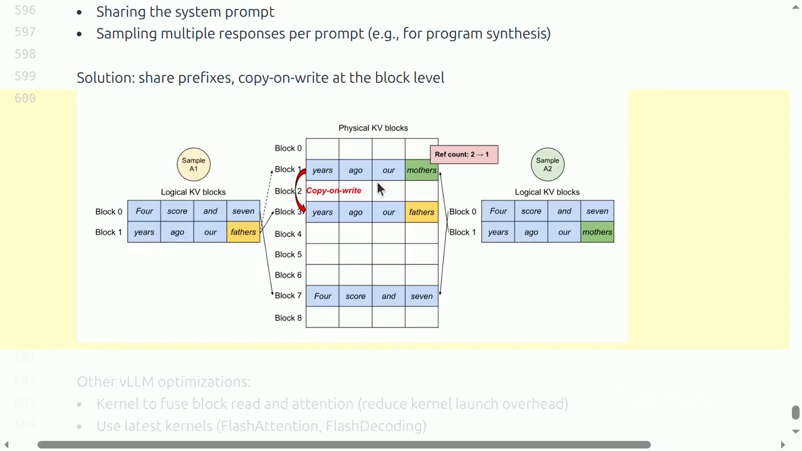
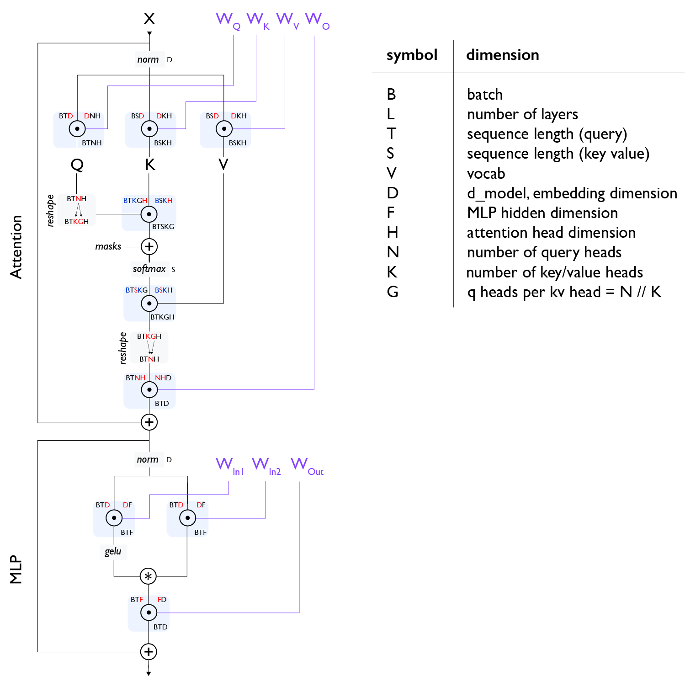
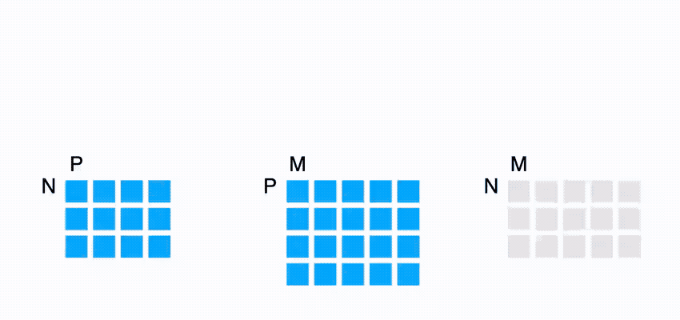
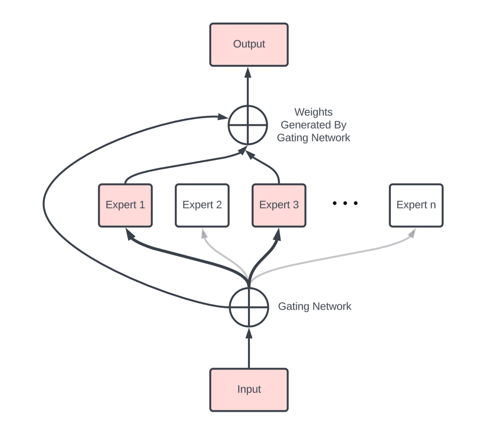
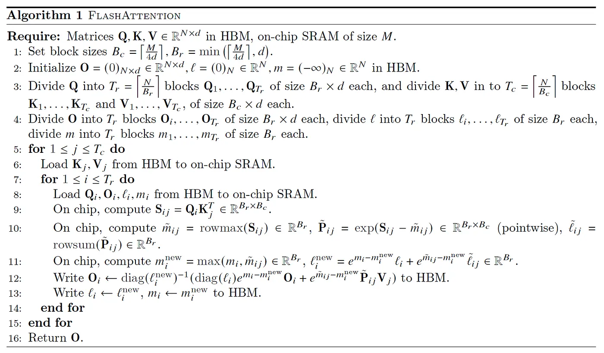

# Lecture 10：Inference

> [!abstract] 本讲一句话
> LLM inference 的核心不只是“少算一点”，而是针对 prefill 可并行、decode 严格自回归且常受显存带宽限制的 workload，联合优化 KV cache、模型表示、batch 调度和动态内存管理，同时分别守住 TTFT、单请求延迟与总体吞吐。

## 来源与范围

- 课程：Stanford CS336 — Language Modeling from Scratch, Spring 2026
- 讲师：Percy Liang
- 上课日期：2026-04-29
- [课程视频](https://www.youtube.com/watch?v=EfM546A79aM)，时长 1:25:30
- [课程主页](https://cs336.stanford.edu/)
- [官方 Lecture 10 可执行讲义](https://cs336.stanford.edu/lectures/?trace=lecture_10)
- 延伸教材：[How to Scale Your Model — Inference](https://jax-ml.github.io/scaling-book/inference/)
- 本次专题拓展：[All the Transformer Math You Need to Know](https://jax-ml.github.io/scaling-book/transformers/)
- 本讲覆盖：prefill/decode、arithmetic intensity、KV cache、latency/throughput、GQA/MLA/CLA/local attention、quantization、pruning/distillation、speculative sampling、continuous batching 和 PagedAttention
- 本讲不展开：tensor/pipeline parallel serving 的完整通信模型、admission control、prefix-aware routing 和多租户隔离

> [!warning] 来源边界
> 正文按公开视频完整英文字幕与官方 2026 可执行讲义交叉核对；论文细节以原论文为边界。下表是字幕轨定位出的真实时间点。讲义中的理想性能模型忽略 kernel、通信、cache hierarchy 和调度开销，正文会明确这些假设；生产 SLO 和容量规划属于笔记拓展。

## 视频索引

| 视频位置 | 内容结构 | 对应笔记 |
| --- | --- | --- |
| [00:00](https://www.youtube.com/watch?v=EfM546A79aM&t=0s) | 推理成本与 agent workload | [[#1. 为什么 inference 是独立问题\|1]] |
| [04:23](https://www.youtube.com/watch?v=EfM546A79aM&t=263s) | vLLM、SGLang、TensorRT-LLM、llama.cpp | [[#1. 为什么 inference 是独立问题\|1]] |
| [05:13](https://www.youtube.com/watch?v=EfM546A79aM&t=313s) | TTFT、ITL、throughput | [[#2. “快”至少有三个指标\|2]] |
| [14:23](https://www.youtube.com/watch?v=EfM546A79aM&t=863s) | Arithmetic intensity | [[#3. 用 arithmetic intensity 分析 inference\|3]] |
| [20:44](https://www.youtube.com/watch?v=EfM546A79aM&t=1244s) | 自回归生成与 KV cache | [[#4. 两阶段 inference\|4]] |
| [35:07](https://www.youtube.com/watch?v=EfM546A79aM&t=2107s) | Llama 2 13B/H100 latency–throughput 算例 | [[#6. Batch size 的双刃剑\|6]] |
| [45:47](https://www.youtube.com/watch?v=EfM546A79aM&t=2747s) | GQA/MLA/CLA/local attention | [[#7. 从架构上缩小 KV cache\|7]] |
| [64:29](https://www.youtube.com/watch?v=EfM546A79aM&t=3869s) | Quantization 与 AWQ | [[#8. 压缩模型与表示\|8]] |
| [67:39](https://www.youtube.com/watch?v=EfM546A79aM&t=4059s) | Pruning 与 distillation | [[#8.2 Pruning + Distillation\|8.2]] |
| [71:43](https://www.youtube.com/watch?v=EfM546A79aM&t=4303s) | Speculative decoding | [[#9. Speculative sampling\|9]] |
| [77:09](https://www.youtube.com/watch?v=EfM546A79aM&t=4629s) | Dynamic requests 与 continuous batching | [[#10. 动态 serving workload\|10]] |
| [79:34](https://www.youtube.com/watch?v=EfM546A79aM&t=4774s) | PagedAttention | [[#10.3 PagedAttention\|10.3]] |
| [83:28](https://www.youtube.com/watch?v=EfM546A79aM&t=5008s) | 其他 kernel/runtime 优化 | [[#11. 一个端到端 serving 心智模型\|11]] |

## 视频补充：课堂中的定量例子与判断

- 课堂以 2026-04-29 的数量级作动机：推理 token 消耗在数天内就可能接近一次大型训练；agent 内部 reasoning/tool loop 又缺少人类阅读速度这一自然上限。重点是生命周期成本，而不是背某个公司的瞬时数字。
- 当时的软件判断是 vLLM 可作为常用默认、SGLang 偏 agentic workload、TensorRT-LLM 更高度特化、llama.cpp 面向 CPU/local；这是课堂时点快照，不是长期排名。
- 如果每生成一个 token 都重算整个 prefix，随生成长度累积会出现近似 $O(T^3)$ 的总工作；KV cache 把重复 prefix computation 换成持续增长的 memory footprint。
- Decode MLP 的 arithmetic intensity 可随并发 batch 增长；decode attention 的强度通常仍小于 1，不能仅靠普通 batching 消除 memory-bound。这解释了为什么优化 KV 表示与调度比“再调大 batch”更根本。
- 课堂 Llama 2 13B/H100 算例用“公交车”类比 batch：载客更多提高总体吞吐，却可能增加单请求等待；TTFT 主要受 prefill/queue 影响，decode 通常需要更大的 batch 才能提高权重复用。
- AWQ 的直觉是保留与少数异常大 activation channels 对应的权重为较高精度，其余权重更激进量化；pruning 后还要用 continued training/distillation “healing”。
- 展示的 speculative decoding 实验中，draft 长度约 3–4 tokens 是 sweet spot；draft 越长并不保证越快。



> 视频关键帧：[1:22:55](https://www.youtube.com/watch?v=EfM546A79aM&t=4975s)。Logical KV blocks 映射到 physical blocks；共享 prefix 用 ref count，发生分叉时才 copy-on-write，避免为最大长度 1024 等上限连续预分配整块 KV 空间。

## 1. 为什么 inference 是独立问题

Inference 出现在：

- Chatbot、code completion、agent；
- 离线 batch data processing；
- 模型 evaluation；
- RL 训练中的 rollout；
- 生成 synthetic data。

训练通常只发生一次，inference 会在模型生命周期内重复很多次。因此总成本更接近：

$$
C_{\mathrm{life}}
=
C_{\mathrm{train}}
+
\sum_{r=1}^{R}
C_{\mathrm{infer}}(r)
$$

Agent workload 尤其重要：用户只看到简短结果，内部却可能生成长 reasoning trace、调用工具并反复重试。**Generated tokens 直接对应计算与服务成本。**

训练与推理的 workload 不同：

| 维度 | Training | Autoregressive inference |
| --- | --- | --- |
| Token 可见性 | 整段序列已知 | 未来 token 未知 |
| 序列并行 | 可对所有 token 并行 | decode 必须逐 token |
| Batch | 常规则、固定 | 动态到达、长度不同 |
| 持久状态 | parameters、optimizer、activations | parameters、KV cache |
| 常见瓶颈 | compute、communication | decode memory bandwidth、capacity |

## 2. “快”至少有三个指标

### 2.1 Time to First Token

TTFT 是请求到达后，第一个输出 token 出现前的时间：

$$
\operatorname{TTFT}
=
t_{\mathrm{queue}}
+
t_{\mathrm{prefill}}
+
t_{\mathrm{schedule}}
$$

它影响交互系统的响应感，主要与排队和 prompt prefill 有关。

### 2.2 Inter-token latency

也称 time per output token（TPOT）：

$$
\operatorname{TPOT}
\approx
\frac{t_{\mathrm{decode}}}{T_{\mathrm{output}}}
$$

用户感受到的输出速度常以 seconds/token 或 tokens/second/request 表示。

### 2.3 Throughput

服务整体吞吐：

$$
\operatorname{Throughput}
=
\frac{\text{all generated tokens}}
{\text{wall-clock second}}
$$

它关注多请求资源利用率。

> [!warning] 三者不能互换
> 等更久以凑大 batch 可以提高 throughput，却恶化 TTFT；增加 batch 也可能让每轮 decode 更慢，从而恶化 TPOT。

此外生产系统还关心：

- P50/P95/P99 latency；
- requests/second 与 tokens/second；
- goodput：满足 SLO 的有效吞吐；
- GPU-hour/token、energy/token；
- cache hit rate、preemption 和失败率。

## 3. 用 arithmetic intensity 分析 inference

### 3.1 符号

沿用官方讲义：

| 符号 | 含义 |
| --- | --- |
| $B$ | 同时处理的 sequences |
| $S$ | 已有 prefix/context tokens |
| $T$ | 本次并行计算的 query/output positions |
| $D$ | model dimension |
| $F$ | MLP hidden dimension，常约 $4D$ |
| $N$ | query heads |
| $K$ | KV heads |
| $H$ | head dimension，$D=NH$ |
| $L$ | layers |
| $V$ | vocabulary size |

### 3.2 一个矩阵乘法

对 BF16：

$$
X_{B\times D}
W_{D\times F}
\rightarrow
Y_{B\times F}
$$

FLOPs：

$$
2BDF
$$

理想 HBM bytes：

$$
2BD+2DF+2BF
$$

Arithmetic intensity：

$$
I
=
\frac{2BDF}
{2BD+2DF+2BF}
$$

若 $B\ll D,F$，权重读取占主导：

$$
I
\approx
B
\quad
\text{FLOP/byte}
$$

H100 的课堂示例使用：

$$
\frac{989\ \text{TFLOP/s}}
{3.35\ \text{TB/s}}
\approx
295\ \text{FLOP/byte}
$$

因此小 batch matrix-vector-like workload 远低于硬件 knee，常为 memory-bound。

> [!note] Roofline 只是上界
> 实际性能还受 Tensor Core shape、kernel launch、cache、fusion、quantization kernel、并行通信和 scheduler 影响。

## 4. 两阶段 inference

### 4.1 为什么需要 KV cache

若每生成一个 token 都重新对完整 prefix 做 forward，attention 会重复计算旧 token 的 K/V。

不缓存时，单次长度 $t$ 的 forward attention 约为 $O(t^2)$，连续生成到 $T$ 的总和为：

$$
\sum_{t=1}^{T} O(t^2)
=
O(T^3)
$$

KV cache 保存每层历史 token 的 key/value，使旧位置无需重复投影。

### 4.2 Prefill

Prefill 一次处理 prompt 的多个 token：

- prompt tokens 已知；
- 可在 sequence 维并行；
- 矩阵更大，通常更容易 compute-bound；
- 建立后续 decode 所需的 KV cache；
- 决定 TTFT 的主要计算部分。

### 4.3 Decode

每步只产生一个新 token：

- $T=1$；
- 下一步依赖上一步采样结果；
- 每层需要读权重和历史 KV；
- 小 batch 时权重没有被充分复用；
- 常受 HBM bandwidth 限制。

这不是说 decode “FLOPs 很大”，而是每搬一个 byte 做的 FLOPs 太少。

## 5. MLP 与 Attention 的 inference 账本

### 5.1 Gated MLP

官方讲义按三次 projection 核算：

$$
\text{FLOPs}_{\mathrm{MLP}}
=
6BTDF
$$

BF16 bytes：

$$
\text{Bytes}_{\mathrm{MLP}}
=
4BTD
+
4BTF
+
6DF
$$

若 $BT\ll D,F$，权重读取主导：

$$
I_{\mathrm{MLP}}
\approx
BT
$$

于是：

- Prefill：$BT$ 大，易提高 arithmetic intensity；
- Decode：$T=1$，intensity 约为 $B$，需要并发请求摊薄权重读取。

### 5.2 FlashAttention 视角下的 Attention

先采用 MHA 简化口径 $K=N,G=1,NH=D$，考虑 $T$ 个 query positions 读取 $S$ 个历史 K/V：

$$
\text{FLOPs}_{\mathrm{attn}}
=
4BSTD
$$

BF16 bytes：

$$
\text{Bytes}_{\mathrm{attn}}
=
4BSD
+
4BTD
$$

所以：

$$
I_{\mathrm{attn}}
=
\frac{ST}{S+T}
$$

Prefill 取 $T=S$：

$$
I_{\mathrm{prefill,attn}}
=
\frac{S}{2}
$$

Decode 取 $T=1$：

$$
I_{\mathrm{decode,attn}}
=
\frac{S}{S+1}
<
1
$$

Attention decode 几乎是极端 memory-bound。

GQA/MQA 时更一般的结果是 $I_{\text{decode}}\rightarrow G=N/K$，见 [[#13.7 Self-attention arithmetic intensity：prefill 与 decode 的统一式|13.7]]；共享 KV 能增加复用，但通常仍远低于 compute roofline。

为什么增加 $B$ 不提升这个理想 intensity？

- MLP 权重由整个 batch 共享；
- 每条 sequence 的 KV cache 不同；
- batch 增加时，KV bytes 与 FLOPs 同比例增长。

## 6. Batch size 的双刃剑

### 6.1 KV cache 大小

每条 sequence、每层、每 token 保存 K 和 V。BF16 下：

$$
M_{\mathrm{KV,seq}}
=
S
\times K
\times H
\times L
\times 2_{\mathrm{K,V}}
\times 2_{\mathrm{bytes}}
$$

Batch $B$：

$$
M_{\mathrm{KV,total}}
=
4BSKHL
$$

注意 cache 容量随：

- batch size 线性增长；
- context length 线性增长；
- layers 线性增长；
- KV heads 和 head dimension 线性增长。

### 6.2 理想 memory-bound 模型

若每 decode step 需要读参数和当前 KV：

$$
t_{\mathrm{step}}
\gtrsim
\frac{M_{\mathrm{params}}+M_{\mathrm{KV}}}
\text{HBM bandwidth}
$$

一次并行生成 $B$ 个 token：

$$
\operatorname{throughput}
\lesssim
\frac{B}{t_{\mathrm{step}}}
$$

增大 batch：

- 好处：参数读取被更多请求复用，throughput 提高；
- 代价：KV cache 增大，step latency 和 capacity 压力增加；
- 最终：KV bytes 主导后，throughput 收益递减。

多复制几份模型可以线性增加 capacity，且不改变单副本 latency；模型切分则需要额外通信。

### 6.3 Prefill 和 decode 不应采用同一策略

- Prefill：小 batch 往往更有利于 TTFT；
- Decode：较大 batch 能摊薄权重读取；
- 长 prompt prefill 可能抢占 decode，引发 head-of-line blocking；
- 实际 scheduler 需要同时满足交互延迟和吞吐 SLO。

## 7. 从架构上缩小 KV cache

### 7.1 GQA / MQA

标准 MHA：

$$
K=N
$$

MQA：

$$
K=1
$$

GQA：

$$
1<K<N
$$

$N$ 个 query heads 共享 $K$ 组 K/V，KV cache 相对 MHA 缩小：

$$
\frac{N}{K}
\text{ times}
$$

这能降低 capacity 和 bandwidth，但需要检查质量变化。

### 7.2 Multi-head Latent Attention

普通 attention 缓存投影后的 K/V。MLA 先将 hidden state 压缩：

$$
c
=
W_c h
$$

缓存低维 $c$，使用时再上投影得到 K/V。若 latent dimension $C\ll NH$，cache 大幅缩小。

RoPE 与这种 factorization 的组合需要额外设计；不能只看压缩维度而忽略位置编码分支。

### 7.3 Cross-layer Attention

CLA 在 layer 之间共享 K/V，类似 GQA 在 head 之间共享。

收益：减少按 $L$ 线性增长的 cache。

代价：层间表示自由度减少，且实现和并行布局会变化。

### 7.4 Local / Sliding-window Attention

只保留最近 $W$ 个 token：

$$
M_{\mathrm{KV}}
=
O(BWLKH)
$$

而非随完整 $S$ 增长。多层堆叠仍能扩大 effective receptive field。

风险是丢失远程信息，因此常将 local 与 global layers 交错。

> [!tip] 架构优化要在训练前决定
> GQA、MLA、CLA 和 local attention 直接改变模型结构。最干净的 recipe 是按目标架构从头训练；若从旧模型改造，则通常需要 weight surgery 和 distillation 修复。

## 8. 压缩模型与表示

### 8.1 Quantization

对 affine integer quantization：

$$
q
=
\operatorname{round}
\left(\frac{x}{s}\right)
+
z
$$

$$
\hat{x}
=
(q-z)s
$$

其中 $s$ 是 scale，$z$ 是 zero point。

更低 bit-width 同时减少：

- parameter memory；
- 权重读取 bytes；
- 可能的 KV cache bytes；
- 某些硬件上的计算成本。

但速度收益要求有匹配的 kernel；若频繁 dequantize 或算子不支持，容量下降不一定转化为 latency 改善。

#### QAT 与 PTQ

QAT：

- 训练 forward 中模拟量化误差；
- 模型可适应误差；
- 需要重新训练，成本高。

PTQ：

- 在训练后用 calibration data 决定 scale；
- 成本低；
- accuracy 对 outlier、group size 和量化对象敏感。

AWQ 的直觉是：大 activation channel 对应的部分权重更重要，应获得更高保护或更合适的缩放。

### 8.2 Pruning + Distillation

课程示例流程：

1. 用 calibration set 估计 layer、head、hidden dimension 的重要性；
2. 删除不重要结构；
3. 用原模型作为 teacher 对 pruned student 做 distillation。

结构化 pruning 更容易获得真实硬件 speedup；非结构化 sparsity 若没有硬件和 kernel 支持，可能只减少理论参数而不变快。

## 9. Speculative sampling

### 9.1 为什么可能加速

Decode 逐 token 生成慢，但 target model 对一段已知候选 token 做验证可以并行。于是：

1. 小 draft model $p$ 快速提出 $k$ 个 tokens；
2. 大 target model $q$ 一次并行计算这些位置的概率；
3. 接受与 $q$ 一致的前缀；
4. 在首次拒绝处做修正采样。

### 9.2 Exactness

对 draft 候选 $x$，接受概率：

$$
a(x)
=
\min\left(1,\frac{q(x)}{p(x)}\right)
$$

若拒绝，从 normalized residual 分布采样：

$$
r(x)
\propto
\max(q(x)-p(x),0)
$$

这个 modified rejection-sampling construction 保证最终 token 的边际分布仍为 $q$，因此在数学算法正确、随机数和数值误差可忽略时，它是 **lossless acceleration**，不是把 draft 输出直接当结果。

### 9.3 何时有效

Speedup 取决于：

- draft/target 成本比；
- acceptance rate；
- speculation length $k$；
- target 验证的并行效率；
- sampling 参数和 batch；
- serving scheduler 是否能容纳额外 draft 工作。

Draft 太弱会频繁拒绝；太强又太贵。Distillation、Medusa、EAGLE 等方向都在提高便宜预测与 target 的一致性。

## 10. 动态 serving workload

### 10.1 为什么 static batching 浪费

线上请求：

- 到达时间不同；
- prompt/output 长度不同；
- 有的共享 system prompt；
- 有的从同一 prompt 采样多个答案。

若等待整个 batch 全部完成：

- 短请求被长请求拖住；
- 已完成 slot 空闲；
- padding 做无效计算；
- 新请求必须等待。

### 10.2 Continuous batching

Iteration-level scheduling 在每个 decode iteration 重组 batch：

```text
执行当前 batch 的一个 token
→ 移除完成请求
→ 接纳新请求
→ 更新 active sequences
→ 执行下一 iteration
```

Selective batching 处理 ragged sequences：

- attention 需要尊重各序列边界；
- non-attention operators 可把所有 active tokens 拼成二维 tensor；
- 用 metadata 描述每条序列的 offsets 和 lengths。

这提高 utilization，却让调度、数据结构和 kernel 更复杂。

### 10.3 PagedAttention

传统方式按最大可能长度为每个请求预留连续 KV 区域，会产生：

- internal fragmentation：请求提前结束，预留未使用；
- external fragmentation：空洞无法被新大块使用。

PagedAttention 借鉴虚拟内存：

- 将每条序列的逻辑 KV 切成固定大小 blocks；
- 物理 blocks 可以不连续；
- block table 完成逻辑到物理映射；
- prefix sharing 时多个序列引用相同 blocks；
- 分叉后用 copy-on-write。

收益：

- 更接近按实际 token 使用量分配；
- 容纳更大 batch；
- 高效共享 system prompt 和多样本 prefix。

代价：

- block lookup 和 metadata；
- attention kernel 必须支持分块读取；
- block size 在碎片率与管理开销之间取舍。

## 11. 一个端到端 serving 心智模型

```text
request queue → admission / scheduler → prefill batch
              → KV block allocator → decode batch
                 ├─ unfinished → 回到 scheduler 组成下一轮 batch
                 └─ finished   → release KV blocks
```

对每个 optimization，先问它改变哪一项：

| 技术 | Compute | Memory capacity | Bandwidth | Runtime |
| --- | --- | --- | --- | --- |
| GQA / MLA / CLA | 可能增加 projection | 降 KV | 降 KV IO | 架构需训练 |
| Quantization | kernel-dependent | 降参数/KV | 降 IO | calibration |
| Pruning | 降 | 降 | 降 | 需修复质量 |
| Speculative sampling | 增加 draft、减少 target steps | 增少量状态 | 更好利用 target pass | 接受率决定收益 |
| Continuous batching | 基本不改单 token 算法 | batch 变大 | 提高权重复用 | scheduler 复杂 |
| PagedAttention | 少量寻址开销 | 降碎片 | 支持共享 | block 管理 |

## 12. 我的推导与易错点

### 12.1 KV cache 与模型权重的 crossover

设 BF16 参数量为 $P$，参数 bytes 为 $2P$。KV 为：

$$
4BSKHL
$$

当：

$$
4BSKHL
\approx
2P
$$

即：

$$
BS
\approx
\frac{P}{2KHL}
$$

KV cache 与权重容量相当。长 context、大 batch 即使模型本身能装下，也可能迅速撞上 cache wall。

### 12.2 Decode throughput 的饱和

理想模型：

$$
\operatorname{TPS}(B)
\approx
\frac{B\cdot BW}
{M_P+B M_{KV,1}}
$$

当 $B$ 很小时，$M_P$ 主导，TPS 随 $B$ 近似线性。

当 $B$ 很大时：

$$
\lim_{B\to\infty}
\operatorname{TPS}(B)
=
\frac{BW}{M_{KV,1}}
$$

这解释了为什么 batch 不会无限提高吞吐。

### 12.3 常见误区

> [!danger] 易错点
> - 把 TTFT、TPOT、end-to-end latency 和 throughput 混成一个“速度”；
> - 认为 prefill 与 decode 有相同瓶颈；
> - 只算 KV 容量，不算每步读取的 bandwidth；
> - 认为 batch 越大越好，忽略 queueing 和 tail latency；
> - 把量化后文件变小直接等同于运行更快；
> - 认为所有 pruning 都能获得 dense-kernel speedup；
> - 把 speculative decoding 当近似采样；正确算法可保持 target 分布；
> - 把 PagedAttention 误解成一种新的 attention 数学公式；它首先是 KV memory-management 方法。

## 13. Scaling Book 专题：Transformer 全量数学账本

这一节详记 Google DeepMind/JAX 团队的 [All the Transformer Math You Need to Know](https://jax-ml.github.io/scaling-book/transformers/)（核对日期：2026-08-10），并把训练视角的 Transformer accounting 接回本讲的 inference 分析。原项目采用 [MIT License](https://github.com/jax-ml/scaling-book/blob/main/LICENSE)；下面四张图保存自官方仓库，文字为重新组织的中文推导。MoE 图在原文中另注明来自 Deepgram。

> [!important] 先固定口径
> 原材料的 FLOPs 约定是“一次乘法 + 一次加法 = 2 FLOPs”；训练 matmul 按 forward、input-gradient、weight-gradient 三个同规模 contraction，共为 forward 的 3 倍。所有常数都依赖 gated MLP、GQA/MHA、是否 tied embedding、causal kernel 和 rematerialization policy，使用公式前必须先声明这些假设。

### 13.1 符号、shape 与完整 decoder block

| 符号 | 含义 |
| --- | --- |
| $B$ | batch/sequences 数 |
| $L$ | Transformer layers |
| $T$ | query sequence length；self-attention training 时通常 $T=S$，decode 时 $T=1$ |
| $S$ | key/value sequence length，即已有 context |
| $V$ | vocabulary size |
| $D$ | model/embedding dimension |
| $F$ | MLP hidden dimension |
| $H$ | attention head dimension |
| $N$ | query heads |
| $K$ | key/value heads |
| $G=N/K$ | 每个 KV head 服务的 query heads 数；要求 $K\mid N$ |



图的阅读规则：

- 紫色连线是 parameters；黑色竖线是 activations/residual stream。
- 红色轴是 contraction dimension：同时出现在两个输入、但不出现在输出，要沿此轴求和。
- 蓝色轴是 batching dimension：两个输入和输出都保留，表示一组独立子问题。
- 圆点是 contraction/matmul，圆加号是 residual 或 mask addition，星号是 elementwise gating。
- 左半 attention 先把 $X[B,T,D]$ 投影为 $Q[B,T,N,H]$、$K/V[B,S,K,H]$；右侧字典给出了全部单字母含义。

图中有三个架构假设：

1. **Gated MLP**：两个 up-projections 得到 $[B,T,F]$，其中一支过 GELU/SiLU 后与另一支逐元素相乘，再由 $W_{\text{out}}[F,D]$ 下投影，所以 MLP 主参数是 $3DF$。非 gated MLP 只有 $2DF$，通常会相应调整 $F$。
2. **GQA 的统一表示**：MHA 是 $K=N,G=1$；MQA 是 $K=1,G=N$；一般 GQA 是 $1<K<N$。reshape 后 query 可写成 $Q[B,T,K,G,H]$，每组 $G$ 个 query heads 共享一组 K/V。
3. **Pre-norm**：图中是 $x+\operatorname{Attn}(\operatorname{Norm}(x))$，以及后续 $x+\operatorname{MLP}(\operatorname{Norm}(x))$。原始 Transformer 的 post-norm 则把 norm 放在 residual addition 之后。

### 13.2 Counting dots：如何从 einsum 数 FLOPs

基本矩阵运算：

| Operation | FLOPs | 只计主要输入读取量 |
| --- | ---: | ---: |
| $x[P]\cdot y[P]$ | $2P$ | $2P$ elements |
| $A[N,P]x[P]$ | $2NP$ | $NP+P$ |
| $A[N,P]B[P,M]$ | $2NPM$ | $NP+PM$ |

对一般 contraction：

$$
C[\text{batch},\text{left},\text{contract}]
\times
D[\text{batch},\text{right},\text{contract}]
\rightarrow
E[\text{batch},\text{left},\text{right}],
$$

FLOPs 等于：

$$
2\times
\left(\prod \text{batch axes}\right)
\left(\prod \text{left-only axes}\right)
\left(\prod \text{right-only axes}\right)
\left(\prod \text{contract axes}\right).
$$

每个共同 batch/contract axis 只乘一次；纯 elementwise product 没有 reduction，不应机械乘 2。



动画把 $[N,P]\times[P,M]\rightarrow[N,M]$ 展开为 $NM$ 个长度为 $P$ 的 dot products。若三维都按同一尺度 $n$ 增大，compute 为 $O(n^3)$，而输入/输出 data movement 为 $O(n^2)$，arithmetic intensity 随 $n$ 增大。这正是大型 matmul 比大量细碎 elementwise ops 更容易吃满加速器的原因。

### 13.3 为什么训练 matmul 约是 inference 的 3 倍

令：

$$C=A[N,P]B[P,M].$$

三次同量级 contraction：

$$
\text{forward:}\quad C=AB,\qquad 2NPM,
$$

$$
\text{weight grad:}\quad
\frac{\partial\mathcal L}{\partial B}
=A^{\mathsf T}\frac{\partial\mathcal L}{\partial C},
\qquad 2NPM,
$$

$$
\text{input grad:}\quad
\frac{\partial\mathcal L}{\partial A}
=\frac{\partial\mathcal L}{\partial C}B^{\mathsf T},
\qquad 2NPM.
$$

因此：

$$
F_{\text{forward}}=2NPM,\quad
F_{\text{backward}}=4NPM,\quad
F_{\text{train}}=6NPM.
$$

如果 $PM$ 是这一矩阵的参数量、$N$ 是处理的 token 数，就得到：

$$F_{\text{train}}\approx6\times \text{parameters}\times\text{tokens},$$
$$F_{\text{inference-forward}}\approx2\times \text{parameters}\times\text{tokens}.$$

这只是 **parameter matmuls** 的一阶近似：attention score/value matmuls、norm、softmax、embedding lookup、routing、稀疏激活以及 rematerialization 都可能增加或改变实际工作。

### 13.4 Gated MLP 的参数与 FLOPs

| Operation | Params | Forward FLOPs | Training FLOPs |
| --- | ---: | ---: | ---: |
| $X[B,T,D]W_{\text{in1}}[D,F]$ | $DF$ | $2BTDF$ | $6BTDF$ |
| $X[B,T,D]W_{\text{in2}}[D,F]$ | $DF$ | $2BTDF$ | $6BTDF$ |
| $\sigma(XW_{\text{in1}})\odot(XW_{\text{in2}})$ | 0 | $O(BTF)$ | lower order |
| $U[B,T,F]W_{\text{out}}[F,D]$ | $DF$ | $2BTDF$ | $6BTDF$ |
| **每层 MLP 合计** | **$3DF$** | **$\approx6BTDF$** | **$\approx18BTDF$** |

当 $F\approx4D$ 时，gated MLP 每层主参数约为 $12D^2$。这也是 dense Transformer 参数/FLOPs 往往主要落在 MLP 的原因。

### 13.5 Attention projection 与 dot-product attention

#### Q/K/V/O projections

| Operation | Params | Forward FLOPs | Training FLOPs |
| --- | ---: | ---: | ---: |
| $XW_Q:[B,T,D]\times[D,N,H]$ | $DNH$ | $2BTDNH$ | $6BTDNH$ |
| $XW_K:[B,T,D]\times[D,K,H]$ | $DKH$ | $2BTDKH$ | $6BTDKH$ |
| $XW_V:[B,T,D]\times[D,K,H]$ | $DKH$ | $2BTDKH$ | $6BTDKH$ |
| $AW_O:[B,T,N,H]\times[N,H,D]$ | $DNH$ | $2BTDNH$ | $6BTDNH$ |
| **Projection 合计** | **$2D(N+K)H$** | **$4BTD(N+K)H$** | **$12BTD(N+K)H$** |

MHA 中 $N=K$ 且 $NH=D$，projection parameters 退化为 $4D^2$。GQA 只缩小 K/V 两项：总量变成 $2D(N+K)H$，不会缩小 Q/O。

#### Attention core

把 query reshape 为 $Q[B,T,K,G,H]$：

$$
QK^{\mathsf T}:
[B,T,K,G,H]\times[B,S,K,H]
\rightarrow[B,T,S,K,G],
$$

$$F_{QK,\text{forward}}=2BTSKGH=2BTSNH.$$

再做：

$$
\operatorname{softmax}(QK^{\mathsf T})V
:\ [B,T,S,K,G]\times[B,S,K,H]
\rightarrow[B,T,K,G,H],
$$

同样需要 $2BTSNH$ forward FLOPs。因此忽略 softmax lower-order term：

$$F_{\text{attn-core,forward}}\approx4BTSNH,$$
$$F_{\text{attn-core,train}}\approx12BTSNH.$$

当 self-attention 有 $S=T$ 时，训练 core 是 $12BT^2NH$。Causal attention 的有效 score 区域只有下三角，理论 useful FLOPs 可约减半，但必须由 causal-aware/FlashAttention kernel 真正跳过上三角，naive dense einsum 不会自动兑现。

### 13.6 全模型参数/FLOPs 与两个长度阈值

每层主要参数：

$$
P_{\text{layer}}
\approx
\underbrace{3DF}_{\text{gated MLP}}
+
\underbrace{2D(N+K)H}_{\text{QKVO projections}}
+
\underbrace{2D}_{\text{two norms}}.
$$

总参数还要加入 vocabulary matrix。若 input embedding 与 unembedding 不 tied，约有 $2DV$；若 tied，则只有一份 $DV$ parameter。Embedding lookup 与输出 logits matmul 的计算口径也不同，应单独声明。

每层训练 FLOPs：

$$
\begin{aligned}
F_{\text{layer,train}}
\approx{}&
18BTDF\\
&+12BTD(N+K)H\\
&+12BTSNH\\
&+O(BTD+BTF+BTSN).
\end{aligned}
$$

若暂时忽略 attention core 和 lower-order ops：

$$
F_{\text{train}}
\approx
6BT\times P_{\text{matmul}},
$$

这就是 $6PT$ rule。输出 unembedding 单独是约 $6BTDV$ training FLOPs；原材料总结表给出更大的 vocabulary 总口径，实际估算时必须明确是否把 input/output 两侧、weight tying 与 embedding gradient 一并计算。

一页式总账：

| Component | Params | Training FLOPs |
| --- | ---: | ---: |
| Gated MLP / layer | $3DF$ | $18BTDF$ |
| GQA attention / layer | $2D(N+K)H$ | $12BTD(N+K)H+12BTSNH$ |
| MHA attention / layer | $4D^2$ | $24BTD^2+12BT^2D$ |
| Two norms / layer | $2D$ | $O(BTD)$ |
| Output unembedding | $DV$ | $6BTDV$ |
| Optional separate input embedding | $DV$ | lookup/scatter，不是同口径 dense matmul |

原材料给出两个看似相近、实际比较对象不同的阈值：

1. **Attention core 与 QKVO projection 相等**（MHA）：

$$12BT^2NH=24BTDNH\quad\Rightarrow\quad T=2D.$$

2. **Attention core 与整层所有主要 matmuls 相比**，取 $F=4D,NH=D,N=K$：

$$
\frac{F_{\text{attn core}}}{F_{\text{MLP+QKVO}}}
=\frac{T}{8D}.
$$

因此 attention core 超过其余主 matmuls 要到 $T>8D$。例如 $D=8192$ 时约为 65K tokens；$D=4608$ 时约为 37K。它不表示长上下文“免费”：activation/KV capacity、HBM IO、通信和 kernel efficiency 可能更早成为瓶颈。

### 13.7 Self-attention arithmetic intensity：prefill 与 decode 的统一式

忽略 Q/K/V/O projections，只分析 FlashAttention-style attention core。BF16 下，不把完整 score matrix 写回 HBM，主要读写量近似为：

$$
\begin{aligned}
\text{Bytes}
&\approx 2\,\operatorname{sizeof}(Q)
+2\,\operatorname{sizeof}(K\text{ or }V)\\
&=4BTNH+4BSKH\\
&=4BHK(TG+S).
\end{aligned}
$$

这里第一个系数 2 表示 BF16 每元素 2 bytes；另一组 2 来自 input read/output write 或 K/V 两个张量的合并口径。结合：

$$\text{FLOPs}\approx4BTSKGH,$$

得到：

$$
I_{\text{attn}}
\approx
\frac{TSG}{TG+S}
\quad\text{FLOP/byte}.
$$

Prefill/self-attention 取 $S=T$：

$$
I_{\text{prefill}}
=\frac{TG}{G+1}
=O(T).
$$

Decode 取 $T=1$：

$$
I_{\text{decode}}
=\frac{SG}{G+S}
\xrightarrow[S\gg G]{}G.
$$

这比前文 MHA 简化式 $ST/(S+T)$ 更一般：

- MHA 有 $G=1$，decode intensity 逼近 1，极端 memory-bound。
- GQA/MQA 有 $G>1$，一份 KV 被更多 query heads 复用，decode intensity 上界提高到 $G$；但常仍远低于加速器数百 FLOP/byte 的 compute roofline。
- Batch $B$ 在分子分母同时消去，因为每条 sequence 有自己的 KV；普通 batching 不能像共享 weights 那样复用不同请求的 KV cache。

原材料练习以 TPU 约 240 FLOP/byte 的 knee 为例：不做 sequence sharding 的 prefill 在 $T$ 达到数百后可能 compute-bound；decode 的上界由 $G$ 决定，通常仍不可能靠拉长 context 进入 compute-bound。

### 13.8 KV cache：shape、dtype 与算例

单条 sequence 的 cache shape：

$$[2,S,L,K,H],$$

其中 2 是 key/value。若每元素 $b_{\text{KV}}$ bytes：

$$
M_{\text{KV,seq}}
=2SLKH\,b_{\text{KV}},
$$

batch $B$：

$$
M_{\text{KV,total}}
=2BSLKH\,b_{\text{KV}}.
$$

- INT8：$b_{\text{KV}}=1$，原材料简写为 $2SLKH$ bytes。
- BF16：$b_{\text{KV}}=2$，即前文的 $4SLKH$ bytes/sequence。
- MHA：$KH=NH=D$；GQA/MQA 把 $K$ 从 $N$ 降低，cache 按 $K/N$ 等比例缩小。

原材料算例：$S=8192,L=64,KH=D=8192$，INT8 KV：

$$
2\times8192\times64\times8192
=2^{33}\text{ bytes}
=8\text{ GiB/sequence}.
$$

另一个练习取 $D=4096,L=64$、MHA、INT8：

$$
M_{\text{KV/token}}
=2LNH
=2\times64\times4096
=512\text{ KiB/token}.
$$

因此 KV cache 不是“小附属状态”：长 context 乘上 continuous-batching 并发后，它既占容量，又在每次 decode 中形成持续 HBM read traffic。

### 13.9 Sparsity 与 Mixture-of-Experts



原图中 router/gating network 产生 expert weights，只执行被选中的 $k$ 个 experts，再做加权求和。若每个 expert 是一套 gated MLP：

$$
P_{\text{expert,total}}\approx3EDF,
$$

每 token 激活：

$$
P_{\text{expert,active/token}}\approx3kDF.
$$

其中 $E/k$ 常被称为 sparsity ratio：它描述“总 expert 容量”相对“每 token 激活 experts”的倍率。它带来三个必须分开的账本：

- **参数容量**随 $E$ 增长；
- **每 token matmul FLOPs**随 $k$ 增长；
- **跨设备 routing**通常引入 dispatch 与 combine 两次 all-to-all。

只有当 experts 与 tokens 被放在不同的 device axis 上时才需要跨设备 all-to-all；若相关数据本就在同一设备，逻辑 routing 不必等同于网络通信。

原材料在其 **bidirectional-ring、同 payload** 的简化模型中，把单次 all-to-all 估为可比 all-gather 成本的约 $1/4$。这个常数不是跨硬件定律：fat-tree/mesh 拓扑、endpoint 数、message size、routing contention 与 collective implementation 都会改变它；真正容量规划仍要使用目标集群 benchmark。

原材料练习还给出 MoE decode 难以 compute-bound 的量级。INT8 expert weights、BF16 compute、硬件 knee 约 240 FLOP/byte 时：

$$
I_{\text{expert}}
\approx
\frac{2kBDF}{EDF}
=\frac{2kB}{E}.
$$

要超过 240：

$$B>120\frac{E}{k}.$$

取 $E=256,k=8$：

$$B>3840\text{ tokens/step}.$$

这只是理想 roofline：实际 expert imbalance、padding、grouped GEMM shape、quantization metadata 与 all-to-all 会让所需 batch 更苛刻。它解释了为什么 MoE generation 即使 active FLOPs 较低，也可能严重受 weight IO 和 routing 限制。

> [!note] 图源边界
> 图片文件随 MIT 项目保存；Scaling Book 原图注另指向 [Deepgram 的 MoE 介绍](https://deepgram.com/learn/mixture-of-experts-ml-model-guide)。这里保留两层出处，不把该图误标成课程原创。

### 13.10 Gradient checkpointing / rematerialization

标准 reverse-mode autodiff 若完全避免重算，需要保存 forward 中 backward 会用到的 intermediates。原材料用粗略系数 20 表示一层 Transformer 的主要 activation nodes；BF16、$BT=4$M、$L=64,D=8192$：

$$
M_{\text{all activations}}
\approx
2\times20\times BTDL
\approx84\text{ TB}.
$$

这不是通用精确显存公式，而是用来说明“保存所有中间量”不可行。两个 policy：

| Policy | 保存什么 | 该算例粗略内存 | 额外 compute |
| --- | --- | ---: | --- |
| Block remat | 每层只保存 block input | 约 4.2 TB | backward 前几乎重跑整层 forward；$6PT\rightarrow8PT$ |
| Big-matmuls-only | 保存 7 个主 matmul outputs | 粗略从每层 20 份降到约 7 份 | 重算 norm/activation/attention 等，但避免重跑大 projection/MLP matmuls |

若只保存 Q/K/V/O 和三次 MLP matmul outputs，attention backward 仍需重算：

$$QK^{\mathsf T},\qquad
\operatorname{softmax}(QK^{\mathsf T})V,$$

额外主 FLOPs：

$$4BT^2NH,$$

再加 $O(BTD)$、$O(BTF)$ 的 pointwise/lower-order work。最优 checkpoint policy 取决于 activation bytes、各算子重算 FLOPs、pipeline in-flight 数和 sharding layout，不是“checkpoint 越多越好”。

### 13.11 FlashAttention：online softmax 为什么不需要完整 $T\times S$



Attention scores 有 $[B,T,S,N]$，但输出只需要每行 softmax-weighted value：

$$
O_i
=
\frac{\sum_j e^{z_{ij}}V_j}
{\sum_j e^{z_{ij}}},
\qquad z_{ij}=Q_iK_j^{\mathsf T}.
$$

FlashAttention 的关键不是减少 exact-attention 的二次 FLOPs，而是把 Q/K/V 分块，在 SRAM/VMEM 内计算局部 score，始终只把每个 query row 的三个 running states 带到下一块：

- $m$：目前看过的 scores 最大值；
- $\ell$：减去 running max 后的指数和；
- $u$：未归一化的 weighted-value numerator，最终 $O=u/\ell$。

对新 K/V block，局部计算：

$$
m_b=\max_j z_j,\qquad
\ell_b=\sum_j e^{z_j-m_b},\qquad
u_b=\sum_j e^{z_j-m_b}V_j.
$$

与旧状态合并：

$$m'=\max(m,m_b),$$

$$
\ell'
=e^{m-m'}\ell+e^{m_b-m'}\ell_b,
$$

$$
u'
=e^{m-m'}u+e^{m_b-m'}u_b,
\qquad
O'=\frac{u'}{\ell'}.
$$

指数重标定保证 old/new block 使用同一个 global running max，因此组合是 exact 且数值稳定的。图中算法按 K/V outer loop、Q inner loop加载 tiles，把 score/softmax 和 $PV$ 保留在 on-chip SRAM，只把更新后的 $O,\ell,m$ 写回 HBM，避免 materialize 完整 score/probability matrices。

> [!important] FlashAttention 改变 IO complexity，不改变数学
> 它仍计算 exact softmax attention，主要收益来自 fusion、tiling 和减少 HBM round trips。对 causal mask、GQA、不同 block size、GPU/TPU SRAM 容量，具体 kernel schedule 会不同。

#### Backward/VJP 中的局部化恒等式

定义：

$$
S_{ij}
=
\frac{e^{q_i\cdot k_j}}
{\sum_l e^{q_i\cdot k_l}},
\qquad
O_{id}=\sum_j S_{ij}V_{jd}.
$$

由 output cotangent 得到：

$$
dS_{ij}
=\sum_d dO_{id}V_{jd}.
$$

Softmax backward 需要每个 query row 的：

$$
\sum_j S_{ij}dS_{ij}.
$$

交换 $j,d$ 的求和次序：

$$
\begin{aligned}
\sum_j S_{ij}dS_{ij}
&=\sum_j S_{ij}\sum_d dO_{id}V_{jd}\\
&=\sum_d dO_{id}\sum_j S_{ij}V_{jd}\\
&=\sum_d dO_{id}O_{id}.
\end{aligned}
$$

右边只沿较小的 head dimension $d$ 收缩，不需要保存/遍历一个额外的全长 $S$ intermediate。这个 identity 让 backward 也能按 sequence blocks 局部计算，并为 ring attention 一类 sequence sharding 奠定基础。

### 13.12 原材料八道练习：答案与边界

| 题目 | 结果 | 关键边界 |
| --- | --- | --- |
| $D=4096,F=4D,V=32K,L=64$ 的参数量 | 约 16B；MHA attention 约占主 block 参数 $1/4$；INT8 KV 为 512 KiB/token | 原答案按两份 vocabulary matrices 近似；tied embedding 会少一份 |
| $A[B_X,D_Y]W[D_Y,F]$ 在 $X=4,Y=8,Z=4$ mesh | 理论 FLOPs $2BDF$；因 $Z$ 轴复制，集群实际执行 $2BDFZ$；每 device 约 $2BDF/(XY)$ | 区分 algorithmic FLOPs 与因 replication 产生的 executed FLOPs |
| $A[I,J,K,L]B[I,J,M,N,O]$ 收缩 $I,J$ | $2IJKLMNO$ | 若共同轴保留在输出，它是 batch axis，不是 contract axis |
| Self-attention intensity | $TSG/(TG+S)$；prefill 为 $TG/(G+1)$；decode 趋近 $G$ | 约 240 FLOP/byte 的阈值只对应书中 TPU/precision 假设 |
| Attention core = QKVO projection | $T=2D$ | 与 core 超过“MLP+QKVO”的 $T=8D$ 不是同一问题 |
| 只保存 7 个主 matmul outputs 的重算 | 主额外 FLOPs $4BT^2NH$ | 还存在 $O(BTD)$、$O(BTF)$ lower-order ops |
| DeepSeek-V3 训练利用率反推 | 书中按 37B active params、14.8T tokens、2.79M H800-hours、dense FP8 peak 得约 21.7% | 对 peak spec、sparsity 标称、active FLOPs 和系统 overhead 极敏感，只是 ballpark |
| INT8 MoE 在 TPU v5e 上 compute-bound 的 batch | $B>120E/k$；$E=256,k=8$ 时 $B>3840$ | 未计 routing、imbalance 与通信，真实要求不会更低 |

这一组练习的共同训练目标是：始终区分 **参数量、理论 FLOPs、设备实际执行 FLOPs、HBM bytes、通信 bytes 和 wall-clock utilization**。把其中任意两个混为一谈，都会得到看似精确但无法预测系统的答案。

## 14. 本讲结论

1. Prefill 可在 sequence 维并行，decode 必须自回归，二者应该分别建模和调度。
2. KV cache 避免重复计算，但把 decode 转化成 memory-capacity 和 bandwidth 问题。
3. MLP decode 的 arithmetic intensity 约随 batch 增长；MHA attention decode 的理想 intensity 小于 1，GQA 的上界提高到 $G=N/K$，但通常仍受 bandwidth 限制。
4. 大 batch 提高 throughput，却可能恶化 TTFT、TPOT 和显存占用。
5. GQA、MLA、CLA 与 local attention 从架构上减少 KV cache。
6. Quantization 和 pruning 只有配合硬件、kernel 与质量校准才会产生真实收益。
7. Speculative sampling 利用“并行验证比逐 token 生成更高效”的不对称性，并可保持 target 分布。
8. Continuous batching 和 PagedAttention 让动态、ragged 请求更高效地共享计算和显存。
9. Serving 优化必须以 workload、SLO 和 tail latency 为目标，而非只看理论 FLOPs。
10. Gated MLP 每层主参数为 $3DF$；GQA attention projections 为 $2D(N+K)H$。
11. $6PT$ 是忽略 attention core/lower-order ops 的训练近似；长 context 下应显式加入 $12BTSNH$。
12. FlashAttention 不改变 exact attention 的二次 FLOPs，而是用 tiling 与 online softmax 避免完整 $T\times S$ HBM materialization。

## 15. 自测问题

1. TTFT、TPOT 和 throughput 分别由哪些阶段决定？
2. 为什么没有 KV cache 时，自回归生成的 attention 可能达到 $O(T^3)$？
3. 推导 gated MLP 在 $BT\ll D,F$ 时 arithmetic intensity 约为 $BT$。
4. 为什么 attention decode 的 arithmetic intensity 不随 batch size 提高？
5. 写出 BF16 GQA KV cache 的 shape 与 bytes。
6. 为什么增大 decode batch 最终会出现 throughput 饱和？
7. MHA、GQA、MQA 和 MLA 分别缓存什么？
8. QAT、PTQ、AWQ 的目标和成本有何不同？
9. Speculative sampling 被拒绝时，为什么不能直接从 target $q$ 重新采样？
10. Continuous batching 解决了 static batching 的什么浪费？
11. PagedAttention 的 internal fragmentation、external fragmentation 和 copy-on-write 分别是什么？
12. 如果一个优化降低理论 FLOPs 却增加 all-to-all 或 kernel overhead，应该用什么指标判断是否值得？
13. 对一个 einsum，如何区分 batching axes 与 contracting axes，并从 shape 直接数 FLOPs？
14. 为什么一个 parameter matmul 的 training FLOPs 通常是 forward 的 3 倍？
15. 推导 gated MLP 和 GQA QKVO projections 的参数量。
16. $T=2D$ 与 $T=8D$ 两个 attention 阈值各自在比较什么？
17. 推导 GQA attention core 的 $I_{\text{prefill}}=TG/(G+1)$ 与 $I_{\text{decode}}\rightarrow G$。
18. FlashAttention 合并两个 K/V blocks 时，为什么 running max 改变后必须同时重标定 $\ell$ 和 numerator？

## 参考资料

- [Stanford CS336 Spring 2026](https://cs336.stanford.edu/)
- [Official Lecture 10 executable notes](https://cs336.stanford.edu/lectures/?trace=lecture_10)
- [How to Scale Your Model — Inference](https://jax-ml.github.io/scaling-book/inference/)
- [How to Scale Your Model — All the Transformer Math You Need to Know](https://jax-ml.github.io/scaling-book/transformers/)
- [JAX Scaling Book source repository](https://github.com/jax-ml/scaling-book)
- [JAX Scaling Book MIT License](https://github.com/jax-ml/scaling-book/blob/main/LICENSE)
- [Shazeer, GLU Variants Improve Transformer](https://arxiv.org/abs/2002.05202)
- [Shazeer, Fast Transformer Decoding: One Write-Head is All You Need](https://arxiv.org/abs/1911.02150)
- [Ainslie et al., GQA: Training Generalized Multi-Query Transformer Models](https://arxiv.org/abs/2305.13245)
- [Rabe & Staats, Self-attention Does Not Need $O(n^2)$ Memory](https://arxiv.org/abs/2112.05682)
- [Dao et al., FlashAttention](https://arxiv.org/abs/2205.14135)
- [DeepSeek-V2: A Strong, Economical, and Efficient Mixture-of-Experts Language Model](https://arxiv.org/abs/2405.04434)
- [Brandon et al., Reducing Transformer Key-Value Cache Size with Cross-Layer Attention](https://arxiv.org/abs/2405.12981)
- [Leviathan et al., Fast Inference from Transformers via Speculative Decoding](https://arxiv.org/abs/2211.17192)
- [Chen et al., Accelerating Large Language Model Decoding with Speculative Sampling](https://arxiv.org/abs/2302.01318)
- [Yu et al., Orca: A Distributed Serving System for Transformer-Based Generative Models](https://www.usenix.org/conference/osdi22/presentation/yu)
- [Kwon et al., Efficient Memory Management for Large Language Model Serving with PagedAttention](https://arxiv.org/abs/2309.06180)
- [Lin et al., AWQ: Activation-aware Weight Quantization for LLM Compression and Acceleration](https://arxiv.org/abs/2306.00978)
