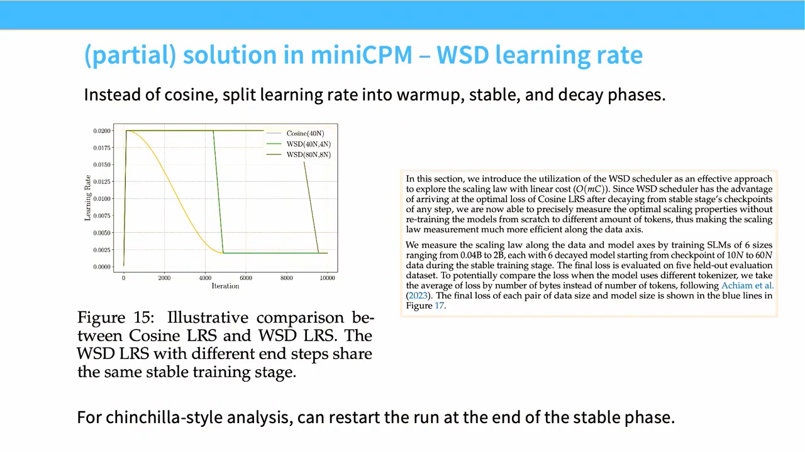

# Lecture 11：Scaling Laws II

> [!abstract] 本讲一句话
> Scaling law 落地时最难的不是拟合一条 loss 曲线，而是让小模型与大模型真正处于可比的训练机制：需要控制 initialization、learning rate、batch、schedule 和参数化，并用 WSD、IsoFLOPs 或 μP 降低 sweep 成本，同时持续验证“可迁移性”而不是假设它存在。

## 来源与范围

- 课程：Stanford CS336 — Language Modeling from Scratch, Spring 2026
- 讲师：Tatsunori Hashimoto
- 上课日期：2026-05-04
- [课程视频](https://www.youtube.com/watch?v=vTfEyOyzV9E)，时长 1:17:04
- [课程主页](https://cs336.stanford.edu/)
- [官方 Lecture 11 PDF](https://github.com/stanford-cs336/lectures/blob/main/lecture_11.pdf)
- 主要案例：MiniCPM、DeepSeek LLM、Qwen、Kimi K2、Hunyuan、Llama 3、MiniMax、Cerebras-GPT
- 本讲覆盖：工业 scaling recipe、LR/batch 搜索、WSD schedule、IsoFLOPs、optimizer scaling、Muon，以及 μP 的目标、简化推导与稳健性
- 本讲不重复：Lecture 09 的幂律基础、联合 loss 和 Chinchilla 三种方法的完整定义

> [!warning] 来源边界
> 结构和案例按公开视频完整英文字幕与 2026 官方 PDF 交叉核对；μP 的规则在课件中明确是简化的 “baby μP” 推导，正文不会把它替代官方实现规则。下表是可跳转的真实时间点。不同公司报告的 scaling ratio 使用不同参数、token 和 compute 口径，不能横向机械比较。

## 视频索引

| 视频位置 | 内容结构 | 对应笔记 |
| --- | --- | --- |
| [00:00](https://www.youtube.com/watch?v=vTfEyOyzV9E&t=0s) | Scaling in practice | [[#1. 从理论曲线到训练 recipe\|1]] |
| [04:28](https://www.youtube.com/watch?v=vTfEyOyzV9E&t=268s) | MiniCPM：proxy、μP、optimal LR | [[#3. MiniCPM：μP + WSD\|3]] |
| [09:59](https://www.youtube.com/watch?v=vTfEyOyzV9E&t=599s) | Warmup–Stable–Decay | [[#4. WSD：复用稳定阶段降低 sweep 成本\|4]] |
| [15:57](https://www.youtube.com/watch?v=vTfEyOyzV9E&t=957s) | DeepSeek recipe | [[#5. DeepSeek：直接拟合超参数\|5]] |
| [22:26](https://www.youtube.com/watch?v=vTfEyOyzV9E&t=1346s) | Recent public recipes | [[#6. 其他公开案例透露了什么\|6]] |
| [31:00](https://www.youtube.com/watch?v=vTfEyOyzV9E&t=1860s) | LR/batch response surface | [[#7. Optimizer 与 scale\|7]] |
| [41:39](https://www.youtube.com/watch?v=vTfEyOyzV9E&t=2499s) | Muon 与 scale | [[#7.4 Muon\|7.4]] |
| [58:36](https://www.youtube.com/watch?v=vTfEyOyzV9E&t=3516s) | CerebrasGPT 与 baby μP 推导 | [[#8. μP 的目标\|8–9]] |
| [74:26](https://www.youtube.com/watch?v=vTfEyOyzV9E&t=4466s) | μP failure modes | [[#10. μP 在现代 LM 中的边界\|10]] |
| [75:31](https://www.youtube.com/watch?v=vTfEyOyzV9E&t=4531s) | 总结 | [[#14. 本讲结论\|14]] |

## 视频补充：recipe 的口头边界

- MiniCPM 的最大 proxy 只比最终模型小约 5 倍；这里的目标是一次选对 final-scale 超参，而不是声称极小 toy model 可以无限外推。
- WSD 的 warmup 步数与总训练长度解耦，decay 常占总训练的 10–20%，终点约为峰值 LR 的 10%。延长训练时可从 stable checkpoint 重新 decay，使一次额外 probe 只花完整 run 的一小部分。
- DeepSeek 的 batch fit 看起来合理，但课堂明确说 learning-rate linear fit 不是最佳拟合；两阶段 decay 的原因也不确定。课程把公开 recipe 当证据，不把每个设计都解释成已验证因果。
- StepFun 得到“数据更多时 optimal LR 更高”的反直觉结果；讲师强调该结论脆弱，别的 WSD 工作可能相反。
- Muon 在小规模 NanoGPT speedrun 中收益很大，随 scale 增大收益缩小；Kimi K2 证明它能大规模稳定运行，但缺少 Adam ablation，因此证明的是 viability，不是 superiority。
- μP 推导使用强 worst-case 上界。Learned RMSNorm gain、sign-gradient/Lion、较强 decoupled weight decay 都可能破坏 transfer；最后判断是“有前景的工具”，不是银弹。



> 视频关键帧：[11:30](https://www.youtube.com/watch?v=vTfEyOyzV9E&t=690s)。WSD 在 stable 阶段的 loss 可能暂时比 cosine 难看，但 decay 后快速追上；它的价值是让不同 token budget 复用同一段训练。

## 1. 从理论曲线到训练 recipe

Lecture 09 给出理想流程：

$$
\text{small runs}
\rightarrow
\text{fit}
\rightarrow
\text{large-run prediction}
$$

现实中，small 和 large runs 只有在以下条件可比时，外推才有意义：

- 相同 tokenizer 和数据分布；
- 相同 model family 和 aspect ratio；
- initialization 在不同 width/depth 下保持稳定；
- optimizer hyperparameters 不使某些规模欠训练；
- warmup、decay 和 batch 的定义随训练长度合理变化；
- 参数、tokens、FLOPs 的计数一致。

如果小模型使用了近乎最优的 LR，而大模型因 LR 错误损失 0.1 loss，那么拟合到的不是 architecture scaling，而是：

$$
\text{architecture effect}
+
\text{optimization mismatch}
$$

所以本讲的问题是：

> 怎样设计一种便宜、稳定、能跨规模迁移的训练协议？

## 2. 三类需要 scale-aware 的超参数

### 2.1 Architecture

- width $d_{\mathrm{model}}$；
- depth $L$；
- MLP ratio；
- number of heads / head dimension；
- MoE experts、active experts、sparsity；
- embedding 与 vocabulary size。

常见简化是固定 aspect ratio，只按一个 overall scale 放大；这降低实验维度，但本身是一项假设。

### 2.2 Optimization

- base learning rate；
- per-parameter-group learning-rate multiplier；
- batch size；
- warmup tokens/steps；
- weight decay；
- optimizer $\beta$、$\epsilon$；
- gradient clipping。

这些量决定模型是否在目标 token budget 内进入可比较的训练状态。

### 2.3 Data/compute allocation

- model parameters $N$；
- training tokens $D$；
- token-to-parameter ratio；
- unique data 与 repetition；
- fixed-FLOP 条件下的 $N,D$ 组合。

Architecture 和 optimization 没有稳定前，直接拟合 $N,D$ curve 会把调参误差写入 scaling exponent。

## 3. MiniCPM：μP + WSD

### 3.1 Recipe

课程总结 MiniCPM 的做法：

1. 用 μP 选择 scale-aware initialization 与参数组规则；
2. 固定 architecture aspect ratio；
3. 按 overall model size 扩展；
4. 检查 optimal LR 是否近似稳定；
5. 对 batch、loss、data size 做响应面实验；
6. 用 WSD schedule 降低 Chinchilla sweep 成本；
7. 用 training-curve envelope 和 joint fit 分析 model/data 比例。

其最大 pilot model 与最终模型约有 5 倍差距。这仍是外推，但远小于从极小模型直接跳到 frontier scale。

### 3.2 Batch response surface

对固定 model size $N$ 和不同训练进度 $D$，扫描 batch $B$，得到：

$$
L
=
f(N,D,B)
$$

一条固定 batch 的训练曲线会在多个 $D$ 上提供 loss 点；在每个 $D$ 上寻找最低 loss 对应的 $B^*(N,D)$。

再将 optimal batch 与 final loss 关联：

$$
B^*
\approx
g(L)
$$

课程展示的经验趋势是：目标 loss 越低，optimal batch 越大。这与 critical-batch 视角一致。

> [!warning] 最低点必须可辨识
> Batch grid 太稀、随机噪声太大或训练没有对齐 tokens，会让“红色最优曲线”只是插值幻觉。应保留近优区域，而非只记录单点 argmin。

## 4. WSD：复用稳定阶段降低 sweep 成本

### 4.1 Cosine schedule 的问题

假设要评估同一模型在 $D_1<D_2<\cdots<D_m$ 个 token budget 上的最终 loss。

若每个预算都从头训练并使用以终点为基准的 cosine decay，总训练量约为：

$$
D_1+D_2+\cdots+D_m
$$

当预算大致等间距时，它相对最大一次训练可能产生 $O(m)$ 倍额外成本；若同时扫 $m$ 个模型与 $m$ 个数据规模，实验数和总成本会呈近似 quadratic 增长。

### 4.2 Warmup-Stable-Decay

WSD 将 schedule 分成：

1. Warmup：将 LR 从小值升到目标；
2. Stable：长时间维持近似稳定 LR；
3. Decay：在准备结束训练时快速衰减。

概念图：

```text
LR
│       ┌──────────────── stable ─────────────┐
│      /                                      \
│     / warmup                                 \ decay
└──────────────────────────────────────────────── tokens
```

关键工程能力是从 stable checkpoint 分叉：

```text
shared warmup + stable run
├── decay at D1 → endpoint 1
├── continue stable → decay at D2 → endpoint 2
└── continue stable → continue → decay at D3 → endpoint 3
```

这样不需要为每个 $D_i$ 从头重跑全部 prefix。

### 4.3 WSD 改变了什么

WSD 不是免费获得多个独立样本：

- 分叉 endpoints 共享前半段随机轨迹，误差相关；
- stable-phase loss 可能比 decay 后高；
- decay length/shape 本身是超参数；
- checkpoint 必须包含 optimizer state、scheduler state 和 data position；
- 对比 cosine 时要统一总 tokens 和终点条件。

它解决的是 sweep 的计算复用，不自动保证 scaling fit 正确。

## 5. DeepSeek：直接拟合超参数

### 5.1 不使用 μP

课程中的 DeepSeek recipe 选择：

- 不依赖 μP；
- 在小规模上直接搜索 learning rate 和 batch；
- 对 near-optimal region 建模；
- 用 WSD-like schedule；
- 用 IsoFLOPs 选择模型大小与数据量；
- 用拟合曲线预测最终模型 loss。

这代表另一条路线：

> 与其通过参数化让超参数不随 scale 改变，不如直接估计它们怎样随 scale 改变。

### 5.2 Near-optimal set 比单点更可靠

设网格最小 loss 为 $L_{\min}$。可定义：

$$
\mathcal H_\epsilon
=
\{h:
L(h)
\le
L_{\min}(1+\epsilon)\}
$$

课程案例收集接近最优的配置，再观察它们的趋势。

好处：

- 避免噪声决定唯一 winner；
- 能看出 loss surface 是否平坦；
- 外推时可得到安全区间。

课件也提醒：某些 LR fit 看起来并不稳健。曲线“能画出来”不等于外推可信。

### 5.3 WSD-like schedule 与 IsoFLOPs

DeepSeek 使用快速 warmup 和分段 decay，并在固定 FLOP budgets 下扫描 model size：

$$
D
\approx
\frac{C}{6N}
$$

对每个 $C_i$：

$$
N_i^*
=
\arg\min_N
L\left(N,\frac{C_i}{6N}\right)
$$

再拟合 $N^*(C)$ 和 predicted loss。课件指出 fitted scaling generally 能预测最终模型 loss，但 “generally” 不应被读成无误差保证。

## 6. 其他公开案例透露了什么

课程列举近年公开做法：

| 案例 | 报告的 scaling 工作 |
| --- | --- |
| Qwen 2.5 / 3 | LR 与 batch scaling，公开细节有限 |
| Kimi K2 | MoE sparsity 与 optimizer scaling |
| Hunyuan | 面向 MoE active parameters 的 IsoFLOPs |
| Llama 3 | compute-to-downstream 与 IsoFLOPs |
| MiniMax | architecture choice 与 Chinchilla method 1 |

课件展示了若干 data-to-active-parameter ratios，例如 Hunyuan 约 96:1、Llama 3 约 39:1。

> [!danger] 不要把比例当排行榜
> 这些比值可能分别使用 active/total/non-embedding parameters、不同 tokenizer、不同数据质量和不同 compute 公式。它们首先是各自实验协议内的结果。

### 6.1 公开 recipe 的共同模式

DeepSeek-like：

```text
假设多数 architecture ratios 稳定
→ 小规模搜索 LR / batch
→ 拟合超参数随 scale 的变化
→ WSD 降低 endpoint sweep 成本
→ IsoFLOPs 选择 N/D
```

MiniCPM-like：

```text
用 μP 稳定 width scaling
→ 复用较稳定的 base LR
→ WSD 获取多个 endpoints
→ envelope / joint fit
```

两者都没有绕过实验，只是把实验预算放在不同位置。

## 7. Optimizer 与 scale

### 7.1 公平比较需要分别调参

若 optimizer A 与 B 使用同一 LR 和 batch：

$$
L_A(h_0)
<
L_B(h_0)
$$

不能推出：

$$
\min_h L_A(h)
<
\min_h L_B(h)
$$

不同 optimizer 的：

- 最佳 LR；
- batch scaling；
- weight decay；
- warmup；
- numerical stability

都可能不同。

### 7.2 LR-batch loss surface

课程展示的经验观察是 pretraining loss 对 LR 和 batch 常呈可辨识的 convex-like basin。

这让局部网格搜索可行：

```python
for model_size in model_sizes:
    for data_budget in data_budgets:
        for learning_rate in learning_rates:
            for batch_size in batch_sizes:
                loss = train(...)
                record(model_size, data_budget,
                       learning_rate, batch_size, loss)
```

但 “convex-like” 是经验形状：

- 不代表神经网络目标函数凸；
- 只描述超参数响应面的一段区域；
- divergence 和 schedule interaction 会破坏形状。

### 7.3 Batch 可能主要随 data budget 变化

课件介绍的实证研究发现，在 Chinchilla-style grid 中，optimal batch 与 dataset/training-token size 的关系可能比与 model size 更强。

有工作还观察到固定模型下，optimal LR 随 $D$ 增加而提高；课程马上提醒，这个趋势对 schedule 很敏感，改用 WSD 后可能变化。

结论不是记一个指数，而是：

> LR、batch 和 schedule 构成耦合系统，不能分别拟合后假设独立。

### 7.4 Muon

Muon 面向 matrix-valued parameters。其核心步骤之一用 Newton-Schulz iteration 近似把更新矩阵：

$$
B
=
USV^\top
$$

变成接近：

$$
UV^\top
$$

即对奇异值做近似归一化，使不同方向的更新更均衡。

课程提到 Kimi K2 和 NanoGPT speedrun 等 scale 证据，同时保持谨慎：

- 小规模 speedrun 不等于大规模收益；
- 优势可能来自不同 LR/batch；
- optimizer 额外计算和通信也要核算；
- “能在大规模运行”不等于已证明跨规模优势恒定。

## 8. μP 的目标

Maximum Update Parametrization 希望 width 增长时，网络处于相同的 feature-learning regime，并使小模型调好的 base hyperparameters 更可迁移。

课程用两个条件表述：

### A1：初始化时 activation 保持 $O(1)$

对每个 coordinate：

$$
h_{l,i}
=
\Theta(1)
$$

因此 width 为 $n_l$ 的 activation vector norm：

$$
\|h_l\|_2
=
\Theta(\sqrt{n_l})
$$

若 activation 随 width 爆炸或消失，小模型和大模型不是同一种训练机制。

### A2：一次更新造成 $O(1)$ activation change

$$
\Delta h_{l,i}
=
\Theta(1)
$$

要求模型变宽后，单步 feature learning 不能趋于零，也不能爆炸。

> [!note] 关键是 parametrization，不是单一初始化公式
> μP 会区分 input、hidden、output、embedding、attention 等参数类型，并给出不同 initialization、LR multiplier 和 output scaling。只设置 `std=1/sqrt(width)` 并不等于完整 μP。

## 9. 简化的 μP 推导直觉

### 9.1 保持初始化 activation 尺度

考虑 deep linear network：

$$
h_l
=
W_l h_{l-1}
$$

其中：

$$
W_l
\in
\mathbb R^{n_l\times n_{l-1}}
$$

若元素独立、标准差为 $\sigma_l$，随机矩阵 spectral norm 量级为：

$$
\|W_l\|_*
\sim
\sigma_l
\left(
\sqrt{n_l}
+
\sqrt{n_{l-1}}
\right)
$$

在相近 width 的 hidden-to-hidden layer，选择：

$$
\sigma_l
=
\Theta(n_{l-1}^{-1/2})
$$

能让单个 activation coordinate 保持常数量级。

课件进一步讨论 fan-in 与 fan-out 不等时的保守修正，但这个线性、spectral-norm 推导是上界式直觉，不是现代 Transformer 所有 layer 的完整证明。

### 9.2 保持更新尺度

SGD 下，linear layer 的 gradient/update 有 outer-product 结构：

$$
\Delta W_l
=
-\eta_l
\nabla_{h_l}\ell
h_{l-1}^{\top}
$$

activation change 包含：

$$
\Delta h_l
=
W_l\Delta h_{l-1}
+
\Delta W_l h_{l-1}
+
\Delta W_l\Delta h_{l-1}
$$

若希望：

$$
\|\Delta h_l\|_2
=
\Theta(\sqrt{n_l})
$$

就必须让 $\Delta W_l$ 的 operator scale 随输入、输出 width 调整。

因此不同形状参数的 learning rate 不能都无条件设为同一个常数。

Adam 又会改变 gradient normalization，所需 width multiplier 与 SGD 不同。完整规则应由 μP parameter types 决定。

### 9.3 为什么 base LR 可能迁移

μP 的实现把 width 依赖吸收进：

- 参数初始化；
- parameter-specific multipliers；
- output scaling。

调参者看到的 base LR 因而有机会跨 width 保持近似不变。

这不是说每个 tensor 的实际 update coefficient 都相同。

## 10. μP 在现代 LM 中的边界

现代 Transformer 偏离理想推导：

- SwiGLU、squared ReLU；
- attention 与 softmax；
- RMSNorm learnable gain；
- 不同 batch regime；
- zero initialization 变体；
- Lion、Muon 等 optimizer；
- weight decay 和 regularization；
- tied embeddings。

课程汇总的 replication 观察：

- μP 通常比 standard parametrization 的 LR transfer 更稳定；
- 可学习 RMSNorm gain 可能破坏 transfer，移除 gain 后可改善；
- 某些 sign-based optimizer 不遵循同一规则；
- 强 weight decay 是明显风险；
- 许多常见非线性和 batch 变化下仍有一定稳健性。

> [!warning] “更稳”不等于“无需 sweep”
> μP 减少 width 维度上的超参数漂移，但 depth、data、batch、schedule、optimizer 和 architecture change 仍需验证。

## 11. 实际 scaling experiment 的设计

### 11.1 先写清不变量

```yaml
tokenizer: fixed
data_mixture: fixed
model_family: fixed
aspect_ratio: fixed_or_explicitly_swept
parameter_count: total/non_embedding/active
compute_formula: documented
validation_set: frozen
```

### 11.2 分阶段搜索

1. 在少量规模上确认稳定 initialization；
2. 对 LR/batch 做粗网格，定位 basin；
3. 加密 near-optimal region；
4. 检查最优点随 $N,D$ 的趋势；
5. 再做 IsoFLOPs 或 joint scaling；
6. 保留一个较大规模作为真正 holdout；
7. 目标训练前做最后一次校准。

### 11.3 记录完整曲线

只保存 final loss 会丢失：

- divergence；
- warmup 是否过长；
- decay 带来的增益；
- 相同 loss 的 sample efficiency；
- WSD 分叉点的可比性。

至少保存：

$$
\{D_t,C_t,L_{\mathrm{train},t},L_{\mathrm{val},t},
\eta_t,\|\nabla\|_t,\text{throughput}_t\}
$$

### 11.4 衡量不确定性

应检查：

- seeds；
- bootstrap 或 fit covariance；
- 不同函数形式；
- 删除最小/最大规模点后的敏感性；
- residual 是否随 scale 系统弯曲；
- extrapolated optimum 是否落在 pilot grid 很远之外。

“最终模型 loss 在预测附近”是一项验证结果，不应作为 fitting 的前提。

## 12. 拓展：AI Infra 视角

### 12.1 Compute

WSD 通过共享 stable prefix 降低 sweep FLOPs；IsoFLOPs 保证每个 budget 内比较公平。

但实际资源账本还应包含：

- failed/diverged runs；
- calibration runs；
- checkpoint 分叉；
- data loading 和 evaluation；
- optimizer 本身的额外 FLOPs。

### 12.2 Memory

- μP 通常不直接降低训练显存；
- 更优 batch 可能需要 gradient accumulation；
- optimizer 更换会改变 state bytes；
- WSD 多分支会增加 checkpoint storage。

### 12.3 Communication

Batch scaling 会改变 data-parallel 通信摊销；MoE sparsity sweep 会改变 all-to-all。

因此：

$$
\text{best loss/FLOP}
\ne
\text{best loss/hour}
$$

尤其当不同模型规模需要不同并行策略时。

### 12.4 Runtime 与可复现性

Scaling pipeline 本质上是实验调度系统：

```text
configuration generator
→ cluster scheduler
→ failure/retry policy
→ metrics store
→ curve fitting
→ uncertainty report
→ next experiment selection
```

任何静默改变数据版本、代码 commit、FLOP 口径的 run 都不应进入同一 fit。

## 13. 我的推导与易错点

### 13.1 WSD 的成本优势来自 prefix sharing

若 budgets 为 $D_i=i\Delta$：

独立训练总 token：

$$
\sum_{i=1}^{m}D_i
=
\frac{m(m+1)}{2}\Delta
$$

若共享 stable trajectory，到最大点只需约 $m\Delta$，再加每个 endpoint 的 decay branch：

$$
C_{\mathrm{WSD}}
\approx
m\Delta
+
\sum_i D_{\mathrm{decay},i}
$$

当 decay 只占小比例时，节省可接近 $O(m)$ 倍。

### 13.2 Flat basin 会让“最优指数”不稳定

若 LR/batch basin 很平：

- 多组超参数 loss 几乎相同；
- argmin 对 seed 很敏感；
- 拟合唯一的 $LR^*(C)$ 指数没有实际意义。

此时更适合拟合 near-optimal interval，并选择数值最稳定、系统吞吐最好的点。

### 13.3 固定超参数也可能制造漂亮幂律

即使 LR 随 scale 越来越不合适，loss 仍可能在有限区间近似直线。漂亮的 log-log 图不能证明各规模均被同等优化。

需要额外验证：

$$
\frac{\partial L}{\partial \log LR}
\approx
0
$$

即观测点位于各规模的 near-optimal basin，而非边缘。

### 13.4 常见误区

> [!danger] 易错点
> - 把 WSD 当作一种必然优于 cosine 的 loss function；
> - 从同一 stable checkpoint 分叉，却把 endpoints 当完全独立样本；
> - 看到 μP 后停止验证 LR transfer；
> - 只调 base LR，忽略 parameter-group multiplier；
> - 不同 optimizer 共用一套超参数并宣称优劣；
> - 混用 active、total、non-embedding parameters；
> - 只看理论 FLOPs，不看并行策略改变后的 wall-clock；
> - 把某家公司报告的 token/parameter ratio 当作普遍最优值。

## 14. 本讲结论

1. Practical scaling 的前提是让不同规模处于可比的 optimization regime。
2. MiniCPM 路线用 μP 稳定 width scaling，再拟合 batch 和 model/data trade-off。
3. DeepSeek 路线直接搜索并拟合 LR/batch，再用 IsoFLOPs 选择模型规模。
4. WSD 通过共享 stable training prefix，显著降低多个 token endpoints 的成本。
5. LR、batch、schedule 和 optimizer 相互耦合，单独拟合的指数可能不稳健。
6. μP 追求 initialization activation 与 update activation 在 width 增长时保持常数量级。
7. μP 需要 parameter-type-specific 规则，不等于一条统一的 `1/sqrt(width)`。
8. RMSNorm gain、强 weight decay 和 exotic optimizer 可能破坏 hyperparameter transfer。
9. 公开 scaling ratio 的口径不同，应学习方法而非机械抄数字。
10. Scaling pipeline 必须保存协议、曲线、不确定性和 wall-clock 资源账本。

## 15. 自测问题

1. 为什么 optimization mismatch 会污染 architecture scaling exponent？
2. MiniCPM-like 与 DeepSeek-like recipe 的核心区别是什么？
3. WSD 怎样从同一 run 产生多个可比较 endpoints？
4. 为什么 WSD endpoints 的误差不是独立的？
5. IsoFLOPs 如何在固定 $C$ 下确定 $D$？
6. Near-optimal set 为什么比唯一 argmin 更稳健？
7. 为什么不同 optimizer 必须分别调 LR、batch 和 weight decay？
8. μP 的 A1 与 A2 分别约束什么？
9. 为什么 individual activation 为 $O(1)$ 时，向量 norm 是 $O(\sqrt n)$？
10. Base LR transfer 为什么不等于所有参数实际 LR 相同？
11. 哪些现代 Transformer 组件可能破坏 μP 假设？
12. 怎样判断一条漂亮 scaling curve 是否由欠调的超参数造成？

## 参考资料

- [Stanford CS336 Spring 2026](https://cs336.stanford.edu/)
- [Official Lecture 11 PDF](https://github.com/stanford-cs336/lectures/blob/main/lecture_11.pdf)
- [Hu et al., MiniCPM: Unveiling the Potential of Small Language Models with Scalable Training Strategies](https://arxiv.org/abs/2404.06395)
- [DeepSeek-AI, DeepSeek LLM: Scaling Open-Source Language Models with Longtermism](https://arxiv.org/abs/2401.02954)
- [Yang et al., Tensor Programs V: Tuning Large Neural Networks via Zero-Shot Hyperparameter Transfer](https://arxiv.org/abs/2203.03466)
- [Dey et al., Cerebras-GPT: Open Compute-Optimal Language Models Trained on the Cerebras Wafer-Scale Cluster](https://arxiv.org/abs/2304.03208)
- [Hoffmann et al., Training Compute-Optimal Large Language Models](https://arxiv.org/abs/2203.15556)
