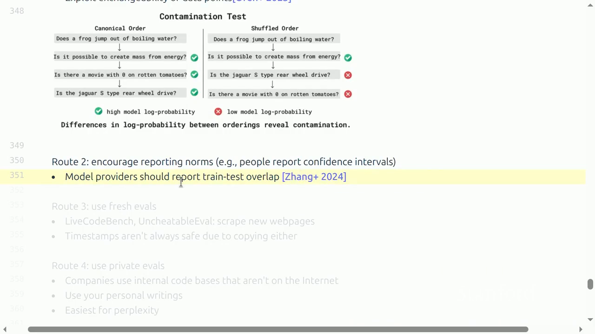

# Lecture 12：Evaluation

> [!abstract] 本讲一句话
> Evaluation 是把“模型有多好”这个抽象 construct 映射成可复现 metric 的测量设计：LM loss 提供平滑而窄的概率指标，task、chat、agent、reasoning 与 safety benchmarks 提供不同的行为切片；任何分数只有在目标、规则、数据有效性和统计不确定性都被写清时才有意义。

## 来源与范围

- 课程：Stanford CS336 — Language Modeling from Scratch, Spring 2026
- 讲师：Percy Liang
- 上课日期：2026-05-06
- [课程视频](https://www.youtube.com/watch?v=JpAxdTWQJxM)，时长 1:18:34
- [课程主页](https://cs336.stanford.edu/)
- [官方 Lecture 12 可执行讲义](https://cs336.stanford.edu/lectures/?trace=lecture_12)
- 本讲覆盖：perplexity、exam/chat/agent/reasoning/safety benchmarks、LLM-as-a-judge、realism、contamination、dataset quality，以及 method/model/agent 的评测边界
- 本讲不提供：一张永远有效的模型总榜；课程的核心结论恰恰是不存在脱离使用目标的唯一 evaluation

> [!warning] 来源边界
> 讲次结构、benchmark 案例和主要判断已按公开视频完整英文字幕与官方 2026 可执行讲义交叉核对。下表是可跳转的真实时间点。统计区间、paired comparison、运行协议等内容是依据课程“validity 与 rules of the game”框架补充的 AI Infra 实践，已标成拓展。

## 视频索引

| 视频位置 | 内容结构 | 对应笔记 |
| --- | --- | --- |
| [00:00](https://www.youtube.com/watch?v=JpAxdTWQJxM&t=0s) | Construct、dataset、metric、protocol | [[#1. Evaluation 是测量设计\|1]] |
| [05:41](https://www.youtube.com/watch?v=JpAxdTWQJxM&t=341s) | Perplexity | [[#2. LM loss 与 perplexity\|2]] |
| [18:00](https://www.youtube.com/watch?v=JpAxdTWQJxM&t=1080s) | Exam benchmarks | [[#3. Knowledge 与 exam benchmarks\|3]] |
| [32:58](https://www.youtube.com/watch?v=JpAxdTWQJxM&t=1978s) | Arena、human preference 与 LLM judge | [[#4. Open-ended generation\|4]] |
| [44:58](https://www.youtube.com/watch?v=JpAxdTWQJxM&t=2698s) | Agent evaluation | [[#5. Agent evaluation\|5]] |
| [54:03](https://www.youtube.com/watch?v=JpAxdTWQJxM&t=3243s) | ARC-AGI 与 test-time scaffold | [[#6. Reasoning 与 safety\|6]] |
| [60:12](https://www.youtube.com/watch?v=JpAxdTWQJxM&t=3612s) | Safety benchmarks 与 attacks | [[#6. Reasoning 与 safety\|6]] |
| [65:15](https://www.youtube.com/watch?v=JpAxdTWQJxM&t=3915s) | Ecological realism | [[#7. Realism：是否像真实世界\|7]] |
| [68:51](https://www.youtube.com/watch?v=JpAxdTWQJxM&t=4131s) | Scientific validity 与 contamination | [[#8. Validity：分数是否可信\|8]] |
| [75:45](https://www.youtube.com/watch?v=JpAxdTWQJxM&t=4545s) | Procurement、science、policy、development | [[#11. 到底在评什么\|11]] |

## 视频补充：benchmark 数字背后的规则

- Perplexity 对 scale 很平滑，但必须信任模型返回规范化概率；恶意实现对每个 token 返回 `logprob=0` 就能伪造完美 PPL。它也不能单独覆盖 factuality 等 construct。
- MMLU-Pro 从 4 个选项扩到 10 个，模型下降约 16–33%；GPQA 从 expert 65%/nonexpert 34%/GPT-4 39% 演进到 2026 领先模型约 94%，直观说明 benchmark shelf life。
- Multiple choice 让模型只输出字母、输出 explanation 或 CoT，会改变结果；一旦生成解释，就必须定义 extraction protocol。
- Chatbot Arena 的真实用户 prompt 同时带来用户偏差和 spam；pairwise preference 混合 style 与 correctness。AlpacaEval 曾被长回答 gaming，后来用 regression debias。
- Agent benchmark 同时评 LM 与 scaffold：todo list、clean-context subagent、persistent files/memory、context engineering 都会影响结果。
- Fresh eval 的时间戳并非绝对安全，新 repo 也可能复制旧数据；private eval、dataset repair 和 trace-level qualitative inspection 是互补路线。



> 视频关键帧：[1:11:00](https://www.youtube.com/watch?v=JpAxdTWQJxM&t=4260s)。课程还要求 model provider 报告 train–test overlap 证据和 confidence intervals；单一 leaderboard 分数不足以证明科学有效性。

## 1. Evaluation 是测量设计

表面流程很机械：

```text
define prompts
→ call model
→ collect responses
→ compute score
```

真正困难的是：

$$
\text{abstract construct}
\longrightarrow
\text{observable metric}
$$

“好”可能指：

- 低 held-out loss；
- 知识问答准确；
- 用户更偏好；
- 能以低成本完成任务；
- agent 能在环境中取得结果；
- 安全、可靠、诚实；
- 在特定企业 workflow 中产生 ROI。

这些目标不能被单一分数完全替代。

### 1.1 先写 evaluation question

一个有效评测应先完成句子：

> 我想知道模型/系统 ___ 在 workload ___、资源约束 ___、交互规则 ___ 下，能否以 ___ 的可靠性完成 ___。

如果填不出来，收集更多 benchmark 分数只会制造更多不明确数字。

### 1.2 Construct、dataset、metric、protocol

| 层次 | 问题 |
| --- | --- |
| Construct | 想测 knowledge、reasoning、helpfulness 还是真实任务完成？ |
| Dataset | 哪些样本代表该 construct？ |
| Metric | accuracy、loss、win rate、unit-test pass rate 还是成本？ |
| Protocol | prompt、tools、sampling、budget、judge 如何固定？ |

任一层不稳，最终 leaderboard 都可能失真。

## 2. LM loss 与 perplexity

### 2.1 定义

对 token sequence：

$$
x_{1:T}
$$

自回归概率：

$$
p(x_{1:T})
=
\prod_{t=1}^{T}
p(x_t\mid x_{<t})
$$

平均 negative log-likelihood：

$$
\operatorname{NLL}
=
-\frac{1}{T}
\sum_{t=1}^{T}
\log p(x_t\mid x_{<t})
$$

Perplexity：

$$
\operatorname{PPL}
=
\exp(\operatorname{NLL})
=
p(x_{1:T})^{-1/T}
$$

越低表示模型给 test sequence 的平均 token probability 越高。

### 2.2 为什么它重要

- 每个 token 都贡献信号，metric 密集；
- 连续且相对低噪声；
- 与训练目标一致；
- 很适合 scaling-law 实验；
- 可在 private text 上便宜评估；
- 不需要生成和昂贵人工标注。

传统 LM 在 Penn Treebank、WikiText-103、One Billion Word 等标准 train/test split 上做 in-distribution PPL。

GPT-2 展示了另一种范式：在 WebText 训练，再 zero-shot 评估多个标准数据集，属于 out-of-distribution transfer。

### 2.3 “Perplexity is all you need” 的理想论证

若真实分布为 $t$，模型为 $p$，cross-entropy 在：

$$
p=t
$$

时达到最优。若模型真的学习了完整 joint distribution，原则上可通过：

$$
p(\text{solution}\mid\text{problem})
$$

回答各种任务。

但这是极限论证，不是实践保证：

- 真实 $t$ 未知；
- evaluation dataset 只代表某个分布；
- 有限 loss improvement 可能来自不重要 token；
- decoding、instruction following、tools 不由无条件 PPL 单独决定；
- 用户效用不是 token-average log-probability。

### 2.4 Perplexity 可能“多于所需”

句子：

```text
Stanford was founded in 1885.
```

任务若只关心事实 `1885`，PPL 仍会评分 `was`、`founded`、`in` 等全部 token。

更贴近 conditional task 的做法：

$$
\operatorname{NLL}(y\mid x)
=
-\frac{1}{|y|}
\log p(y\mid x)
$$

只评分 response $y$，prompt $x$ 作为条件。

LAMBADA、HellaSwag 等 cloze/sentence-completion benchmark，本质上也可通过 conditional likelihood 评分。

### 2.5 PPL 的可比性陷阱

> [!danger] 不同 tokenizer 的 token-level PPL 不能直接比较
> 同一字符串被切成不同 token 数，$T$ 和每步事件空间都改变。跨 tokenizer 更适合比较 bits-per-byte、bits-per-character，或在统一 tokenization/protocol 下比较。

还需要统一：

- BOS/EOS 是否计分；
- context truncation 和 stride；
- document boundary；
- decontamination；
- exact test text；
- log base；
- 是否对空格、Unicode 做 normalization。

## 3. Knowledge 与 exam benchmarks

### 3.1 为什么用考试

Exam 的优势：

- 可控制 subject 与 difficulty；
- 正确答案通常明确；
- multiple choice 易自动评分；
- 可以覆盖长尾知识。

缺点：

- 与真实 assistant 使用距离远；
- 容易被训练数据污染；
- multiple-choice strategy 不等于开放生成；
- prompt 与 CoT 会显著改变结果。

### 3.2 MMLU

MMLU：

- 57 个 subjects；
- math、history、law、morality 等；
- 以公开考试材料为来源；
- 最初用 few-shot prompting 评估 GPT-3。

尽管名称含 “language understanding”，它更接近 broad knowledge test。

### 3.3 MMLU-Pro

针对 MMLU 饱和：

- 删除 noisy/trivial questions；
- 选项从 4 扩到 10；
- 使用 chain-of-thought evaluation；
- 课程课件报告模型准确率下降约 16–33 percentage points。

它说明 benchmark 会随模型能力升级，否则 ceiling effect 让模型差异不可辨。

### 3.4 GPQA

GPQA 由相关学科 PhD 编写，目标是 expert-level、“Google-proof”问题。

课件中的原始论文结果：

- 专家约 65%；
- 非专家在可用 Google、30 分钟条件下约 34%；
- 当时 GPT-4 约 39%。

这些数字描述论文发布时协议，不应当成当前模型能力。

### 3.5 Humanity's Last Exam

HLE：

- 约 2,500 道题；
- 多学科、多模态；
- multiple choice 与 short answer 混合；
- 通过 frontier models 过滤，并经过多阶段审核；
- 用奖励和共同署名吸引高难问题创作者。

“由旧模型筛掉会做的题”能缓解饱和，却可能让 benchmark 对筛选模型族产生 selection bias。

### 3.6 Multiple-choice 也有 protocol

常见评分：

1. 让模型生成选项字母，exact match；
2. 比较各选项 conditional log-probability；
3. 对选项长度做 normalization；
4. 允许 CoT，再解析最终答案。

不同方案测到的能力不同。必须报告：

- prompt template；
- few-shot examples；
- answer-order randomization；
- 是否允许 CoT；
- parsing failure 如何处理；
- raw/normalized likelihood。

## 4. Open-ended generation

现实用户不会只问 multiple-choice。开放回复可能同时需要：

- factual correctness；
- relevance；
- instruction following；
- style 与 concision；
- harmlessness；
- uncertainty calibration。

这些维度常没有唯一 reference answer。

### 4.1 Pairwise human preference

Chatbot Arena 流程：

1. 真实用户提交 prompt；
2. 匿名展示两个随机模型回复；
3. 用户选择更好的回复或 tie；
4. 从 pairwise comparisons 拟合相对 rating。

课件给出 Elo-style 胜率：

$$
P(A>B)
=
\frac{1}
{1+10^{(R_B-R_A)/400}}
$$

优点：

- prompts 来自真实使用；
- pairwise 比绝对 1–10 打分更容易；
- 不要求所有模型回答完全相同 prompts；
- 新模型可动态加入。

风险：

- 用户群体未知且有 selection bias；
- spammers、重复投票；
- style/verbosity 可能压过 correctness；
- 用户未必能判断专业事实；
- sycophancy 可能被偏好奖励；
- 对战图稀疏或不均衡。

### 4.2 LLM-as-a-judge

AlpacaEval：

- 固定 instruction set；
- 相对 baseline 计算 win rate；
- 使用 LLM judge；
- 早期版本暴露 verbosity bias；
- 后续用 regression 做长度 debias。

WildBench：

- 从真实 human-chatbot conversations 抽样；
- 使用 checklist/rubric；
- judge 先逐项检查再给结论；
- 以与 human Arena 的相关性做 sanity check。

LLM judge 的常见偏差：

- position bias；
- length/verbosity bias；
- self-preference 或 model-family bias；
- style bias；
- 对不可验证事实过度自信；
- judge prompt 和版本漂移。

### 4.3 Rubric 比“你觉得哪个好”更稳

一个更可审计的 judge prompt 应包含：

```text
task definition
→ explicit rubric dimensions
→ disallowed shortcuts
→ evidence/checklist
→ pairwise or scalar decision
→ structured output schema
```

同时保留原始 prompt、responses、judge rationale 和最终 decision，便于复核。

### 4.4 Generation evaluation 的选择

| 输出类型 | 合适的主要 metric |
| --- | --- |
| 唯一短答案 | exact match / normalized match |
| 代码 | unit tests / execution |
| 摘要 | factuality + coverage + human/judge rubric |
| Chat | pairwise preference + dimension rubrics |
| 长报告 | claims verification + completeness + cost |
| Tool-use trace | final state + budget + safety constraints |

BLEU/ROUGE 等 lexical overlap 只衡量与 reference 的表面重合；reference 不唯一时不能单独代表质量。

## 5. Agent evaluation

Agent 不只是 language model：

$$
\text{Agent}
=
\text{LM}
+
\text{scaffold}
+
\text{tools}
+
\text{environment}
$$

Scaffold 可以包含：

- planning / todo list；
- hierarchical delegation；
- persistent memory；
- context management；
- retry、reflection、tool selection。

因此 agent benchmark 的分数不能自动归因给 base model。

### 5.1 SWE-bench

- 来自真实 GitHub Python repositories；
- 输入 issue description 与 codebase；
- 输出 patch；
- 用 repository tests 判断解决与否。

它比文字问答真实，但也依赖：

- tests 是否覆盖 issue；
- environment 能否复现；
- agent 是否能访问 tools；
- time/token budget；
- repository version。

SWE-bench Verified 说明 benchmark 本身也需要人工验证和清洗。

### 5.2 Terminal-Bench、CyBench、MLE-bench

| Benchmark | Environment | 主要结果 |
| --- | --- | --- |
| Terminal-Bench | 计算机终端任务 | 环境中的任务完成 |
| CyBench | Capture the Flag | 安全挑战完成 |
| MLE-bench | Kaggle competitions | 数据处理与模型训练结果 |

这些任务允许长 horizon 和工具使用，更接近实际工作，也引入更多随机性与基础设施变量。

### 5.3 Agent protocol 必须报告

- base model 与版本；
- system prompt 和 scaffold code；
- tools、network、filesystem 权限；
- token、time、money budget；
- maximum turns/retries；
- temperature 和 seeds；
- environment/image version；
- pass@1、pass@$k$ 还是 best-of-$k$；
- failure taxonomy。

如果 A 使用 20 次重试、B 使用 1 次，只比较成功率不公平。

可加入效率约束：

$$
\operatorname{utility}
=
\operatorname{task\ success}
-
\lambda_1\operatorname{cost}
-
\lambda_2\operatorname{latency}
-
\lambda_3\operatorname{risk}
$$

## 6. Reasoning 与 safety

### 6.1 ARC-AGI

ARC-AGI 试图把 reasoning 与世界知识分离：

- 每个任务展示输入输出 grid；
- 需要推断抽象变换；
- 人类可解但对 AI 困难；
- 任务新颖，降低直接记忆帮助。

课件沿 ARC-AGI-1、2、3 展示从静态 grid 到多步、交互环境的发展。

限制：

- “无知识”仍是理想化描述；
- benchmark 约束于人类设计的 reasoning；
- 反复公开测试会带来适应与污染。

### 6.2 Safety 是上下文相关 construct

HarmBench：

- 以违反法律或社会规范的 harmful behaviors 为基础；
- 测模型是否完成有害请求。

AIR-Bench：

- 从监管框架和公司 policy 建风险 taxonomy；
- 覆盖大量 risk categories 和 prompts。

Jailbreak 评测则主动寻找 refusal 的绕过方式。GCG 用优化得到 adversarial suffix，并展示对不同模型的 transfer。

Safety evaluation 的困难：

- 法律与规范跨地区变化；
- helpfulness 与 refusal 存在 trade-off；
- 同一 cyber capability 可用于攻击或防御；
- 静态 prompts 不能覆盖 adaptive attacker；
- judge 本身可能无法安全、正确识别危害。

因此应分别报告：

- harmful request compliance；
- benign request over-refusal；
- jailbreak robustness；
- domain-specific risk；
- dual-use capability。

## 7. Realism：是否像真实世界

Ecological validity 问：

> Evaluation 的人、任务、环境和约束，是否代表实际 deployment？

Exam benchmark 控制强、易评分，但离工作流远。Arena prompts 来自真实用户，却分布不可控。

课程案例：

### GDPVal

- 从美国 GDP 主要行业选 occupations；
- 任务由有经验专业人士提供；
- 目标是更接近 economically valuable work。

### MedHELM

- 不只使用标准化医学考试；
- 汇集临床医生提出的实际 clinical tasks；
- 包含 public/private datasets。

### Clio

- 用模型分析真实用户交互；
- 只发布聚合模式；
- 试图理解真实 use distribution。

现实数据与 privacy 常冲突：

- 越真实，越可能含敏感信息；
- 脱敏和聚合会损失细节；
- private eval 难以公开复现。

## 8. Validity：分数是否可信

### 8.1 Train-test contamination

传统 supervised ML 有清晰 train/test split。Foundation model 训练于互联网，训练数据又常不公开。

污染可以有多层：

- exact question/answer；
- paraphrase；
- benchmark explanation；
- GitHub tests/patch；
- benchmark-specific synthetic data；
- 人类在 post-training 中示范解法。

课程列出四条路线。

#### 路线 1：从模型行为推断

利用 test items 应近似 exchangeable 的统计性质，检查模型对特定位置、排序或文本的异常熟悉度。

局限：只能给出证据，通常不能完整恢复训练集合。

#### 路线 2：报告规范

Model provider 应：

- 报告 known overlap；
- 给 contamination confidence；
- 说明 decontamination 方法；
- 报告置信区间。

#### 路线 3：Fresh evals

LiveCodeBench 等持续抓取新题，降低发布日期前直接训练重叠。

但 timestamp 不是绝对保证：

- 题目可能从更早来源复制；
- model update 与数据 cutoff 不透明；
- 相似模板可能已见过。

#### 路线 4：Private evals

- 企业内部代码库；
- 私有业务数据；
- 个人未公开文本。

它们最贴近采购判断，也最难被社区复现。

### 8.2 Dataset quality

Benchmark 可能出现：

- 错误答案；
- ambiguous prompt；
- insufficient unit tests；
- environment 无法构建；
- trivial shortcut；
- duplicate items；
- judge rubric 不完整。

课程用 SWE-bench Verified、benchmark “Platinum” versions 和 agent trace inspection 说明：evaluation dataset 本身也要持续审计。

### 8.3 Leakage 不只来自 pretraining

还要记录：

- prompt 是否针对 benchmark 调优；
- scaffold 是否包含 task-specific hints；
- judge 是否见过 reference；
- test-time retrieval 是否访问答案；
- repeated submission 是否形成 adaptive overfitting。

Leaderboard 使用次数越多，test set 越像训练反馈。

## 9. 拓展：统计显著性与可靠性

> [!note] 这是对课程 validity 框架的工程化补充
> 官方讲义强调 confidence intervals、overlap 与 dataset quality；本节将这些要求落实成常用统计检查。

### 9.1 Accuracy 的 sampling error

若 $n$ 个独立题目、accuracy 为 $\hat p$，近似 standard error：

$$
\operatorname{SE}(\hat p)
\approx
\sqrt{
\frac{\hat p(1-\hat p)}{n}
}
$$

例如 $n=100$、$\hat p=0.5$：

$$
\operatorname{SE}
\approx
0.05
$$

1 percentage-point 差异显然难以从这种样本量可靠分辨。

接近 0 或 1、小样本时，应使用 Wilson 或 exact binomial interval，而非只报 normal approximation。

### 9.2 比较模型要使用 paired data

模型 A、B 通常回答同一批 items。定义每题差异：

$$
d_i
=
s_i(A)-s_i(B)
$$

关心：

$$
\bar d
=
\frac{1}{n}
\sum_i d_i
$$

对 items 做 paired bootstrap，比把两个 accuracy 当独立样本更有效，因为题目难度被配对抵消。

Binary correctness 还可考虑 McNemar test，重点看：

- A 对、B 错的题数；
- A 错、B 对的题数。

### 9.3 Generation 和 agent 有多层方差

总方差可能来自：

$$
\operatorname{Var}
=
\operatorname{Var}_{\mathrm{items}}
+
\operatorname{Var}_{\mathrm{sampling}}
+
\operatorname{Var}_{\mathrm{judge}}
+
\operatorname{Var}_{\mathrm{environment}}
$$

因此需要：

- 对随机生成重复 runs；
- 对 judge 更换 order 或多次采样；
- 对 agent 固定 environment image；
- 同时报告 pass@1 与 repeated-trial 指标；
- 分层 bootstrap：先抽 items，再抽 runs/judges。

### 9.4 Effect size 与 significance

统计显著不等于产品重要：

- 0.2% accuracy 在百万样本上可能显著；
- 但不一定抵消更高 cost/latency；
- 某个关键安全类别的 1 个 failure 又可能极其重要。

应一起报告：

```text
point estimate
+ confidence interval
+ cost / latency
+ subgroup breakdown
+ failure examples
```

### 9.5 Multiple comparisons

在几十个 benchmarks、prompts 和 checkpoints 中挑最好结果，会产生 winner's curse。

至少应：

- 预先定义 primary metrics；
- 区分 exploratory 与 confirmatory eval；
- 保留真正 holdout；
- 对多重比较做校正或明确披露；
- 不只发布最佳 seed。

## 10. 拓展：一套可复现 evaluation pipeline

```text
evaluation question
→ dataset + protocol version
→ model / scaffold execution
→ raw generations + traces
   ├─ deterministic graders ─┐
   └─ human / LLM judges ────┤
                             ↓
                 paired statistics + CIs
                 → slices + failure analysis
                 → report with cost and rules
```

### 10.1 Manifest

```yaml
evaluation:
  dataset: name@version
  split: test
  prompt_template: sha256
  few_shot_examples: fixed
  scorer: name@version
model:
  id: exact_provider_model_version
  system_prompt: sha256
  temperature: 0
agent:
  scaffold_commit: git_sha
  tools: fixed_versions
  budget:
    max_tokens: ...
    max_time_s: ...
statistics:
  unit: item
  paired: true
  confidence_interval: bootstrap
```

### 10.2 保存 raw artifacts

不要只保存 aggregate score。至少保存：

- input item id；
- formatted prompt；
- raw response；
- parsed answer；
- token usage 和 latency；
- judge input/output；
- tool trace；
- environment error；
- final score。

有了 raw artifacts 才能定位 parsing、judge、model 或 infra 的责任。

### 10.3 分层报告

总分可能隐藏：

- subject；
- language；
- difficulty；
- prompt length；
- demographic group；
- safety category；
- repository；
- context length。

报告每个 slice 的样本量与 interval，避免对极小 subgroup 过度解释。

## 11. 到底在评什么

课程区分三类 “rules of the game”。

### 11.1 Methods

传统 benchmark 固定：

- train data；
- test data；
- compute budget；
- metric。

比较的是 algorithm/method。优点是鼓励可复现研究创新。

NanoGPT speedrun 是一个现代例子：固定数据和目标 validation loss，比较达到目标所需时间。

### 11.2 Models / systems

今天很多 leaderboard 比较最终系统：

- 训练数据不限；
- 计算不限；
- architecture 不限；
- post-training 不限。

它对采购用户有用，但不能只凭分数推断某个方法更优。

### 11.3 Agents

Agent benchmark 进一步把：

- model；
- scaffold；
- tools；
- test-time compute

都纳入系统。必须明确究竟允许什么，尤其是网络、重试和 delegation。

> [!tip] 先定规则，再看榜单
> 方法研究者、模型购买者、政策制定者和产品开发者需要不同 evaluation；同一 leaderboard 不可能同时优化所有目标。

## 12. 拓展：AI Infra 视角

### 12.1 Shape 与数据

- Multiple choice 是规则矩阵：`[items, choices]`；
- Generation 是 ragged sequences；
- Agent 是变长 trajectories；
- Judge comparison 是 `[items, candidates, judges]`。

数据 schema 必须容纳 raw text、metadata、cost、trace 和多次 trial。

### 12.2 Compute

评测 compute 可能很大：

$$
C_{\mathrm{eval}}
\propto
n_{\mathrm{items}}
\times
n_{\mathrm{samples}}
\times
\text{test-time tokens}
$$

Agent、reasoning 和 LLM judge 会再乘上 tools 与 judge 成本。

应把评测算力当预算，而不是“训练后免费跑一下”。

### 12.3 Memory 与 storage

长 context、并行 samples 和 agent traces 增加 KV cache 与 artifact storage。保存完整 traces 便于审计，但涉及隐私、访问控制和 retention policy。

### 12.4 Communication 与 runtime

- provider rate limits；
- request retries；
- timeout；
- model version drift；
- judge endpoint changes；
- distributed shard merge。

这些基础设施错误会改变样本集合。失败不应静默丢弃，否则会形成 survivorship bias。

## 13. 我的推导与易错点

### 13.1 Benchmark score 是条件分布

更完整地写：

$$
\operatorname{Score}
=
f(
\text{model},
\text{prompt},
\text{scaffold},
\text{tools},
\text{budget},
\text{data},
\text{grader}
)
$$

榜单上只写 model name，隐藏了其余条件。

### 13.2 Judge correlation 不是 validity 的充分条件

若自动 judge 与 Arena 高相关，可能意味着：

- 它捕捉了人类偏好；
- 或二者共享 verbosity/style bias；
- 或 benchmark model set 太窄。

需要同时看：

- expert-labeled correctness；
- adversarial examples；
- subgroup errors；
- judge calibration；
- order swap consistency。

### 13.3 Fresh benchmark 会随时间变旧

Fresh eval 只能减小当前 contamination：

```text
new private/fresh test
→ repeated public use
→ prompt tuning and training adoption
→ adaptive overfitting
→ refresh again
```

Evaluation 应被视为持续过程，而非一次性 dataset release。

### 13.4 常见误区

> [!danger] 易错点
> - 跨 tokenizer 直接比较 token-level PPL；
> - 将 benchmark saturation 误解为能力已经解决；
> - 只报总分，不报 prompt、sampling、budget；
> - 把 LLM judge 当无偏 ground truth；
> - 用 agent 分数宣称 base LM 本身更强；
> - 只检查 exact contamination，忽略 paraphrase 和 post-training；
> - 用 timestamp 当绝对无污染证明；
> - 报 0.5% 改善却不给置信区间；
> - 在多组 prompts/seeds 中只挑最好一组；
> - 静默删除 timeout/error 样本；
> - 把用户偏好、事实正确、安全和经济价值压成一个未经解释的总分。

## 14. 本讲结论

1. Evaluation 是从抽象 construct 到具体 metric 的测量设计，没有唯一“真实总分”。
2. LM loss/PPL 平滑、密集、适合开发和 scaling，但不能替代行为与真实工作流评测。
3. Exam benchmark 易控制和评分，却可能饱和、污染且生态效度有限。
4. Open-ended generation 更适合 pairwise preference 和 rubric-based judge，但人类与 LLM 都有偏差。
5. Agent benchmark 评估的是 model、scaffold、tools、environment 和 budget 的组合。
6. Reasoning 与 safety 都是难以完全隔离、强上下文相关的 construct。
7. Realism、privacy、reproducibility 常相互冲突。
8. Contamination、错误题目、测试不足和 leaderboard overfitting 会破坏 validity。
9. 分数必须带 paired uncertainty、重复运行、slice 和失败分析。
10. 无论评 method、model 还是 agent，都要先公开 rules of the game。

## 15. 自测问题

1. NLL 与 perplexity 的关系是什么？
2. 为什么跨 tokenizer 直接比较 token PPL 不公平？
3. Conditional PPL 比无条件 PPL 更适合什么任务？
4. MMLU-Pro 如何降低 MMLU 饱和？
5. Pairwise preference 相比绝对打分有什么优势和偏差？
6. LLM judge 的 position、verbosity 和 self-preference bias 分别是什么？
7. 为什么 SWE-bench 分数不能直接归因给 base model？
8. Safety evaluation 为什么必须同时看 harmful compliance 与 over-refusal？
9. Fresh eval 和 private eval 各自解决、引入什么问题？
10. 为什么同一批题上的模型比较应使用 paired statistics？
11. Agent evaluation 的方差来自哪些层次？
12. Method、model/system 和 agent leaderboard 的规则有何不同？
13. 如果一个模型 accuracy 高 1%，但区间高度重叠，应怎样报告？
14. 为什么自动 judge 与 Arena 高相关仍不足以证明 judge 有效？

## 参考资料

- [Stanford CS336 Spring 2026](https://cs336.stanford.edu/)
- [Official Lecture 12 executable notes](https://cs336.stanford.edu/lectures/?trace=lecture_12)
- [Hendrycks et al., Measuring Massive Multitask Language Understanding](https://arxiv.org/abs/2009.03300)
- [Wang et al., MMLU-Pro: A More Robust and Challenging Multi-Task Language Understanding Benchmark](https://arxiv.org/abs/2406.01574)
- [Rein et al., GPQA: A Graduate-Level Google-Proof Q&A Benchmark](https://arxiv.org/abs/2311.12022)
- [Chiang et al., Chatbot Arena: An Open Platform for Evaluating LLMs by Human Preference](https://arxiv.org/abs/2403.04132)
- [Dubois et al., Length-Controlled AlpacaEval](https://arxiv.org/abs/2404.04475)
- [Jimenez et al., SWE-bench: Can Language Models Resolve Real-World GitHub Issues?](https://arxiv.org/abs/2310.06770)
- [Mazeika et al., HarmBench](https://arxiv.org/abs/2402.04249)
- [Li et al., LiveCodeBench: Holistic and Contamination Free Evaluation of Large Language Models](https://arxiv.org/abs/2403.07974)
- [Liang et al., Holistic Evaluation of Language Models](https://arxiv.org/abs/2211.09110)
