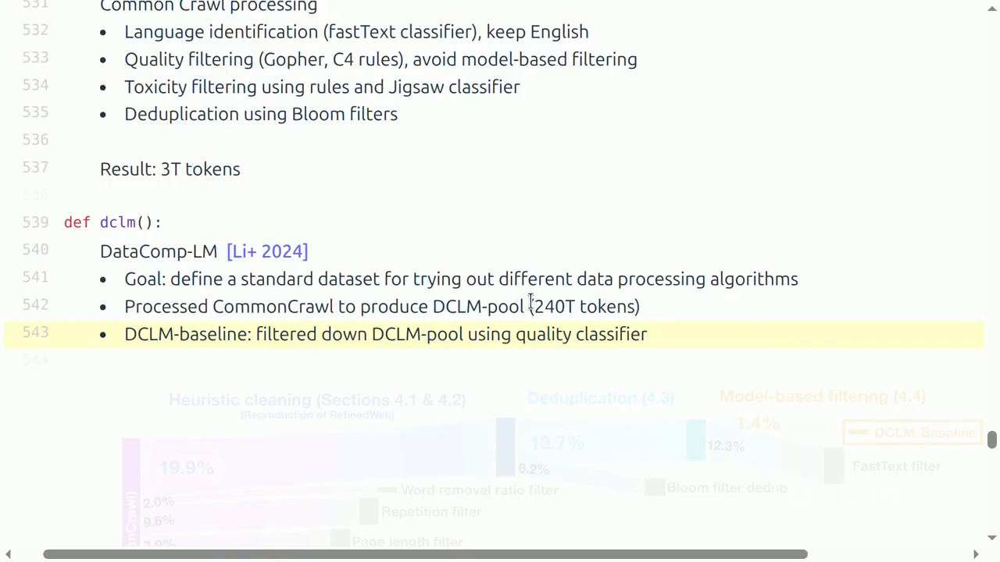

# Lecture 13：Data Sources and Datasets

> [!abstract] 本讲一句话
> 预训练数据不是“从互联网下载文本”，而是一条把 live service 转化为可审计、可许可、可复现训练样本的供应链；模型差异很大程度上来自这条供应链对来源、许可、解析和治理所做的长期选择。

## 来源与范围
- 课程：Stanford CS336 — Language Modeling from Scratch, Spring 2026
- 讲师：Percy Liang
- 上课日期：2026-05-11
- [课程视频](https://www.youtube.com/watch?v=-qm0ln33G24)，时长 1:22:02
- [课程主页](https://cs336.stanford.edu/)
- [官方可执行讲义](https://cs336.stanford.edu/lectures/?trace=lecture_13)
- 本讲覆盖：原始数据来源、网页抓取、版权和许可、Common Crawl、Wikipedia、GitHub、arXiv，以及主要开放预训练数据集的演进
- 下一讲继续：filtering、deduplication、mixing 与 synthetic data 的具体算法

> [!warning] 来源边界
> 正文按公开视频完整英文字幕与官方 `lecture_13.py` 交叉核对，下表是可跳转的真实时间点。法律部分只总结课程材料，不构成法律意见；版权、诉讼、robots 与服务条款会变化，实际使用数据时必须重新核对司法辖区、许可证原文与最新状态。课堂把版权期限口头简化成单一数字，本文不沿用该简化。

## 视频时间索引

| 时间 | 视频内容 | 对应笔记 |
| --- | --- | --- |
| [00:00](https://www.youtube.com/watch?v=-qm0ln33G24&t=0s) | 为什么 data 是长尾瓶颈 | [[#1. Data 是模型工程的长尾问题\|1]] |
| [02:18](https://www.youtube.com/watch?v=-qm0ln33G24&t=138s) | Pre/mid/post-training 三阶段 | [[#1.1 三个训练阶段的数据趋势\|1.1]] |
| [04:42](https://www.youtube.com/watch?v=-qm0ln33G24&t=282s) | Live web、crawler、访问限制 | [[#2. 从 live service 到训练样本\|2]] |
| [14:20](https://www.youtube.com/watch?v=-qm0ln33G24&t=860s) | Copyright、fair use、license、ToS | [[#3. 能访问不等于能使用\|3]] |
| [32:12](https://www.youtube.com/watch?v=-qm0ln33G24&t=1932s) | Common Crawl、WARC/WET、extractor | [[#4. Common Crawl：网页数据的原料层\|4]] |
| [36:08](https://www.youtube.com/watch?v=-qm0ln33G24&t=2168s) | Wikipedia、GitHub、arXiv | [[#5. 专门数据源\|5]] |
| [45:07](https://www.youtube.com/watch?v=-qm0ln33G24&t=2707s) | BooksCorpus、WebText、C4、GPT-3、Pile | [[#6. 早期数据配方\|6]] |
| [61:53](https://www.youtube.com/watch?v=-qm0ln33G24&t=3713s) | RefinedWeb、FineWeb、Dolma、DCLM | [[#7. 现代开放数据集的三条路线\|7]] |
| [67:26](https://www.youtube.com/watch?v=-qm0ln33G24&t=4046s) | Nemotron-CC synthetic rephrasing | [[#7.4 扩大数量：Nemotron-CC\|7.4]] |
| [71:00](https://www.youtube.com/watch?v=-qm0ln33G24&t=4260s) | The Stack | [[#8. Code、许可与可追溯性\|8]] |
| [74:44](https://www.youtube.com/watch?v=-qm0ln33G24&t=4484s) | Common Pile 与 license laundering | [[#8. Code、许可与可追溯性\|8]] |
| [79:30](https://www.youtube.com/watch?v=-qm0ln33G24&t=4770s) | 总结：从约 200T 过滤到不足 3T | [[#12. 本讲结论\|12]] |

## 视频补充：数据谱系与课堂口头边界

- “Trained on the Internet” 在类型上不成立：训练系统拿到的是 live services 经 crawler/dump 转成的静态 artifacts。Dynamic app、authentication、robots、Cloudflare、IP/rate limit、ToS、license 是不同的约束层。
- Common Crawl 每月数十亿页面，但 WARC 是 raw HTTP response、WET 是有损文本。Extractor choice 会改变下游 accuracy，说明 HTML-to-text 不是无关紧要的 ETL。
- Wikipedia dump 也可能被 poisoning：攻击者可在 dump 前短暂注入编辑，之后页面回滚却不自动修改已生成的数据快照。
- 早期数据集并不等于“干净历史”：BooksCorpus 后来因 ToS 下线，Books3 来源于 shadow library；透明披露有助复现，也可能暴露法律风险。
- DCLM 从约 240T-token pool 经 language/rule/dedup/model filtering 只保留极小部分；课堂强调正样本 OpenHermes/ELI5、负样本 RefinedWeb 的组合“有点奇怪但有效”。
- Llama 3 约 15T、Qwen3 约 36T 的训练 token 可能包含重复 epochs，不能当 unique-token 数。Common Pile 即使只用 public-domain/permissive data，也仍面临 collection license 不覆盖单文档、license laundering 与来源争议。



> 视频关键帧：[1:05:20](https://www.youtube.com/watch?v=-qm0ln33G24&t=3920s)。数据处理链中的每个百分比都是模型设计决策；“pool 有多大”和“最终训练了多少 unique/high-value tokens”是不同问题。

## 1. Data 是模型工程的长尾问题
此前课程大多回答：

> 给定数据，怎样构建、训练和扩展模型？
本讲开始回答：

> 究竟应该用什么数据训练？
开放权重模型通常会公开 architecture、参数量和训练系统，却很少完整公开数据。讲义给出两个现实原因：
1. 数据配方具有竞争价值；
2. 公开来源可能引入版权责任。
与 architecture 不同，数据问题不容易被一个简洁模块彻底解决：
- 网页格式和站点规则不断变化；
- 低频语言、长尾领域与非标准文档需要逐类处理；
- license、PII、恶意内容和重复内容都需要来源相关的决策；
- 每次删除都可能同时删除噪声和某类群体、语言或观点。
因此数据工程更像持续运营的供应链，而不是一次性预处理脚本。

### 1.1 三个训练阶段的数据趋势
课程用一个粗粒度阶段划分建立直觉：

| 阶段 | 典型数据 | 量与质的趋势 | 产物 |
| --- | --- | --- | --- |
| Pre-training | 网页、书籍、代码、论文等原始文档 | 极大量、平均质量较低 | 初步 base model |
| Mid-training | 精选领域、长上下文、高质量或能力定向数据 | 较少、更聚焦 | 完整 base model |
| Post-training | 指令、对话、偏好、可验证任务与 rollout | 更少、监督信号更强 | instruct/chat model |
边界并不严格，但沿训练流程常见趋势是：
$$
\text{data volume}\downarrow,\qquad
\text{average supervision/quality}\uparrow
$$

> [!note] 重要术语
> 课程把 pre-training + mid-training 后的模型称为 base model，把 post-training 后的模型称为 instruct/chat model；现实发布命名未必严格遵守这一约定。

## 2. 从 live service 到训练样本
“模型在整个 Internet 上训练”至少有两层不准确：
1. Internet 还包括很多网络协议和私有服务，通常实际指 public World Wide Web；
2. 即使是公开网页，也不能直接作为稳定训练数据。

### 2.1 Crawler 的基本循环
Crawler 从 seed URLs 开始：

```text
frontier = seed_urls
while budget_not_exhausted:
    url = scheduler.pop(frontier)
    if policy.allows(url):
        response = fetch(url)
        archive(response)
        frontier.add(extract_links(response))
```

这不是简单 BFS，还需要四类政策：
- **Selection policy**：优先抓什么页面；
- **Politeness policy**：尊重 `robots.txt`、rate limit 和服务器负载；
- **Revisit policy**：多久重新抓取发生变化的页面；
- **Canonicalization policy**：如何识别不同 URL 下的相同或近似内容。

### 2.2 为什么“网页可见”仍抓不到
- **Dynamic content**：内容需要 JavaScript、点击、表单或无限滚动才生成；
- **Authentication/paywall**：需要账户、订阅或登录状态；
- **Bot controls**：CAPTCHA、Cloudflare、IP/地域封锁；
- **Rate limits**：大规模抓取会降低服务质量并给站点造成成本；
- **robots.txt**：技术上通常是自愿协议，但表达站点的抓取意愿；
- **Terms of Service**：可能额外禁止自动下载；
- **Copyright/license**：取得 bytes 不自动取得训练许可。
这给数据集留下系统性 selection bias：更容易被 crawl 的静态、开放、英文网页会过度代表；封闭社区、付费媒体和动态服务则欠代表。

### 2.3 Shadow library 不是普通网页源
课程以 LibGen、Z-Library、Anna's Archive、Sci-Hub 为例说明：绕过付费墙并无视版权限制的 shadow library 即使技术上能访问，也不意味着适合作为合规数据源。数据治理不能把“URL 可下载”当作“组织有权复制和训练”。

## 3. 能访问不等于能使用

### 3.1 Copyright 保护什么
课程强调以下区别：
- Copyright 保护具体**表达**，通常不保护抽象 idea；
- 作品一旦固定在可感知媒介上就可能自动获得保护，不要求先注册；
- 门槛很低，所以“公开网页”大多仍受版权保护；
- 汇编本身可能因选择或编排的创造性受到保护，但其中每一项的权利仍需分别判断。
因此来源检查至少要分开：

```text
能否访问
  ≠ 能否复制
  ≠ 能否重新分发
  ≠ 能否用于训练
  ≠ 模型输出可以复现原作
```

### 3.2 两条常见使用路径
1. 获得 license；
2. 在具体案件中主张 fair use。
Creative Commons 提供一族标准许可，但 `CC-BY`、`CC-BY-SA`、`CC-BY-NC` 等义务不同，不能只记录“CC”。商业许可则通常由数据提供方与模型开发者签约。
美国 fair use 常以四因素分析：
1. 使用目的与性质，是否 transformative；
2. 原作品性质；
3. 使用部分的数量与实质性；
4. 对原作品现有或潜在市场的影响。

> [!warning] 不要把 fair use 当数据标签
> Fair use 是依赖事实的法律抗辩，不是给单条文档打一个布尔值就能永久解决的问题。课程列出的诉讼结论也只适用于特定案件事实。

### 3.3 License 与 ToS 是不同约束层
即使作品使用某种宽松 license，站点 ToS 仍可能限制抓取方式；反过来，站点允许下载也不代表其拥有站内每个用户作品的再许可权。工程上必须记录：
- 内容作者/权利主体；
- 页面声明的作品 license；
- collection 或 dataset license；
- 获取时的站点 ToS 与 robots 状态；
- 下载日期、URL、crawl ID；
- 后续删除、opt-out 与 takedown 记录。

## 4. Common Crawl：网页数据的原料层
[Common Crawl](https://commoncrawl.org/) 是 2007 年成立的非营利组织，周期性运行大规模 web crawl。课程给出的 2026 年量级是累计约 300B pages，单次 crawl 常包含数十亿页面。

### 4.1 WARC 与 WET

| 格式 | 内容 | 优点 | 风险 |
| --- | --- | --- | --- |
| WARC | 原始 HTTP response，包括 HTML | 可重新解析、保留结构 | 大、解析昂贵 |
| WET | 已转换的纯文本 | 直接、较小 | 有损，无法挽回错误抽取 |
HTML-to-text 不是无关紧要的清洗步骤。正文识别错误会把导航、cookie banner、广告和 boilerplate 送进训练，也可能删掉表格、代码或标题层次。讲义引用 DCLM 的结果强调：`trafilatura`、`resiliparse`、`jusText` 等 extractor 的选择会改变下游准确率。

### 4.2 一个可复现的文档记录
建议把每个文档表示为 payload + provenance：

```json
{
  "doc_id": "sha256(normalized_source_key)",
  "source_url": "...",
  "crawl": "CC-MAIN-...",
  "fetched_at": "...",
  "http_status": 200,
  "content_type": "text/html",
  "raw_warc_ref": "...",
  "extractor": "trafilatura@version",
  "text_hash": "...",
  "license_evidence": "...",
  "pipeline_version": "..."
}
```

这使得后续发现 PII、版权异议或解析 bug 时，可以定位受影响样本并重建数据集。

## 5. 专门数据源

### 5.1 Wikipedia
特点：
- 百科体、高信息密度、跨语言；
- 不接受原创研究，内容受 notability 与可靠来源约束；
- 可直接使用周期性 dumps，不必抓页面；
- 社区治理能快速回滚 vandalism，但不是绝对防护。
课程特别提醒 **data poisoning**：攻击者可能在 dump 生成前短暂注入恶意编辑，即使后来被回滚，快照中仍可能保留。因此“高质量来源”也需要版本、时间和异常检测。

### 5.2 GitHub 与 Software Heritage
代码数据不只有 source file：
- repository tree 和 commit history；
- issues、pull requests、review comments；
- tests、documentation 与 build metadata。
获取路径也不同：repository 更适合用 Git 协议；事件和元数据可通过 GitHub API/Archive；Software Heritage 聚合多个代码托管站点并侧重长期保存。
代码数据的主要难点：
- forks、vendored dependency 和模板造成大量重复；
- 需识别 permissive license，不能把“public repo”直接视为可训练；
- secrets、email、public IP、malware 和生成文件需要处理；
- 文件之间存在依赖，按单文件切分会丢失结构。

### 5.3 arXiv
arXiv 提供 metadata、PDF，部分投稿还含 LaTeX source：
- metadata 通常更容易获得和许可；
- PDF parsing 会丢失公式与阅读顺序；
- LaTeX source 保留结构，但宏、注释、bibliography 和编译依赖需要处理；
- 论文正文 license 由作者选择，不应从“arXiv 免费阅读”推导出统一训练许可。

### 5.4 Books、Project Gutenberg 与 Stack Exchange
- Books 提供长程叙事和跨章节依赖，但版权风险突出；
- Project Gutenberg 以版权已清理、许多进入 public domain 的书为主；
- BooksCorpus 和 Books3 分别展示了违反 ToS、来自 shadow library 的风险；
- Stack Exchange 的问答格式接近指令数据，votes、tags、accepted answer 等 metadata 还能用于质量筛选。

## 6. 早期数据配方

### 6.1 BERT 与 WebText
**BERT** 使用 Wikipedia 与 BooksCorpus，且把 sequence 组织成 document 而非彼此独立的 sentence。
**GPT-2 WebText** 用 Reddit 外链且帖子 karma $\ge 3$ 作为质量代理：
$$
\text{Reddit endorsement}
\rightarrow
\text{candidate URL}
\rightarrow
\text{downloaded page}
$$
它是便宜的 human curation，但会继承 Reddit 用户和社区的偏好。OpenWebText 是公开复现，并增加 language filtering 与 near-dedup。

### 6.2 CCNet 与 C4
**CCNet** 的典型管线：
1. paragraph dedup；
2. fastText language ID；
3. 用 Wikipedia 训练的 5-gram KenLM perplexity 判断文档是否“像 Wikipedia”。
**C4** 从 Common Crawl 出发，使用大量手工规则：
- 句行长度和标点要求；
- 页面最少句数；
- language detection；
- 移除 bad-word list 命中的页面；
- 排除代码、`lorem ipsum`、terms-of-use 等模式。
这些规则能快速去噪，也会带来偏差。例如整页 bad-word 删除会不成比例地过滤讨论身份、健康或边缘社群的正常文本。

### 6.3 GPT-3、The Pile 与 MassiveText
**GPT-3** 混合 processed Common Crawl、WebText2、books 与 Wikipedia，并用高质量来源训练 classifier 过滤 Common Crawl，再做 fuzzy dedup。
**The Pile** 反过来强调 22 个显式 domain 的 curated mixture，包括 Pile-CC、PubMed Central、arXiv、Enron email、Project Gutenberg、Books3 和 Stack Exchange。
**MassiveText/Gopher** 展示另一条路线：多来源混合，使用 language、dedup、train-test overlap、manual quality rules 与 toxicity filtering；可用数据远大于最终采样训练的数据。

## 7. 现代开放数据集的三条路线

### 7.1 Web-only：RefinedWeb / FineWeb
RefinedWeb 的主张是高质量 web data 本身可以支持强模型：
- 从 WARC 重新做 HTML extraction；
- Gopher-style rule filtering；
- 对 5-gram shingles 做 MinHash fuzzy dedup；
- 避免 model-based filtering，以减少 classifier 带来的窄化。
FineWeb 在更多 Common Crawl dumps 上扩展流程，并加入 URL filter、language ID、更多规则、MinHash 与 email/public-IP anonymization。

### 7.2 Multi-source：Dolma
Dolma 混合 Common Crawl、Reddit、学术论文、C4、Project Gutenberg、Wikipedia/Wikibooks 等来源，并对网页做 language ID、rule filtering、toxicity filtering 与 Bloom-filter dedup。
多来源的价值是覆盖互补，代价是：
- 每个来源 schema、license 和质量信号不同；
- source mixture 本身成为重要超参数；
- global dedup 比 source-local dedup 更复杂。

### 7.3 Benchmark-driven filtering：DCLM
DataComp-LM 先构建约 240T token 的 DCLM-pool，再把 dataset construction 变成可比较实验。DCLM baseline 用正负样本训练 fastText quality classifier：
$$
s(x)
=
P_\phi(\text{high quality}\mid x)
$$
然后按阈值或分位数过滤 pool，训练固定预算模型，用下游 evaluation 比较数据处理策略。
关键观念是：数据算法的目标不是让样本“看起来干净”，而是在受控训练预算下提高模型能力。

### 7.4 扩大数量：Nemotron-CC
课程把 Nemotron-CC 作为“quality filter 过于激进时如何恢复 token 数”的例子：
- ensemble DCLM classifier 与由大模型教育价值评分蒸馏出的 classifier；
- 对低质量文档用模型 rephrase；
- 对高质量文档生成 QA、key-information extraction 等 synthetic variants。
这引入新的治理问题：synthetic text 的来源关系、生成模型许可、事实漂移和重复模式必须进入 lineage，而不能把生成输出当作无来源的新数据。

## 8. Code、许可与可追溯性

### 8.1 The Stack
课程中的 The Stack 管线包括：
1. 从 GitHub Archive 获得 repository 列表；
2. clone repositories；
3. 用 license detector 保留 permissive license；
4. 用 MinHash/Jaccard 去除 near-duplicates；
5. 在 Stack v2 加入 issues、comments、PR、文档和 Software Heritage。
PR 数据是结构化对象，通常需线性化为 token sequence，并添加 diff 周围的 source context。这个转换必须保留 repo、commit、file path 和 parent commit，否则样本难以复查。

### 8.2 Common Pile
Common Pile 追问：只用 public-domain 或 permissively licensed data 能否训练有竞争力的模型？课程强调三个陷阱：
- **License laundering**：上游无权却以宽松 license 再分发；
- dataset/collection license 不自动覆盖其中每个 document；
- 从未许可数据训练的模型生成 synthetic data，其权利状态并不会自动清晰。
因此“license-clean”不是只运行一次 license classifier，而是端到端的 evidence chain。

## 9. 拓展：Data lineage 与治理设计

### 9.1 Dataset 不是一个文件，而是版本化 DAG

```text
live sources / dumps → raw immutable archive → extraction → filtering
→ dedup clusters → mixture / sampling → tokenized shards → training run
→ model checkpoint / eval

license / consent / PII evidence ─┬→ filtering
                                  └→ mixture / sampling
```

每个 edge 都应有代码版本、配置、时间和输入/输出 manifest。建议最少记录：
- source + retrieval timestamp + immutable object ID；
- raw、normalized text 与 tokenized content 的 hashes；
- extractor/filter/dedup 版本和 score；
- license、ToS、robots、consent/opt-out evidence；
- cluster ID、split、mixture weight；
- shard ID、token range、训练 run ID；
- deletion/takedown tombstone。

### 9.2 可删除性必须提前设计
若训练后才发现某一来源不能使用，需要回答：
1. 哪些 raw objects 来自该来源？
2. 派生出了哪些 normalized docs 和 synthetic variants？
3. 被分配到哪些 shards 与 checkpoints？
4. 是否需要重建数据、重新训练或采用其他补救？
没有 lineage 时，删除只能停留在“以后不再下载”，无法证明已有派生物得到处理。

## 10. 拓展：AI Infra 视角

### Shape
数据 tensor 常见 shape：
$$
\text{input\_ids}\in\mathbb{N}^{B\times L}
$$
但上游文档长度是重尾分布。tokenization、packing、truncation 会把 document DAG 映射为固定/变长 sequence；若不保留映射，很难追踪某 token 来自哪个文档。

### Compute
数据处理总 compute 可粗写成：
$$
C_{\text{data}}
=
C_{\text{download}}
+C_{\text{parse}}
+C_{\text{classify}}
+C_{\text{dedup}}
+C_{\text{tokenize}}
+C_{\text{synthetic}}
$$
简单规则通常近似线性；model-based scoring 和 synthetic generation 可能成为最大的 GPU 成本。

### Memory / Storage
应区分：
- raw WARC；
- extracted text；
- metadata/index；
- dedup signatures；
- tokenized shards。
WARC 保留可重处理能力，却显著增大 cold storage；只保存 WET 节省空间，却把 extractor 错误永久固化。

### Communication
抓取受公网带宽和站点 politeness 限制；集群内则常受 object-store 吞吐、小文件数量和 shuffle 限制。训练前最好生成足够大的顺序 shards，避免每个 worker 随机读取海量小文档。

### Runtime
成熟管线应具备：
- idempotent stage；
- content-addressed artifacts；
- checkpoint/retry；
- deterministic manifests；
- observability（每来源保留率、错误率、token rate）；
- quarantine 与人工审查队列。

## 11. 拓展：我的推导与易错点

### 11.1 数据质量的价值要乘上训练成本
设原始 pool 有 $T$ tokens，过滤保留率为 $r$，固定训练 token budget 为 $D$。若 $rT<D$，即使样本平均质量更高，也会导致重复 epoch 或数据不足。因此选择阈值时优化的不是单文档平均分：
$$
\max_{\tau}
\ \text{model quality}\big(
\text{sample}(x:s(x)\ge\tau),D
\big)
$$
而不是：
$$
\max_{\tau}
\ \mathbb{E}[s(x)\mid s(x)\ge\tau]
$$
这解释了为什么 DCLM 重视固定训练预算 benchmark，也解释了 Nemotron-CC 为什么尝试恢复数量。

### 11.2 “公开、免费、开放、可训练”不是同义词

| 词 | 只说明什么 | 不保证什么 |
| --- | --- | --- |
| Publicly accessible | 浏览器或 API 可访问 | 批量抓取、复制、训练 |
| Free of charge | 不收费 | copyright/license |
| Open source/open data | 有某种开放许可 | 上游权利链完整 |
| Public domain | 不受版权限制或版权已届满 | 无隐私、ToS、地域问题 |

### 11.3 Dataset card 不能替代 document-level provenance
Dataset card 能说明总体构建方式，但 takedown、审计和 bias analysis 往往需要 document-level evidence。只保存聚合统计无法反向定位问题样本。

### 11.4 常见错误
- 用 WET 就以为已经得到“正文”；
- 把 language-ID score 当作语言事实，忽略 code-switching；
- 只在单一来源内 dedup，漏掉跨来源复制；
- 把 collection license 自动套到每条内容；
- 过滤后只看保留 token 数，不看被删群体与 domain；
- 为节省 storage 删除 raw data，却失去修复 extractor 的能力；
- 记录 URL 而不记录 crawl/time，动态页面后来已完全变化。

## 12. 本讲结论
1. Data 不会从天上掉下来；训练集来自持续维护的采集、解析和治理供应链。
2. “整个互联网”既不准确也不可操作；动态内容、认证、技术限制、ToS 与 copyright 会系统性改变可见数据。
3. Common Crawl 是原料而不是训练集，HTML extraction 本身就影响模型质量。
4. Wikipedia、GitHub、arXiv、books 与 Q&A 各有独特结构、metadata、许可和偏差。
5. C4、The Pile、RefinedWeb、Dolma、DCLM 等数据集代表 rule-based、curated mixture、web-only 与 model-based filtering 等不同路线。
6. 许可治理必须区分内容权利、collection license、抓取规则与 fair-use 判断。
7. 数据谱系是 infra 基础设施：没有版本化 provenance，就无法真正复现、审计和删除。

## 13. 自测问题
1. 为什么模型不能直接在 live web server 上训练？

    **面试回答：** Live web 的内容、URL 和权限会变化，下载延迟与站点限流也无法满足 GPU 稳定供数，训练过程中实时抓取还难以复现数据版本。实际应先按采集政策抓取或使用 dump，保存可追溯快照，再做解析、过滤、去重和分片，把不稳定的在线服务变成可重复读取的训练样本。

2. WARC 与 WET 的取舍是什么？为什么 extractor 会影响下游 accuracy？

    **面试回答：** WARC 保留原始 HTTP 内容，方便重新解析和审计，但体积大、处理贵；WET 是已抽取文本，更轻便，却无法恢复被错误删除的结构。Extractor 决定正文、代码、表格和段落是否保留，也决定广告与导航是否混入，直接改变模型收到的训练信号及下游 accuracy。

3. `robots.txt`、ToS、copyright 和 license 分别约束什么？

    **面试回答：** `robots.txt` 描述爬虫访问规则，并不授予内容使用权；ToS 规定服务使用条件；copyright 保护作品表达；license 由有权授权者规定允许哪些使用及其条件。工程上应分开记录抓取许可与内容权利，不能用“允许访问”代替“允许训练”，具体适用还取决于司法辖区和使用方式。[RFC 9309](https://www.rfc-editor.org/rfc/rfc9309.html#section-1)、[版权概述](https://www.copyright.gov/help/faq/faq-general.html)

4. 为什么 public repository 不等于 permissively licensed code？

    **面试回答：** Public 只表示可见，仓库可能没有 license，也可能采用附带较强义务的许可；缺少明确许可不能自动按 MIT/Apache 处理。还要检查文件级声明、vendored dependencies 和上游权利链，因为仓库首页的 license 未必覆盖全部内容；GitHub 允许查看或 fork 也不等于授予所有其他用途。[GitHub 许可说明](https://docs.github.com/en/repositories/managing-your-repositorys-settings-and-features/customizing-your-repository/licensing-a-repository)

5. WebText 的 Reddit karma proxy 带来什么优点和 selection bias？

    **面试回答：** Reddit karma 相当于低成本的人类推荐信号，比随机抓网页更容易筛到有信息量、读者愿意分享的内容。它同时偏向 Reddit 用户的人口结构、语言、兴趣与流行话题，冷门专业内容和未被链接的高质量页面容易漏掉；所以“受欢迎”只是质量代理，不能代表全网分布。

6. CCNet 的 Wikipedia perplexity filter 与 C4 手工规则分别会偏向什么文本？

    **面试回答：** CCNet 用 Wikipedia 训练的语言模型打 perplexity，会偏好类似百科的规范表达、主题与语言分布，不等于衡量通用真实性。C4 的长度、标点、坏词和代码规则偏向完整自然语言散文，可能过滤代码、口语，以及讨论身份、健康等主题的正常文本；二者都把过滤器偏好写入训练集。

7. The Pile 的 domain mixture 与 RefinedWeb 的 web-only 路线有什么不同？

    **面试回答：** The Pile 显式混合多个领域来源，借助书籍、论文、代码和问答等互补覆盖能力，但需要管理来源许可、混合权重和跨源重复。RefinedWeb 主要依靠大规模网页的重新抽取、规则清洗和去重证明 web-only 路线的潜力；关键区别是靠来源配方补齐覆盖，还是优先把网页原料处理好。

8. 为什么 quality threshold 越高不一定越好？

    **面试回答：** 提高阈值能提升平均代理分数，却会缩小 unique-token pool、删去长尾领域，固定训练预算下还可能迫使数据反复使用。最优点取决于模型规模、训练 tokens 和目标任务，应比较实际训练后的能力及各领域保留率，而不是只追求过滤后数据的平均质量分数。

9. Dataset/collection license 为什么不必然覆盖单条 document？

    **面试回答：** 数据集发布者可能只拥有汇编、整理或自身新增内容的权利，不能仅靠给 collection 标注宽松许可就改变原文档的许可。单篇内容仍可能属于不同作者或包含第三方材料，因此要保留 document-level 来源和授权证据；例如 CC 明确说明，汇编许可不改变所收录作品的原许可。[Creative Commons FAQ](https://creativecommons.org/faq/#if-i-create-a-collection-that-includes-a-work-offered-under-a-cc-license-which-licenses-may-i-choose-for-the-collection)

10. 若收到数据删除请求，一条合格 lineage 应让你回答哪些问题？

    **面试回答：** 应能定位请求对应的 raw objects、抓取时间与来源证据，并追踪它们派生的正文、去重副本、合成变体、token shards 和训练 run/checkpoints。还要说明哪些副本已删除、哪些数据需重建、模型影响如何处理以及后续如何阻止重新摄入；删除原始文件本身不能证明已有模型已忘记该数据。


## 参考资料
- [Stanford CS336 课程主页与 Schedule](https://cs336.stanford.edu/)
- [Lecture 13 官方可执行讲义](https://cs336.stanford.edu/lectures/?trace=lecture_13)
- [Lecture 13 视频](https://www.youtube.com/watch?v=-qm0ln33G24)
- [Common Crawl](https://commoncrawl.org/)
- [CCNet](https://arxiv.org/abs/1911.00359)
- [C4 / T5](https://arxiv.org/abs/1910.10683)
- [The Pile](https://arxiv.org/abs/2101.00027)
- [RefinedWeb](https://arxiv.org/abs/2306.01116)
- [Dolma](https://arxiv.org/abs/2402.00159)
- [DataComp-LM](https://arxiv.org/abs/2406.11794)
- [The Stack](https://arxiv.org/abs/2211.15533)
- [Common Pile](https://arxiv.org/abs/2506.05209)
