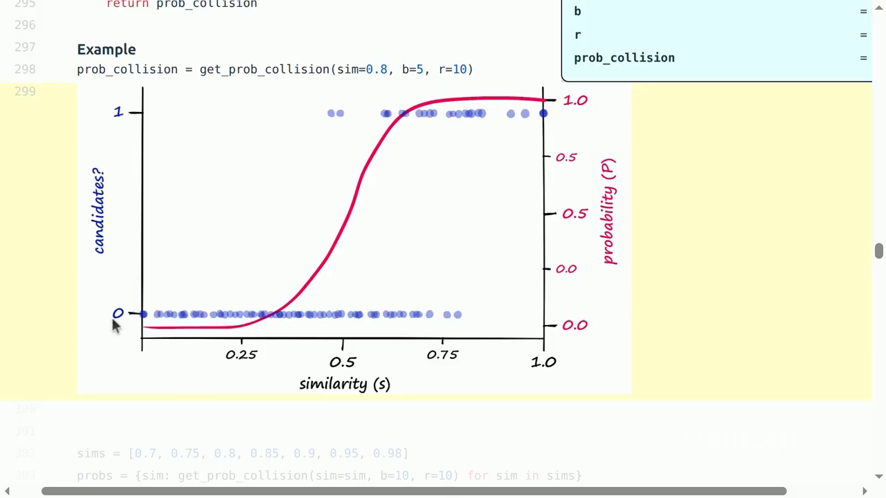

# Lecture 14：Data Filtering, Deduplication, Mixing, and Synthetic Data

> [!abstract] 本讲一句话
> 数据管线的核心不是“删掉脏数据”，而是以固定训练预算为目标，用可扩展的 transformation、filtering、deduplication 和 mixing 算法分配每一个 token 的价值，并将 synthetic-data 生成本身视为一套昂贵、带偏差的训练系统。

## 来源与范围
- 课程：Stanford CS336 — Language Modeling from Scratch, Spring 2026
- 讲师：Percy Liang
- 上课日期：2026-05-13
- [课程视频](https://www.youtube.com/watch?v=5sxHosTLPF8)，时长 1:24:46
- [课程主页](https://cs336.stanford.edu/)
- [官方可执行讲义](https://cs336.stanford.edu/lectures/?trace=lecture_14)
- 本讲覆盖：document transformation、classifier-based filtering、exact/fuzzy deduplication、MinHash/LSH、data mixture、epoch cap、regression mixing 与 synthetic post-training data

> [!warning] 来源边界
> 公式、算法顺序和案例按公开视频人工英文字幕与官方 `lecture_14.py` 交叉核对；下面是可跳转的真实时间点。SWE-Zero、OpenThoughts 等 2026 案例只按课程材料概述，不延伸成对后续系统的判断。

## 视频时间索引

| 时间 | 内容 | 对应笔记 |
| --- | --- | --- |
| [00:00](https://www.youtube.com/watch?v=5sxHosTLPF8&t=0s) | 从 raw data 到 trainable data | [[#1. 数据管线的目标函数\|1]] |
| [05:58](https://www.youtube.com/watch?v=5sxHosTLPF8&t=358s) | PDF transformation 的质量与难点 | [[#2.2 PDF-to-text\|2.2]] |
| [08:38](https://www.youtube.com/watch?v=5sxHosTLPF8&t=518s) | 100T 原始池、model-based filtering | [[#3. Filtering：定义什么叫好\|3]] |
| [17:50](https://www.youtube.com/watch?v=5sxHosTLPF8&t=1070s) | 过滤阈值随训练规模变化 | [[#3.5 阈值依赖训练规模\|3.5]] |
| [25:49](https://www.youtube.com/watch?v=5sxHosTLPF8&t=1549s) | 重复 61,000 次的 C4 商品描述 | [[#4. Deduplication 的问题定义\|4]] |
| [32:20](https://www.youtube.com/watch?v=5sxHosTLPF8&t=1940s) | Jaccard 与 MinHash | [[#5. 可扩展的 fuzzy dedup\|5]] |
| [38:05](https://www.youtube.com/watch?v=5sxHosTLPF8&t=2285s) | Locality-sensitive hashing | [[#5.4 LSH banding\|5.4]] |
| [48:55](https://www.youtube.com/watch?v=5sxHosTLPF8&t=2935s) | 跨来源全局 dedup | [[#4. Deduplication 的问题定义\|4]] |
| [52:20](https://www.youtube.com/watch?v=5sxHosTLPF8&t=3140s) | Data mixing、epochs、UniMax | [[#6. Data mixing\|6]] |
| [1:00:40](https://www.youtube.com/watch?v=5sxHosTLPF8&t=3640s) | RegMix 与 simulated epoching | [[#7. 用小实验预测 mixture\|7]] |
| [1:11:59](https://www.youtube.com/watch?v=5sxHosTLPF8&t=4319s) | Q&A：domain × quality mixture cells | [[#6. Data mixing\|6]] |
| [1:15:58](https://www.youtube.com/watch?v=5sxHosTLPF8&t=4558s) | Synthetic data 与 OpenThoughts | [[#8. Synthetic data 管线\|8]] |

## 视频补充：数据处理不是独立算子的串联

- 讲师给出经验判断：PDF 往往质量较高，因为制作本身需要投入；但 PDF 比 HTML 更容易丢失阅读顺序、表格和版面语义。这不是“PDF 永远更好”的定律。
- 原始池可达 100T tokens，最后可能只留个位数百分比。算力不足以对所有候选做训练实验，促使 model-based filtering 成为常态。
- C4 审计中一个商品描述重复约 61,000 次；dedup 不只是节省 token，也影响 test contamination 和 memorization。
- Dedup 必须在合并后的多来源数据上执行。只在来源内部去重，会让同一文档从 Common Crawl、Wikipedia mirror、代码仓库文档等路径重复进入 mixture。
- 即使只有 Common Crawl，也可以先按“domain × quality”划为二维 mixture cells，再与外部来源共同采样。
- OpenThoughts 的 1.2M examples 来自每 prompt 采样 16 个回答，实际约 75K prompts；example 数不等于独立任务数，更强 teacher 也不保证更好数据。



> 视频关键帧：[43:15](https://www.youtube.com/watch?v=5sxHosTLPF8&t=2595s)。增加每 band 的 rows $r$ 会让曲线更陡并右移；增加 bands $b$ 会把曲线左移。LSH 返回 candidates，仍需精确相似度复核。

## 1. 数据管线的目标函数
上一讲得到：
$$
\text{live source}
\rightarrow
\text{dump/crawl}
\rightarrow
\text{raw artifacts}
$$
本讲继续：
$$
\text{raw artifacts}
\xrightarrow{\text{transform}}
\text{text}
\xrightarrow{\text{filter}}
\text{candidate docs}
\xrightarrow{\text{dedup}}
\text{unique docs}
\xrightarrow{\text{mix}}
\text{training tokens}
$$
每一阶段都在优化同一个最终目标：
$$
\max_{\mathcal D,\ p}
\ Q\big(\operatorname{Train}(\mathcal D,p;C)\big)
$$
- $\mathcal D$：保留下来的数据；
- $p$：各来源的采样分布；
- $C$：固定 compute/token budget；
- $Q$：目标 evaluation 上的模型质量。
因此局部指标只是 proxy：
- extractor 的字符覆盖率不等于下游质量；
- classifier score 高不等于样本一定有用；
- dedup 后 token 越少不等于越好；
- mixture 中“高质量来源越多”也会因重复 epoch 而过拟合。

## 2. Transformation：结构化内容到文本
原始数据常是 HTML、PDF、LaTeX、repository tree，而 LM 输入通常是线性 token sequence。

### 2.1 HTML-to-text
Extractor 要去掉：
- navigation、footer、ads；
- cookie banner、related links；
- duplicated mobile/desktop content；
- scripts 和 styling。
同时又要保留：
- 标题与段落边界；
- list、table、code block；
- image caption 与 alt text；
- 文档顺序。
这是有损映射：
$$
f:\text{DOM tree}\rightarrow\text{token sequence}
$$
不同 `trafilatura`、`resiliparse`、`jusText` 或规则会改变 $f$。课程引用 DCLM 强调 extractor choice 会影响模型 evaluation，说明解析不是“训练前无关紧要的 ETL”。

### 2.2 PDF-to-text
PDF 主要保存页面绘制指令，而不是语义阅读顺序。课件以 FinePDFs 为例：
1. 从 crawl 中定位 PDF；
2. 重新抓取可能被截断的大文件；
3. 用 OCR/VLM 或 Docling 转换；
4. 做 cleanup 与 filtering。
常见损失包括 multi-column 顺序、公式、table structure、footnote 与图注关系。因此应保留 raw PDF、page spans 和 extractor version，避免只保存不可逆的纯文本。

## 3. Filtering：定义什么叫好

### 3.1 统一框架
给定少量 target data $T$ 与海量 raw data $R$，寻找 $R$ 中像 $T$ 的子集：
1. 用 $T$，有时也用 $R$，估计 scoring model；
2. 对每个 $x\in R$ 算 $s(x)$；
3. threshold、rank 或 stochastic sample。
两类经典 score：
$$
s_{\text{gen}}(x)=p_T(x)
$$
$$
s_{\text{disc}}(x)=P(y=T\mid x)
$$
前者可用 KenLM，后者可用 fastText/linear classifier。工程要求是：
- 能从小 target set 泛化；
- inference 极快，因为 $|R|$ 可达 trillion-token 量级。

### 3.2 Language identification
fastText language-ID 支持大量语言，Dolma 示例按 $P(\text{English}\mid x)$ 阈值保留英文页。
易错点：
- classifier 的训练域以 Wikipedia 等为主，网页短句和 code-switching 会 domain shift；
- 低资源语言 error rate 往往更高；
- document-level 单标签会删除多语文档；
- 语言阈值改变各语言最终 token 比例。

### 3.3 Quality filtering
课程案例体现三种设计：

| 案例 | Target/positive | Model | 选择方式 |
| --- | --- | --- | --- |
| GPT-3 | Wikipedia、WebText2、Books | word-feature linear classifier | 依 score 随机保留 |
| LLaMA | 被 Wikipedia 引用的网页 | classifier | 判为 positive 即保留 |
| phi-1 | GPT-4 标注 educational value | code embedding + random forest | 选择教育价值高的 code |
OpenMathText 先用 LaTeX 规则找候选，再用 ProofPile 上的 KenLM perplexity 与 math classifier 过滤。这说明 domain-specific filter 通常优于一个通用“质量分数”。

### 3.4 Toxicity filtering
Dolma 使用 Jigsaw Toxic Comments 的类别信号。过滤能降低明显有害内容，却有三重风险：
1. identity term 可能被 classifier 当作 toxicity proxy；
2. 删除讨论伤害的文本会损害模型理解和安全分类能力；
3. 训练标注来自特定社区，跨域 calibration 未必稳定。
所以必须按 group/domain 统计 false positive，并保留安全研究所需的受控数据，而非只追求总体 removal rate。

### 3.5 阈值依赖训练规模
不存在对所有 compute budget 都最优的单一阈值：
- 训练较短时，更严格过滤可提高平均质量；
- 训练更长时，过严过滤会让数据不够，导致重复 epoch。
设 threshold $\tau$ 后有 $T(\tau)$ 个 token，计划训练 $D$ tokens，则平均 epoch 数：
$$
E(\tau)=\frac{D}{T(\tau)}
$$
$\tau$ 越高通常 $T(\tau)$ 越小、$E(\tau)$ 越大。最优 threshold 必须和训练 horizon 联合选择。

## 4. Deduplication 的问题定义
重复包括：
- **Exact duplicates**：mirror、fork、转载；
- **Near duplicates**：只改少量 token、格式或模板字段；
- **Subdocument duplicates**：license、boilerplate、固定产品描述；
- **Semantic duplicates**：措辞不同但信息相同，最难可靠识别。
Dedup 的设计空间有三个轴：
1. item 是 sentence、paragraph、span 还是 document；
2. match 是 exact、共享 subitem 还是相似度阈值；
3. action 是删全部、留一个、还是从文档中切除 span。
好处：
- 固定 unique-token budget 下覆盖更多信息；
- 减少 memorization 和 evaluation contamination；
- 缩短训练或减少重复 epoch。
风险：
- 删除文档中间 span 会破坏上下文连贯；
- 常见规范文本可能被过度删除；
- cluster 代表选择会改变 source/domain 分布。

## 5. 可扩展的 fuzzy dedup
全量 pairwise comparison 是：
$$
O(n^2)
$$
无法扩展到十亿文档。课程用 hash、MinHash 与 Locality-Sensitive Hashing（LSH）把候选生成降到近线性。

### 5.1 Exact hashing
先 canonicalize：

```python
normalized = normalize(document)
key = hash(normalized)
emit(key, doc_id)
```

对相同 key 分组并保留一个代表。SHA-256 collision resistance 强但较慢；MurmurHash 等非加密 hash 更快。即使用非加密 hash，生产系统也应在候选组内比较 normalized bytes，避免 collision 误删。

### 5.2 Jaccard similarity
把文档转换为 $k$-gram/shingle 集合 $A,B$：
$$
J(A,B)
=
\frac{|A\cap B|}{|A\cup B|}
$$
若 $J(A,B)\ge\tau$，视为 near duplicate。

### 5.3 MinHash
对集合 $S$ 和随机 hash/permutation $h$：
$$
m_h(S)=\min_{x\in S}h(x)
$$
MinHash 的关键性质：
$$
P[m_h(A)=m_h(B)]
=
J(A,B)
$$
用 $n$ 个独立 MinHash 得到 signature，匹配比例是 Jaccard 的无偏近似。
直觉：在 $A\cup B$ 的随机次序中，最小元素落入 $A\cap B$ 时两个集合的 MinHash 才相同；概率正是交集占并集的比例。

### 5.4 LSH banding
将 $n=br$ 个 MinHash 分成 $b$ 个 bands，每 band 有 $r$ 个值。若至少一个 band 全相同，就把两文档送入候选对：
$$
P(\text{collision}\mid s)
=
1-(1-s^r)^b
$$
其中 $s=J(A,B)$。
- 增大 $r$：匹配更严格，曲线右移；
- 增大 $b$：更容易产生候选，曲线左移；
- 近似阈值：
$$
\tau\approx\left(\frac{1}{b}\right)^{1/r}
$$
LSH 不直接证明两个文档重复，只做 candidate generation。生产流程仍应对候选计算真实 Jaccard，并对连通 components/clusters 选择代表。

## 6. Data mixing
设来源集合为 $\mathcal S$，mixture：
$$
p_s\ge0,\qquad
\sum_{s\in\mathcal S}p_s=1
$$
训练 $D$ tokens 时，来源 $s$ 被采样：
$$
D_s=p_sD
$$
若该来源只有 $N_s$ unique tokens，则 epoch 数：
$$
E_s=\frac{p_sD}{N_s}
$$
三个 baseline：
- Manual/vibes：专家手调；
- Uniform：$p_s\propto1$；
- Proportional：$p_s\propto N_s$。
难点在于同时平衡：
- source quality；
- domain/language diversity；
- token availability；
- 重复 epoch 的 overfitting；
- 下游目标的权重。
课程例子中，10B-token 高质量源若在 1T-token 训练中占 50%，就会经历：
$$
\frac{0.5\times1T}{10B}=50
\text{ epochs}
$$
这说明 mixture weight 不能脱离 source size 讨论。

### 6.1 UniMax
UniMax 从尽量 uniform 出发，但限制任一来源的最大 epoch：
$$
p_sD\le C N_s
$$
其中 $C$ 是 epoch cap。它防止低资源语言/小数据源因过度 upsampling 而反复出现。

## 7. 用小实验预测 mixture
Regression-based mixing 的流程：
1. 从 Dirichlet 等 proposal 分布采样 mixtures $p^{(1)},\ldots,p^{(K)}$；
2. 训练小模型；
3. 记录每个 mixture 的 validation/downstream loss；
4. 拟合 $\hat L(p)$；
5. 求 $\arg\min_p\hat L(p)$，再迁移到大训练。
两个关键假设：
- regression 在 optimum 附近足够准确；
- small-scale optimum 能转移到 large scale。

### 7.1 Scale mismatch 与 simulated epoching
小实验 token 少，不容易暴露小来源的重复问题。课程提出 simulated epoching：若小实验 token 与大实验 token 比率为
$$
\rho=\frac{D_{\text{small}}}{D_{\text{large}}}
$$
则在小实验中把所有 source 的可用 token 也缩到：
$$
\tilde N_s=\rho N_s
$$
于是候选 mixture 在小规模就会经历与大规模相似的 epoch pressure，避免选出只在“不重复数据”假设下成立的极端配方。

> [!warning] Eval overfitting
> 用下游 eval 选择 mixture 也是一种超参数搜索。若反复围绕少量 benchmark 优化，会把其内容和偏好间接写入 pretraining distribution。

## 8. Synthetic data 管线
课程把 post-training data 的基础 recipe 写成：
1. 定义 environments；
2. 定义 tasks/prompts；
3. 用强 teacher 采样 responses；
4. 验证、过滤并形成训练 example。

### 8.1 Prompt/Task 从哪里来
- **Fully synthetic**：模型生成题目；
- **Semi-synthetic**：真实环境 + 模型制造任务，例如在真实 repo 中引入 bug；
- **Real**：GitHub PR、用户问题等真实事件。

### 8.2 Teacher response
OpenThoughts 的课程案例强调：
- prompt 来自多个人工与 synthetic sources；
- 每题采样多个 responses 能增加有效覆盖；
- 更强的 solver 不必然是更好的 teacher；
- 大而杂的源也不必然优于小而高质量的源。
因此 teacher selection 应比较学生训练后的结果，而不只是 teacher 自己的 benchmark。

### 8.3 Code agent data 的 environment 成本
SWE 类数据额外需要：
- checkout 正确 commit；
- 安装依赖；
- 构建 Docker/image；
- 运行 tests；
- 隔离网络与 secrets；
- 记录 trajectory、tool calls 和环境状态。
SWE-Smith 用真实 repository 合成 bug；SWE-Rebench 从 PR 构建可交互任务；课件中的 SWE-Zero 探索不依赖 repository-specific execution 的 trajectories，以降低环境构建成本。
但无 execution feedback 会降低 verifier 的可信度；有执行则 infra 成本大增。这是数据质量和系统成本的直接耦合。

### 8.4 Synthetic data 的失败模式
- teacher error 被放大；
- 多次采样仍高度相关，名义 token 数大于有效多样性；
- 风格和推理模板变窄；
- verifier 漏洞使错误轨迹通过；
- train/eval prompt 污染；
- 使用未记录版本的 model/API，无法复现；
- synthetic derivative 没有继承 source lineage。

## 9. 拓展：AI Infra 视角

### Shape
Pretraining 文档经 packing 形成：
$$
\text{input\_ids}\in\mathbb N^{B\times L}
$$
Synthetic trajectory 则更接近：
$$
\{\text{messages},\text{tool calls},\text{observations},\text{rewards}\}
$$
线性化时必须保存 role、turn boundary、loss mask 与 environment state，不能只拼成文本。

### Compute
- fastText/KenLM：适合 CPU 大吞吐；
- model-based quality score/OCR：常需 GPU inference；
- MinHash：CPU/hash 密集，signature 存储大；
- synthetic rollout：通常是最高 GPU token 成本；
- execution verifier：CPU、container、I/O 与长尾 wall time。
Synthetic 生成成本可写为：
$$
C_{\text{syn}}
\approx
N_{\text{prompts}}
\times K_{\text{samples}}
\times \bar L_{\text{response}}
\times c_{\text{teacher/token}}
$$

### Memory / Storage
MinHash signature 若每文档存 $n$ 个 64-bit 值：
$$
M=8nN_{\text{docs}}\text{ bytes}
$$
因此课程中的大 $n$ 只给算法直觉，工程上需压缩、分片或选择更小 signature。Synthetic trajectory 还会包含 logs、patch、container artifact，往往远大于最终训练 text。

### Communication
Dedup 需要按 hash/band 做 all-to-all shuffle；mixing 需要协调各 worker 的 deterministic sampler；rollout workers 与 verifier/environment workers 之间要传递 prompt、trajectory 和结果。

### Runtime
应监控：
- 每 stage documents/s、tokens/s、bytes/s；
- 各 source/language 的保留率；
- LSH candidate/cluster size 分布；
- 每来源 effective epochs；
- teacher tokens、acceptance rate、verifier failure；
- environment setup latency 与 timeout rate。

## 10. 拓展：我的推导与易错点

### 10.1 Dedup 会隐式改变 mixture
设 dedup 前来源 token 为 $N_s$，保留率为 $r_s$。若继续按 proportional sampling：
$$
p'_s
=
\frac{r_sN_s}{\sum_j r_jN_j}
$$
重复率高的 code/web 来源会自动降权。因此必须在 dedup 后重新计算 mixture，而不是沿用原始 token counts。

### 10.2 Stochastic filtering 保留 diversity
硬阈值：
$$
q(x)=\mathbb 1[s(x)\ge\tau]
$$
会使阈值附近极相似的文档发生不连续选择。可用单调概率：
$$
q(x)=g(s(x))\in[0,1]
$$
按 $q(x)$ 采样，保留部分低分长尾。代价是可复现性需要固定 RNG seed，并记录 acceptance probability。

### 10.3 有效数据量不是生成 token 数
若 $K$ 个 teacher samples 高度相关，有效样本数远小于 $K$。增加 sampling temperature、teacher、prompt/environment 多样性可能比单纯加倍 responses 更有效。

### 10.4 常见错误
- 在 full raw corpus 上使用昂贵 LLM filter，而不先用便宜规则 cascade；
- 用 Python pairwise loop 做 dedup；
- LSH collision 后直接删除，不验证真实相似度；
- 从 duplicate cluster 随机留一个，丢掉 license/quality 更好的版本；
- 小规模调 mixture 时不模拟大规模 epoch；
- 只记录 synthetic answer，不记录 teacher、prompt、seed 与 verifier；
- 以 teacher benchmark 排名替代“训练 student 后的提升”。

## 11. 本讲结论
1. Transformation 是有损 modeling choice，尤其 HTML/PDF extraction 会改变训练信号。
2. Filtering 的本质是用 target data 定义“什么叫好”，再以低成本 score 扩展到 raw pool。
3. Threshold 与训练 token budget 耦合；过滤过严会造成 epoching。
4. MinHash 以碰撞概率估计 Jaccard，LSH banding 将相似文档送入小规模候选集。
5. Mixture 要同时考虑质量、多样性、source size 与 effective epochs。
6. Small-scale regression mixing 只有在 scale transfer 成立时有价值；simulated epoching 用来暴露大规模重复压力。
7. Synthetic data 是完整系统：task、teacher、rollout、environment、verifier、filter 和 lineage 缺一不可。

## 12. 自测问题
1. 为什么 HTML/PDF extraction 会影响模型质量？

    **面试回答：** Extraction 是从 DOM 或页面绘制结构到 token 序列的有损转换，决定标题、阅读顺序、公式、表格和代码是否完整。错误抽取既会混入广告和页眉等噪声，也会破坏事实之间的关系，因此即使原始来源相同，不同 extractor 也会产生不同训练分布和下游模型质量。

2. Generative 与 discriminative filtering score 有何不同？

    **面试回答：** Generative score 衡量文本在目标分布下的概率，如长度归一化的 log-likelihood 或 perplexity；discriminative score 直接预测它属于目标类的概率 $P(y=T\mid x)$。前者容易受目标文风与常见度影响，后者依赖正负例、类别先验和校准，二者都只是目标数据相似度或质量的代理。

3. 为什么不存在独立于训练规模的最优 quality threshold？

    **面试回答：** 阈值越严格，可用 unique tokens $T(\tau)$ 通常越少；固定训练 tokens $D$ 下，有效 epoch 为 $E(\tau)=D/T(\tau)$。短训练可能受益于更精的数据，长训练却可能因重复、过拟合和多样性不足而退化，所以阈值必须与训练 horizon、模型及目标任务联合选择。

4. Jaccard、MinHash、LSH 分别解决哪一步？

    **面试回答：** Jaccard 定义 shingle 集合的相似度 $J=|A\cap B|/|A\cup B|$；MinHash 用短签名及其碰撞比例近似这个相似度。LSH 再利用签名分桶生成少量高相似候选，避免全量 $O(n^2)$ 比较；候选不等于确认重复，还应验证相似度并选择合适的保留代表。

5. 推导 $1-(1-s^r)^b$，并说明 $b,r$ 如何改变候选阈值。

    **面试回答：** 若两个文档的 Jaccard 为 $s$，独立 MinHash 每个位置相同的概率为 $s$，一条含 $r$ 行的 band 全同概率为 $s^r$。$b$ 个独立 bands 都不碰撞的概率是 $(1-s^r)^b$，故至少一次碰撞为 $1-(1-s^r)^b$；固定另一参数时，增大 $b$ 提高召回、阈值左移，增大 $r$ 更严格、阈值右移，转折约为 $b^{-1/r}$。

6. 为什么 exact span dedup 可能破坏文档？

    **面试回答：** Exact span 匹配只说明局部字符串相同，不说明这段内容在当前文档中没有作用。直接切掉重复段可能删去定义、代码依赖或法律说明，使上下文指代和逻辑连接断裂；应按文档结构决定保留代表、整篇删除或局部处理，并检查处理后的连贯性。

7. 已知 $p_s,D,N_s$，怎样计算来源的 effective epochs？

    **面试回答：** 若 $p_s$ 按 token 比例定义，来源 $s$ 预期被使用 $D_s=p_sD$ tokens，因此 effective epochs 为 $E_s=p_sD/N_s$。例如来源仅 10B unique tokens，在 1T-token 训练中占 50%，就是 50 epochs；若权重按文档而非 token 定义，需先按长度换算。

8. UniMax 和 simulated epoching 各解决什么问题？

    **面试回答：** UniMax 在尽量均衡来源的同时施加 $p_sD\le C N_s$，限制小来源被过度重复。Simulated epoching 则用于小规模 mixture 搜索：按 $\rho=D_{small}/D_{large}$ 将各来源可用量缩至 $\rho N_s$，让小实验暴露与大训练相同的重复压力，提高配方迁移可信度。

9. 为什么更强 solver 不一定是更好的 teacher？

    **面试回答：** Solver 排名衡量自己能否做对，teacher 价值还取决于学生能否从它的轨迹学到可迁移方法。过于省略、过长、错误但貌似合理或高度模板化的答案，都可能降低教学价值；应控制任务、样本量与训练预算后比较学生结果，并审计正确性、可学性和多样性。

10. Synthetic code trajectory 的最大 infra 成本通常来自哪里？

    **面试回答：** 除 teacher rollout 的 GPU token 成本外，代码轨迹常在环境准备和执行验证上付出很大 infra 成本：定位 commit、构建镜像、安装依赖、运行 tests、隔离 sandbox，以及处理超时和重试。长尾环境失败会拖住流水线，因此应分别测量生成与执行成本，不能把最大瓶颈一概归为模型推理。


## 参考资料
- [Lecture 14 官方可执行讲义](https://cs336.stanford.edu/lectures/?trace=lecture_14)
- [Lecture 14 视频](https://www.youtube.com/watch?v=5sxHosTLPF8)
- [Data selection survey](https://arxiv.org/abs/2402.16827)
- [Deduplicating Training Data Makes Language Models Better](https://arxiv.org/abs/2107.06499)
- [Mining of Massive Datasets：LSH](http://www.mmds.org/)
- [UniMax](https://arxiv.org/abs/2304.09151)
- [RegMix](https://arxiv.org/abs/2407.01492)
- [OpenThoughts](https://arxiv.org/abs/2506.04178)
- [SWE-Smith](https://arxiv.org/abs/2504.21798)
- [SWE-Rebench](https://arxiv.org/abs/2505.20411)
