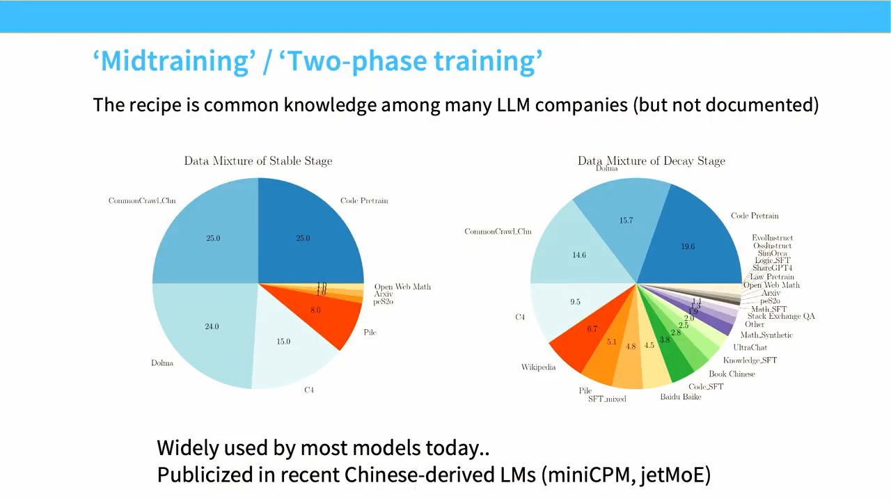

# Lecture 15：Mid- and Post-Training

> [!abstract] 本讲一句话
> Pre-training 学习“人类文本如何分布”，mid/post-training 则用少量高信号数据把 base model 变成可控 policy：SFT 模仿目标行为，RLHF/DPO 优化偏好，但数据风格、标注者分布和 reward proxy 会直接成为模型行为的一部分。

## 来源与范围
- 课程：Stanford CS336 — Language Modeling from Scratch, Spring 2026
- 讲师：Tatsunori Hashimoto
- 上课日期：2026-05-18
- [课程视频](https://www.youtube.com/watch?v=2oH6PWPrYFo)，时长 1:19:55
- [官方 Lecture 15 PDF](https://github.com/stanford-cs336/lectures/blob/main/lecture_15.pdf)，65 页
- 本讲覆盖：SFT data、style/knowledge/safety、mid-training、human/AI preference data、PPO 的概念、DPO 推导，以及 reward overoptimization/mode collapse
- 下一讲继续：可验证 reward、GRPO 与在线 rollout 系统

> [!warning] 来源边界
> 正文按公开视频人工英文字幕与官方 65 页课件交叉核对，下面是可跳转的真实时间点。课件明确提醒现代 frontier post-training 的公开细节很少，因此本文把公开 recipe、课堂判断与一般数学框架分开，不把推测写成任何特定模型的事实。

## 视频时间索引

| 时间 | 内容 | 对应笔记 |
| --- | --- | --- |
| [00:00](https://www.youtube.com/watch?v=2oH6PWPrYFo&t=0s) | 从 GPT-3 到 instruction following | [[#1. Pre-training 后还缺什么\|1]] |
| [03:34](https://www.youtube.com/watch?v=2oH6PWPrYFo&t=214s) | Frontier recipe 的公开边界 | [[#1. Pre-training 后还缺什么\|1]] |
| [10:36](https://www.youtube.com/watch?v=2oH6PWPrYFo&t=636s) | Q&A：低质量 pair 能否教 instruction following | [[#2. SFT：用示范控制输出\|2]] |
| [12:53](https://www.youtube.com/watch?v=2oH6PWPrYFo&t=773s) | FLAN benchmark artifacts | [[#2.1 SFT 数据的公开演进\|2.1]] |
| [23:10](https://www.youtube.com/watch?v=2oH6PWPrYFo&t=1390s) | Citation style、tail knowledge 与伪引用 | [[#3.2 SFT 更擅长 elicitation，不一定适合写入尾部事实\|3.2]] |
| [26:27](https://www.youtube.com/watch?v=2oH6PWPrYFo&t=1587s) | RL correctness feedback 与 imitation 的差异 | [[#6. 从模仿到 reward optimization\|6]] |
| [29:49](https://www.youtube.com/watch?v=2oH6PWPrYFo&t=1789s) | Safety 过拒绝与真实场景迭代 | [[#3.3 Safety 需要少量关键样本，也有长尾\|3.3]] |
| [37:45](https://www.youtube.com/watch?v=2oH6PWPrYFo&t=2265s) | Midtraining / two-phase training | [[#4. Mid-training\|4]] |
| [49:15](https://www.youtube.com/watch?v=2oH6PWPrYFo&t=2955s) | Annotator demographics、expertise 与审核 | [[#5. RLHF 数据\|5]] |
| [1:14:55](https://www.youtube.com/watch?v=2oH6PWPrYFo&t=4495s) | DPO 与 rejection-sampling 外循环 | [[#7. DPO：把 preference optimization 写成监督损失\|7]] |
| [1:16:39](https://www.youtube.com/watch?v=2oH6PWPrYFo&t=4599s) | Reward overoptimization | [[#8. 优化 reward 的副作用\|8]] |

## 视频补充：数据为什么会成为行为

- 现代 frontier post-training 的公开细节很少，较早的 instruction-tuning/RLHF 论文反而更完整；公开 recipe 的空白不应由推测填补。
- Base model 足够强时，有时能从奇怪甚至低质量的 pair 中泛化出 instruction-following 格式；这不否定高质量/正确数据，而是说明 SFT 可能主要在做 behavior elicitation。
- FLAN 的摘要任务会继承 benchmark artifacts，reference 可能不自然甚至带幻觉。Citation-style SFT 也可能同时学会引用格式、事实或伪引用；“tail knowledge”没有清晰形式边界。
- Safety 数据需要真实使用场景的持续“打地鼠”迭代。课堂举例：`how do I kill a Python process?` 可能因 `kill` 被误判为伤害请求；约 500 个关键例子也可能显著降低恶意指令服从。
- Midtraining/decay 阶段较便宜，适合做 mixture ablation，再反推 pretraining 配方；它不只是“继续多训一点”。
- Annotator quality 没有机械 gold standard；学历、年龄、专业时薪、AI 辅助和审核压力会改变 preference distribution，inter-annotator agreement 也可能把一致偏差伪装成质量。
- DPO 常嵌入 rejection-sampling 外循环；DPO 与 PPO 的经验排序高度依赖 setup，二者都可能 reward overoptimization。



> 视频关键帧：[37:45](https://www.youtube.com/watch?v=2oH6PWPrYFo&t=2265s)。右图在 decay 阶段加入更聚焦的 code、math、book、SFT 等来源；它展示的是公开案例，不是所有模型的固定配方。

## 1. Pre-training 后还缺什么
Autoregressive pre-training 解决：
$$
\min_\theta
\mathbb E_{x\sim\mathcal D_{\text{web}}}
\left[
-\sum_t\log p_\theta(x_t\mid x_{<t})
\right]
$$
它让模型拟合大量自然文本，但用户需要的是更窄的行为：
- 把 prompt 当指令而不是待续写文本；
- 使用合适格式、语气和详略；
- 拒绝有害请求；
- 调用工具并遵守协议；
- 在多个“可能的回答”中选择人更喜欢的一个。
课程把标准流程概括为：

```text
pre-trained base model
→ mid-training（mixed high-quality data）
→ SFT（imitate demonstrations）
→ preference / RL optimization
→ instruct/chat policy
```

SFT 与 RLHF 的根本区别：

| 方法 | 数据 | 目标 |
| --- | --- | --- |
| SFT / imitation | $(x,y^\*)$ demonstration | 拟合示范分布 |
| RLHF / optimization | reward 或 $(x,y_w,y_l)$ preference | 找到高 reward policy |

## 2. SFT：用示范控制输出
给定 prompt $x$ 和目标 response $y=(y_1,\dots,y_T)$：
$$
\mathcal L_{\text{SFT}}(\theta)
=
-\sum_{t=1}^{T}
m_t\log\pi_\theta(y_t\mid x,y_{<t})
$$
$m_t$ 是 loss mask，通常：
- user/system/tool observation token：$m_t=0$；
- assistant target token：$m_t=1$。
如果多轮对话中错误地对 user token 也计算 loss，模型会被训练去生成用户消息，而不是回答用户。

### 2.1 SFT 数据的公开演进
课件用数据样式变化说明目标行为在变化：
- **FLAN**：把 NLP tasks 统一成自然语言指令，回答常很短；
- **Self-Instruct / Alpaca**：用模型生成 instruction–response；
- **ShareGPT/Vicuna**：真实聊天风格；
- **OpenAssistant**：更长、更细致，有引用和复杂知识；
- **Tulu/Nemotron**：多来源、高质量、工具使用和 agentic 格式。
变化不只是内容 domain：
- response length；
- bullet/heading/citation 风格；
- chattiness；
- safety behavior；
- tool-call schema；
- single-turn / multi-turn；
- 数据规模与生成来源。

### 2.2 Chat template 与 shape
原始样本：

```json
[
  {"role": "system", "content": "..."},
  {"role": "user", "content": "..."},
  {"role": "assistant", "content": "..."}
]
```

经 chat template 线性化并 tokenize：
$$
\text{input\_ids},
\text{labels}
\in\mathbb Z^{B\times L}
$$
`labels[t] = -100` 表示该 token 不参与 cross-entropy。工具调用还需要把 JSON schema、call ID、tool result 与 assistant continuation 对齐。

## 3. SFT 数据到底教会模型什么

### 3.1 Style 对偏好评测影响很大
课程展示两个现象：
1. SFT 数据显著改变回答长度和格式；
2. 人类和 LM judge 的 pairwise preference 对长度很敏感。
这产生 **verbosity bias**：更长答案可能因覆盖更多关键词、显得详尽而获胜，即使事实质量没有提高。普通 academic benchmark 对这种 style 变化未必敏感，因此“benchmark 不变、聊天评价大涨”可能主要来自行为格式。
应拆分评价：
- correctness；
- relevance；
- concision；
- style；
- citation validity；
- safety；
- task completion。

### 3.2 SFT 更擅长 elicitation，不一定适合写入尾部事实
课件提出一个微妙结论：

> SFT 最可靠的作用是抽取 base model 已有能力并教它何时表现，而不是把大量它原本不知道的 tail knowledge 写入参数。
如果在少量 SFT 中加入罕见事实或引用，模型可能学会“输出引用的风格”，却没有获得稳定的事实检索能力；甚至会泛化成编造引用。
可以把知识与行为区分为：
$$
\underbrace{\text{knowledge/capability}}_{\text{mostly pre/mid-training}}
\quad+\quad
\underbrace{\text{elicitation/control}}_{\text{mostly SFT/RL}}
$$
这不是绝对分工，但对数据设计很有用：
- 大量 domain knowledge 更适合 pre/mid-training 或 retrieval；
- SFT 用来教回答协议、推理范式和工具使用；
- correctness feedback/RL 可能比“把答案当示范背下来”更适合某些任务。

### 3.3 Safety 需要少量关键样本，也有长尾
课件列举 safety SFT 的经验：几百条精心构造的行为样本就可能显著改善 hate-speech 等类别的拒答/规范遵循；但真实风险场景有长尾，需要持续扩展。
一个 safety example 不应只有“拒绝”：

```text
scenario
→ policy category
→ allowed / disallowed boundary
→ ideal response
→ helpful safe alternative
```

否则模型容易过度拒答，或只记住表面关键词。

### 3.4 SFT 数据结论
课程总结可整理为：
1. SFT 最适合激活 pretraining 已有行为；
2. 加入“事实正确”的示范仍可能伤害模型；
3. 少量 instruction/safety/style 数据影响巨大；
4. 长尾能力和 tool use 仍需要规模与覆盖。

## 4. Mid-training
课件把越来越常见的 two-phase recipe 表示为：
1. 先在 web/pretraining data 上训练；
2. 在训练后段混入 instruction、高质量领域或能力数据；
3. 最后做较短的纯 SFT。
形式上，mid-training 仍是 next-token prediction：
$$
\mathcal D_{\text{mid}}
=
\lambda\mathcal D_{\text{pre}}
+(1-\lambda)\mathcal D_{\text{capability/instruction}}
$$
$$
\mathcal L_{\text{mid}}
=
\mathbb E_{z\sim\mathcal D_{\text{mid}}}
[-\log p_\theta(z)]
$$
它和 SFT 的区别更多是数据规模、mixture 和 masking：
- 训练 token 更多；
- 保留 pretraining data，降低 catastrophic forgetting；
- instruction example 可作为完整 sequence 做 LM；
- 常用于 code、math、long context、repository-level 和 domain adaptation；
- 最终短 SFT 再收紧 chat behavior。

> [!note] 为什么不是把所有 instruction data 留到 SFT
> 若 instruction 数据量很大，短 SFT 学不完；若长时间只训 instruction distribution，又可能损害一般语言能力。Mid-training 通过混合让能力数据享有更大 compute，同时保留 base distribution。

## 5. RLHF 数据

### 5.1 标准 pairwise setup
对 prompt $x$，从 policy 采样多个 response，标注者比较：
$$
(x,y_w,y_l)
$$
$y_w$ 是 chosen/winner，$y_l$ 是 rejected/loser。
可训练 Bradley–Terry reward model：
$$
P(y_w\succ y_l\mid x)
=
\sigma(r_\phi(x,y_w)-r_\phi(x,y_l))
$$
$$
\mathcal L_{\text{RM}}
=
-\log\sigma(r_\phi(x,y_w)-r_\phi(x,y_l))
$$
重要的是 preference **只定义相对顺序**；它不告诉我们两个回答是否都很差，也不天然给出 reward 的绝对尺度。

### 5.2 Human feedback 的数据难点
- 高质量 annotator 难验证；
- correctness checking 花时，复杂专业问题更需要 experts；
- 众包 compensation、工作条件与潜在有害内容暴露涉及伦理；
- annotator 可能使用 AI，造成未记录的 synthetic feedback；
- 个人/群体 demographic 与价值观改变最终 policy；
- guideline 本身也会漂移。
所以每条 preference 最好保留：
- guideline version；
- annotator cohort/qualification；
- response order randomization；
- tie/abstain；
- confidence 与理由；
- disagreement；
- acquisition policy 和模型版本。

### 5.3 AI feedback
课件指出强模型在 pairwise judging 上可接近 human agreement，system-level ranking 也可能很高。AI feedback 可扩展规模，但会继承 judge 的：
- length/style bias；
- self-preference；
- domain blind spot；
- safety policy；
- prompt injection vulnerability。
应做 human calibration，不应因相关系数高就把 judge 当 ground truth。

### 5.4 Preference 的 G–V gap
人们自然生成的回答分布 $p^\*(y\mid x)$，不一定等于他们最喜欢的回答分布。SFT 模仿“人写了什么”，RLHF 优化“人选了什么”。这就是从 generation/imitation 转向 value/optimization 的理由。

## 6. 从模仿到 reward optimization
目标是：
$$
\max_\pi
\mathbb E_{x\sim\mathcal D,\ y\sim\pi(\cdot\mid x)}
[r_\phi(x,y)]
$$
但不受约束地最大化 reward 会离开 reward model 可靠的训练分布，因此常加入对 reference policy $\pi_{\text{ref}}$ 的 KL：
$$
\max_\pi
\mathbb E[r(x,y)]
-\beta
\mathbb E_x
D_{\mathrm{KL}}
\left(
\pi(\cdot\mid x)
\Vert
\pi_{\text{ref}}(\cdot\mid x)
\right)
$$

### 6.1 Policy gradient
REINFORCE identity：
$$
\nabla_\theta
\mathbb E_{y\sim\pi_\theta}[R(y)]
=
\mathbb E[
R(y)\nabla_\theta\log\pi_\theta(y)
]
$$
对 LM，sequence probability：
$$
\log\pi_\theta(y\mid x)
=
\sum_t
\log\pi_\theta(y_t\mid x,y_{<t})
$$
reward 常只在序列末尾返回，credit assignment 和 variance 都很困难。

### 6.2 PPO 的核心
PPO 在旧 policy $\pi_{\text{old}}$ 的 rollouts 上构造 ratio：
$$
\rho_t(\theta)
=
\frac{\pi_\theta(a_t\mid s_t)}
{\pi_{\text{old}}(a_t\mid s_t)}
$$
clipped surrogate：
$$
\mathcal L_{\text{PPO}}
=
-\mathbb E_t
\left[
\min\left(
\rho_t A_t,
\operatorname{clip}(\rho_t,1-\epsilon,1+\epsilon)A_t
\right)
\right]
$$
实际 LM PPO 通常还包括：
- reward model；
- policy 与 frozen reference；
- value model；
- rollout generation；
- advantage estimation；
- KL shaping；
- 多轮更新和 rollout refresh。
它的难点不只在公式，而是这些状态和模型必须正确同步。

## 7. DPO：把 preference optimization 写成监督损失

### 7.1 从 KL-regularized RL 到隐式 reward
KL-regularized optimum 满足：
$$
\pi^\*(y\mid x)
=
\frac{1}{Z(x)}
\pi_{\text{ref}}(y\mid x)
\exp\left(\frac{r(x,y)}{\beta}\right)
$$
反解 reward：
$$
r(x,y)
=
\beta
\log\frac{\pi^\*(y\mid x)}
{\pi_{\text{ref}}(y\mid x)}
+\beta\log Z(x)
$$
把它代入 Bradley–Terry preference likelihood 时，同一 prompt 的 $\log Z(x)$ 抵消。

### 7.2 DPO loss
定义 policy 相对 reference 的 log-ratio：
$$
\Delta_\theta(x,y)
=
\log\pi_\theta(y\mid x)
-\log\pi_{\text{ref}}(y\mid x)
$$
则：
$$
\mathcal L_{\text{DPO}}
=
-\mathbb E
\log\sigma
\left(
\beta[
\Delta_\theta(x,y_w)
-\Delta_\theta(x,y_l)
]
\right)
$$
直觉：
- 提高 chosen 相对 reference 的 probability；
- 降低 rejected 相对 reference 的 probability；
- 权重由当前隐式 reward 对 pair 的预测误差决定。
DPO 省掉在线 rollout、显式 reward model 与 value model，因此工程上像 supervised training；但它依赖 offline preference distribution，并不意味着没有 RLHF 假设。

### 7.3 Sequence length 与 normalization
$$
\log\pi(y\mid x)=\sum_t\log\pi(y_t\mid x,y_{<t})
$$
天然随长度变得更负。数据若存在 systematic length preference，loss 会把 verbosity 混入质量。课件提到 length-normalized DPO 与 SimPO 等 variants，提醒比较方法时必须统一：
- sum 还是 mean token log-prob；
- reference policy；
- $\beta$；
- response truncation；
- pair length distribution。

## 8. 优化 reward 的副作用

### 8.1 Reward overoptimization
Reward model 是真实偏好的 proxy：
$$
\hat r(y)=r^\*(y)+\epsilon(y)
$$
弱优化时提高 $\hat r$ 往往也提高真实质量；优化过强后 policy 会找到 $\epsilon(y)$ 的漏洞，出现：
$$
\hat r\uparrow
\quad\text{而}\quad
r^\*\downarrow
$$
课件展示多种 RLHF optimizer 都可能在某点后 overfit noisy reward。KL、early stopping、held-out human evaluation 和多个 judges 只能缓解，不能从根本上把 proxy 变成目标。

### 8.2 Mode collapse 与 calibration
Pretraining model 是分布模型，保留多种可能 continuation。Preference optimization 强调高 reward mode，可能：
- entropy 降低；
- 风格同质化；
- 对不确定问题仍用确定语气；
- sample diversity 下降；
- probability 不再有原来的 calibration 含义。
因此不能只看平均 reward，还应监控 entropy、distinctness、calibration、拒答率和分群表现。

## 9. 拓展：AI Infra 视角

### Shape
SFT：
$$
\text{tokens},\text{labels}\in\mathbb Z^{B\times L}
$$
Preference：
$$
x\in\mathbb Z^{B\times L_x},\quad
y_w,y_l\in\mathbb Z^{B\times L_y}
$$
DPO 每个 pair 要对 policy/reference × chosen/rejected 计算 sequence log-prob；通过拼接 chosen/rejected forward 可提高并行度。

### Compute / Memory

| 方法 | 训练/推理组件 | 主要成本 |
| --- | --- | --- |
| SFT | 1 个 trainable policy | 普通 teacher-forcing |
| DPO | trainable policy + reference log-probs | 约两条 response；reference 可预计算 |
| PPO | policy、reference、reward、value + rollout | generation、多个模型与反复更新 |
PPO 峰值显存可通过模型共址、offload 或分离服务缓解，但会增加切换和通信。

### Communication
PPO/RLHF 需要在 rollout workers、reward/value inference 和 trainer 之间传输 variable-length sequences、log-probs、values、rewards 与 masks。错误的 tokenizer/chat template 版本会让看似相同的 sequence 在各组件中错位。

### Runtime
- SFT：稳定、可离线 shuffle；
- DPO：离线 pair 训练，吞吐接近 supervised pipeline；
- PPO：on-policy freshness、generation latency、训练/推理框架切换和 straggler 都影响利用率。

## 10. 拓展：我的推导与易错点

### 10.1 Preference 数据没有“绝对好”
若 $y_w$ 只是“两者中较好”，DPO 会提高它，即使它仍有严重问题。应加入：
- 两者都不可接受；
- tie；
- absolute rubric score；
- correctness verifier；
- chosen 的人工修订版本。

### 10.2 SFT 与 DPO 的梯度信号不同
SFT 对 chosen 的每个 target token给正向 likelihood；DPO 只关心 chosen 相对 rejected/reference 的 sequence margin。一个 pair 已被正确排序时，sigmoid error 变小，更新自然减弱。

### 10.3 Mid-training 不是第三种 loss
它多数仍用 language-modeling loss；区别在 dataset mixture、curriculum、训练长度和目标能力。把“mid-training”误认为某个特定算法，会忽略它最关键的数据工程。

### 10.4 常见错误
- 对整段 chat 都算 SFT loss；
- 将 citation 风格误判为事实能力；
- 用长度高度不平衡的 pair 训练而不审计；
- 只报告 reward model 分数，未做人类/可验证评估；
- DPO 中 policy/reference 使用不同 chat template；
- reference log-prob 在不同 tokenizer 或 truncation 下预计算；
- PPO rollout 太旧仍重复多轮更新；
- 把 KL penalty 当作安全保证。

## 11. 本讲结论
1. SFT 用少量 demonstrations 把 base model 的潜在能力转成 instruction-following behavior。
2. Response style、长度、引用和 tool protocol 都由 SFT 数据直接塑造，并显著影响 preference evaluation。
3. Tail knowledge 不宜简单依赖 SFT 写入；mid-training 或 retrieval 往往更适合能力/知识扩展。
4. Mid-training 用大规模 mixture 把 instruction/capability data 引入 pretraining 后段，再做短 SFT。
5. RLHF 的困难首先是数据：annotator、guideline、demographic、compensation 和 AI judge 都会改变 preference。
6. PPO 是 on-policy reward optimization；DPO 将 KL-regularized preference objective 转成离线 pair loss。
7. Reward 是 proxy，过度优化会 reward hacking、mode collapse 并损害 calibration。

## 12. 自测问题
1. SFT loss mask 为什么通常只覆盖 assistant tokens？

    **面试回答：** SFT 的目标是学习 $\pi(y\mid x)$：system、user 和 tool observation 构成输入条件，assistant response 才是要模仿的输出。通常只对 assistant target tokens 计算交叉熵，可避免把有限训练预算用于预测用户话语或环境观察；具体也可采用混合目标，但必须显式定义角色和 loss mask。

2. SFT 更适合 behavior elicitation 而非 tail knowledge 写入，这句话的理由是什么？

    **面试回答：** 少量 SFT 示范能快速教会已有 base model 何时回答、使用什么格式和工具协议，因为这些行为可复用预训练能力。罕见知识若只出现少数次，监督覆盖不足，模型可能学到引用或确信语气而没有稳定掌握事实；SFT 也能学新知识，但大规模知识扩展通常更依赖 pre/mid-training 或 retrieval。

3. Mid-training 与 SFT 的 loss、数据量和 mixture 有何区别？

    **面试回答：** 两者通常都用 next-token 交叉熵；mid-training 主要差在更大的 token 预算、精选能力数据与预训练数据的 mixture，并可能对完整序列算 loss。SFT 更集中于指令对话、数据量较小，常只监督 assistant tokens；阶段边界是训练配方和目标上的区别，不是一个全新的 loss 名称。

4. Pairwise preference 为什么不提供绝对质量？

    **面试回答：** Pairwise 标签只告诉模型在同一 prompt 下哪个回答更好，即使 winner 仍然错误，也可能被选中。Bradley–Terry 概率只依赖 reward 差，给同一 prompt 的所有 reward 加常数不会改变比较；因此需要绝对 rubric、两者皆差选项或 correctness verifier 来补充可接受性信息。

5. 推导 Bradley–Terry reward-model loss。

    **面试回答：** 设两回答的正效用为 $e^{r_w}$ 与 $e^{r_l}$，Bradley–Terry 给出 $P(w\succ l)=e^{r_w}/(e^{r_w}+e^{r_l})=\sigma(r_w-r_l)$。对观察到 winner 的标签做最大似然，取负对数并对数据平均，得到 $\mathcal L_{RM}=-\mathbb E\log\sigma(r_\phi(x,y_w)-r_\phi(x,y_l))$。

6. PPO 为什么需要 old policy ratio 与 clipping？

    **面试回答：** Rollout 来自旧 policy，更新后动作概率已改变，所以用 $\rho_t=\pi_\theta(a_t\mid s_t)/\pi_{old}(a_t\mid s_t)$ 调整代理目标。Clipping 用 $\min(\rho_tA_t,\operatorname{clip}(\rho_t,1-\epsilon,1+\epsilon)A_t)$ 限制某些过大更新带来的收益，提升数据复用稳定性；它不是严格 KL 保证，也不能补救无限陈旧的 rollout。

7. 从 KL-regularized optimum 推导 DPO objective 的关键消元是什么？

    **面试回答：** KL 正则最优解满足 $\pi^*(y\mid x)=\pi_{ref}(y\mid x)e^{r(x,y)/\beta}/Z(x)$，故 $r=\beta\log(\pi^*/\pi_{ref})+\beta\log Z(x)$。代入同一 prompt 的 Bradley–Terry reward 差，$\log Z(x)$ 抵消；令 $\Delta_\theta(y)=\log\pi_\theta(y\mid x)-\log\pi_{ref}(y\mid x)$，得到 $\mathcal L_{DPO}=-\mathbb E\log\sigma(\beta[\Delta_\theta(y_w)-\Delta_\theta(y_l)])$。

8. DPO 不使用在线 rollout，为什么仍属于 preference/RLHF 思路？

    **面试回答：** DPO 的监督来自 chosen/rejected 偏好对，目标是学习偏好对应的隐式 reward 排序，并通过 reference log-ratio 表达 KL 正则的政策改进。它把 RLHF 的偏好优化问题改写成离线监督损失，省去在线 rollout 和显式 reward/value model，但仍继承偏好数据偏差与分布覆盖限制。

9. Length bias 会通过哪些数据和 loss 细节进入 policy？

    **面试回答：** Length bias 先可能进入数据：人类或 judge 偏好更长回答，chosen/rejected 长度长期失衡。它还会经 sequence log-prob 的求和/平均、按样本或 token 归一化、截断、EOS 与格式奖励改变梯度权重；应审计长度分布并做长度控制评测，不能把变长自动解释为质量提升。

10. Reward model 分数持续上升时，真实质量为什么可能下降？

    **面试回答：** Reward model 是真实质量的代理，policy 强化优化后可能进入其未覆盖的分布，学会利用误差、冗长风格或其他评分捷径。若 $\hat r=r^*+\epsilon$，优化越来越依赖提高 $\epsilon$，就可能出现 $\hat r$ 上升而 $r^*$ 下降；需结合独立正确性评测、人类抽查、KL 和早停控制过度优化。


## 参考资料
- [Lecture 15 官方课件](https://github.com/stanford-cs336/lectures/blob/main/lecture_15.pdf)
- [Lecture 15 视频](https://www.youtube.com/watch?v=2oH6PWPrYFo)
- [InstructGPT](https://arxiv.org/abs/2203.02155)
- [Learning to Summarize from Human Feedback](https://arxiv.org/abs/2009.01325)
- [Training a Helpful and Harmless Assistant](https://arxiv.org/abs/2204.05862)
- [Constitutional AI](https://arxiv.org/abs/2212.08073)
- [Direct Preference Optimization](https://arxiv.org/abs/2305.18290)
- [PPO](https://arxiv.org/abs/1707.06347)
- [Tulu 3](https://arxiv.org/abs/2411.15124)
