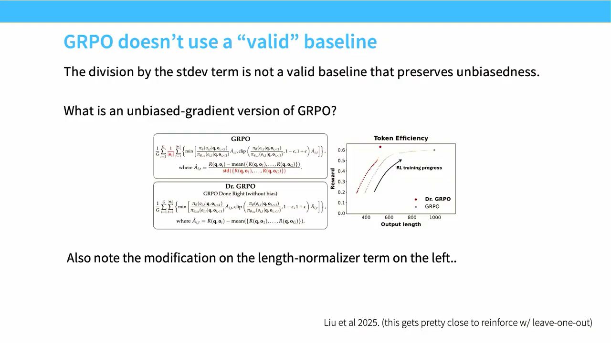

# Lecture 16：Post-Training and RLVR

> [!abstract] 本讲一句话
> RLVR 把模糊的人类偏好换成可执行 verifier 的 reward，并用 on-policy rollout 让模型探索解法；它能扩展推理能力，却把算法正确性、长序列生成、验证环境、batch 负载均衡和训练–推理切换紧密耦合成一个系统问题。

## 来源与范围
- 课程：Stanford CS336 — Language Modeling from Scratch, Spring 2026
- 讲师：Tatsunori Hashimoto
- 上课日期：2026-05-20
- [课程视频](https://www.youtube.com/watch?v=dIFAi87Ws4E)，时长 1:15:51
- [官方 Lecture 16 PDF](https://github.com/stanford-cs336/lectures/blob/main/lecture_16.pdf)，61 页
- 本讲覆盖：PPO recap、GRPO、group baseline 与 length bias、RLVR、DeepSeek-R1/Kimi k1.5/Qwen3 案例、long-CoT、difficulty curriculum、RL infra 和 agentic RL

> [!warning] 来源边界
> 正文按公开视频人工英文字幕与官方 61 页课件交叉核对，下面是可跳转的真实时间点。R1、Kimi、Qwen3 的数据规模和阶段只按课件对公开论文的整理记录；公开资料并不完整，不能由此推断未披露的系统细节。课件特别提醒 RL 实验对 setup 高度敏感，不把单个 case study 写成普适结论。

## 视频时间索引

| 时间 | 内容 | 对应笔记 |
| --- | --- | --- |
| [00:00](https://www.youtube.com/watch?v=dIFAi87Ws4E&t=0s) | Why verifiable rewards | [[#1. 从 RLHF 到 RLVR\|1]] |
| [09:36](https://www.youtube.com/watch?v=dIFAi87Ws4E&t=576s) | PPO 的 KL 实现细节 | [[#2. PPO 为何复杂\|2]] |
| [10:48](https://www.youtube.com/watch?v=dIFAi87Ws4E&t=648s) | `gamma=lambda=1` 与 bandit 近似 | [[#2. PPO 为何复杂\|2]] |
| [13:55](https://www.youtube.com/watch?v=dIFAi87Ws4E&t=835s) | GRPO group rollout | [[#3. GRPO\|3]] |
| [22:10](https://www.youtube.com/watch?v=dIFAi87Ws4E&t=1330s) | Std、length normalization 与偏差 | [[#4. GRPO 的统计与长度问题\|4]] |
| [30:20](https://www.youtube.com/watch?v=dIFAi87Ws4E&t=1820s) | R1-Zero、aha moment 的边界 | [[#5.1 R1-Zero\|5.1]] |
| [31:50](https://www.youtube.com/watch?v=dIFAi87Ws4E&t=1910s) | R1 完整 pipeline | [[#5.2 R1\|5.2]] |
| [38:40](https://www.youtube.com/watch?v=dIFAi87Ws4E&t=2320s) | Kimi difficulty、reward、length control | [[#6. Kimi：difficulty、reward 与长度控制\|6]] |
| [57:41](https://www.youtube.com/watch?v=dIFAi87Ws4E&t=3461s) | Qwen3 约 4K-example GRPO stage | [[#7. Qwen3：thinking mode 与 stage composition\|7]] |
| [1:02:17](https://www.youtube.com/watch?v=dIFAi87Ws4E&t=3737s) | Qwen3-Coder-Next agent data/environment | [[#8. RL Infra\|8]] |
| [1:11:40](https://www.youtube.com/watch?v=dIFAi87Ws4E&t=4300s) | Q&A：midtraining 与 RL 可采样性 | [[#11. 本讲结论\|11]] |

## 视频补充：目标函数中的“小改动”就是算法

- 课堂 PPO 实现把 KL 裁到非负；数学上并不自然，但去掉后训练会崩。语言模型 PPO 又常设 `gamma=lambda=1`，近似退化成 bandit，丢失了许多时间结构。
- GRPO 的 group mean 可作 baseline，但再除以 group std、按 sequence length 归一化后，不再等于无偏 vanilla policy gradient；它会改变 easy/hard problem 权重，并可能偏好更长 CoT。
- R1-Zero 的 “aha moment” 可能已存在于 base model；CoT 变长也可能部分来自目标函数偏置。不要把所有可见行为都归因于 RL 创造了新算法。
- Qwen3 的 GRPO stage 只有约 3,995/4K examples，其前提是前面阶段已把能力和可采样性准备好；低数据量不能脱离 stage composition 解读。
- Qwen3-Coder-Next 的课堂案例包含 repository concatenation、PR+RAG、agent trajectory、约 800K 自动构造任务，以及防止模型读取 future commit 的 anti-hacking reward。Verifier 是环境工程，不只是一个标量函数。
- 课堂 Q&A 强调：midtraining 决定 RL 是否能采样到正确解；long-CoT SFT 通常不叫 midtraining，但阶段命名本身并没有严格数学边界。



> 视频关键帧：[22:15](https://www.youtube.com/watch?v=dIFAi87Ws4E&t=1335s)。图中 Dr. GRPO 去掉 std division 并修改 length normalizer，用来说明“baseline”和“归一化”不是同一件事。

## 1. 从 RLHF 到 RLVR
RLHF 的 reward model 近似人类偏好：
$$
\hat r_\phi(x,y)
\approx
\text{human preference}
$$
它会有 misspecification，强优化后可能 reward hacking。RLVR（Reinforcement Learning from Verifiable Rewards）选择能机械验证结果的任务：
- 数学：最终答案或等价表达；
- code：unit tests / hidden tests；
- theorem：proof checker；
- structured constraint：parser、schema、exact match；
- agent：环境最终状态或可重复 evaluator。
Reward 可写成：
$$
r(x,y)
=
r_{\text{correct}}(x,y)
+\lambda_f r_{\text{format}}(y)
+\lambda_s r_{\text{safety}}(x,y)
$$
核心变化是 $r_{\text{correct}}$ 不依赖“回答看起来不错”的 learned preference model，而由 verifier 计算。

### 1.1 Verifiable 不等于没有 reward hacking
Verifier 仍可能：
- parser 接受歧义格式；
- unit tests 覆盖不全；
- answer extraction 只检查最后字符串；
- agent 修改测试或读取 hidden answer；
- sandbox 泄漏网络、文件或 future commits；
- 数学等价判断误判。
所以 RLVR 只是让目标更接近真实任务，并没有自动消除 specification gaming。

### 1.2 On-policy 的意义
离线 SFT 学习固定 demonstrations；on-policy RL 重复：

```text
current policy
→ sample new rollouts
→ verify rewards
→ update policy
→ discard/age old rollouts
```

随着 policy 改变，它会探索当前能力边界的回答。若 rollout 长期来自旧 policy，就退化为 off-policy 数据，importance ratio 和训练稳定性都变差。

## 2. PPO 为何复杂
对 prompt $x$ 生成 tokens $a_t$，状态 $s_t=(x,a_{<t})$。PPO ratio：
$$
\rho_t(\theta)
=
\frac{\pi_\theta(a_t\mid s_t)}
{\pi_{\text{old}}(a_t\mid s_t)}
$$
clipped objective：
$$
J_{\text{PPO}}
=
\mathbb E_t
\left[
\min(
\rho_tA_t,
\operatorname{clip}(\rho_t,1-\epsilon,1+\epsilon)A_t
)
\right]
$$
LM 中常在最后 token 得到 dense sequence reward，同时每 token 加 KL shaping：
$$
r_t^{\text{shaped}}
=
\begin{cases}
-\beta\left(
\log\pi_\theta(a_t\mid s_t)
-\log\pi_{\text{ref}}(a_t\mid s_t)
\right), & t<T\\
r_{\text{task}}-\beta\Delta\log\pi_T, & t=T
\end{cases}
$$
PPO 需要：
- policy；
- old policy/log-probs；
- frozen reference；
- value model；
- reward/verifier；
- rollout buffer；
- advantage/return；
- clipping、KL controller 和多轮 minibatch update。
课件强调实际实现必须结合 live code 看，因为 bug 常来自 mask、padding、reward placement、whitening 和模型同步，而不是课本公式。

## 3. GRPO
GRPO（Group Relative Policy Optimization）的动机：
- 去掉 value model，降低显存和调参复杂度；
- RLVR 的同一 prompt 可采样一组 responses，用组内结果构造 baseline；
- 不必把数据先转成 pairwise preference，保持在线更新。

### 3.1 Group rollout
对每个 prompt $x_i$，采样 $G$ 个回答：
$$
y_{i,1},\ldots,y_{i,G}
\sim
\pi_{\text{old}}(\cdot\mid x_i)
$$
得到 rewards $r_{i,1},\ldots,r_{i,G}$，课件中的 vanilla group-normalized advantage：
$$
\mu_i=\frac1G\sum_jr_{i,j}
$$
$$
\sigma_i
=
\sqrt{
\frac1G\sum_j(r_{i,j}-\mu_i)^2+\epsilon
}
$$
$$
\hat A_{i,j}
=
\frac{r_{i,j}-\mu_i}{\sigma_i}
$$
再把 $\hat A_{i,j}$ 广播到该 response 的有效 tokens，使用 PPO-like clipped loss 与 KL regularization。

### 3.2 直觉
同一题中：
- 高于组均值的回答增大 probability；
- 低于组均值的回答减小 probability；
- 全部答对或全错时，组内没有区分信号。
这使 GRPO 自动关注 success probability 处在中间的题，但也引出 difficulty weighting bias。

### 3.3 最小伪代码

```python
for prompts in loader:
    with inference_mode():
        ys, old_logps = rollout(policy, prompts, group_size=G)
        rewards = verifier(prompts, ys)
        adv = group_normalize(rewards)
    for _ in range(num_updates):
        logps = policy.log_probs(prompts, ys)
        ref_logps = reference.log_probs(prompts, ys)
        ratio = exp(logps - old_logps)
        policy_loss = clipped_pg(ratio, adv, token_mask)
        kl = estimate_kl(logps, ref_logps, token_mask)
        optimize(policy_loss + beta * kl)
```

生产实现还需保存 policy/version、prompt ID、sample seed、token mask、raw verifier evidence 和 termination reason。

## 4. GRPO 的统计与长度问题

### 4.1 Baseline 与归一化不是一回事
Policy gradient 中可以减去不依赖当前 action 的 state baseline：
$$
\mathbb E[
(R-b(s))\nabla\log\pi(a\mid s)
]
$$
在合适条件下仍是无偏。GRPO 的组均值与样本包含彼此，除以组内标准差又让缩放依赖 sampled actions；课件指出这不一定保留无偏 gradient。
接近 REINFORCE leave-one-out 的改法，是对第 $j$ 个样本使用其他 $G-1$ 个回答作为 baseline：
$$
b_{i,-j}
=
\frac{1}{G-1}
\sum_{k\ne j}r_{i,k}
$$
$$
A_{i,j}=r_{i,j}-b_{i,-j}
$$
它避免样本自己的 reward 进入 baseline；是否再做 variance normalization 则是另一个会改变 weighting 的选择。

### 4.2 Difficulty weighting
若 binary reward 的成功率接近 0 或 1，组内 $\sigma$ 小。除以 $\sigma$ 后，少数差异可能被放大；完全相同时则无更新。不同题目的梯度权重因此不只由 reward gap 决定，也由组内难度与采样噪声决定。
需要监控：
- pass rate；
- all-zero / all-one group ratio；
- advantage magnitude；
- reward variance；
- 每 prompt 的有效 update 次数。

### 4.3 Length normalization
Sequence gradient 常对 token 平均：
$$
g(y)
\propto
\frac{1}{|y|}
\sum_{t=1}^{|y|}
A(y)\nabla\log\pi(y_t\mid s_t)
$$
不同“先按 sequence 平均，再按 batch 平均”或“对所有有效 token 全局平均”的实现，会给长/短回答不同权重。课件引用后续分析提醒：观察到的 CoT 变长可能同时来自：
- reward 真正偏好更充分推理；
- objective 的 length normalization；
- base model 已有长推理行为；
- truncation/format reward；
- sampling temperature。
因此不能仅凭训练中平均长度上升，就断言 RL 自发发现了全新 reasoning algorithm。

## 5. R1：RLVR 与 SFT 的组合
课件把公开 R1 recipe 拆成两个模型视角。

### 5.1 R1-Zero
- base：DeepSeek-V3；
- data：未公开的 reasoning prompts；
- reward：accuracy + format（例如 thinking tags）；
- algorithm：GRPO；
- 不使用 process reward model。
它展示纯 RLVR 能增加 long-CoT 与 reasoning performance，但可读性、语言混杂和输出规范仍有问题。

### 5.2 R1
R1 在纯 RL 之外加入阶段化 recipe：
1. reasoning SFT initialization；
2. RLVR，并加入 language-consistency signal；
3. 收集 reasoning 与非-reasoning SFT data；
4. general post-training / RLHF。
课程给出的公开量级：
- reasoning/non-verifiable 数据由模型 judge；
- 非 reasoning 数据来自已有 SFT pipeline；
- R1 生成的约 800K CoT traces 被用于蒸馏到较小 Qwen/Llama models。
要点不是记数字，而是：

> RL 与 SFT 不是二选一。SFT 提供格式、先验策略和稳定起点；RL 在 verifier 可用的分布上优化；之后还需 general-purpose alignment 恢复可用性。

### 5.3 Outcome vs process supervision
- **Outcome reward**：只验证最终答案，便宜、定义明确，但 credit sparse；
- **Process reward**：评价中间步骤，信号密集，但标注/模型更复杂，容易将错误 reasoning style 固化。
R1 案例的重要公开观察是：强 outcome-based recipe 可以取得很高性能，不证明 process supervision 永远无用。

## 6. Kimi：difficulty、reward 与长度控制
课件整理的 Kimi k1.5 recipe：
- math-style data 做 topic balance；
- 排除 multiple-choice/true-false 等 false-positive 风险高的题；
- 用 best-of-8 失败筛选难题；
- long-CoT SFT 初始化；
- 使用带 reference regularization 的 policy-gradient-style objective；
- curriculum 从易到难；
- 按 $1-\text{success rate}$ 提高未掌握题目的采样率。

### 6.1 Difficulty filtering
若题太易：
$$
P_{\pi}(\text{correct}\mid x)\approx1
$$
组内几乎都正确，没有 relative signal。若题太难则全错。有效 RL 数据往往位于能力边界：
$$
0<P_{\pi}(\text{correct}\mid x)<1
$$
但 policy 会变化，所以 difficulty 是动态量，需要持续重估而非一次静态打分。

### 6.2 Length reward
Kimi 案例中后期加入组内 length signal，鼓励正确答案更短，并控制错误 rollout 的长度。压缩过早可能切断探索，故课程指出它只在训练后期启用。
这揭示 multi-objective trade-off：
$$
r
=
r_{\text{correct}}
-\lambda(t)\,c_{\text{length}}
$$
其中 $\lambda(t)$ 随阶段变化；先学习 solve，再优化 efficient solve。

### 6.3 Verifier 构建
- code：从有 ground-truth solution 的题生成新 tests；
- math：训练 answer-equivalence/CoT reward model 处理表达差异。
只做 string exact match 会把等价答案判错；用 learned verifier 又重新引入 reward-model error，需要对 difficult cases 做人工校准。

## 7. Qwen3：thinking mode 与 stage composition
课件整理的 Qwen3 reasoning recipe 包括：
- best-of-$n$ difficulty filtering；
- 删除无需 CoT 就能答对的题；
- 去除和 validation 近似的数据；
- 人工过滤“猜中”但 reasoning 差的 trace；
- 只用约 3995 examples 做 GRPO 的公开说法；
- 混合 thinking/non-thinking tags；
- 特殊字符串实现 thinking early termination。

### 7.1 Thinking mode fusion
训练样本显式包含 mode control：

```text
<thinking> ... reasoning ... </thinking>
<final> ... </final>
```

以及 non-thinking response。模型学习：
$$
\pi(y\mid x,m)
$$
$m$ 是用户或系统选择的 compute mode。它把 test-time compute 变成 policy 条件，而不只是 decoding 参数。

### 7.2 Stage interference
课件提醒 general-purpose RLHF 加入后，部分 math/STEM 能力可能略降。后阶段目标会改变前阶段 policy：
$$
\theta_{\text{reasoning}}
\xrightarrow{\text{general alignment}}
\theta_{\text{chat}}
$$
因此每阶段都要做 capability regression suite，必要时 replay reasoning data 或混合 reward，而不是默认阶段只会叠加收益。

## 8. RL Infra

### 8.1 为什么利用率低
RLVR 一轮包含：
1. autoregressive generation；
2. verifier/environment execution；
3. log-prob/ref computation；
4. policy update；
5. weight refresh 到 rollout engine。
Generation 相比 teacher-forced training：
- 每 token 串行；
- sequence length 不同；
- KV cache 占显存；
- prompt/response 长度重尾；
- verifier wall time 也重尾。
GPU 可能在等待 CPU/container verifier，trainer 又可能等待最慢 rollout。

### 8.2 资源账本
设每轮 $B$ prompts，每题 $G$ rollouts，平均生成长度 $\bar L$：
$$
N_{\text{generated tokens}}
=
BG\bar L
$$
若 policy rollout 吞吐 $q$ tokens/s：
$$
T_{\text{rollout}}
\gtrsim
\frac{BG\bar L}{q}
$$
但实际还受最大长度、batch fragmentation 和 verifier 控制。训练 tokens 也是 $O(BG\bar L)$，所以延长 CoT 同时增加 rollout 和 update 成本。

### 8.3 训练与推理框架切换
训练需要 optimizer states、gradients 和 sharding；推理希望 tensor/pipeline parallel、continuous batching、paged KV cache。常见两种架构：

| 架构 | 优点 | 代价 |
| --- | --- | --- |
| Colocated | 少传权重，硬件复用 | phase 切换、显存状态冲突 |
| Disaggregated | rollout/training 各自优化，可流水 | 权重广播、policy staleness |
On-policy 约束要求 rollout metadata 携带 policy version，并限制 trainer 使用过旧数据。

### 8.4 Variable-length scheduling
可以按 estimated length/difficulty bucketing，但 estimate 本身会随 policy 变化。应使用：
- dynamic batching by token budget；
- asynchronous verifier queue；
- timeout + retry taxonomy；
- partial-batch update 的明确统计语义；
- failure 不可简单记作 reward 0，否则会把 infra error 当模型错误。

### 8.5 Agentic RL
Agent rollout 还包含 tool/environment loop：
$$
s_t
\xrightarrow{\pi}
a_t
\xrightarrow{\text{environment}}
o_{t+1},s_{t+1}
$$
需要 sandbox、filesystem snapshot、network policy、secret isolation、deterministic reset 和 state diff。环境构建质量本身决定 reward 是否可信。

## 9. 拓展：SFT、Expert Iteration 与 RL
三者可统一理解：

### SFT
$$
\max_\theta
\mathbb E_{(x,y^+)\sim\mathcal D}
\log\pi_\theta(y^+\mid x)
$$
只对正样本 imitation。

### Expert iteration / rejection sampling fine-tuning
当前 policy 采样多个答案，verifier 选正例，再 SFT：

```text
sample → verify → keep positives → imitate
```

它有在线数据刷新，但不对负样本直接施加负梯度。

### Policy gradient / GRPO
正 advantage 提高概率，负 advantage 降低概率，并在采样 policy 附近优化 expected reward。
课程中的 case studies 没有证明 RL 在所有设置都优于 expert iteration；比较必须统一生成 budget、数据、verifier、base model 和 training compute。

## 10. 拓展：我的推导与易错点

### 10.1 Pass rate 决定 group signal 密度
binary reward 下，单组全同 reward 的概率：
$$
P_{\text{no signal}}
=
p^G+(1-p)^G
$$
$p$ 是单次成功率。它在 $p\approx0$ 或 $1$ 时很高。这从公式解释了 difficulty filtering、curriculum 和 dynamic resampling。

### 10.2 Group size 的收益递减
更大 $G$ 提高发现正确答案和估计 baseline 的机会，但 rollout cost 线性增长：
$$
C_{\text{rollout}}\propto G
$$
优化 $G$ 应看“每生成 token 获得的有效非零 advantage 数”，而不是只看 pass@G。

### 10.3 Infra failure 不能当 reward 0
若 test timeout、image pull 失败或 sandbox crash 被记为 0，policy 会因与回答无关的噪声受罚。最少区分：
- model answer wrong；
- invalid format；
- verifier rejected；
- environment setup failed；
- timeout；
- evaluator internal error。
后四类中部分应重试或 mask 掉 gradient。

### 10.4 常见错误
- 用 old rollouts 更新太久却仍称 on-policy；
- group normalization 在 $\sigma\approx0$ 时产生极端 advantage；
- padding tokens 进入 policy loss；
- sequence/token averaging 口径不一致；
- verifier 可被修改或访问 hidden answer；
- 按最终 string exact match 误判数学等价答案；
- 只报告 reward 与平均 CoT length，不报告真实 eval；
- general RLHF 后不做 reasoning regression；
- 比较 RL 与 SFT 时不统一 sampling compute。

## 11. 本讲结论
1. RLVR 用可验证 correctness signal 替代模糊 preference proxy，适合 math、code 和可执行环境。
2. PPO 在 LM 中需要 value、reference、reward、rollout 和复杂状态同步。
3. GRPO 去掉 value model，以同 prompt 的 group rewards 构造 relative advantage。
4. Group standardization 与 token/sequence normalization 会引入 difficulty 和 length weighting，不能忽略。
5. R1、Kimi、Qwen3 都体现 SFT、RLVR、distillation 和 general alignment 的阶段组合，而非单一算法神话。
6. 有效题目通常处于当前 policy 的能力边界，难度必须动态更新。
7. RL 性能是算法和系统的乘积：rollout、verifier、调度、权重刷新和环境可靠性共同决定可用 signal。

## 12. 自测问题
1. RLVR 相比 RLHF 减少了什么误差，又保留了哪些 reward-hacking 风险？
2. 为什么 on-policy rollout 要记录 policy version？
3. GRPO 如何从一组 rewards 计算 advantage？
4. 为什么除以 group standard deviation 可能改变梯度 weighting？
5. 推导 binary reward 下 $p^G+(1-p)^G$。
6. Long-CoT 变长为什么不能自动解释为“涌现新推理”？
7. Outcome reward 与 process reward 的 trade-off 是什么？
8. 为什么 reasoning SFT、RLVR 和 general RLHF 常按阶段组合？
9. Colocated 与 disaggregated RL architecture 各有什么瓶颈？
10. Expert iteration 与 policy gradient 的关键训练信号差别是什么？

## 参考资料
- [Lecture 16 官方课件](https://github.com/stanford-cs336/lectures/blob/main/lecture_16.pdf)
- [Lecture 16 视频](https://www.youtube.com/watch?v=dIFAi87Ws4E)
- [PPO](https://arxiv.org/abs/1707.06347)
- [DeepSeekMath / GRPO](https://arxiv.org/abs/2402.03300)
- [DeepSeek-R1](https://arxiv.org/abs/2501.12948)
- [Kimi k1.5](https://arxiv.org/abs/2501.12599)
- [Qwen3 Technical Report](https://arxiv.org/abs/2505.09388)
- [Dr. GRPO](https://arxiv.org/abs/2503.20783)
- [REINFORCE Leave-One-Out](https://arxiv.org/abs/2402.14740)
