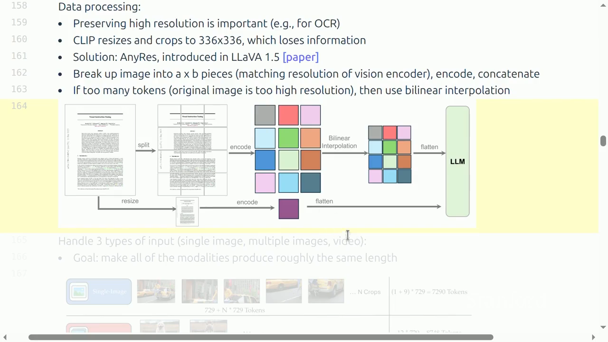

# Lecture 17：Alignment and Multimodality

> [!abstract] 本讲一句话
> Multimodal model 的核心不是“把图片塞给 LLM”，而是把不同信息密度、分辨率和时序的信号转换成 Transformer 可消费的 token，并在 encoder、projector、fusion、数据 mixture、对齐目标与生成 decoder 之间决定保留语义还是细节。

## 来源与范围
- 课程：Stanford CS336 — Language Modeling from Scratch, Spring 2026
- 讲师：Percy Liang
- 上课日期：2026-05-27
- [课程视频](https://www.youtube.com/watch?v=26FtD08ZpOU)，时长 1:17:40
- [课程主页](https://cs336.stanford.edu/)
- [官方可执行讲义](https://cs336.stanford.edu/lectures/?trace=lecture_17)
- 本讲覆盖：CLIP、SigLIP、LLaVA、LLaVA-OneVision、Qwen-VL 系列、dynamic resolution、multimodal RoPE、Chameleon 和统一生成

> [!warning] 来源边界
> 模型结构、公开数据规模和训练阶段按公开视频人工英文字幕与官方 `lecture_17.py` 交叉核对，下面是可跳转的真实时间点。课程把 Qwen3-VL 等作为 2026 课堂案例；本文不把课件之外的后续版本、性能排名或未披露数据细节写成课程结论。

## 视频时间索引

| 时间 | 内容 | 对应笔记 |
| --- | --- | --- |
| [00:00](https://www.youtube.com/watch?v=26FtD08ZpOU&t=0s) | 从 text-to-text 到 omni | [[#1. 所有模态都要进入 token 接口\|1]] |
| [02:21](https://www.youtube.com/watch?v=26FtD08ZpOU&t=141s) | Token 应表示语义单元 | [[#1. 所有模态都要进入 token 接口\|1]] |
| [05:55](https://www.youtube.com/watch?v=26FtD08ZpOU&t=355s) | CLIP objective | [[#2. CLIP：用文本监督学习视觉语义\|2]] |
| [10:25](https://www.youtube.com/watch?v=26FtD08ZpOU&t=625s) | Resize/crop 的 ImageNet 偏置 | [[#2. CLIP：用文本监督学习视觉语义\|2]] |
| [26:24](https://www.youtube.com/watch?v=26FtD08ZpOU&t=1584s) | SigLIP 的 ring/block 计算 | [[#3. SigLIP：去掉全局 softmax\|3]] |
| [30:04](https://www.youtube.com/watch?v=26FtD08ZpOU&t=1804s) | LLaVA：encoder + projector + LM | [[#4. VLM 标准模板：encoder + projector + LM\|4]] |
| [37:45](https://www.youtube.com/watch?v=26FtD08ZpOU&t=2265s) | AnyRes 与高分辨率 OCR | [[#5.1 AnyRes\|5.1]] |
| [40:33](https://www.youtube.com/watch?v=26FtD08ZpOU&t=2433s) | LLaVA-OneVision token budget/curriculum | [[#5.3 LLaVA-OneVision\|5.3]] |
| [49:29](https://www.youtube.com/watch?v=26FtD08ZpOU&t=2969s) | Dynamic resolution 的 token 量级 | [[#6.2 Qwen2-VL dynamic resolution\|6.2]] |
| [51:15](https://www.youtube.com/watch?v=26FtD08ZpOU&t=3075s) | Multimodal RoPE | [[#6.3 Multimodal RoPE\|6.3]] |
| [59:54](https://www.youtube.com/watch?v=26FtD08ZpOU&t=3594s) | Q&A：input multimodal 与 output generation | [[#7. 从理解走向统一生成\|7]] |
| [1:01:16](https://www.youtube.com/watch?v=26FtD08ZpOU&t=3676s) | Variable shapes、encoder、loss weighting | [[#9. 拓展：AI Infra 视角\|9]] |
| [1:08:10](https://www.youtube.com/watch?v=26FtD08ZpOU&t=4090s) | Chameleon unified token sequence | [[#7.2 Discrete multimodal tokens\|7.2]] |
| [1:12:25](https://www.youtube.com/watch?v=26FtD08ZpOU&t=4345s) | 图像高熵与训练稳定性 | [[#7.3 稳定性\|7.3]] |

## 视频补充：视觉 token 不是“像素版文字 token”

- Transformer 可接收连续或离散 token，但 token 应表示可用的语义单元；单个像素不是合适接口。Resize/center crop 的默认选择又隐含了 ImageNet 分类偏置。
- CLIP 选择图文对比而非纯图像学习，是因为文本提供了更高层语义监督；代价是图文数据中的语言、OCR 与选择偏差会进入 representation。
- SigLIP 把 pairwise sigmoid loss 分块/ring 化，loss 与全局 batch size 解耦；课堂提到约 32K 是一个关键 batch scale。
- LLaVA-OneVision 的 curriculum 把单图 diagram 能力迁移到多图、OCR+关系推理、GUI agent 和 video；“多模态”不是把所有来源一次混在一起即可。
- Dynamic resolution 的量级差异很大：一张大图可能约 11K visual tokens，一个小公式可能约 8 tokens。Shape bucketing、padding 和 token budget 是核心系统问题。
- 72B LM 对比不足 1B vision encoder，绝大多数容量仍在语言模型；可变 shape、额外 encoder、异步计算和 loss weighting 仍会显著增加系统复杂度。
- 文本较低熵、图像较高熵会造成 norm/logit drift；QK norm、z-loss 与 diffusion route 是不同层面的稳定化手段。



> 视频关键帧：[39:02](https://www.youtube.com/watch?v=26FtD08ZpOU&t=2342s)。底部分支保留整图低分辨率 overview，上方分块保留 OCR/细节；token 太多时再做插值压缩。

## 1. 所有模态都要进入 token 接口
此前语言模型：
$$
\text{text}\rightarrow\text{text}
$$
Omni model 的目标：
$$
\{\text{text,image,audio,video,\ldots}\}
\rightarrow
\{\text{text,image,audio,video,\ldots}\}
$$
Transformer 接收 sequence，因此每种模态都要映射为 token：
$$
f_m:
\mathcal X_m
\rightarrow
\mathbb R^{N_m\times d}
\quad\text{或}\quad
\{1,\ldots,V_m\}^{N_m}
$$
- continuous tokens：encoder feature，经 projector 映射到 LM embedding；
- discrete tokens：量化成 codebook ID，可像文字一样 autoregressive 生成。
困难在于模态的“一个 token”没有统一尺度：
- 文本 token 通常承载较高语义密度；
- image patch 是局部像素；
- video 同时有空间和时间冗余；
- 理解只需语义，生成还要保留纹理、音色等细节。
因此 multimodal design 本质上是 information bottleneck 与 compute allocation。

## 2. CLIP：用文本监督学习视觉语义
CLIP 用海量 `(image, caption)` pairs，而不是人工 ImageNet class，训练双 encoder：
$$
v_i
=
\frac{f_{\text{img}}(I_i)}
{\|f_{\text{img}}(I_i)\|}
,\qquad
t_i
=
\frac{f_{\text{text}}(C_i)}
{\|f_{\text{text}}(C_i)\|}
$$
batch similarity：
$$
S_{ij}
=
\frac{v_i^\top t_j}{\tau}
\in\mathbb R^{B\times B}
$$
对 image→text 与 text→image 做对称 cross-entropy：
$$
\mathcal L_{\text{CLIP}}
=
\frac12
\left[
\operatorname{CE}(S,\operatorname{diag})
+
\operatorname{CE}(S^\top,\operatorname{diag})
\right]
$$
正样本是 $(I_i,C_i)$，同 batch 其他 $B-1$ 个 pair 作为 negatives。

### 2.1 Shape

```text
images:        [B, 3, H, W]
image tokens:  [B, N_v, d_v]
image pooled:  [B, d_c]
text tokens:   [B, L, d_t]
text pooled:   [B, d_c]
similarity:    [B, B]
```

CLIP 课件示例：
- 图像 resize，使短边到 336，再 center crop 到 $336\times336$；
- 最佳公开配置之一为 ViT-L/14@336px；
- text encoder 取最高层 `[EOS]` activation；
- 训练使用 400M image-text pairs，原始数据未公开；

### 2.2 为什么比 image caption generation 高效
生成 caption 需要逐 token 计算完整 vocabulary softmax；contrastive objective 只需判别 batch 内配对关系，直接把视觉 embedding 对齐到语言语义空间。代价是 encoder 更擅长 semantic similarity/classification，可能丢失 OCR、精细位置和像素重建需要的细节。

### 2.3 Batch 与通信
大 batch 提供更多 negatives，但 global logits 需要跨设备 gather embeddings：
$$
B_{\text{global}}
=
B_{\text{local}}\times G
$$
similarity matrix 的计算/存储为 $O(B_{\text{global}}^2)$；distributed all-gather 也成为瓶颈。

## 3. SigLIP：去掉全局 softmax
CLIP 把每个 image 在 batch 文本中做 multiclass classification。SigLIP 将每个 pair 当 binary aligned/not-aligned：
$$
z_{ij}\in\{+1,-1\}
$$
$$
\mathcal L_{\text{SigLIP}}
=
\frac{1}{B^2}
\sum_{i,j}
\log\left(
1+\exp[-z_{ij}(v_i^\top t_j/\tau+b)]
\right)
$$
优势：
- loss 不依赖一个全局 softmax denominator；
- 更容易分块计算 pairs，减少全局同步；
- 在较小 batch 下也有较好效率；
SigLIP 使用 WebLI 量级的 multilingual image-text data，并用 OCR text、质量筛选。这里有循环依赖风险：用已有 image-text model 做数据过滤，可能强化原模型偏见与盲点。

## 4. VLM 标准模板：encoder + projector + LM
LLaVA 建立了一个极简且影响很大的模板：

```text
image → vision encoder → visual features [B, Nv, dv]
      → projector dv→dLM → visual tokens [B, Nv, dLM]
visual tokens + text tokens → causal LM → text response
```

### 4.1 Projector
最简单是线性层：
$$
E_v=ZW,\qquad
W\in\mathbb R^{d_v\times d_{\text{LM}}}
$$
也可用 2-layer MLP、cross-attention resampler/Q-former，把可变 patch features 压到固定长度。
Projector 不只是对齐维度，还决定：
- LM 能看到多少 visual tokens；
- 是否压缩空间细节；
- 是否保留二维位置；
- vision encoder 与 LM 的 representation gap。

### 4.2 LLaVA 数据
LLaVA 使用 COCO 的 caption/bounding-box 信息，prompt GPT-4 生成 conversation/questions，再配回原始 image，形成约 158K examples。
这是一种 synthetic multimodal instruction data：

```text
image + human metadata
→ teacher sees textual description/objects
→ synthetic conversation
→ pair conversation with original image
```

风险：teacher 并未直接看到 image 时，问题/回答只受 caption 覆盖，遗漏视觉细节甚至产生不被图像支持的内容。

### 4.3 两阶段训练
LLaVA：
1. **Alignment**：冻结 vision encoder 与 LM，只训练 projector；
2. **Fine-tuning**：冻结 vision encoder，训练 projector + LM。
第一阶段让 visual features 进入 LM embedding manifold；第二阶段让 LM 学会根据视觉 token 回答。冻结 vision encoder 减少 compute 与 catastrophic drift，但限制 task-specific visual adaptation。

## 5. 分辨率、多图和视频
固定 resize/crop 会丢失：
- 边缘内容；
- 小字号 OCR；
- high-resolution chart；
- long screenshot；
- spatial relation。

### 5.1 AnyRes
对原图选择 $a\times b$ 网格，每个 tile resize 到 vision encoder 的基准分辨率，分别编码后拼接：
$$
N_v
\approx
abN_{\text{tile}}
+N_{\text{global}}
$$
优点是保留细节；代价是 visual tokens 和 LM attention compute 增长。
若 LM self-attention 直接融合：
$$
C_{\text{attn}}
=
O\left((L_{\text{text}}+N_v)^2d\right)
$$
高分辨率图片会迅速消耗 context。LLaVA-OneVision 在 token 太多时用 interpolation 压缩 feature grid。

### 5.2 单图、多图、视频的 token budget
课程总结的策略：
- single image：可用较高分辨率；
- multiple images：每图用 base resolution；
- video：每 frame 用更低分辨率/更少 tokens。
目标是让不同样本的总 visual-token length 接近，保证训练稳定和 batch 利用率。它也反映视频的相邻帧冗余：不应把每帧都按单图最高预算处理。

### 5.3 LLaVA-OneVision
- vision encoder：SigLIP；
- text decoder：Qwen2 72B；
- projector：2-layer MLP；
- 支持 single image、multi-image、video；
- data philosophy：quality over quantity；
- curriculum：由易到难。
课件强调主要工作在 synthetic、task-specific 数据策划；架构模板相对稳定。

## 6. 动态视觉 token 与位置编码

### 6.1 Qwen-VL
早期 Qwen-VL：
- OpenCLIP ViT-bigG 类视觉 encoder；
- 单层 cross-attention adaptor；
- 加 2D position；
- 映射成固定 256 visual tokens；
- ``、`<box>`、`<ref>` 支持 grounding。
训练阶段：
1. 大规模低质量 pair，冻结 LM，训练 vision encoder + adaptor；
2. 更高质量 task data，提高分辨率，训练全部参数；
3. instruction tuning，冻结 vision encoder，训练 adaptor + LM。
这体现“量→质→行为对齐”的一般 curriculum。

### 6.2 Qwen2-VL dynamic resolution
Qwen2-VL 根据输入 resolution 动态产生 token。课件给出的例子：
- ViT patch size 14；
- 每 $2\times2$ spatial tokens merge；
- $224\times224$ region 约映射为 66 tokens（包含具体实现边界/特殊 token）；
- video 采样约 2 frames/s，并设置 visual-token 上限。
一般近似：
$$
N_v
\approx
\frac{HW}{(p\cdot m)^2}
$$
$p$ 是 patch size，$m$ 是 spatial merge factor。

### 6.3 Multimodal RoPE
Text 只有位置 $t$；image/video 需要 temporal、height、width：
$$
(t,h,w)
$$
MRoPE 把 rotary dimensions 分配给三个 axes，使 attention 能表示帧次序与二维关系。Qwen3-VL 课件案例进一步：
- interleaved temporal/width/height frequency bands；
- video timestamps 用显式 tokens 表达；
- DeepStack 将 visual information 注入多层；
- long-context pretraining 从 8K 逐步扩到 32K、256K；
- post-training 包含 long-CoT SFT、distillation 和 RL。

### 6.4 Loss balance
Video 样本 token 多，若直接对所有 token 求平均，会支配 gradient。设每样本 token 数 $L_i$，普通 token average：
$$
\mathcal L
=
\frac{\sum_i\sum_{t=1}^{L_i}\ell_{it}}
{\sum_iL_i}
$$
课程提到 Qwen3-VL 的 square-root-normalized per-token weighting，用来平衡 text 与 multimodal 长样本。一般思想是在：
- 每 token 同权；
- 每 example 同权；
- 按 $\sqrt{L_i}$ 等中间尺度
之间选择，避免视频长度等同于更高任务重要性。

## 7. 从理解走向统一生成
CLIP/SigLIP continuous feature 很适合理解，却不能直接让 causal LM 输出 image。两条路线：

### 7.1 专用生成 decoder
LLM 输出 semantic condition，再由 diffusion/其他 continuous generative model 生成 image/audio。优点是重建质量高；缺点是系统包含多个模型与 sampling loop。

### 7.2 Discrete multimodal tokens
Chameleon 用 VQ-VAE 将 image 映射为 codebook IDs：
$$
z_e=E(I),\qquad
k_{hw}
=
\arg\min_j
\|z_{e,hw}-e_j\|^2
$$
decoder 重建：
$$
\hat I=D(e_{k})
$$
课件配置将 $512\times512$ image 编成 1024 tokens，codebook size 8192；再与 text tokens 一起 autoregressive modeling。
优势：
- 一个 Transformer 同时理解与生成；
- interleaved text/image 自然表示；
- 使用统一 next-token objective。
代价：
- quantization 丢失 OCR/细纹理；
- image token entropy 高、序列长；
- text/image 统计差异导致训练不稳定；
- autoregressive image generation 慢。

### 7.3 稳定性
课程指出 text tokens entropy 较低、image tokens entropy 较高，混训会造成 norm growth 与 logit drift。Chameleon 使用：
- QK norm；
- z-loss regularization。
常见 z-loss：
$$
\mathcal L_z
=
\lambda
\left(
\log\sum_j e^{z_j}
\right)^2
$$
它抑制 log-partition 过度增长，提高大规模混合训练稳定性。

## 8. 拓展：Multimodal data 与 alignment

### 8.1 数据层次

| 阶段 | 数据 | 学到什么 |
| --- | --- | --- |
| Encoder pretraining | noisy image-caption/web pairs | cross-modal semantics |
| Alignment | image/text pairs，冻结大模块 | projector 接口 |
| Capability tuning | OCR、chart、grounding、video、multi-image | 细分任务 |
| Instruction SFT | multimodal conversation/tool use | 交互格式 |
| Preference/RL | chosen/rejected、verifiable tasks | helpfulness/safety/reasoning |
合成数据非常重要，但必须确认 teacher 是否真正访问原模态；只看 caption 的 teacher 不能产生可靠的 pixel-grounded answer。

### 8.2 Safety 扩展
Multimodality 带来 text-only policy 没覆盖的攻击面：
- image 中的 prompt injection；
- OCR 隐藏/极小/对抗文字；
- 人脸、位置、屏幕截图中的 PII；
- medical/biometric 高风险判断；
- tool-using agent 根据恶意 UI 执行动作。
安全数据必须包括跨模态组合：单独看 text 或 image 都无害，组合后才形成违规意图。

### 8.3 Evaluation
至少分开：
- perception/OCR；
- grounding/localization；
- knowledge/reasoning；
- multi-image relation；
- temporal/video；
- hallucination；
- safety；
- latency/token budget。
用 LM-as-judge 评视觉结果时，要确认 judge 能看到原图，而不是只看到答案文本。

## 9. 拓展：AI Infra 视角

### Shape
典型 early-fusion VLM：

```text
pixels:         [B, 3, H, W]
patch features: [B, Nv, dv]
projected:      [B, Nv, dlm]
text embeds:    [B, Lt, dlm]
fused sequence: [B, Nv + Lt, dlm]
logits:         [B, Nv + Lt, Vtext]
```

Dynamic resolution 让 $N_v$ 变化，batch padding 浪费可能很高。

### Compute
$$
C_{\text{total}}
=
C_{\text{vision}}
+C_{\text{projector}}
+C_{\text{LM}}(L_t+N_v)
+C_{\text{generator}}
$$
通常 LM self-attention 对 visual token 数最敏感。压缩 $N_v$ 能显著降低 prefill，但可能损害 OCR/grounding。

### Memory
- vision activations；
- fused-sequence activations；
- attention matrix/KV；
- video frames decode buffer；
- generation decoder state。
推理 KV cache 近似随：
$$
M_{\text{KV}}
\propto
B(L_t+N_v)n_{\text{layers}}d_{\text{KV}}
$$
增长；visual tokens 虽只出现在 prefill，通常仍占后续 decode 的 KV。

### Communication
- CLIP global negatives 需要 all-gather embeddings；
- 高分辨率 image/video 输入传输大；
- tensor/pipeline parallel 下长 visual prefill 增大通信；
- encoder 与 LLM 分离服务会传 `[B,N_v,d]` features，需权衡带宽、缓存和版本一致性。

### Runtime
需考虑：
- image decode/resize/crop；
- video seek/frame sampling；
- variable-resolution batching；
- encoder feature cache；
- prefill/decode disaggregation；
- content moderation 与 metadata stripping。

## 10. 拓展：我的推导与易错点

### 10.1 Visual token 是 compute currency
分辨率扩大 $k$ 倍（高宽都乘 $k$）：
$$
N_v'\approx k^2N_v
$$
若 LM full attention：
$$
C_{\text{attn}}'
\approx
O((L_t+k^2N_v)^2)
$$
因此“保留原图分辨率”不是免费改进，必须搭配 tiling、token merge、resampler 或 sparse attention。

### 10.2 Encoder 目标决定可恢复信息
Contrastive encoder 被奖励保留 caption 可描述的 semantics，而不是每个像素细节。Projector 再复杂也不能恢复 encoder 已丢掉的信息。OCR 较差可能应改 resolution/encoder objective，而不是只扩 LM。

### 10.3 理解 tokenizer 与生成 tokenizer 的目标不同
- 理解：允许 many-to-one，强调 invariant semantics；
- 生成：需要近似 invertible，保留高频细节。
一个 codebook 同时承担二者会有冲突；这解释了很多系统使用 continuous semantic encoder + diffusion decoder，而非完全统一离散 token。

### 10.4 常见错误
- 把 image resize 后的 $H,W$ 与原图混淆；
- 忽略 center crop 已删除边缘内容；
- variable-length visual tokens padding 进 loss/attention；
- projector 输出维度正确就认为 modality 已对齐；
- 合成问答 teacher 没看图；
- image/video token 多，未经归一化支配 training loss；
- text-only safety eval 直接用于 multimodal model；
- visual KV cache 不进入推理容量规划；
- 把模型能描述图片等同于能可靠定位像素。

## 11. 本讲结论
1. Transformer 的统一接口是 token sequence；multimodality 的第一难题是把每种模态转换成有用且可负担的 token。
2. CLIP 用 batch contrastive learning 对齐 image/text semantics；SigLIP 用 pairwise sigmoid loss降低全局 softmax/batch 依赖。
3. 主流 VLM 模板是 vision encoder + projector + causal LM，数据和训练阶段往往比 projector 花样更关键。
4. AnyRes、dynamic resolution 和 token merging 在视觉细节与 LM context compute 之间权衡。
5. Video/长图 token 数巨大，position、loss normalization、batching 和 KV cache 都需要专门设计。
6. Continuous semantic encoder 适合理解；discrete VQ tokens 可以统一生成，但有量化损失与训练稳定性问题。
7. Multimodal alignment 不只包含回答偏好，还包含 grounding、跨模态 safety、tool action 与数据许可。

## 12. 自测问题
1. 为什么 multimodal Transformer 必须定义每种模态的 token 接口？
2. 写出 CLIP 的 $B\times B$ similarity matrix 和对称 loss。
3. SigLIP 与 CLIP 在 loss 和 distributed communication 上有何差别？
4. Projector 除了匹配 embedding dimension，还控制什么？
5. AnyRes 为什么提升 OCR，又为什么显著增加 LM compute？
6. Dynamic resolution 下 visual-token 数如何随 $H,W,p,m$ 变化？
7. MRoPE 为什么需要 temporal/height/width 三轴？
8. 为什么 video example 可能支配普通 per-token loss？
9. Continuous encoder + diffusion 与统一 discrete token 各有什么优缺点？
10. Multimodal prompt injection 与 text-only injection 有何额外风险？

## 参考资料
- [Lecture 17 官方可执行讲义](https://cs336.stanford.edu/lectures/?trace=lecture_17)
- [Lecture 17 视频](https://www.youtube.com/watch?v=26FtD08ZpOU)
- [CLIP](https://arxiv.org/abs/2103.00020)
- [SigLIP](https://arxiv.org/abs/2303.15343)
- [LLaVA](https://arxiv.org/abs/2304.08485)
- [LLaVA-OneVision](https://arxiv.org/abs/2408.03326)
- [Qwen-VL](https://arxiv.org/abs/2308.12966)
- [Qwen2-VL](https://arxiv.org/abs/2409.12191)
- [Chameleon](https://arxiv.org/abs/2405.09818)
- [VQ-VAE](https://arxiv.org/abs/1711.00937)
