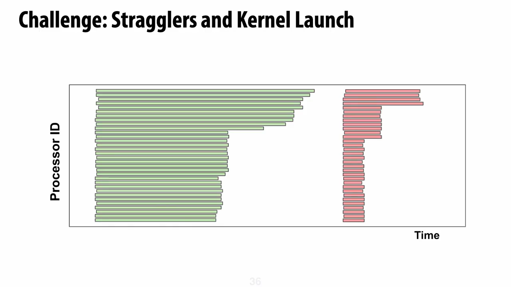

# Lecture 18：Guest Lecture — Dan Fu

> [!abstract] 本讲一句话
> 推理引擎是把 GPU 和电力转化为 token 的机器；只有同时理解真实 workload、调度与 KV cache、GPU kernel 和模型架构，才可能跨越单层局部优化，在整个系统中寻找新的效率前沿。

## 来源与范围

- 课程：Stanford CS336 — Language Modeling from Scratch, Spring 2026
- 嘉宾：Dan Fu
- 上课日期：2026-06-03
- [课程视频](https://www.youtube.com/watch?v=9EEm4iMAF5s)，时长 1:11:41
- [课程主页](https://cs336.stanford.edu/)
- 讲座主题：LLM inference 的请求生命周期、production serving、KV cache、prefill/decode disaggregation、megakernel，以及稳定的 looped language model Parcae
- 嘉宾在开场中说明，本讲工作分别来自其 UCSD 团队和 Together AI
- 课程主页没有为这场 guest lecture 提供公开讲义；正文以公开视频的人工 `en-US` 字幕为主，并用相关项目页与论文校正术语、公式和实验口径

> [!warning] 编号说明
> 这份笔记按**公开视频播放顺序**编号：它是 Spring 2026 播放列表中的第 18 个视频。课程官网日程把 Daniel Selsam 列为 Lecture 18、Dan Fu 列为 Lecture 19，但当前公开播放列表中没有前者的录像。因此本文沿用你的观看顺序，记作 Lecture 18，同时保留实际上课日期 2026-06-03。

> [!warning] 来源边界
> 时间索引来自公开视频人工 `en-US` 字幕，可以用于跳转；课堂 Q&A 的听不清片段仍保守转述。Parcae、ThunderKittens 与 CPD 的技术细节以论文或项目页为准。课堂中的硬件产品、模型规模和商业合作是 2026 年讲授时的快照；本文不把它们外推为长期不变的事实。

## 视频时间索引

| 时间 | 内容 | 对应笔记 |
| --- | --- | --- |
| [00:05](https://www.youtube.com/watch?v=9EEm4iMAF5s&t=5s) | 从训练模型转向服务模型 | [[#1. 本讲主线：从模型到推理服务\|1. 本讲主线]] |
| [05:04](https://www.youtube.com/watch?v=9EEm4iMAF5s&t=304s) | Inference engine 把硬件转化为 intelligence | [[#2. 为什么 inference 是全栈问题\|2. 为什么 inference 是全栈问题]] |
| [07:39](https://www.youtube.com/watch?v=9EEm4iMAF5s&t=459s) | Lifetime of a token | [[#3. 一个 token 的生命周期\|3. 一个 token 的生命周期]] |
| [09:38](https://www.youtube.com/watch?v=9EEm4iMAF5s&t=578s) | 真实 workload 的形状 | [[#4. Workload 先于优化\|4. Workload 先于优化]] |
| [14:02](https://www.youtube.com/watch?v=9EEm4iMAF5s&t=842s) | Prefill 与 decode | [[#5. Prefill 与 decode\|5. Prefill 与 decode]] |
| [16:18](https://www.youtube.com/watch?v=9EEm4iMAF5s&t=978s) | Continuous batching | [[#6. Continuous batching：动态资源分配\|6. Continuous batching]] |
| [18:01](https://www.youtube.com/watch?v=9EEm4iMAF5s&t=1081s) | Prefix reuse 与 KV cache | [[#7. KV cache 是系统资源\|7. KV cache 是系统资源]] |
| [19:55](https://www.youtube.com/watch?v=9EEm4iMAF5s&t=1195s) | Prefill/decode disaggregation | [[#8. Prefill/decode 解耦\|8. Prefill/decode 解耦]] |
| [22:06](https://www.youtube.com/watch?v=9EEm4iMAF5s&t=1326s) | Production-scale inference bugs | [[#9. 小概率错误会变成必现事件\|9. 小概率错误会变成必现事件]] |
| [25:38](https://www.youtube.com/watch?v=9EEm4iMAF5s&t=1538s) | HBM、DRAM、SSD cache hierarchy | [[#10. KV cache 的存储层级\|10. KV cache 的存储层级]] |
| [31:41](https://www.youtube.com/watch?v=9EEm4iMAF5s&t=1901s) | Cache-aware PD disaggregation | [[#11. CPD：把 cache hit rate 纳入路由\|11. CPD：把 cache hit rate 纳入路由]] |
| [34:09](https://www.youtube.com/watch?v=9EEm4iMAF5s&t=2049s) | Megakernel | [[#12. Megakernel：把 GPU 视为分布式系统\|12. Megakernel]] |
| [41:45](https://www.youtube.com/watch?v=9EEm4iMAF5s&t=2505s) | Parcae 与 looped Transformer | [[#13. Parcae：用循环扩展计算而不是参数\|13. Parcae]] |
| [54:14](https://www.youtube.com/watch?v=9EEm4iMAF5s&t=3254s) | Recurrence scaling laws | [[#15. Looping scaling law\|15. Looping scaling law]] |
| [60:38](https://www.youtube.com/watch?v=9EEm4iMAF5s&t=3638s) | Q&A：部署、硬件和架构取舍 | [[#16. Q&A：把系统约束带回模型设计\|16. Q&A]] |

## 视频补充：生产事故、估算值与未发表轶事

- Workload 不能只用平均输入/输出长度表示，还要记录 turn gap、sticky session、tool loop 和 session-level prefix reuse。
- 课堂给了三个具体事故：NaN 导致重复 token；tool-call 状态机形成 loop；off-by-one/未初始化内存让输出偏向中文。大规模流量会把小概率 bug 变成常态事件。
- [27:51](https://www.youtube.com/watch?v=9EEm4iMAF5s&t=1671s) Q&A 把 KV hierarchy 类比 OS paging；用户重新打开旧会话本身就是 prefetch signal。
- CPD 在特定设置下最高约 40% serving speedup；megakernel 的 30–70% 和 “speed-of-light bandwidth utilization” 都依赖具体 workload，不能泛化成产品承诺。
- [1:01:13](https://www.youtube.com/watch?v=9EEm4iMAF5s&t=3673s) 循环 2–3 个预训练 Qwen layer 后部分数学题变好的说法是未发表课堂 anecdote，不是稳定结论。
- [1:03:37](https://www.youtube.com/watch?v=9EEm4iMAF5s&t=3817s) “资深工程师一年可能只覆盖一种硬件、2–3 个模型、batch 1–16，batch 17 可能重做”是讲者估算，用于说明 megakernel specialization 成本。
- Agentic workload 有 hot KV 与 sticky sessions，和 one-shot batch workload 不同；把 NCCL collective 融入多 GPU persistent kernel 仍是 preliminary idea。

## 1. 本讲主线：从模型到推理服务

此前课程主要回答：

> 如何训练出一个 language model？

本讲换到模型的另一侧：

> 模型已经训练好了，怎样把请求稳定、快速而经济地变成输出 token？

一个模型可以抽象为由 tensor operations 构成的 DAG，但 DAG 本身不会自动变成一个可用服务。还需要：

1. 接收并鉴权请求；
2. 识别 workload 和 SLO；
3. 查找可复用的 prefix/KV cache；
4. 调度 prefill、decode 和不同 GPU；
5. 执行 kernels 与通信；
6. sampling、停止条件、tool-call parsing 和安全检查；
7. 流式返回 token；
8. 在高并发和硬件故障下继续满足延迟目标。

本讲的两条研究线都来自这个观察：

- **Megakernel**：深入 kernel 与 GPU execution model，消除 decode 中的空泡；
- **Parcae**：从推理的参数与内存约束反推模型架构，用 recurrence 增加计算深度而不同比例增加参数。

它们看似一个偏系统、一个偏模型，实际共享同一个目标：

> 不只优化现有 DAG 的执行，还要允许系统约束反过来改变 DAG。

## 2. 为什么 inference 是全栈问题

讲座将 inference engine 类比为“把能源和硬件转化为可用智能的引擎”。这个类比强调：

- GPU 只提供 compute、memory 和 communication；
- 模型权重只规定数学函数；
- 推理系统决定这些资源能否以目标延迟和成本转化为 token。

### 2.1 局部最优不等于服务最优

一个 kernel 更快，不一定让服务更快。端到端请求延迟可以粗略分解为：

$$
T_{\text{request}}
=
T_{\text{queue}}
+T_{\text{cache lookup}}
+T_{\text{prefill}}
+T_{\text{KV transfer}}
+T_{\text{decode}}
+T_{\text{post}}
$$

如果主要时间花在排队、KV 传输或 decode，继续优化 prefill GEMM 的收益可能接近零。

反过来，一个只有几行路由逻辑的修改，如果能避免 warm request 被 cold prefill 阻塞，就可能比重写某个 kernel 更有价值。

### 2.2 全栈优化的四个层次

| 层次 | 主要对象 | 典型问题 |
| --- | --- | --- |
| Workload | 请求长度、轮次、间隔和 SLO | 真实流量到底是什么形状？ |
| Serving | batching、routing、cache、P/D 分离 | 请求应该去哪台机器、何时运行？ |
| Kernel | launch、tiling、同步、fusion | GPU 是否一直在做有用工作？ |
| Architecture | 参数、KV、attention、recurrence | 模型本身是否适合目标硬件和流量？ |

## 3. 一个 token 的生命周期

一次生成请求大致经过：

```text
request
  ↓
authentication / admission control
  ↓
tokenization
  ↓
prefix lookup / session lookup
  ↓
scheduler and router
  ↓
prefill workers
  ↓
KV-cache placement or transfer
  ↓
decode workers + continuous batching
  ↓
sampling / stop condition / tool-call parsing
  ↓
stream tokens to the client
```

### 3.1 请求进入系统

系统首先得到：

- 输入 token；
- generation parameters；
- model/adapter 标识；
- latency 或 priority class；
- session/conversation 标识；
- 可能的 tool schema 与 structured-output 约束。

这些元数据不能都推迟到模型运行以后处理，因为它们会影响：

- 是否存在 cache hit；
- 选择哪个 replica；
- 是否允许排队；
- batch compatibility；
- 最大输出长度和显存预留。

### 3.2 模型执行之后仍有工作

模型给出 logits 后，系统还要：

1. 应用 temperature、top-p/top-k 等 sampling policy；
2. 检查 stop token 或 stop string；
3. 解析 tool call、JSON 或 grammar-constrained output；
4. 更新会话状态；
5. 把 token 流式返回。

因此 production bug 可能不在 Transformer 内部，而在外围状态机中。

## 4. Workload 先于优化

训练通常使用相对规整的 batch，但 production traffic 是一个分布。

定义单个请求：

$$
w=(L_{\text{in}}, L_{\text{out}}, n_{\text{turn}}, \Delta t, \text{SLO}, \text{cacheability})
$$

其中：

- $L_{\text{in}}$：输入长度；
- $L_{\text{out}}$：输出长度；
- $n_{\text{turn}}$：会话轮次；
- $\Delta t$：相邻轮次的时间间隔；
- SLO：TTFT、TPOT、端到端延迟或吞吐目标；
- cacheability：与已有 prefix/KV 的重合程度。

### 4.1 不同应用不是同一种 workload

| 应用 | 常见形状 | 系统关注点 |
| --- | --- | --- |
| Coding agent | 长 codebase，上下文复用，多轮 tool calls | prefix cache、session affinity、长会话 |
| 普通 chat | 中短输入，中短输出，交互延迟敏感 | TTFT、TPOT、continuous batching |
| Voice agent | 连续交互，首 token 极敏感 | 极低尾延迟、稳定 decode |
| 文档总结 | 超长输入，较短输出，可能一次性 | prefill capacity、context parallel |
| 后台 agent | 长输出、多轮、轮次间隔不规则 | cache eviction、恢复和 durable session |
| Batch processing | 一次性文档，吞吐优先 | 大 batch、prefill 利用率 |

### 4.2 不能只用平均长度

假设两个系统的平均输入长度都是 8K：

- 系统 A：所有请求都接近 8K；
- 系统 B：90% 为 1K，10% 为 71K。

两者的平均值相同，但：

- queueing behavior 不同；
- tail latency 不同；
- cold prefill 对 warm request 的干扰不同；
- cache hit 和显存分配不同。

因此容量规划至少要保留长度分布、并发分布和 cache-hit 分布。

## 5. Prefill 与 decode

### 5.1 Prefill

Prefill 同时处理输入序列的多个 token：

$$
X\in\mathbb{R}^{B\times S\times d}
$$

大矩阵乘法和 attention 可以提供较高并行度，通常更接近 compute-bound workload。

它主要影响：

- Time to First Token（TTFT）；
- 长 prompt 吞吐；
- KV cache 的创建速度。

### 5.2 Decode

Decode 每一步只为每个 active sequence 生成少量 token：

$$
x_t\in\mathbb{R}^{B\times 1\times d}
$$

每一步仍要访问大部分模型权重。batch 较小时，计算量不足以隐藏权重读取，因而经常受 HBM bandwidth 限制。

如果模型权重为 $P$ 个参数，每参数 $b_w$ bytes，忽略 cache、通信和 kernel overhead，则单步延迟存在粗略下界：

$$
T_{\text{decode step}}
\gtrsim
\frac{P b_w}{BW_{\text{HBM}}}
$$

相应的理想 token throughput 上界近似：

$$
\text{tokens/s}
\lesssim
\frac{BW_{\text{HBM}}}{P b_w}
$$

这是近似模型，不代表真实 benchmark：

- batch 会让一次权重读取服务多个 sequence；
- MoE 每 token 只激活部分权重；
- tensor parallel 引入通信；
- KV cache 和 activation 也消耗带宽；
- kernel launch 与 tail effect 会产生空泡。

### 5.3 两阶段优化目标不同

| 阶段 | 典型瓶颈 | 主要指标 | 常见优化 |
| --- | --- | --- | --- |
| Prefill | Tensor-core compute、attention、长序列内存 | TTFT、input tok/s | FlashAttention、chunked prefill、context parallel |
| Decode | 权重/KV 带宽、kernel 空泡、同步 | TPOT、output tok/s | batching、quantization、speculation、megakernel |

## 6. Continuous batching：动态资源分配

静态 batching 要等整个 batch 的请求全部结束，容易被长输出拖住。

Continuous batching 在每个 decode step 重新组织 active batch：

1. 已完成的 sequence 立刻移出；
2. 新请求可以加入空出的 slot；
3. 每一步重新检查 token 和 KV memory budget；
4. 当显存不足时，新请求进入队列或触发 cache eviction。

可以把 scheduler 的约束写成：

$$
\sum_{i\in \mathcal{B}} M_{\text{KV},i}
+M_{\text{weights}}
+M_{\text{workspace}}
\le M_{\text{GPU}}
$$

同时还要满足：

$$
\operatorname{P99}(\text{TTFT})\le S_{\text{TTFT}},
\qquad
\operatorname{P99}(\text{TPOT})\le S_{\text{TPOT}}
$$

所以 batch size 不是越大越好：

- 大 batch 提高吞吐和 weight reuse；
- 但会增加排队、TPOT 和 KV memory；
- 极长请求还会制造 tail effect。

## 7. KV cache 是系统资源

### 7.1 KV cache 存了什么

自回归 attention 不需要每一步重新计算历史 token 的 key/value。

对 $L$ 层、序列长度 $S$、$H_{kv}$ 个 KV heads、head dimension $d_h$、每元素 $b$ bytes，单 sequence 的 KV cache 大小约为：

$$
M_{\text{KV}}
\approx
2LSH_{kv}d_hb
$$

前面的 2 对应 key 和 value。

对于 batch 内多个不同长度的 sequence：

$$
M_{\text{KV,total}}
\approx
2LH_{kv}d_hb\sum_i S_i
$$

因此 GQA/MLA、KV quantization 和 local attention 会直接改变 serving capacity。

### 7.2 Prefix cache 与普通 KV cache

- **KV cache**：避免同一 sequence 在 decode 中重算历史；
- **Prefix cache**：让不同请求或同一会话的后续轮次复用已经计算的公共前缀。

Prefix lookup 可以用 trie/radix tree 或基于 block hash 的结构：

```text
system prompt
  ├── user A turn 1
  │     └── assistant A turn 1
  └── user B turn 1
```

匹配到的最长前缀越长，需要重新 prefill 的 token 越少。

### 7.3 Cache hit 不是二元变量

定义 cache-hit ratio：

$$
r_{\text{hit}}
=
\frac{L_{\text{reused}}}{L_{\text{prompt}}}
$$

- $r_{\text{hit}}\approx 0$：cold request；
- $r_{\text{hit}}\approx 1$：warm request；
- 中间情况需要同时读取旧 KV 并计算新增 token。

后面的 CPD 正是把 $r_{\text{hit}}$ 从“缓存统计指标”提升为“路由特征”。

## 8. Prefill/decode 解耦

Prefill 和 decode 的硬件需求、运行时长和优化目标不同，因此可以放到不同 worker pools：

```text
request
   ↓
prefill workers ── KV transfer ──→ decode workers
                                      ↓
                                  output tokens
```

### 8.1 收益

- prefill 的长计算不再阻塞 latency-sensitive decode；
- 两种 worker 可以选择不同并行度、batch 和硬件；
- 可以独立扩缩容；
- 更容易分别守住 TTFT 与 TPOT。

### 8.2 新成本

Prefill 产生的 KV cache 必须转移到 decode worker。

解耦有价值的大致条件是：

$$
T_{\text{interference saved}}
>
T_{\text{KV transfer}}
+T_{\text{routing}}
+T_{\text{queue imbalance}}
$$

如果 interconnect 慢、KV 很大或负载失衡，P/D 分离未必优于 colocated serving。

### 8.3 硬件专业化

课堂用不同 accelerator 作为例子说明：

- prefill 更需要矩阵算力；
- decode 更重视权重驻留、片上/近存储容量和带宽；
- workload 被明确拆分后，异构硬件才有更自然的放置空间。

这里的重点不是某一种产品一定更优，而是：

> 先把 workload 的瓶颈分开，硬件选择才有明确目标。

## 9. 小概率错误会变成必现事件

当系统每天处理海量 token 时，概率极低的 bug 也会持续出现。

课堂给出三类案例。

### 9.1 NaN 导致退化循环

极少触发的 kernel 数值错误可能让 logits 出现 NaN，随后模型反复输出相同 token 或标点。

需要监控：

- logits/activation 是否 finite；
- 重复 token run length；
- entropy 是否突然塌缩；
- 特定 kernel/config 是否与异常相关。

### 9.2 Tool-call 状态机错误

模型已经发出 tool call，但 serving harness 没有正确结束当前生成或执行工具，于是模型不断重复请求工具，造成异常长 completion。

这说明：

- output length distribution 也是健康指标；
- 不能只看 HTTP 200；
- tool-call parser 和 agent state machine 必须纳入端到端测试。

### 9.3 Off-by-one 与未初始化内存

课堂案例中，一个非常细微的 kernel 越界读取改变了 attention 结果，使模型偶发输出意外字符，并在后续自回归中放大偏差。

自回归的危险在于：

$$
\text{small error at }t
\rightarrow
\text{different token}
\rightarrow
\text{different context at }t+1
\rightarrow
\text{trajectory divergence}
$$

因此数值误差不能只用单步平均误差衡量，还应检查：

- token-level agreement；
- generation-level divergence；
- 不同 batch/context shape；
- 长时间 soak test；
- canary 与快速 rollback。

## 10. KV cache 的存储层级

仅靠 HBM 很快无法容纳大量长会话，因此 cache 会形成 hierarchy：

```text
GPU HBM
  ↓ eviction / ↑ prefetch
CPU DRAM
  ↓ eviction / ↑ prefetch
Local NVMe / SSD
  ↓
Distributed cache or object storage
```

### 10.1 每层的取舍

| 层级 | 延迟 | 容量 | 典型用途 |
| --- | --- | --- | --- |
| HBM | 最低 | 最小、最贵 | active sequences |
| CPU DRAM | 较低 | 更大 | 近期可能恢复的 session |
| NVMe/SSD | 更高 | 很大 | 冷却中的长会话 |
| Distributed store | 网络相关 | 可横向扩展 | 跨 worker/session reuse |

### 10.2 Eviction

最简单策略是 LRU，但真正目标不是“最久没访问”，而是：

$$
\max \mathbb{E}[\text{future recompute saved}]
-\text{storage/transfer cost}
$$

影响 cache value 的因素包括：

- prefix 长度；
- 重新 prefill 的成本；
- 用户恢复会话的概率；
- cache 所在层级；
- 迁移到目标 worker 的成本；
- 当前 SLO 压力。

### 10.3 Predictive prefetch

如果 UI 显示用户打开旧会话，系统可能在用户发送下一条消息前就把 KV 从 SSD/DRAM 提升到 HBM。

这与经典 OS 的 paging/prefetch 很相似，但多了模型特有信息：

- token prefix；
- session semantics；
- prompt compute cost；
- GPU topology。

## 11. CPD：把 cache hit rate 纳入路由

普通 P/D disaggregation 分开 prefill 和 decode，但 warm 与 cold prefill 仍共享同一队列。

问题：

```text
100K-token cold prompt
        ↓
occupies prefill capacity
        ↓
nearly cached warm request waits behind it
        ↓
TTFT tail grows
```

Cache-aware Prefill–Decode Disaggregation（CPD）进一步拆为：

| 角色 | 处理对象 | 行为 |
| --- | --- | --- |
| Pre-prefill nodes | cache reuse 很低的 cold request | 计算新 context，写入 distributed KV cache |
| Prefill nodes | cache reuse 很高的 warm request | 快速读取旧 KV，只计算增量 |
| Decode nodes | 已完成 prefill 的 request | 专注 latency-sensitive generation |

路由器可以依据：

$$
\text{route}(x)
=f(r_{\text{hit}}, L_{\text{miss}}, Q_{\text{cold}}, Q_{\text{warm}}, \text{SLO})
$$

其中 $L_{\text{miss}}$ 是必须重新计算的 token 数。

课堂与项目页报告，在其特定长上下文混合流量和 tail-latency SLO 下，CPD 可将 sustainable throughput 提高约 35–40%。这个数字依赖：

- 请求长度和 cache-hit 分布；
- worker 配比；
- KV transfer；
- 使用的模型与硬件；
- SLO 定义。

> [!important] 关键认识
> Cache 不只是 memory optimization。只要 cache hit 会显著改变服务时间，它就必须进入 admission、routing、capacity planning 和 SLO 模型。

## 12. Megakernel：把 GPU 视为分布式系统

### 12.1 Kernel-per-operation 的空泡

传统执行把模型拆成许多 kernels：

```text
RMSNorm
→ QKV projection
→ RoPE
→ Attention
→ O projection
→ RMSNorm
→ MLP
→ residual
→ ...
```

每个 kernel 独立 launch 会引入：

1. launch/teardown overhead；
2. kernel 之间的全局边界；
3. 上一个 kernel 的 tail effect；
4. 下一组权重无法足够早地 prefetch；
5. decode 的短小操作无法持续填满全部 SM。

对 memory-bound decode：

$$
\text{useful bandwidth utilization}
=
\frac{\text{time moving useful weights/data}}
{\text{total decode time}}
$$

kernel 之间的空白时间会直接降低这个比例。



> 视频关键帧：[36:17](https://www.youtube.com/watch?v=9EEm4iMAF5s&t=2177s)。横轴是时间、纵轴是 SM；绿色/红色 bars 之间的大块空白来自 launch boundary、tail effect 和不同长度任务的等待。

### 12.2 核心思想

Megakernel 把多个 operation，极端情况下把整个 forward pass，放进一个 persistent kernel。

此时不再是：

> CUDA runtime 依次调度一串 kernels。

而是：

> 一个常驻 GPU program 把所有 operation 拆成有依赖的 tasks，再显式调度到各个 SM。

GPU 因而像一个小型分布式系统：

- SM 是 workers；
- instruction queue 是 task graph；
- shared memory 是有限的 local storage；
- counters/barriers 管理依赖；
- global memory load 与 compute 需要 pipeline。

### 12.3 可以实现的 overlap

课堂举例：

- QKV projection 和 RoPE 尚未全部结束时，先为已经就绪的 heads 加载 KV；
- attention 仍在运行时，预取后续 O projection 的权重；
- reduction 的部分结果一旦就绪，立即启动下游工作；
- 不等待整个 tensor 完成才进入下一 operation。

传统 kernel boundary 通常提供 coarse-grained synchronization；megakernel 可以按 tile、head 或 chunk 实现更细粒度 producer-consumer。

### 12.4 ThunderKittens 的角色

ThunderKittens 提供比 Triton 更低层的 GPU abstractions，包括：

- warp-level tiles；
- asynchronous load/compute overlap；
- thread-block/grid-level scheduling；
- 构建复杂 persistent kernel 的基础组件。

课堂将其概括为：

> 更难写，但能控制 Triton 难以表达的细粒度调度。

### 12.5 实验数字必须绑定 workload

课堂展示：

- decode attention megakernel 在相应测试中获得约 30–70% 加速；
- Llama-1B 整层/整模型实验接近 HBM “speed of light”，课堂幻灯给出约 72% bandwidth utilization。

相关 Hazy Research 项目页在其明确的 H100、BF16、batch 1、Llama-3.2-1B 设置下报告：

- 约 78% memory bandwidth utilization；
- 相对 vLLM/SGLang 基线超过 1.5×；
- 单次 forward pass 低于 1 ms。

这些数字来自不同版本和测量口径，不应合并成一个通用 speedup。

### 12.6 代价

Megakernel 的主要成本是 specialization：

- 模型结构变了，可能重写；
- batch/context shape 变了，schedule 可能失效；
- GPU 代际变了，共享内存、SM 数和指令特性都不同；
- 显式同步更容易写错；
- debug 和数值验证困难。

课堂 Q&A 的判断很直接：手写 megakernel 可能需要大量资深 kernel engineer 时间。

因此实际路线通常是：

1. 先定位稳定、重要且 memory-bound 的 decode regime；
2. 对热点子图做 megakernel；
3. 用 compiler/autotuning 扩大 shape 和硬件覆盖；
4. 对不匹配的 workload 回退到普通 kernels。

## 13. Parcae：用循环扩展计算而不是参数

### 13.1 动机

标准 Transformer 增加深度通常同时增加：

- 参数量；
- 权重内存；
- decode 时每 token 要读取的 bytes。

Looped model 复用同一个 block：

$$
h_{t+1}=R(h_t)
$$

增加 recurrence $T$ 会增加 FLOPs，却不同比例增加参数量。

这提供第三个 scaling axis：

| 扩展方向 | 增加什么 | 主要成本 |
| --- | --- | --- |
| Parameters | width/depth | 权重内存、通信、FLOPs |
| Data | training tokens | 训练时间、数据需求 |
| Recurrence | 同一 block 的循环次数 | FLOPs/latency，不同比例增加权重 |

### 13.2 基本结构

Parcae 把模型分为：

1. **Prelude**：把输入变为注入信号 $e$；
2. **Recurrent block**：共享参数，循环 $T$ 次；
3. **Coda**：把最终 hidden state 变为输出。

可以写为：

$$
e=P(x)
$$

$$
h_{t+1}
=
\bar A h_t+\bar B e+\bar R(h_t,e)
$$

$$
y=C(h_T)
$$

$\bar R$ 包含 attention、MLP 等非线性 residual contribution；$\bar A,\bar B$ 控制状态保留和输入注入。

## 14. Parcae 如何稳定循环

### 14.1 为什么 naive looping 会爆炸

先忽略复杂的非线性项：

$$
h_{t+1}=\bar A h_t+\bar B e
$$

展开 $T$ 步：

$$
h_T
=
\bar A^T h_0
+\sum_{k=0}^{T-1}\bar A^k\bar B e
$$

如果 $\bar A$ 的 spectral radius：

$$
\rho(\bar A)>1
$$

那么 $\bar A^T$ 会随循环次数指数增长，导致：

- residual norm explosion；
- loss spike；
- NaN；
- 对 learning rate 极度敏感。

即使有 normalization 把 activation 压回固定尺度，模型内部“想放大”与 normalization“强行缩小”的对抗仍可能制造优化不稳定。

### 14.2 稳定条件

离散线性系统的渐近稳定条件是：

$$
\rho(\bar A)<1
$$

Parcae 从连续系统参数化：

$$
A=\operatorname{Diag}(-\exp(\text{log\_A}))
$$

所以 $A$ 的对角元素严格为负。

再通过 zero-order hold/Euler 风格离散化：

$$
\bar A=\exp(\Delta t A)
$$

$$
\bar B=\Delta t B
$$

其中 $\Delta t$ 可学习。因为 $A$ 为负对角矩阵：

$$
0<\rho(\bar A)<1
$$

从构造上限制循环状态的爆炸。

> [!note] 分析边界
> 真实 Transformer recurrence 是非线性、time-varying system。线性近似没有证明完整网络在所有条件下稳定，但它找到了一个能够解释实验 loss spike、并可由结构直接约束的重要因素。

### 14.3 结果

Parcae 项目报告：

- 相对既有 large-scale looped recipes，validation perplexity 最多降低 6.3%；
- 770M Parcae 在相应设置下可接近 1.3B Transformer 的质量；
- looped model 的训练对 learning rate 更稳健；
- recurrence 可以用于 training-time 和 test-time compute scaling。

这些结果仍绑定：

- 模型规模最高到论文研究范围；
- 数据和 benchmark；
- 固定参数/数据/FLOP 的比较协议；
- recurrence 的训练方式。

不能直接推出 frontier-scale model 必然获得同样比例的收益。

## 15. Looping scaling law

传统 compute-optimal 问题在固定 FLOPs 下平衡：

$$
C\approx 6ND
$$

其中 $N$ 为参数量，$D$ 为训练 token。

加入 recurrence 后，粗略地：

$$
C\propto NDT
$$

$T$ 是有效循环深度。真实系数取决于 prelude/core/coda 比例，不能简单把所有 FLOPs 都乘 $T$。

### 15.1 课堂结论

在固定参数量、比较不同 data 和 recurrence 的 isoFLOP 实验中，最优点并非一直取最小 recurrence。

初步 scaling law 表明：

$$
T_{\text{opt}}\propto D^\alpha,
\qquad \alpha>0
$$

也就是：

> 当训练数据和 FLOP budget 增加时，compute-optimal recurrence 也应增加。

这意味着 recurrence 可能与 parameters、data 一样，是一个独立的 scaling axis。

### 15.2 为什么对 inference 有吸引力

如果两个模型质量接近，而 looped model 参数更少：

- 权重更容易放进单 GPU 或更少 GPU；
- decode 每轮权重读取更少；
- tensor-parallel communication 可能减少；
- 可为 KV cache 留出更多 HBM；
- 在特定硬件上可能让 recurrent core 常驻更快的 memory。

但 looping 会增加串行深度和 FLOPs，所以并不是免费收益：

$$
\text{smaller weight traffic}
\quad\text{vs.}\quad
\text{more recurrent compute}
$$

最终取决于硬件是 memory-bound 还是 compute-bound，以及 recurrent block 能否被高效实现。

## 16. Q&A：把系统约束带回模型设计

### 16.1 能否给已有模型直接加 loop？

课堂提到，某些实验直接重复 pretrained model 的少数层，也可能在部分任务上改善结果，但机制尚不清楚。

应把它视为研究问题，而不是通用部署技巧：

- layer 不是按 recurrence 训练的；
- norm 与 residual 可能不稳定；
- 不同任务的收益可能不一致；
- 增加 loop 会增加 latency。

### 16.2 参数更少为何可能出现非线性系统收益？

当模型跨过某个 memory threshold：

- 从多 GPU 变成单 GPU；
- 从 HBM 反复加载变成更快层级驻留；
- 消除一次 collective；
- 多出的 HBM 可容纳更多 KV。

性能不是平滑函数。少量参数下降可能因为跨过放置边界而带来阶跃式收益。

### 16.3 Megakernel 为什么没有成为默认方案？

因为优化对象不仅是模型，还包括：

$$
(\text{model},\text{hardware},B,S,\text{precision},\text{parallelism})
$$

任何维度变化都可能需要新 schedule。它的上限高，但工程泛化性差。

### 16.4 面向硬件设计模型

如果模型明确部署在某类硬件上，架构会受到：

- 可用 memory；
- 支持的低精度格式；
- HBM/片上 SRAM；
- interconnect；
- KV cache capacity；
- tensor-core 指令；
- batch/context regime；
- causal generation 或 bidirectional processing

的影响。

因此不存在脱离 workload 和 serving platform 的“绝对最优架构”。

### 16.5 多 GPU Megakernel

通信也可以被融合到 persistent kernel 中，但收益取决于：

- collective 本身的固定延迟；
- compute/communication overlap；
- topology；
- 是否存在足够大的稳定热点子图。

更现实的路径往往是：

> 对 MoE、attention 或某个 tensor-parallel block 构建局部 megakernel，而不是一次融合整个超大模型。

## 17. 从本讲继续推导

### 17.1 Workload contract 应早于模型选择

通常流程是“选模型，再优化部署”。本讲反过来提示：

1. 定义 input/output length distribution；
2. 定义 session reuse 和 cache hit；
3. 定义 TTFT/TPOT/吞吐 SLO；
4. 确定 memory 和硬件约束；
5. 再选择 attention、precision、参数量和 serving architecture。

模型架构是 workload contract 的结果之一。

### 17.2 Cache affinity 是新的 locality

传统 scheduler 关心：

- CPU/GPU load；
- memory capacity；
- data locality。

LLM scheduler 还要关心：

- token-prefix locality；
- conversation/session affinity；
- adapter/model affinity；
- KV 所在 storage tier。

两个 load 相同的 worker，可能因为 cache state 不同而拥有完全不同的服务成本。

### 17.3 Serving observability 必须跨层关联

一个异常长 completion 可能来自：

- model behavior；
- sampling；
- parser；
- tool-call state machine；
- kernel corruption；
- NaN。

因此 trace 需要贯穿：

```text
request
→ route
→ cache lookup
→ batch
→ kernels
→ logits health
→ sampling
→ parser
→ streamed response
```

只记录 GPU utilization 无法定位语义退化，只记录用户输出也无法定位 kernel。

### 17.4 Megakernel 与 Parcae 的共同点

两项工作都在打破人为边界：

- Megakernel 打破 operation/kernel boundary；
- Parcae 打破“每一层必须拥有独立参数”的 boundary。

两者都通过复用获得效率：

- Megakernel 复用 resident program、shared-memory pages 和调度状态；
- Parcae 复用 weights。

但复用也引入更强耦合：

- Megakernel 更依赖具体 hardware/shape；
- Parcae 更依赖 recurrent dynamics 和 stability。

### 17.5 下一代 compiler 可能跨模型与系统

如果只编译单个 tensor graph，很难自动发现：

- 哪些请求是 warm/cold；
- KV 应驻留在哪层；
- 哪段模型适合 recurrence；
- 哪些 operations 应融合；
- 通信与 compute 怎样 overlap。

更完整的优化器需要同时看到：

$$
\text{workload}
+\text{model graph}
+\text{cache state}
+\text{hardware topology}
+\text{SLO}
$$

这就是 full-stack ML systems 的研究空间。

## 18. 本讲结论

1. Inference performance 由 workload、serving、kernel 和 architecture 共同决定。
2. Prefill 通常更 compute-bound，decode 通常更 memory-bandwidth-bound，二者适合不同资源与优化。
3. KV cache 不只是 decode 内存，而是跨请求、跨 worker、跨存储层的核心系统状态。
4. CPD 用 cache-hit ratio 分开 cold/warm prefill，说明缓存状态应参与路由。
5. Production scale 会放大罕见的 kernel、数值和状态机错误，需要跨层观测。
6. Megakernel 通过消除 kernel boundary、显式调度 SM 和流水化数据移动逼近硬件上限。
7. Megakernel 的代价是开发难度、shape/hardware specialization 和验证复杂度。
8. Parcae 用稳定的 recurrence 增加计算而不同比例增加参数，为 parameter-efficient scaling 提供新轴。
9. Parcae 的线性动力系统近似把训练不稳定关联到 spectral radius，并通过负对角参数化约束它。
10. 真正的全栈创新不是分别优化每层，而是允许每层约束改变其他层的设计。

## 19. 自测问题

1. 为什么 training workload 与 production inference workload 的形状不同？
2. TTFT 和 TPOT 分别主要受哪些阶段影响？
3. 为什么 decode 在小 batch 下通常受 HBM bandwidth 限制？
4. Continuous batching 相比 static batching 解决了什么问题，又引入什么约束？
5. 写出 GQA 模型单 sequence 的 KV cache 大小近似式。
6. Prefix cache 与普通 autoregressive KV cache 有什么区别？
7. P/D disaggregation 在什么情况下可能得不偿失？
8. 为什么 cold prefill 会伤害 warm request 的尾延迟？
9. CPD 相比普通 P/D disaggregation 多拆出了什么角色？
10. 为什么一个 off-by-one kernel bug 可能导致整段生成轨迹偏离？
11. Kernel-per-operation 为什么会在低延迟 decode 中产生大量空泡？
12. Megakernel 如何让 QKV、attention 和 O projection 的部分工作重叠？
13. 为什么 Megakernel 很难覆盖所有 batch size、context length 和 GPU？
14. 写出 Parcae 的简化 recurrence，并说明 $\rho(\bar A)<1$ 的含义。
15. Parcae 如何从构造上约束 $\bar A$ 的 spectral radius？
16. Recurrence 为什么可以看作 parameters 和 data 之外的第三个 scaling axis？
17. 参数更少为什么可能带来大于线性的 serving 收益？
18. 如果要为 coding agent 设计 serving 系统，你会记录哪些 workload statistics？

## 参考资料

- [课程视频：Guest Lecture — Dan Fu](https://www.youtube.com/watch?v=9EEm4iMAF5s)
- [Stanford CS336 Spring 2026 课程主页](https://cs336.stanford.edu/)
- [Together AI：Cache-aware prefill–decode disaggregation](https://www.together.ai/blog/cache-aware-disaggregated-inference)
- [Hazy Research：Look Ma, No Bubbles! Designing a Low-Latency Megakernel for Llama-1B](https://hazyresearch.stanford.edu/blog/2025-05-27-no-bubbles)
- [ThunderKittens: Simple, Fast, and Adorable AI Kernels](https://arxiv.org/abs/2410.20399)
- [ThunderKittens GitHub](https://github.com/HazyResearch/ThunderKittens)
- [Parcae: Scaling Laws For Stable Looped Language Models](https://arxiv.org/abs/2604.12946)
- [Parcae 项目说明](https://sandyresearch.github.io/parcae/)
- [Parcae GitHub](https://github.com/SandyResearch/parcae)
- [DistServe: Disaggregating Prefill and Decoding for Goodput-optimized LLM Serving](https://www.usenix.org/conference/osdi24/presentation/zhong-yinmin)
- [PagedAttention / vLLM](https://arxiv.org/abs/2309.06180)
